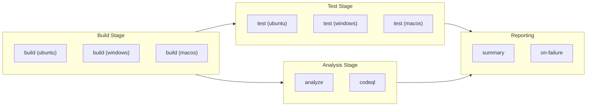

# CI - .NET Reusable Workflow

> **Workflow file:** [`.github/workflows/ci-dotnet-reusable.yml`](../../.github/workflows/ci-dotnet-reusable.yml)

---

## 1. Overview & Purpose

### What This Workflow Does

This is a comprehensive reusable CI workflow for .NET solutions that performs:

- **Cross-platform builds** on Ubuntu, Windows, and macOS
- **Cross-platform testing** with code coverage reporting (Cobertura format)
- **Code formatting analysis** against `.editorconfig` standards
- **CodeQL security scanning** for vulnerability detection
- **Comprehensive reporting** with job summaries and artifacts

### When to Use

- As a called workflow from other CI pipelines
- When needing standardized .NET CI across multiple repositories
- For comprehensive cross-platform validation
- When security scanning is required on every CI run

### When NOT to Use

- As a standalone workflow (must be called via `workflow_call`)
- For non-.NET projects
- When minimal/fast CI is preferred over comprehensive validation

---

## 2. Triggers

### Supported Trigger

| Trigger | Description |
|---------|-------------|
| `workflow_call` | Called by other workflows; not directly triggerable |

This workflow cannot be triggered directly. It must be called from another workflow using the `uses:` directive.

---

## 3. High-Level Workflow Flow

### Narrative Overview

The workflow executes six jobs with dependencies:

1. **Build** (matrix: Ubuntu, Windows, macOS): Compiles the solution on all platforms in parallel
2. **Test** (matrix: Ubuntu, Windows, macOS): Runs tests with coverage on all platforms, depends on Build
3. **Analyze**: Verifies code formatting compliance, depends on Build, optional via input
4. **CodeQL**: Security vulnerability scanning, depends on Build, always runs
5. **Summary**: Aggregates all job results, always runs after all other jobs
6. **On-Failure**: Reports failures with diagnostics, runs only when jobs fail

### Mermaid Diagram



### Interpretation Notes

- **Maximum parallelism**: Build runs on 3 platforms simultaneously; Test, Analyze, and CodeQL run after Build completes
- **Matrix isolation**: Each platform builds and tests independently; failure on one does not stop others (`fail-fast: false`)
- **Conditional analysis**: Analyze job only runs if `enable-code-analysis` input is true
- **Failure propagation**: A single job failure triggers `on-failure` while `summary` still runs (`always()` condition)

---

## 4. Jobs Breakdown

### Job: `build`

| Property | Value |
|----------|-------|
| **Name** | Build (${{ matrix.os }}) |
| **Runner** | Matrix: `ubuntu-latest`, `windows-latest`, `macos-latest` |
| **Timeout** | 15 minutes |
| **Responsibility** | Compile solution, generate versioned artifacts |
| **Outputs** | `build-version` |
| **Artifacts** | `build-artifacts-{os}` |

**Steps:**

1. Checkout repository (full history)
2. Setup .NET SDK
3. Update .NET workloads
4. Generate build version
5. Restore NuGet packages
6. Build solution
7. Upload build artifacts
8. Generate build summary

### Job: `test`

| Property | Value |
|----------|-------|
| **Name** | Test (${{ matrix.os }}) |
| **Runner** | Matrix: `ubuntu-latest`, `windows-latest`, `macos-latest` |
| **Timeout** | 30 minutes |
| **Responsibility** | Execute tests, generate coverage reports |
| **Dependencies** | `build` |
| **Artifacts** | `test-results-{os}`, `code-coverage-{os}` |

**Steps:**

1. Checkout repository
2. Setup .NET SDK
3. Update .NET workloads
4. Restore NuGet packages
5. Build solution
6. Run tests with coverage
7. Publish test results (dorny/test-reporter)
8. Upload test results artifact
9. Upload code coverage artifact
10. Generate test summary

### Job: `analyze`

| Property | Value |
|----------|-------|
| **Name** | Analyze |
| **Runner** | `${{ inputs.runs-on }}` (default: `ubuntu-latest`) |
| **Timeout** | 15 minutes |
| **Responsibility** | Verify code formatting compliance |
| **Dependencies** | `build` |
| **Condition** | `${{ inputs.enable-code-analysis }}` |

**Steps:**

1. Checkout repository
2. Setup .NET SDK
3. Update .NET workloads
4. Restore NuGet packages
5. Verify code formatting (`dotnet format --verify-no-changes`)
6. Generate analysis summary
7. Fail on format issues (if configured)

### Job: `codeql`

| Property | Value |
|----------|-------|
| **Name** | CodeQL Security Scan |
| **Runner** | `${{ inputs.runs-on }}` (default: `ubuntu-latest`) |
| **Timeout** | 45 minutes |
| **Responsibility** | Security vulnerability scanning |
| **Dependencies** | `build` |
| **Artifacts** | `codeql-sarif-results` |

**Steps:**

1. Checkout repository (full history for blame)
2. Setup .NET SDK
3. Initialize CodeQL (C# language, security-extended queries)
4. Autobuild for CodeQL
5. Perform CodeQL analysis
6. Upload SARIF results artifact
7. Generate CodeQL summary

### Job: `summary`

| Property | Value |
|----------|-------|
| **Name** | Summary |
| **Runner** | `${{ inputs.runs-on }}` |
| **Timeout** | 5 minutes |
| **Responsibility** | Aggregate all job results |
| **Dependencies** | `build`, `test`, `analyze`, `codeql` |
| **Condition** | `always()` |

### Job: `on-failure`

| Property | Value |
|----------|-------|
| **Name** | Failed |
| **Runner** | `${{ inputs.runs-on }}` |
| **Timeout** | 5 minutes |
| **Responsibility** | Report failures with diagnostics |
| **Dependencies** | `build`, `test`, `analyze`, `codeql` |
| **Condition** | `failure()` |

---

## 5. Inputs & Parameters

### Input Parameters

| Input | Type | Required | Default | Description |
|-------|------|----------|---------|-------------|
| `configuration` | string | No | `Release` | Build configuration (Release/Debug) |
| `dotnet-version` | string | No | `10.0.x` | .NET SDK version to use |
| `solution-file` | string | No | `app.sln` | Path to the solution file |
| `test-results-artifact-name` | string | No | `test-results` | Test results artifact name |
| `build-artifacts-name` | string | No | `build-artifacts` | Build artifacts name |
| `coverage-artifact-name` | string | No | `code-coverage` | Coverage artifact name |
| `artifact-retention-days` | number | No | `30` | Artifact retention period |
| `runs-on` | string | No | `ubuntu-latest` | Runner for analyze/summary jobs |
| `enable-code-analysis` | boolean | No | `true` | Enable code formatting analysis |
| `fail-on-format-issues` | boolean | No | `true` | Fail workflow on formatting issues |

### Output Parameters

| Output | Description |
|--------|-------------|
| `build-version` | Generated build version (1.0.{run_number}) |
| `build-result` | Build job result |
| `test-result` | Test job result |
| `analyze-result` | Analysis job result |
| `codeql-result` | CodeQL scan result |

---

## 6. Secrets & Variables

### Secrets

No secrets are directly defined by this workflow. Secrets are inherited from calling workflows.

### Environment Variables

| Variable | Value | Purpose |
|----------|-------|---------|
| `DOTNET_SKIP_FIRST_TIME_EXPERIENCE` | `true` | Skip .NET welcome message |
| `DOTNET_NOLOGO` | `true` | Suppress .NET logo in output |
| `DOTNET_CLI_TELEMETRY_OPTOUT` | `true` | Disable .NET telemetry |

---

## 7. Permissions & Security Model

### GitHub Actions Permissions

| Permission | Level | Purpose |
|------------|-------|---------|
| `contents` | `read` | Read repository contents for checkout |
| `checks` | `write` | Create check runs for test results |
| `pull-requests` | `write` | Post comments on pull requests |
| `security-events` | `write` | Upload CodeQL SARIF results |

### Security Features

- **CodeQL Security Scanning:**
  - Always enabled (no conditional skip)
  - Uses `security-extended` and `security-and-quality` query suites
  - Excludes test files from scanning
  - Uploads SARIF to GitHub Security tab

- **Action Version Pinning:**
  - All actions use SHA-pinned versions
  - Protects against supply chain attacks

- **Least-Privilege Permissions:**
  - Minimal permissions requested at workflow level

---

## 8. Environments & Deployment Strategy

This workflow does not perform deployments. It is a CI-only workflow.

---

## 9. Failure Handling & Recovery

### Failure Behavior

| Scenario | Behavior |
|----------|----------|
| Build fails on one platform | Other platforms continue (`fail-fast: false`) |
| Test fails | Artifacts still uploaded; summary still generated |
| Analyze fails (formatting issues) | Workflow fails if `fail-on-format-issues: true` |
| CodeQL fails | Security tab may not update; artifacts uploaded |

### Recovery Steps

1. Check the `on-failure` job summary for quick diagnosis
2. Download relevant artifacts for detailed analysis
3. Review individual job summaries for specific errors
4. Fix locally: `dotnet format` for formatting issues
5. Push fixes and re-run workflow

---

## 10. How to Run This Workflow

### Calling This Workflow

```yaml
jobs:
  ci:
    uses: ./.github/workflows/ci-dotnet-reusable.yml
    with:
      configuration: 'Release'
      dotnet-version: '10.0.x'
      solution-file: 'app.sln'
      enable-code-analysis: true
      fail-on-format-issues: true
    secrets: inherit
```

### Cannot Run Directly

This workflow cannot be triggered directly from the GitHub Actions UI. It must be called from another workflow.

---

## 11. Extensibility & Customization

### Safe Extension Points

| Extension Point | How to Customize |
|-----------------|------------------|
| Add new matrix platforms | Add to `matrix.os` array in build/test jobs |
| Add new CodeQL languages | Add to `languages` input in CodeQL init |
| Add additional analysis steps | Add steps after format verification |
| Customize coverage format | Modify `--coverage-output-format` parameter |

### What Should NOT Be Changed

| Element | Reason |
|---------|--------|
| Job dependency chain | Ensures correct execution order |
| Artifact naming conventions | Downstream workflows may depend on names |
| CodeQL always-run behavior | Security scanning should never be skipped |
| Permission model | Security implications |

---

## 12. Known Limitations & Gotchas

### Limitations

| Limitation | Details |
|------------|---------|
| C# only for CodeQL | Only C# language is configured for scanning |
| Single solution file | Cannot process multiple solutions in one run |
| No dependency caching | Each job restores packages independently |

### Gotchas

| Issue | Workaround |
|-------|------------|
| Windows path separators | `path-replace-backslashes: true` in test-reporter |
| Matrix artifact conflicts | Artifacts named with `-{os}` suffix for uniqueness |
| Empty test results | `fail-on-empty: false` prevents failure when no tests found |
| CodeQL timeout | 45-minute timeout may be insufficient for large codebases |

---

## 13. Ownership & Maintenance

### Ownership

| Role | Responsibility |
|------|----------------|
| DevOps Team | Workflow maintenance and updates |
| Security Team | CodeQL configuration and query updates |
| Development Team | Ensuring code passes all checks |

### Review Expectations

| Change Type | Review Requirements |
|-------------|---------------------|
| Job modifications | DevOps team review |
| Security changes | Security team review |
| Input/output changes | All dependent workflows must be verified |

---

## 14. Assumptions & Gaps

### Assumptions

| Assumption | Impact if Invalid |
|------------|-------------------|
| .NET SDK 10.0.x is available on all runners | Setup will fail |
| Solution file exists at specified path | Build will fail |
| `.editorconfig` exists for formatting | Formatting check may produce unexpected results |
| Tests produce .trx format output | Test reporting will fail |

### Gaps

| Gap | Recommendation |
|-----|----------------|
| No NuGet package caching | Consider adding actions/cache for packages |
| No code coverage threshold enforcement | Add coverage gates via external tools |
| No SBOM generation | Consider adding SBOM for supply chain transparency |
| Test exclusion patterns not configurable | Add input for test filters if needed |

---

## Artifacts Generated

| Artifact | Description | Retention |
|----------|-------------|-----------|
| `build-artifacts-ubuntu-latest` | Ubuntu compiled binaries | 30 days (configurable) |
| `build-artifacts-windows-latest` | Windows compiled binaries | 30 days (configurable) |
| `build-artifacts-macos-latest` | macOS compiled binaries | 30 days (configurable) |
| `test-results-ubuntu-latest` | Ubuntu test results (.trx) | 30 days (configurable) |
| `test-results-windows-latest` | Windows test results (.trx) | 30 days (configurable) |
| `test-results-macos-latest` | macOS test results (.trx) | 30 days (configurable) |
| `code-coverage-ubuntu-latest` | Ubuntu coverage (Cobertura) | 30 days (configurable) |
| `code-coverage-windows-latest` | Windows coverage (Cobertura) | 30 days (configurable) |
| `code-coverage-macos-latest` | macOS coverage (Cobertura) | 30 days (configurable) |
| `codeql-sarif-results` | Security scan results (SARIF) | 30 days (configurable) |

---

## Related Documentation

- [CI - .NET Build and Test Workflow](./github-actions-ci-dotnet.md)
- [CD - Azure Deployment Workflow](./github-actions-azure-dev.md)
- [CodeQL Documentation](https://docs.github.com/en/code-security/code-scanning/introduction-to-code-scanning/about-code-scanning-with-codeql)
- [.NET CLI Reference](https://learn.microsoft.com/en-us/dotnet/core/tools/)
