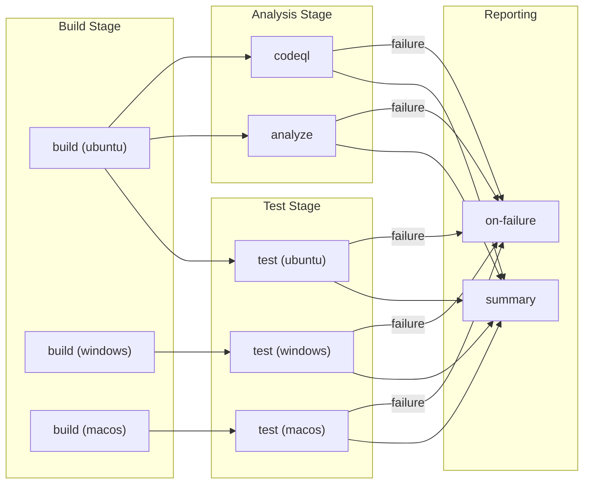

# CI - .NET Reusable Workflow

## 1. Overview & Purpose

### What This Workflow Does

A comprehensive reusable CI workflow for .NET solutions that performs:

- Cross-platform builds (Ubuntu, Windows, macOS)
- Cross-platform testing with code coverage (Cobertura format)
- Code formatting analysis (.editorconfig compliance)
- CodeQL security vulnerability scanning

### When to Use

- As a called workflow from other CI/CD pipelines
- For standardized .NET CI across repositories
- When comprehensive cross-platform validation is required
- When security scanning is mandatory

### When NOT to Use

- As a standalone workflow (must be called via `workflow_call`)
- For non-.NET projects
- When minimal/fast CI is preferred over comprehensive validation

---

## 2. Triggers

| Trigger | Description |
|---------|-------------|
| `workflow_call` | Called by other workflows only |

This workflow cannot be triggered directly. It must be invoked using `uses:` from another workflow.

---

## 3. Pipeline Flow (Mermaid Diagram)



### Interpretation Notes

- **Parallel Builds**: Build runs on 3 platforms simultaneously
- **Matrix Isolation**: `fail-fast: false` allows all platforms to complete independently
- **Conditional Analysis**: `analyze` only runs if `enable-code-analysis` is `true`
- **Always-Run CodeQL**: Security scanning runs on every execution
- **Summary Always Runs**: Executes regardless of prior outcomes

---

## 4. Jobs Breakdown

### Job: `build`

| Property | Value |
|----------|-------|
| **Name** | `🔨 Build (${{ matrix.os }})` |
| **Runner** | Matrix: `ubuntu-latest`, `windows-latest`, `macos-latest` |
| **Timeout** | 15 minutes |
| **Strategy** | `fail-fast: false` |
| **Outputs** | `build-version` |
| **Artifacts** | `build-artifacts-{os}` |

### Job: `test`

| Property | Value |
|----------|-------|
| **Name** | `🧪 Test (${{ matrix.os }})` |
| **Runner** | Matrix: `ubuntu-latest`, `windows-latest`, `macos-latest` |
| **Timeout** | 30 minutes |
| **Needs** | `build` |
| **Strategy** | `fail-fast: false` |
| **Artifacts** | `test-results-{os}`, `code-coverage-{os}` |

### Job: `analyze`

| Property | Value |
|----------|-------|
| **Name** | `🔍 Analyze` |
| **Runner** | `${{ inputs.runs-on }}` |
| **Timeout** | 15 minutes |
| **Needs** | `build` |
| **Condition** | `${{ inputs.enable-code-analysis }}` |

### Job: `codeql`

| Property | Value |
|----------|-------|
| **Name** | `🛡️ CodeQL Security Scan` |
| **Runner** | `${{ inputs.runs-on }}` |
| **Timeout** | 45 minutes |
| **Needs** | `build` |
| **Artifacts** | `codeql-sarif-results` |

### Job: `summary`

| Property | Value |
|----------|-------|
| **Name** | `📊 Summary` |
| **Runner** | `${{ inputs.runs-on }}` |
| **Timeout** | 5 minutes |
| **Needs** | `build`, `test`, `analyze`, `codeql` |
| **Condition** | `always()` |

### Job: `on-failure`

| Property | Value |
|----------|-------|
| **Name** | `❌ Failed` |
| **Runner** | `${{ inputs.runs-on }}` |
| **Timeout** | 5 minutes |
| **Needs** | `build`, `test`, `analyze`, `codeql` |
| **Condition** | `failure()` |

---

## 5. Inputs & Parameters

### Input Parameters

| Input | Type | Required | Default | Description |
|-------|------|----------|---------|-------------|
| `configuration` | string | No | `Release` | Build configuration |
| `dotnet-version` | string | No | `10.0.x` | .NET SDK version |
| `solution-file` | string | No | `app.sln` | Solution file path |
| `test-results-artifact-name` | string | No | `test-results` | Test results artifact name |
| `build-artifacts-name` | string | No | `build-artifacts` | Build artifacts name |
| `coverage-artifact-name` | string | No | `code-coverage` | Coverage artifact name |
| `artifact-retention-days` | number | No | `30` | Artifact retention |
| `runs-on` | string | No | `ubuntu-latest` | Runner for non-matrix jobs |
| `enable-code-analysis` | boolean | No | `true` | Enable formatting check |
| `fail-on-format-issues` | boolean | No | `true` | Fail on formatting issues |

### Output Parameters

| Output | Description |
|--------|-------------|
| `build-version` | Generated version (`1.0.{run_number}`) |
| `build-result` | Build job result |
| `test-result` | Test job result |
| `analyze-result` | Analysis job result |
| `codeql-result` | CodeQL scan result |

---

## 6. Secrets & Variables

### Secrets

No secrets directly defined. Secrets are inherited from calling workflows.

### Environment Variables

| Variable | Value | Purpose |
|----------|-------|---------|
| `DOTNET_SKIP_FIRST_TIME_EXPERIENCE` | `true` | Skip .NET welcome |
| `DOTNET_NOLOGO` | `true` | Suppress logo |
| `DOTNET_CLI_TELEMETRY_OPTOUT` | `true` | Disable telemetry |

---

## 7. Permissions & Security Model

### Workflow Permissions

| Permission | Level | Purpose |
|------------|-------|---------|
| `contents` | read | Repository checkout |
| `checks` | write | Test result check runs |
| `pull-requests` | write | PR comments |
| `security-events` | write | CodeQL SARIF upload |

### CodeQL Configuration

| Setting | Value |
|---------|-------|
| Language | `csharp` |
| Query Suites | `security-extended`, `security-and-quality` |
| Build Mode | Autobuild |
| Excluded Paths | `**/tests/**`, `**/test/**`, `**/*.test.cs`, `**/*.Tests.cs` |

### Security Practices

| Practice | Status |
|----------|--------|
| SHA-pinned actions | ✅ |
| Full git history for blame | ✅ |
| Extended security queries | ✅ |
| SARIF upload always enabled | ✅ |

---

## 8. Environments & Deployment Strategy

This workflow does not perform deployments. It is CI-only.

---

## 9. Failure Handling & Recovery

### Failure Behavior

| Scenario | Behavior |
|----------|----------|
| Build fails on one platform | Other platforms continue |
| Test fails | Artifacts still uploaded; summary generated |
| Analyze fails | Workflow fails if `fail-on-format-issues: true` |
| CodeQL fails | Security tab may not update |

### Recovery

1. Review `on-failure` job summary
2. Download artifacts for analysis
3. Fix locally: `dotnet format` for formatting issues
4. Push fixes

---

## 10. How to Run This Workflow

### Calling This Workflow

```yaml
jobs:
  ci:
    uses: ./.github/workflows/ci-dotnet-reusable.yml
    with:
      configuration: 'Release'
      dotnet-version: '10.0.x'
      solution-file: 'app.sln'
      enable-code-analysis: true
      fail-on-format-issues: true
    secrets: inherit
```

### Cannot Run Directly

This workflow cannot be triggered from the GitHub Actions UI. It must be called from another workflow.

---

## 11. Extensibility & Customization

### Safe Extension Points

| Extension | How |
|-----------|-----|
| Add platforms | Extend `matrix.os` array |
| Add CodeQL languages | Modify `languages` in CodeQL init |
| Additional analysis | Add steps after format verification |
| Coverage format | Modify `--coverage-output-format` |

### Do Not Modify

| Element | Reason |
|---------|--------|
| Job dependency chain | Ensures correct execution order |
| Artifact naming | Downstream workflows depend on names |
| CodeQL always-run | Security scanning should not be skipped |

---

## 12. Known Limitations & Gotchas

### Limitations

| Limitation | Detail |
|------------|--------|
| C# only for CodeQL | Only `csharp` configured |
| Single solution file | Cannot process multiple solutions |
| No dependency caching | Each job restores independently |

### Gotchas

| Issue | Mitigation |
|-------|------------|
| Windows path separators | `path-replace-backslashes: true` in test-reporter |
| Matrix artifact conflicts | `-{os}` suffix for uniqueness |
| Empty test results | `fail-on-empty: false` |

---

## 13. Ownership & Maintenance

| Role | Responsibility |
|------|----------------|
| DevOps Team | Workflow maintenance |
| Security Team | CodeQL configuration |
| Development Team | Code passes all checks |

---

## 14. Assumptions & Gaps

### Assumptions

| Assumption | Source |
|------------|--------|
| .NET SDK 10.0.x available on runners | `dotnet-version` input |
| Solution file exists at path | `solution-file` input |
| `.editorconfig` exists | `dotnet format` usage |
| Tests produce .trx format | `--report-trx` flag |

### Gaps

| Gap | Recommendation |
|-----|----------------|
| No NuGet caching | Add `actions/cache` |
| No coverage thresholds | Add coverage gates |
| No SBOM generation | Add for supply chain transparency |

---

## Artifacts Generated

| Artifact | Description | Platforms |
|----------|-------------|-----------|
| `build-artifacts-{os}` | Compiled binaries | ubuntu, windows, macos |
| `test-results-{os}` | Test results (.trx) | ubuntu, windows, macos |
| `code-coverage-{os}` | Coverage (Cobertura XML) | ubuntu, windows, macos |
| `codeql-sarif-results` | Security scan (SARIF) | Single |
