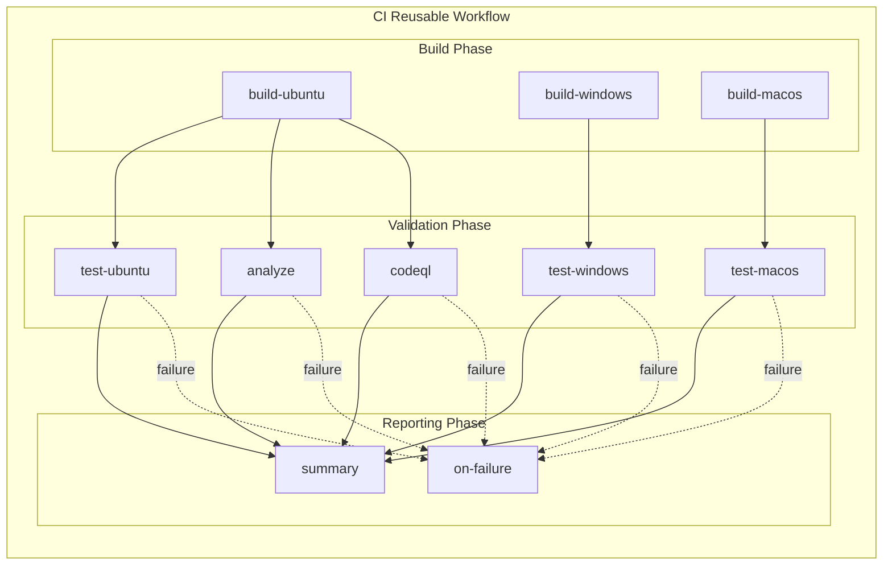

# CI - .NET Reusable Workflow

## 1. Overview & Purpose

### Primary Workflow Purpose

**Reusable CI Implementation** - This is a comprehensive reusable CI workflow for .NET solutions that performs cross-platform builds, testing, code analysis, and security scanning. It is designed to be called by other workflows, not triggered directly.

### In-Scope Responsibilities

- Cross-platform .NET solution compilation (Ubuntu, Windows, macOS)
- Cross-platform test execution with code coverage collection (Cobertura format)
- Code formatting verification against `.editorconfig` standards
- CodeQL security vulnerability scanning
- Artifact generation and upload (binaries, test results, coverage reports, SARIF)
- Job status aggregation and summary reporting

### Out-of-Scope Responsibilities

- Direct trigger handling (no push/PR triggers)
- Deployment to any environment
- Infrastructure provisioning
- NuGet package publishing
- Release management

---

## 2. Triggers

This is a **reusable workflow** triggered exclusively via `workflow_call`. It has no direct triggers.

### Caller Workflow Example

```yaml
jobs:
  ci:
    uses: ./.github/workflows/ci-dotnet-reusable.yml
    with:
      configuration: 'Release'
      dotnet-version: '10.0.x'
      solution-file: 'app.sln'
      enable-code-analysis: true
      fail-on-format-issues: true
    secrets: inherit
```

---

## 3. Pipeline Flow



### Narrative Overview

1. **Build Phase**: Three parallel build jobs compile the solution on Ubuntu, Windows, and macOS using matrix strategy with `fail-fast: false`

2. **Validation Phase**: After build completion:
   - Three parallel test jobs execute tests with coverage collection (one per platform)
   - Analyze job verifies code formatting (conditional on `enable-code-analysis` input)
   - CodeQL job performs security scanning (always runs)

3. **Reporting Phase**: Summary job aggregates all results (`if: always()`); failure handler triggers only when jobs fail

### Interpretation Notes

- **Parallelism**: Build jobs run in parallel; test jobs run in parallel after their respective builds complete
- **Failure Isolation**: `fail-fast: false` ensures one platform failure does not cancel others
- **Conditional Analysis**: The `analyze` job runs only when `enable-code-analysis` input is `true`
- **Always-Run CodeQL**: Security scanning executes on every workflow run regardless of inputs
- **Always-Run Summary**: Uses `if: always()` to provide visibility regardless of outcomes

---

## 4. Jobs Breakdown

| Job | Runner | Timeout | Responsibility | Dependencies |
|-----|--------|---------|----------------|--------------|
| `build` | Matrix: `ubuntu-latest`, `windows-latest`, `macos-latest` | 15 min | Cross-platform compilation, version generation, artifact upload | None |
| `test` | Matrix: `ubuntu-latest`, `windows-latest`, `macos-latest` | 30 min | Test execution, coverage collection, result publishing | `build` |
| `analyze` | `${{ inputs.runs-on }}` | 15 min | Code formatting verification | `build` |
| `codeql` | `${{ inputs.runs-on }}` | 45 min | CodeQL security scanning | `build` |
| `summary` | `${{ inputs.runs-on }}` | 5 min | Aggregate all job results | `build`, `test`, `analyze`, `codeql` |
| `on-failure` | `${{ inputs.runs-on }}` | 5 min | Failure reporting | `build`, `test`, `analyze`, `codeql` |

### Build Job Details

| Aspect | Configuration |
|--------|---------------|
| Matrix | `ubuntu-latest`, `windows-latest`, `macos-latest` |
| Fail-Fast | `false` |
| Version Format | `1.0.{run_number}` |
| Artifact Pattern | `{build-artifacts-name}-{os}` |

### Test Job Details

| Aspect | Configuration |
|--------|---------------|
| Matrix | Same as build |
| Coverage Format | Cobertura XML |
| Test Reporter | `dorny/test-reporter` |
| Result Format | `.trx` files |

### CodeQL Job Details

| Aspect | Configuration |
|--------|---------------|
| Language | C# (csharp) |
| Query Suites | `security-extended`, `security-and-quality` |
| Build Mode | Autobuild |
| Excluded Paths | `**/tests/**`, `**/test/**`, `**/*.test.cs`, `**/*.Tests.cs` |

---

## 5. Inputs & Parameters

### Workflow Inputs

| Input | Type | Required | Default | Description |
|-------|------|----------|---------|-------------|
| `configuration` | string | No | `Release` | Build configuration (`Release` or `Debug`) |
| `dotnet-version` | string | No | `10.0.x` | .NET SDK version |
| `solution-file` | string | No | `app.sln` | Path to solution file |
| `test-results-artifact-name` | string | No | `test-results` | Test results artifact name |
| `build-artifacts-name` | string | No | `build-artifacts` | Build artifacts name |
| `coverage-artifact-name` | string | No | `code-coverage` | Coverage artifact name |
| `artifact-retention-days` | number | No | `30` | Days to retain artifacts |
| `runs-on` | string | No | `ubuntu-latest` | Runner for analyze/summary jobs |
| `enable-code-analysis` | boolean | No | `true` | Enable code formatting check |
| `fail-on-format-issues` | boolean | No | `true` | Fail if formatting issues found |

### Workflow Outputs

| Output | Description |
|--------|-------------|
| `build-version` | Generated build version (e.g., `1.0.42`) |
| `build-result` | Build job result (`success`, `failure`, `cancelled`) |
| `test-result` | Test job result |
| `analyze-result` | Analysis job result |
| `codeql-result` | CodeQL scan result |

---

## 6. Secrets & Variables

### Required Secrets

No secrets required directly. Uses `secrets: inherit` pattern from caller.

### Environment Variables

| Variable | Scope | Purpose |
|----------|-------|---------|
| `DOTNET_SKIP_FIRST_TIME_EXPERIENCE` | Workflow | Skip .NET first-run experience |
| `DOTNET_NOLOGO` | Workflow | Suppress .NET logo output |
| `DOTNET_CLI_TELEMETRY_OPTOUT` | Workflow | Disable .NET CLI telemetry |

---

## 7. Permissions & Security Model

### GitHub Token Permissions

| Permission | Level | Purpose |
|------------|-------|---------|
| `contents` | read | Read repository contents for checkout |
| `checks` | write | Create check runs for test results |
| `pull-requests` | write | Post comments on pull requests |
| `security-events` | write | Upload CodeQL SARIF results |

### Security Features

| Feature | Implementation |
|---------|----------------|
| Pinned actions | All actions use SHA-pinned versions |
| CodeQL scanning | Always enabled with extended queries |
| Test exclusion | CodeQL excludes test files |
| Least privilege | Minimal permissions |
| Full git history | Accurate CodeQL blame tracking |

### Action Versions (SHA-Pinned)

| Action | SHA | Version |
|--------|-----|---------|
| `actions/checkout` | `de0fac2e4500dabe0009e67214ff5f5447ce83dd` | v6.0.2 |
| `actions/setup-dotnet` | `baa11fbfe1d6520db94683bd5c7a3818018e4309` | v5.1.0 |
| `actions/upload-artifact` | `b7c566a772e6b6bfb58ed0dc250532a479d7789f` | v6.0.0 |
| `github/codeql-action/*` | `cdefb33c0f6224e58673d9004f47f7cb3e328b89` | v3.28.0 |
| `dorny/test-reporter` | `b082adf0eced0765477756c2a610396589b8c637` | v2.5.0 |

---

## 8. Environments & Deployment Strategy

This workflow does **not** deploy to any environments. It is a pure CI workflow.

---

## 9. Failure Handling & Recovery

### Failure Behavior by Job

| Job | Failure Behavior |
|-----|------------------|
| `build` | Platform failures isolated (`fail-fast: false`) |
| `test` | Test failures recorded; detailed results in artifacts |
| `analyze` | Uses `continue-on-error: true`; failure controlled by `fail-on-format-issues` |
| `codeql` | Findings uploaded regardless of outcome (`upload: always`) |
| `summary` | Always runs (`if: always()`) |
| `on-failure` | Runs only when jobs fail (`if: failure()`) |

### Recovery Steps

| Issue | Recovery Action |
|-------|-----------------|
| Build failure | Download `build-artifacts-{os}` for debugging |
| Test failure | Download `test-results-{os}` for `.trx` analysis |
| Formatting issues | Run `dotnet format app.sln` locally |
| CodeQL findings | Review Security tab; download `codeql-sarif-results` |

---

## 10. How to Run This Workflow

### This workflow cannot be run directly. It must be called from another workflow

### Caller Configuration Examples

**Minimal Configuration**:

```yaml
jobs:
  ci:
    uses: ./.github/workflows/ci-dotnet-reusable.yml
```

**Full Configuration**:

```yaml
jobs:
  ci:
    uses: ./.github/workflows/ci-dotnet-reusable.yml
    with:
      configuration: 'Release'
      dotnet-version: '10.0.x'
      solution-file: 'app.sln'
      test-results-artifact-name: 'test-results'
      build-artifacts-name: 'build-artifacts'
      coverage-artifact-name: 'code-coverage'
      artifact-retention-days: 30
      runs-on: 'ubuntu-latest'
      enable-code-analysis: true
      fail-on-format-issues: true
    secrets: inherit
```

**Debug Build with Relaxed Formatting**:

```yaml
jobs:
  ci:
    uses: ./.github/workflows/ci-dotnet-reusable.yml
    with:
      configuration: 'Debug'
      fail-on-format-issues: false
    secrets: inherit
```

---

## 11. Extensibility & Customization

### Safe Extension Points

| Extension | How to Customize |
|-----------|------------------|
| Build platforms | Modify matrix in `build` and `test` jobs |
| .NET version | Change `dotnet-version` input |
| Artifact retention | Adjust `artifact-retention-days` input |
| Code analysis | Toggle `enable-code-analysis` input |
| Formatting strictness | Set `fail-on-format-issues` to `false` |
| Runner for analysis | Change `runs-on` input |

### What Should NOT Be Changed

| Item | Reason |
|------|--------|
| CodeQL scanning | Security requirement |
| Permission scopes | Security requirements |
| Pinned action versions | Supply chain security |
| `fail-fast: false` | Cross-platform failure isolation |
| SARIF upload | Security tab integration |

---

## 12. Known Limitations & Gotchas

| Limitation | Impact | Workaround |
|------------|--------|------------|
| Matrix generates separate artifacts | Artifacts named `{name}-{os}` | Designed for platform isolation |
| CodeQL autobuild may miss projects | Custom configurations not compiled | Add manual build steps |
| Windows path separators | Test reporter requires conversion | `path-replace-backslashes: true` enabled |
| No NuGet caching | Longer restore times | Implement caching if needed |
| Single .NET version | Cannot test multiple versions | Add matrix dimension |
| Analysis runs serially | Single-threaded format check | Acceptable for most solutions |

### Platform-Specific Considerations

| Platform | Consideration |
|----------|---------------|
| Ubuntu | Default runner; fastest execution |
| Windows | Backslash path handling required |
| macOS | Case-sensitive filesystem; longer queue times |

---

## 13. Ownership & Maintenance

### Owning Team

Platform Engineering / DevOps

### Review Expectations

| Change Type | Required Review |
|-------------|-----------------|
| Permission changes | Security team |
| New job additions | Architecture review |
| Action version updates | Security verification |
| CodeQL modifications | Security team |

### Change Management

- All changes require PR approval
- Test in feature branches before merging
- Document breaking changes
- Coordinate with caller workflows

---

## 14. Assumptions & Gaps

### Assumptions

| Assumption | Validation |
|------------|------------|
| Valid `.NET` solution at specified path | Build fails if invalid |
| `.editorconfig` present | Analysis may have unexpected results |
| Test projects follow conventions | Test discovery relies on conventions |
| Runners have sufficient resources | Matrix includes resource-intensive platforms |
| Caller passes required permissions | Workflow declares minimum permissions |

### Identified Gaps

| Gap | Impact | Recommendation |
|-----|--------|----------------|
| No coverage threshold | Coverage collected but not gated | Integrate coverage reporting |
| No NuGet cache | Slower restore times | Implement `actions/cache` |
| No external code quality | No SonarQube integration | Add if required |
| No failure notifications | No Slack/Teams alerts | Implement in caller |
| No test retry | Flaky tests cause failures | Add retry logic |
| No benchmark testing | No performance regression | Add benchmark job |

---

## Appendix: Generated Artifacts

| Artifact | Contents | Retention | Per-Platform |
|----------|----------|-----------|--------------|
| `build-artifacts-{os}` | Compiled binaries | Configurable | Yes |
| `test-results-{os}` | Test results (`.trx`) | Configurable | Yes |
| `code-coverage-{os}` | Coverage (Cobertura XML) | Configurable | Yes |
| `codeql-sarif-results` | Security scan (SARIF) | Configurable | No |
