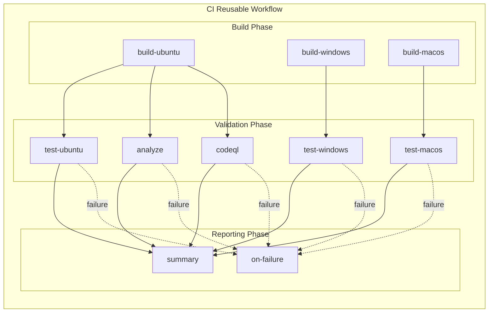

# CI - .NET Reusable Workflow

## 1. Overview & Purpose

### What This Workflow Does

This is a **reusable workflow** that provides a comprehensive Continuous Integration (CI) pipeline for .NET solutions. It is designed to be called by other workflows and executes:

- **Cross-platform builds** on Ubuntu, Windows, and macOS using matrix strategy
- **Cross-platform testing** with code coverage reporting in Cobertura format
- **Code formatting analysis** against `.editorconfig` standards (optional)
- **CodeQL security vulnerability scanning** (always enabled)
- **Comprehensive job summaries** with status aggregation

### In-Scope Responsibilities

- Cross-platform .NET solution compilation
- Test execution with coverage collection
- Code formatting verification
- Security vulnerability detection via CodeQL
- Artifact generation and upload (binaries, test results, coverage reports, SARIF)
- Job status aggregation and reporting

### Out-of-Scope Responsibilities

- Deployment to any environment
- Infrastructure provisioning
- Secret management or credential handling
- NuGet package publishing
- Release creation or tagging

### When to Use

- Call from a parent workflow for standardized CI operations
- When cross-platform validation is required
- When security scanning must be enforced consistently

### When NOT to Use

- Directly via push/PR triggers (use `ci-dotnet.yml` instead)
- For deployment operations (use `azure-dev.yml`)
- For workflows requiring custom build steps

---

## 2. Triggers

This is a **reusable workflow** and does not have direct triggers. It is called via `workflow_call`.

### Caller Workflow Example

```yaml
jobs:
  ci:
    uses: ./.github/workflows/ci-dotnet-reusable.yml
    with:
      configuration: 'Release'
      dotnet-version: '10.0.x'
      solution-file: 'app.sln'
      enable-code-analysis: true
      fail-on-format-issues: true
    secrets: inherit
```

---

## 3. Pipeline Flow (Mermaid Diagram)



### Narrative Overview

1. **Build Phase**: Three parallel build jobs compile the solution on Ubuntu, Windows, and macOS platforms
2. **Validation Phase**: After build completion:
   - Test jobs run in parallel (one per platform) with coverage collection
   - Analyze job verifies code formatting (conditional)
   - CodeQL job performs security scanning (always runs)
3. **Reporting Phase**: Summary aggregates all results; failure handler triggers on any job failure

### Interpretation Notes

- **Parallelism**: All three build jobs execute simultaneously; test jobs follow their respective builds
- **Failure Isolation**: `fail-fast: false` ensures one platform failure does not cancel other platforms
- **Conditional Analysis**: The `analyze` job runs only when `enable-code-analysis` is `true`
- **Always-Run CodeQL**: Security scanning executes on every workflow run regardless of settings
- **Summary Always Runs**: Uses `if: always()` to provide visibility into all job outcomes

---

## 4. Jobs Breakdown

| Job | Runner | Timeout | Responsibility | Dependencies |
|-----|--------|---------|----------------|--------------|
| **build** | Matrix (ubuntu, windows, macos) | 15 min | Cross-platform compilation, version generation, artifact upload | None |
| **test** | Matrix (ubuntu, windows, macos) | 30 min | Test execution, coverage collection, result publishing | `build` |
| **analyze** | `runs-on` input | 15 min | Code formatting verification against `.editorconfig` | `build` |
| **codeql** | `runs-on` input | 45 min | Security vulnerability scanning with CodeQL | `build` |
| **summary** | `runs-on` input | 5 min | Aggregates all job results into summary report | `build`, `test`, `analyze`, `codeql` |
| **on-failure** | `runs-on` input | 5 min | Failure reporting with actionable guidance | `build`, `test`, `analyze`, `codeql` |

### Build Job Details

- **Matrix Strategy**: `ubuntu-latest`, `windows-latest`, `macos-latest`
- **Fail-Fast**: Disabled (`false`)
- **Key Steps**:
  1. Checkout repository (full history)
  2. Setup .NET SDK
  3. Update .NET workloads
  4. Generate build version (`1.0.{run_number}`)
  5. Restore dependencies
  6. Build solution
  7. Upload platform-specific artifacts

### Test Job Details

- **Matrix Strategy**: Same as build
- **Key Steps**:
  1. Checkout and setup .NET
  2. Build solution
  3. Execute tests with coverage (`--coverage --coverage-output-format cobertura`)
  4. Publish test results via `dorny/test-reporter`
  5. Upload test results and coverage artifacts

### CodeQL Job Details

- **Language**: C# (csharp)
- **Query Suites**: `security-extended`, `security-and-quality`
- **Build Mode**: Autobuild
- **Exclusions**: Test files (`**/tests/**`, `**/*.test.cs`, `**/*.Tests.cs`)
- **Output**: SARIF results uploaded to Security tab

---

## 5. Inputs & Parameters

### Workflow Inputs

| Input | Type | Required | Default | Description |
|-------|------|----------|---------|-------------|
| `configuration` | string | No | `Release` | Build configuration (`Release` or `Debug`) |
| `dotnet-version` | string | No | `10.0.x` | .NET SDK version to use |
| `solution-file` | string | No | `app.sln` | Path to the solution file |
| `test-results-artifact-name` | string | No | `test-results` | Name for test results artifact |
| `build-artifacts-name` | string | No | `build-artifacts` | Name for build artifacts |
| `coverage-artifact-name` | string | No | `code-coverage` | Name for code coverage artifact |
| `artifact-retention-days` | number | No | `30` | Number of days to retain artifacts |
| `runs-on` | string | No | `ubuntu-latest` | Runner for analyze, codeql, and summary jobs |
| `enable-code-analysis` | boolean | No | `true` | Enable code formatting analysis |
| `fail-on-format-issues` | boolean | No | `true` | Fail workflow if formatting issues found |

### Workflow Outputs

| Output | Description |
|--------|-------------|
| `build-version` | Generated build version (e.g., `1.0.42`) |
| `build-result` | Build job result (`success`, `failure`, `cancelled`) |
| `test-result` | Test job result |
| `analyze-result` | Analysis job result |
| `codeql-result` | CodeQL security scan result |

---

## 6. Secrets & Variables

### Required Secrets

No secrets are required. The workflow uses `secrets: inherit` pattern to receive secrets from the caller workflow.

### Environment Variables

| Variable | Scope | Purpose |
|----------|-------|---------|
| `DOTNET_SKIP_FIRST_TIME_EXPERIENCE` | Workflow | Skip .NET first-run experience |
| `DOTNET_NOLOGO` | Workflow | Suppress .NET logo output |
| `DOTNET_CLI_TELEMETRY_OPTOUT` | Workflow | Disable .NET CLI telemetry |

---

## 7. Permissions & Security Model

### GitHub Token Permissions

| Permission | Level | Purpose |
|------------|-------|---------|
| `contents` | read | Read repository contents for checkout |
| `checks` | write | Create check runs for test results |
| `pull-requests` | write | Post comments on pull requests |
| `security-events` | write | Upload CodeQL SARIF results |

### Security Features

| Feature | Implementation |
|---------|----------------|
| **Pinned Actions** | All actions use SHA-pinned versions for supply chain security |
| **CodeQL Scanning** | Always enabled with extended security queries |
| **Test Exclusion** | CodeQL excludes test files from vulnerability scanning |
| **Least Privilege** | Minimal permissions requested |

### Least-Privilege Analysis

The workflow operates with minimal permissions:

- **Read-only** access to repository contents
- **Write** access limited to CI artifacts (checks, PRs, security events)
- **No** deployment or administrative permissions
- **No** write access to repository contents

---

## 8. Environments & Deployment Strategy

This reusable workflow does **not** deploy to any environments. It is a pure CI workflow.

---

## 9. Failure Handling & Recovery

### Failure Behavior by Job

| Job | Failure Behavior |
|-----|------------------|
| **build** | Platform failures isolated (`fail-fast: false`); other platforms continue |
| **test** | Test failures recorded in check runs; detailed results in artifacts |
| **analyze** | Uses `continue-on-error: true`; failure controlled by `fail-on-format-issues` |
| **codeql** | Findings uploaded regardless of outcome (`upload: always`) |
| **summary** | Always runs (`if: always()`) to provide visibility |
| **on-failure** | Runs only when any dependent job fails (`if: failure()`) |

### Recovery Steps

1. **Build Failures**:
   - Download platform-specific build artifacts for debugging
   - Check runner-specific issues (e.g., macOS path case sensitivity)
   - Verify .NET SDK version compatibility

2. **Test Failures**:
   - Download `test-results-{os}` artifact for detailed `.trx` results
   - Run tests locally: `dotnet test app.sln`
   - Check for environment-specific test issues

3. **Formatting Failures**:
   - Run locally: `dotnet format app.sln`
   - Verify: `dotnet format app.sln --verify-no-changes`
   - Ensure `.editorconfig` is present and valid

4. **CodeQL Failures**:
   - Review Security tab for detailed findings
   - Download `codeql-sarif-results` artifact
   - Address security vulnerabilities before merging

---

## 10. How to Run This Workflow

### Calling from a Parent Workflow

```yaml
name: CI - .NET Build and Test

on:
  push:
    branches: [main]
  pull_request:
    branches: [main]

jobs:
  ci:
    uses: ./.github/workflows/ci-dotnet-reusable.yml
    with:
      configuration: 'Release'
      dotnet-version: '10.0.x'
      solution-file: 'app.sln'
      enable-code-analysis: true
      fail-on-format-issues: true
    secrets: inherit
```

### Common Configuration Patterns

**Minimal Configuration**:

```yaml
ci:
  uses: ./.github/workflows/ci-dotnet-reusable.yml
```

**Debug Build with Relaxed Formatting**:

```yaml
ci:
  uses: ./.github/workflows/ci-dotnet-reusable.yml
  with:
    configuration: 'Debug'
    fail-on-format-issues: false
```

**Custom Artifact Names**:

```yaml
ci:
  uses: ./.github/workflows/ci-dotnet-reusable.yml
  with:
    build-artifacts-name: 'my-app-binaries'
    test-results-artifact-name: 'my-app-tests'
    artifact-retention-days: 14
```

### Common Mistakes to Avoid

- Do not call this workflow directly via push/PR triggers; use `ci-dotnet.yml`
- Ensure the caller workflow has at least `security-events: write` permission for CodeQL
- Do not override `runs-on` with a matrix value; it expects a single runner

---

## 11. Extensibility & Customization

### Safe Extension Points

| Extension | How to Customize |
|-----------|------------------|
| Build platforms | Modify matrix in `build` and `test` jobs |
| .NET version | Change `dotnet-version` input |
| Artifact retention | Adjust `artifact-retention-days` input |
| Code analysis | Toggle `enable-code-analysis` input |
| Formatting strictness | Set `fail-on-format-issues` to `false` |

### What Should NOT Be Changed

| Item | Reason |
|------|--------|
| CodeQL scanning | Security requirement; removal requires security team approval |
| Permission scopes | Security assessment required for changes |
| Pinned action versions | Supply chain security; verify before updating |
| `fail-fast: false` | Required for proper cross-platform failure isolation |
| SARIF upload | Required for Security tab integration |

### Adding New Build Platforms

To add a new platform (e.g., `linux-arm64`):

1. Add to matrix in `build` job
2. Add to matrix in `test` job
3. Verify runner availability
4. Test artifact naming convention

---

## 12. Known Limitations & Gotchas

| Limitation | Impact | Workaround |
|------------|--------|------------|
| Matrix generates separate artifacts | Artifacts named `{name}-{os}` | Designed behavior for platform isolation |
| CodeQL autobuild may miss projects | Custom configurations not compiled | Add manual build steps if needed |
| Windows path separators | Test reporter requires backslash conversion | Enabled via `path-replace-backslashes: true` |
| No NuGet caching | Longer restore times | Implement caching in future iteration |
| Single .NET version | Cannot test multiple versions | Add matrix dimension if needed |
| Analysis job runs serially | Single-threaded format check | Acceptable for most solutions |

### Platform-Specific Notes

| Platform | Consideration |
|----------|---------------|
| **Ubuntu** | Default runner; fastest execution |
| **Windows** | Backslash path handling required |
| **macOS** | Case-sensitive filesystem; longest queue times |

---

## 13. Ownership & Maintenance

### Owning Team

Platform Engineering / DevOps

### Review Expectations

| Change Type | Required Review |
|-------------|-----------------|
| Permission changes | Security team |
| New job additions | Architecture review |
| Action version updates | Security verification |
| CodeQL modifications | Security team |

### Change Management

- All changes require PR approval
- Test in feature branches before merging
- Document breaking changes in PR descriptions
- Coordinate with consumers of the reusable workflow

---

## 14. Assumptions & Gaps

### Assumptions

| Assumption | Validation |
|------------|------------|
| Valid `.NET` solution at specified path | Build will fail if invalid |
| `.editorconfig` present for formatting | Analysis job may have unexpected results |
| Test projects follow standard conventions | Test discovery relies on conventions |
| Runners have sufficient resources | Matrix includes resource-intensive platforms |
| Caller passes appropriate permissions | Workflow declares required permissions |

### Gaps

| Gap | Impact | Recommendation |
|-----|--------|----------------|
| No coverage threshold enforcement | Coverage collected but not gated | Integrate with coverage reporting service |
| No NuGet cache | Slower restore times | Implement actions/cache for NuGet |
| No external code quality | No SonarQube/Codacy integration | Add integration if required |
| No failure notifications | No Slack/Teams alerts | Implement in caller workflow |
| No test retry for flaky tests | Flaky tests may cause failures | Consider adding retry logic |
| No benchmark testing | No performance regression detection | Add benchmark job if needed |

---

## Appendix: Artifact Reference

### Generated Artifacts

| Artifact | Contents | Retention | Per-Platform |
|----------|----------|-----------|--------------|
| `build-artifacts-{os}` | Compiled binaries | 30 days (default) | Yes |
| `test-results-{os}` | Test results (.trx) | 30 days (default) | Yes |
| `code-coverage-{os}` | Coverage (Cobertura XML) | 30 days (default) | Yes |
| `codeql-sarif-results` | Security scan (SARIF) | 30 days (default) | No |

### Artifact Usage Examples

**Download all test results**:

```bash
gh run download <run-id> --name "test-results-ubuntu-latest"
gh run download <run-id> --name "test-results-windows-latest"
gh run download <run-id> --name "test-results-macos-latest"
```

**Process coverage reports**:

```bash
# Merge coverage from all platforms
gh run download <run-id> --pattern "code-coverage-*"
```
