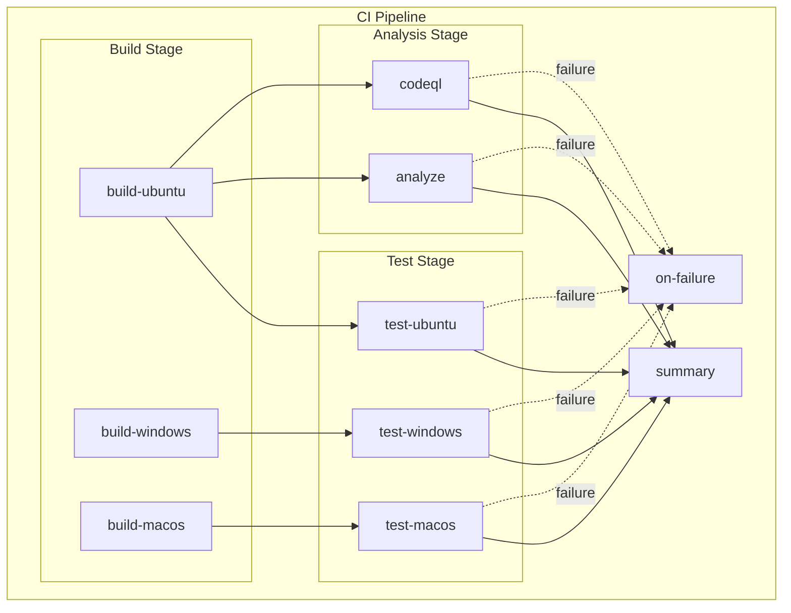

# CI - .NET Build and Test Workflow

## 1. Overview & Purpose

### What This Workflow Does

This workflow orchestrates a comprehensive Continuous Integration (CI) pipeline for .NET solutions by calling a reusable workflow (`ci-dotnet-reusable.yml`). It executes:

- **Cross-platform builds** on Ubuntu, Windows, and macOS
- **Cross-platform testing** with code coverage reporting (Cobertura format)
- **Code formatting analysis** against `.editorconfig` standards
- **CodeQL security vulnerability scanning** (always enabled)

### When to Use

- On every push to `main` or feature/bugfix/hotfix/release/chore/docs/refactor/test branches
- On pull requests targeting the `main` branch
- For manual ad-hoc CI runs via workflow dispatch

### When NOT to Use

- For deployment operations (use `azure-dev.yml` instead)
- When changes do not affect source code, solution files, or workflow definitions (path filters apply)

---

## 2. Triggers

| Trigger Type | Configuration |
|--------------|---------------|
| **Push** | Branches: `main`, `feature/**`, `bugfix/**`, `hotfix/**`, `release/**`, `chore/**`, `docs/**`, `refactor/**`, `test/**` |
| **Pull Request** | Target branch: `main` |
| **Manual** | `workflow_dispatch` with optional inputs |

### Path Filters

Workflow executes only when changes occur in:

- `src/**`
- `app.*/**`
- `*.sln`
- `global.json`
- `.github/workflows/ci-dotnet.yml`
- `.github/workflows/ci-dotnet-reusable.yml`

### Manual Trigger Inputs

| Input | Type | Required | Default | Description |
|-------|------|----------|---------|-------------|
| `configuration` | choice | No | `Release` | Build configuration (`Release` or `Debug`) |
| `enable-code-analysis` | boolean | No | `true` | Enable code formatting analysis |

---

## 3. Pipeline Flow (Mermaid Diagram)

### Narrative Overview

1. **Build Stage**: Three parallel build jobs execute on Ubuntu, Windows, and macOS using a matrix strategy (`fail-fast: false`)
2. **Test Stage**: After each platform build completes, the corresponding test job runs with code coverage collection
3. **Analysis Stage**: Code formatting verification (`analyze`) and security scanning (`codeql`) run in parallel after the build completes
4. **Reporting**: The `summary` job aggregates all results; `on-failure` job triggers only when any job fails

### Interpretation Notes

- **Parallelism**: Build jobs run in parallel across all three platforms; test jobs run in parallel after their respective builds
- **Failure Isolation**: `fail-fast: false` ensures one platform failure does not cancel other platform builds/tests
- **Analysis Independence**: `analyze` and `codeql` jobs depend only on build completion, not on test results
- **Always-Run Summary**: The `summary` job runs regardless of other job outcomes (`if: always()`)

---

## 4. Jobs Breakdown

| Job | Responsibility | Key Outputs | Conditions |
|-----|----------------|-------------|------------|
| **build** | Cross-platform compilation | `build-version`, platform-specific artifacts | Runs on matrix: ubuntu, windows, macos |
| **test** | Test execution with coverage | Test results (.trx), coverage reports (Cobertura) | Depends on `build` |
| **analyze** | Code formatting verification | None | Depends on `build`; conditional on `enable-code-analysis` |
| **codeql** | Security vulnerability scanning | SARIF results uploaded to Security tab | Depends on `build`; always runs |
| **summary** | Aggregates all job results | Workflow summary report | Always runs |
| **on-failure** | Failure reporting | Failure report | Runs only on failure |

---

## 5. Inputs & Parameters

### Reusable Workflow Inputs

| Input | Type | Required | Default | Description |
|-------|------|----------|---------|-------------|
| `configuration` | string | No | `Release` | Build configuration |
| `dotnet-version` | string | No | `10.0.x` | .NET SDK version |
| `solution-file` | string | No | `app.sln` | Path to solution file |
| `test-results-artifact-name` | string | No | `test-results` | Test results artifact name |
| `build-artifacts-name` | string | No | `build-artifacts` | Build artifacts name |
| `coverage-artifact-name` | string | No | `code-coverage` | Coverage artifact name |
| `artifact-retention-days` | number | No | `30` | Artifact retention period |
| `runs-on` | string | No | `ubuntu-latest` | Runner for analyze/summary jobs |
| `enable-code-analysis` | boolean | No | `true` | Enable code formatting check |
| `fail-on-format-issues` | boolean | No | `true` | Fail on formatting issues |

### Outputs

| Output | Description |
|--------|-------------|
| `build-version` | Generated build version (e.g., `1.0.{run_number}`) |
| `build-result` | Build job result |
| `test-result` | Test job result |
| `analyze-result` | Analysis job result |
| `codeql-result` | CodeQL scan result |

---

## 6. Secrets & Variables

### Required Secrets

No secrets are required for CI operations. The workflow uses `secrets: inherit` to pass secrets to the reusable workflow if needed.

### Environment Variables

| Variable | Scope | Purpose |
|----------|-------|---------|
| `DOTNET_SKIP_FIRST_TIME_EXPERIENCE` | Workflow | Skip .NET welcome message |
| `DOTNET_NOLOGO` | Workflow | Suppress .NET logo |
| `DOTNET_CLI_TELEMETRY_OPTOUT` | Workflow | Disable telemetry |

---

## 7. Permissions & Security Model

### GitHub Token Permissions

| Permission | Level | Purpose |
|------------|-------|---------|
| `contents` | read | Read repository contents for checkout |
| `checks` | write | Create check runs for test results |
| `pull-requests` | write | Post comments on pull requests |
| `security-events` | write | Upload CodeQL SARIF results |

### Security Features

- **Pinned Action Versions**: All actions use SHA-pinned versions for supply chain security
- **CodeQL Scanning**: Always enabled with `security-extended` and `security-and-quality` query suites
- **Least Privilege**: Minimal permissions requested at workflow level
- **Test Exclusion**: CodeQL excludes test files from security scanning

### Least-Privilege Analysis

The permissions model follows least-privilege principles:

- Read-only access for repository contents
- Write access limited to CI artifacts (checks, PRs, security events)
- No deployment or administrative permissions

---

## 8. Environments & Deployment Strategy

This workflow does not deploy to any environments. It is a pure CI workflow.

---

## 9. Failure Handling & Recovery

### Failure Behavior

| Job | Failure Behavior |
|-----|------------------|
| **build** | Individual platform failures do not cancel other platforms (`fail-fast: false`) |
| **test** | Test failures marked in check runs; detailed results in artifacts |
| **analyze** | Can continue on error; failure controlled by `fail-on-format-issues` |
| **codeql** | Security findings uploaded regardless of outcome (`upload: always`) |

### Recovery Steps

1. Download test results artifact for the failing platform
2. Run tests locally: `dotnet test app.sln`
3. For formatting issues: `dotnet format app.sln`
4. Review CodeQL findings in the Security tab
5. Re-run failed jobs from the Actions UI

---

## 10. How to Run This Workflow

### Automatic Triggers

- Push changes to any configured branch with matching path filters
- Open or update a pull request targeting `main`

### Manual Execution

1. Navigate to **Actions** → **CI - .NET Build and Test**
2. Click **Run workflow**
3. Select branch and configure optional inputs:
   - Build configuration (`Release`/`Debug`)
   - Enable/disable code analysis
4. Click **Run workflow**

### Common Mistakes to Avoid

- Do not modify workflow files on branches not matching the path filters
- Ensure `.editorconfig` is present for code formatting analysis
- Do not skip CodeQL scanning without security team approval

---

## 11. Extensibility & Customization

### Safe Extension Points

- Add new build/test platforms by extending the matrix in the reusable workflow
- Add new test frameworks by modifying test commands
- Customize artifact retention via `artifact-retention-days` input
- Enable/disable code analysis via `enable-code-analysis` input

### What Should NOT Be Changed

- Do not remove CodeQL scanning without security review
- Do not change permission scopes without security assessment
- Do not modify pinned action versions without verification
- Do not disable `fail-fast: false` as it breaks cross-platform testing isolation

### Adding New Jobs

New jobs should:

1. Follow the existing permission model
2. Use pinned action versions (SHA)
3. Include proper job summaries
4. Handle failures gracefully

---

## 12. Known Limitations & Gotchas

| Limitation | Impact | Workaround |
|------------|--------|------------|
| Matrix builds generate separate artifacts | Artifacts named per-platform (e.g., `build-artifacts-ubuntu-latest`) | Designed behavior for cross-platform support |
| CodeQL autobuild may not cover all projects | Some custom build configurations may be missed | Manually configure build steps if needed |
| Test reporter path handling | Windows paths require backslash conversion | Enabled via `path-replace-backslashes: true` |
| Formatting check runs serially | Single-threaded format verification | Acceptable for most solution sizes |

---

## 13. Ownership & Maintenance

### Owning Team

Platform Engineering / DevOps

### Review Expectations

- Security team review for permission changes
- Architecture review for new job additions
- PR review for any workflow modifications

### Change Management

- All workflow changes require PR approval
- Test workflow changes in feature branches before merging to `main`
- Document breaking changes in PR descriptions

---

## 14. Assumptions & Gaps

### Assumptions

- The repository contains a valid `.NET` solution file at `app.sln`
- `.editorconfig` is present for code formatting standards
- Test projects follow standard .NET test project conventions
- Runners have sufficient resources for cross-platform builds

### Gaps

- No explicit code coverage threshold enforcement (coverage is collected but not gated)
- No integration with external code quality services (SonarQube, Codacy)
- No caching strategy for NuGet packages (could improve build times)
- No notification mechanism for failure alerts (Slack, Teams)
