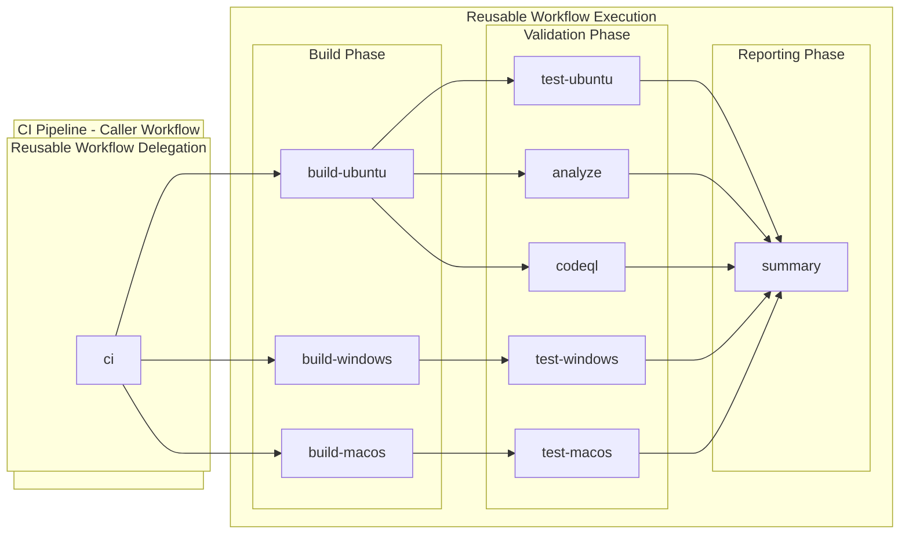

# CI - .NET Build and Test Workflow

## 1. Overview & Purpose

### Primary Workflow Purpose

**CI Validation Pipeline** - This workflow orchestrates continuous integration for .NET solutions by calling a reusable workflow. It handles triggers, path filters, and configuration while delegating execution to the reusable CI workflow.

### In-Scope Responsibilities

- Triggering CI pipeline on push events, pull requests, and manual dispatch
- Configuring build parameters and artifact settings
- Passing appropriate inputs to the reusable CI workflow
- Enforcing path-based filtering for efficient CI execution

### Out-of-Scope Responsibilities

- Direct build, test, or analysis execution (delegated to reusable workflow)
- Deployment to any environment
- Infrastructure provisioning
- Release management

---

## 2. Triggers

| Trigger Type | Configuration | Description |
|--------------|---------------|-------------|
| `push` | Multiple branch patterns | Automatic on code changes |
| `pull_request` | Target: `main` | PR validation |
| `workflow_dispatch` | Manual | On-demand with configurable inputs |

### Branch Patterns (Push Trigger)

| Pattern | Description |
|---------|-------------|
| `main` | Main development branch |
| `feature/**` | Feature branches |
| `bugfix/**` | Bug fix branches |
| `hotfix/**` | Hotfix branches |
| `release/**` | Release branches |
| `chore/**` | Maintenance branches |
| `docs/**` | Documentation branches |
| `refactor/**` | Refactoring branches |
| `test/**` | Test branches |

### Path Filters

The workflow executes only when changes occur in:

| Path Pattern | Description |
|--------------|-------------|
| `src/**` | Application source code |
| `app.*/**` | .NET Aspire host and defaults projects |
| `*.sln` | Solution files |
| `global.json` | .NET SDK version configuration |
| `.github/workflows/ci-dotnet.yml` | This workflow file |
| `.github/workflows/ci-dotnet-reusable.yml` | The reusable workflow |

### Manual Trigger Inputs

| Input | Type | Required | Default | Options | Description |
|-------|------|----------|---------|---------|-------------|
| `configuration` | choice | No | `Release` | `Release`, `Debug` | Build configuration |
| `enable-code-analysis` | boolean | No | `true` | - | Enable code formatting analysis |

### Concurrency Control

```yaml
concurrency:
  group: ${{ github.workflow }}-${{ github.event.pull_request.number || github.ref }}
  cancel-in-progress: true
```

- Groups by workflow name and PR number or branch ref
- **Cancels in-progress runs** when new commits are pushed (efficient resource usage)

---

## 3. Pipeline Flow



### Narrative Overview

1. **Caller Workflow**: This workflow (`ci-dotnet.yml`) acts as the entry point, handling triggers and configuration
2. **Reusable Workflow**: Execution is delegated to `ci-dotnet-reusable.yml` which runs:
   - Cross-platform builds on Ubuntu, Windows, and macOS
   - Cross-platform tests with coverage collection
   - Code formatting analysis (optional)
   - CodeQL security scanning (always enabled)
   - Summary aggregation

### Interpretation Notes

- **Single Job Delegation**: This workflow contains only one job (`ci`) that calls the reusable workflow
- **All Parallelism in Reusable**: Build parallelism, test parallelism, and matrix strategies are defined in the reusable workflow
- **Input Passthrough**: Configuration values flow from this workflow to the reusable workflow via `with` block

---

## 4. Jobs Breakdown

| Job | Type | Responsibility | Key Inputs |
|-----|------|----------------|------------|
| `ci` | `uses` (reusable workflow call) | Delegate all CI operations | Configuration, .NET version, artifact settings |

### Inputs Passed to Reusable Workflow

| Input | Value | Description |
|-------|-------|-------------|
| `configuration` | `${{ inputs.configuration \|\| 'Release' }}` | Build configuration |
| `dotnet-version` | `10.0.x` | .NET SDK version |
| `solution-file` | `app.sln` | Solution file path |
| `test-results-artifact-name` | `test-results` | Test results artifact name |
| `build-artifacts-name` | `build-artifacts` | Build artifacts name |
| `coverage-artifact-name` | `code-coverage` | Coverage artifact name |
| `artifact-retention-days` | `30` | Artifact retention period |
| `runs-on` | `ubuntu-latest` | Runner for analyze/summary jobs |
| `enable-code-analysis` | `${{ inputs.enable-code-analysis == '' && true \|\| inputs.enable-code-analysis }}` | Enable formatting check |
| `fail-on-format-issues` | `true` | Fail on formatting issues |

---

## 5. Inputs & Parameters

### Workflow Dispatch Inputs

| Input | Type | Required | Default | Description |
|-------|------|----------|---------|-------------|
| `configuration` | choice | No | `Release` | Build configuration (`Release` or `Debug`) |
| `enable-code-analysis` | boolean | No | `true` | Enable code formatting analysis |

### Default Behavior

- When triggered via push or PR, defaults are used
- `configuration` defaults to `Release`
- `enable-code-analysis` defaults to `true`

---

## 6. Secrets & Variables

### Required Secrets

No secrets are required directly. The workflow uses `secrets: inherit` to pass any required secrets to the reusable workflow.

### Environment Variables

No workflow-level environment variables defined. Environment variables are set in the reusable workflow.

---

## 7. Permissions & Security Model

### GitHub Token Permissions

| Permission | Level | Purpose |
|------------|-------|---------|
| `contents` | read | Read repository contents for checkout |
| `checks` | write | Create check runs for test results |
| `pull-requests` | write | Post comments on pull requests |
| `security-events` | write | Upload CodeQL SARIF results |

### Security Features

| Feature | Implementation |
|---------|----------------|
| Least privilege | Only necessary permissions requested |
| Secrets inheritance | `secrets: inherit` for controlled secret access |
| Concurrency control | Cancels duplicate runs |
| Path filtering | Only runs on relevant file changes |

---

## 8. Environments & Deployment Strategy

This workflow does **not** deploy to any environments. It is a pure CI validation workflow.

---

## 9. Failure Handling & Recovery

### Failure Behavior

| Scenario | Behavior |
|----------|----------|
| Reusable workflow fails | This workflow fails |
| Any job in reusable workflow fails | Failure propagates to caller |
| Concurrent run superseded | Previous run cancelled |

### Recovery Steps

1. Review failed job in the reusable workflow
2. Check job-specific summaries for details
3. Download artifacts for detailed analysis
4. Fix issues and push new commit

---

## 10. How to Run This Workflow

### Automatic Triggers

- **Push**: Commit to any configured branch with matching path filters
- **Pull Request**: Open or update PR targeting `main`

### Manual Execution

1. Navigate to **Actions** > **CI - .NET Build and Test**
2. Click **Run workflow**
3. Select branch
4. Configure inputs:
   - Build configuration: `Release` or `Debug`
   - Enable code analysis: checked/unchecked
5. Click **Run workflow**

### Common Mistakes to Avoid

| Mistake | Consequence | Prevention |
|---------|-------------|------------|
| Modifying workflow on wrong branch | Workflow not triggered | Ensure branch matches patterns |
| Missing `.editorconfig` | Code analysis may fail unexpectedly | Verify file exists |
| Disabling code analysis permanently | Reduced code quality | Use only for specific needs |

---

## 11. Extensibility & Customization

### Safe Extension Points

| Extension | How to Customize |
|-----------|------------------|
| Add trigger branches | Extend branch patterns in `push.branches` |
| Add path filters | Add patterns to `push.paths` and `pull_request.paths` |
| Change defaults | Modify `with` block in job definition |
| Add new inputs | Define in `workflow_dispatch.inputs` and pass to reusable |

### What Should NOT Be Changed

| Item | Reason |
|------|--------|
| Permission scopes | Security requirements |
| `secrets: inherit` | Required for reusable workflow |
| Reusable workflow reference | Breaking change |
| `fail-on-format-issues: true` | Code quality enforcement |

---

## 12. Known Limitations & Gotchas

| Limitation | Impact | Workaround |
|------------|--------|------------|
| Single reusable workflow call | Cannot customize individual jobs | Modify reusable workflow if needed |
| Path filters apply to all triggers | May skip needed runs | Manual dispatch available |
| Concurrency cancels runs | WIP commits may not complete | Push only when ready |

---

## 13. Ownership & Maintenance

### Owning Team

Platform Engineering / DevOps

### Review Expectations

| Change Type | Required Review |
|-------------|-----------------|
| Permission changes | Security team |
| Trigger modifications | PR approval |
| Default value changes | Team review |

### Change Management

- Changes to this file affect all CI runs
- Test changes via manual dispatch before merging
- Coordinate with reusable workflow changes

---

## 14. Assumptions & Gaps

### Assumptions

| Assumption | Validation |
|------------|------------|
| Reusable workflow exists at `.github/workflows/ci-dotnet-reusable.yml` | Workflow call fails if missing |
| Solution file `app.sln` exists | Build fails if missing |
| `.editorconfig` present | Code analysis may have unexpected results |

### Identified Gaps

| Gap | Impact | Recommendation |
|-----|--------|----------------|
| No conditional workflow skip | Always runs when paths match | Add skip label support |
| No custom artifact names per run | Static artifact names | Add run ID to names if needed |
| No branch-specific configuration | Same config for all branches | Consider environment-based config |
