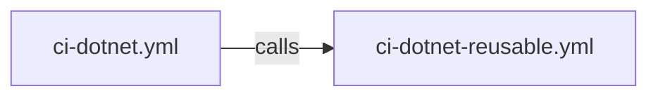

# CI - .NET Build and Test Workflow

## 1. Overview & Purpose

### What This Workflow Does

Orchestrates the CI pipeline by calling the reusable workflow. Handles:

- Trigger configuration and path filters
- Configuration parameter passing to reusable workflow
- Cross-platform builds, testing, analysis, and security scanning (via delegation)

### When to Use

- Validating code changes on push to development branches
- Running CI checks on pull requests targeting `main`
- Manual ad-hoc CI validation

### When NOT to Use

- For deployment operations (use `azure-dev.yml`)
- When only documentation changes are made (path filters skip workflow)

---

## 2. Triggers

### Push Triggers

| Branches | Path Filters |
|----------|--------------|
| `main`, `feature/**`, `bugfix/**`, `hotfix/**`, `release/**`, `chore/**`, `docs/**`, `refactor/**`, `test/**` | `src/**`, `app.*/**`, `*.sln`, `global.json`, `.github/workflows/ci-dotnet.yml`, `.github/workflows/ci-dotnet-reusable.yml` |

### Pull Request Triggers

| Target Branch | Path Filters |
|---------------|--------------|
| `main` | `src/**`, `app.*/**`, `*.sln`, `global.json`, `.github/workflows/ci-dotnet.yml`, `.github/workflows/ci-dotnet-reusable.yml` |

### Manual Triggers

| Input | Type | Required | Default | Options |
|-------|------|----------|---------|---------|
| `configuration` | choice | No | `Release` | `Release`, `Debug` |
| `enable-code-analysis` | boolean | No | `true` | - |

### Concurrency

```yaml
group: ${{ github.workflow }}-${{ github.event.pull_request.number || github.ref }}
cancel-in-progress: true
```

Cancels older runs for same branch/PR when new commits are pushed.

---

## 3. Pipeline Flow (Mermaid Diagram)



### Interpretation Notes

- **Delegation Pattern**: Single job calls reusable workflow
- **All Logic Centralized**: Reusable workflow handles build, test, analysis, reporting
- **Secret Inheritance**: `secrets: inherit` passes all repository secrets
- **For Details**: See `ci-dotnet-reusable.yml` documentation

---

## 4. Jobs Breakdown

### Job: `ci`

| Property | Value |
|----------|-------|
| **Name** | `🚀 CI` |
| **Type** | Reusable workflow call |
| **Called Workflow** | `./.github/workflows/ci-dotnet-reusable.yml` |
| **Secrets** | `inherit` |

---

## 5. Inputs & Parameters

### Parameters Passed to Reusable Workflow

| Parameter | Value |
|-----------|-------|
| `configuration` | `${{ inputs.configuration \|\| 'Release' }}` |
| `dotnet-version` | `10.0.x` |
| `solution-file` | `app.sln` |
| `test-results-artifact-name` | `test-results` |
| `build-artifacts-name` | `build-artifacts` |
| `coverage-artifact-name` | `code-coverage` |
| `artifact-retention-days` | `30` |
| `runs-on` | `ubuntu-latest` |
| `enable-code-analysis` | `${{ inputs.enable-code-analysis == '' && true \|\| inputs.enable-code-analysis }}` |
| `fail-on-format-issues` | `true` |

---

## 6. Secrets & Variables

### Secrets

| Secret | Scope |
|--------|-------|
| All inherited | Repository (via `secrets: inherit`) |

### Variables

No repository variables directly used.

---

## 7. Permissions & Security Model

### Workflow Permissions

| Permission | Level | Purpose |
|------------|-------|---------|
| `contents` | read | Repository checkout |
| `checks` | write | Test result check runs |
| `pull-requests` | write | PR comments |
| `security-events` | write | CodeQL SARIF upload |

---

## 8. Environments & Deployment Strategy

This workflow does not perform deployments. It is CI-only.

---

## 9. Failure Handling & Recovery

Delegated to reusable workflow:

- `on-failure` job reports job statuses
- Summary job provides troubleshooting guidance
- Artifacts uploaded even on failure

---

## 10. How to Run This Workflow

### Automatic

- Push to any configured branch with changes to monitored paths
- Pull request to `main` with changes to monitored paths

### Manual

1. Navigate to **Actions** → **CI - .NET Build and Test**
2. Click **Run workflow**
3. Select build configuration
4. Enable/disable code analysis
5. Click **Run workflow**

---

## 11. Extensibility & Customization

### Safe Extension Points

| Extension | How |
|-----------|-----|
| Add branch patterns | Extend `branches` array in triggers |
| Add path filters | Extend `paths` array in triggers |
| Add manual inputs | Add to `workflow_dispatch.inputs` |

### Do Not Modify

| Element | Reason |
|---------|--------|
| Reusable workflow reference | Breaking change affects all CI |
| Core parameters | May break expected functionality |

---

## 12. Known Limitations & Gotchas

### Limitations

| Limitation | Detail |
|------------|--------|
| Configuration options | Only `Release` and `Debug` |
| Coupled to reusable workflow | Changes to reusable affect this workflow |

### Gotchas

| Issue | Detail |
|-------|--------|
| Path filters | May miss indirect dependencies |
| Input defaults | Empty input uses conditional expression for default |

---

## 13. Ownership & Maintenance

| Role | Responsibility |
|------|----------------|
| DevOps Team | Workflow triggers and configuration |
| Development Team | Ensuring CI passes |

---

## 14. Assumptions & Gaps

### Assumptions

| Assumption | Source |
|------------|--------|
| Reusable workflow exists at path | `uses` reference |
| Solution file `app.sln` exists | Parameter value |
| .NET SDK 10.0.x available | Parameter value |

### Gaps

| Gap | Recommendation |
|-----|----------------|
| No dependency caching visible | Handled by reusable workflow |
| No coverage thresholds | Add coverage gates if needed |
