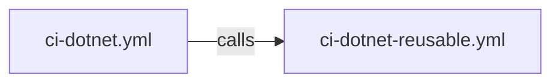

# CI - .NET Build and Test Workflow

> **Workflow file:** [`.github/workflows/ci-dotnet.yml`](../../.github/workflows/ci-dotnet.yml)

---

## 1. Overview & Purpose

### What This Workflow Does

This workflow orchestrates the Continuous Integration (CI) pipeline for the .NET application by calling the reusable CI workflow. It handles trigger configuration, path filters, and passes configuration parameters to the comprehensive reusable workflow that performs cross-platform builds, testing, code analysis, and security scanning.

### When to Use

- Validating code changes on push to any development branch
- Running CI checks on pull requests targeting the `main` branch
- Manually triggering CI for ad-hoc validation
- Verifying build compatibility across Ubuntu, Windows, and macOS

### When NOT to Use

- For deployment operations (use `azure-dev.yml` instead)
- When only documentation changes are made (workflow skips via path filters)
- For emergency hotfixes that need immediate deployment without full CI

---

## 2. Triggers

### Push Triggers

| Branches | Path Filters |
|----------|--------------|
| `main`, `feature/**`, `bugfix/**`, `hotfix/**`, `release/**`, `chore/**`, `docs/**`, `refactor/**`, `test/**` | `src/**`, `app.*/**`, `*.sln`, `global.json`, `.github/workflows/ci-dotnet.yml`, `.github/workflows/ci-dotnet-reusable.yml` |

### Pull Request Triggers

| Target Branches | Path Filters |
|-----------------|--------------|
| `main` | `src/**`, `app.*/**`, `*.sln`, `global.json`, `.github/workflows/ci-dotnet.yml`, `.github/workflows/ci-dotnet-reusable.yml` |

### Manual Triggers

| Input | Type | Required | Default | Options | Description |
|-------|------|----------|---------|---------|-------------|
| `configuration` | choice | No | `Release` | `Release`, `Debug` | Build configuration |
| `enable-code-analysis` | boolean | No | `true` | - | Enable code formatting analysis |

### Concurrency Control

- **Group:** `${{ github.workflow }}-${{ github.event.pull_request.number || github.ref }}`
- **Cancel in Progress:** `true` (newer runs cancel older runs for the same branch/PR)

---

## 3. High-Level Workflow Flow

### Narrative Overview

This workflow acts as an entry point that delegates all CI operations to the reusable workflow. The flow is straightforward:

1. **ci** job calls the reusable workflow with configured parameters
2. The reusable workflow executes Build, Test, Analyze, CodeQL, Summary, and On-Failure jobs internally

The reusable workflow handles all complexity, including cross-platform matrix builds and comprehensive reporting.

### Mermaid Diagram

### Interpretation Notes

- **Delegation pattern**: This workflow contains a single job that calls the reusable workflow
- **All execution logic is centralized**: The reusable workflow handles all build, test, analysis, and reporting
- **Secret inheritance**: All repository secrets are passed to the called workflow
- **For detailed flow**: See the reusable workflow documentation for internal job dependencies

---

## 4. Jobs Breakdown

### Job: `ci`

| Property | Value |
|----------|-------|
| **Name** | CI |
| **Type** | Reusable workflow call |
| **Responsibility** | Orchestrate the complete CI pipeline via delegation |
| **Called Workflow** | `.github/workflows/ci-dotnet-reusable.yml` |
| **Secrets** | `inherit` (passes all repository secrets) |

---

## 5. Inputs & Parameters

### Parameters Passed to Reusable Workflow

| Parameter | Value | Description |
|-----------|-------|-------------|
| `configuration` | `${{ inputs.configuration || 'Release' }}` | Build configuration (Release/Debug) |
| `dotnet-version` | `10.0.x` | .NET SDK version |
| `solution-file` | `app.sln` | Solution file path |
| `test-results-artifact-name` | `test-results` | Test results artifact name |
| `build-artifacts-name` | `build-artifacts` | Build artifacts name |
| `coverage-artifact-name` | `code-coverage` | Code coverage artifact name |
| `artifact-retention-days` | `30` | Artifact retention period |
| `runs-on` | `ubuntu-latest` | Runner for Analyze, CodeQL, Summary jobs |
| `enable-code-analysis` | `${{ inputs.enable-code-analysis == '' && true || inputs.enable-code-analysis }}` | Enable formatting check |
| `fail-on-format-issues` | `true` | Fail on formatting violations |

---

## 6. Secrets & Variables

### Secrets

| Secret | Scope | Purpose |
|--------|-------|---------|
| (all inherited) | Repository | Passed to reusable workflow via `secrets: inherit` |

### Variables

No repository variables are directly used by this workflow.

---

## 7. Permissions & Security Model

### GitHub Actions Permissions

| Permission | Level | Purpose |
|------------|-------|---------|
| `contents` | `read` | Read repository contents for checkout |
| `checks` | `write` | Create check runs for test results |
| `pull-requests` | `write` | Post comments on pull requests |
| `security-events` | `write` | Upload CodeQL SARIF results to Security tab |

### Security Considerations

- **Least-privilege design:** Only required permissions are requested
- **No secrets exposure:** Uses `secrets: inherit` for secure secret passing
- **Concurrency protection:** Prevents resource exhaustion from duplicate runs

---

## 8. Environments & Deployment Strategy

This workflow does not perform deployments. It focuses exclusively on CI validation.

---

## 9. Failure Handling & Recovery

### On Failure

Failure handling is delegated to the reusable workflow, which:

- Reports failures via the `on-failure` job
- Generates failure summaries with job statuses
- Provides troubleshooting guidance in workflow summaries

### Recovery Steps

1. Review the failed job logs in GitHub Actions
2. Download test artifacts for detailed analysis
3. Fix issues locally and push a new commit
4. The workflow will re-run automatically on push

---

## 10. How to Run This Workflow

### Automatic Execution

The workflow runs automatically on:

- Push to any supported branch with changes to monitored paths
- Pull request to `main` branch with changes to monitored paths

### Manual Execution

1. Navigate to **Actions** tab in the repository
2. Select **CI - .NET Build and Test** workflow
3. Click **Run workflow**
4. Select build configuration (`Release` or `Debug`)
5. Choose whether to enable code analysis
6. Click **Run workflow** button

### Common Operator Mistakes to Avoid

| Mistake | Impact | Prevention |
|---------|--------|------------|
| Running with Debug configuration in production | Slower builds, larger artifacts | Use Release for standard CI |
| Disabling code analysis for convenience | Code quality issues slip through | Keep analysis enabled |
| Force-merging without passing CI | Broken code reaches main branch | Enforce branch protection rules |

---

## 11. Extensibility & Customization

### Safe Extension Points

| Extension Point | How to Customize |
|-----------------|------------------|
| Add new branch patterns | Add to `branches` array in `push` trigger |
| Add new path filters | Add to `paths` array in triggers |
| Add new manual inputs | Add to `workflow_dispatch.inputs` section |

### What Should NOT Be Changed

| Element | Reason |
|---------|--------|
| Reusable workflow reference | Breaking change affects all CI behavior |
| Core parameters to reusable workflow | May break expected CI functionality |
| Permission model | Security implications |

---

## 12. Known Limitations & Gotchas

### Limitations

| Limitation | Details |
|------------|---------|
| Configuration options | Only Release and Debug configurations supported |
| Reusable workflow coupling | Changes to reusable workflow affect all callers |

### Gotchas

| Issue | Workaround |
|-------|------------|
| Path filters may miss dependencies | Ensure all relevant paths are included |
| Manual input defaults | Empty input defaults to `true` via conditional expression |

---

## 13. Ownership & Maintenance

### Ownership

| Role | Responsibility |
|------|----------------|
| DevOps Team | Workflow triggers and configuration |
| Development Team | Ensuring CI passes before merging |

### Review Expectations

| Change Type | Review Requirements |
|-------------|---------------------|
| Trigger modifications | DevOps team review |
| Parameter changes | Team lead review |

---

## 14. Assumptions & Gaps

### Assumptions

| Assumption | Impact if Invalid |
|------------|-------------------|
| Reusable workflow exists at referenced path | Workflow will fail |
| Solution file `app.sln` exists | Build will fail |
| .NET SDK 10.0.x is available | Setup will fail |

### Gaps

| Gap | Recommendation |
|-----|----------------|
| No dependency caching visible | Caching handled by reusable workflow |
| No code coverage thresholds | Consider adding coverage gates |

---

## Related Documentation

- [CI - .NET Reusable Workflow](./github-actions-ci-dotnet-reusable.md)
- [CD - Azure Deployment Workflow](./github-actions-azure-dev.md)
