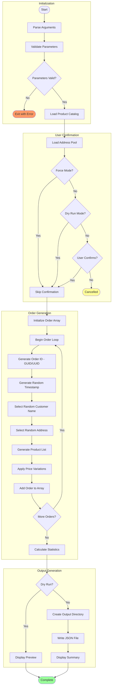

# Generate-Orders

## Overview

Generates sample e-commerce order data with products, customer information, and delivery addresses for testing Azure Logic Apps monitoring and workflow scenarios.

## Description

This utility script creates realistic sample order data for testing and demonstration purposes within the Azure Logic Apps Monitoring solution. It generates random e-commerce orders complete with product selections from a predefined catalog, customer details, and delivery addresses from a global address pool.

Each order is assigned a unique GUID (PowerShell) or UUID (Bash) identifier to ensure uniqueness across multiple runs. Orders contain between 1-6 products (configurable), with prices having a ±20% random variation from base prices to simulate real-world pricing fluctuations, promotions, and discounts. Order timestamps are randomly distributed across a two-year date range (2024-2025) for temporal diversity.

The generated data is output as a JSON file containing an array of order objects, suitable for direct consumption by Logic Apps workflows, API testing, or bulk import scenarios. The product catalog includes 20 different tech products ranging from accessories to furniture, with prices from $12.99 to $499.99.

## Workflow Diagram



## Prerequisites

| Category | Requirement | Version | Verification Command | Required |
|----------|-------------|---------|---------------------|----------|
| Runtime | PowerShell Core | >= 7.0 | `$PSVersionTable.PSVersion` | Yes |
| Runtime | Bash | >= 4.0 | `bash --version` | Yes |
| CLI Tool | jq (Bash only) | Latest | `jq --version` | Yes (Bash) |

### Installation Commands

```bash
# Install jq (Bash dependency for JSON generation)
# macOS
brew install jq

# Ubuntu/Debian
sudo apt-get install jq

# RHEL/CentOS
sudo yum install jq
```

## Parameters/Arguments

### PowerShell Parameters

| Parameter | Type | Required | Default | Description |
|-----------|------|----------|---------|-------------|
| `-OrderCount` | `[int]` | No | `2000` | Number of orders to generate (1-10000) |
| `-OutputPath` | `[string]` | No | `../infra/data/ordersBatch.json` | Output file path for generated orders |
| `-MinProducts` | `[int]` | No | `1` | Minimum products per order (1-20) |
| `-MaxProducts` | `[int]` | No | `6` | Maximum products per order (1-20) |
| `-Force` | `[switch]` | No | `$false` | Force execution without prompting |

### Bash Arguments

| Position/Flag | Type | Required | Default | Description |
|---------------|------|----------|---------|-------------|
| `-c`, `--count` | number | No | `2000` | Number of orders to generate |
| `-o`, `--output` | path | No | `../infra/data/ordersBatch.json` | Output file path |
| `-m`, `--min-products` | number | No | `1` | Minimum products per order |
| `-M`, `--max-products` | number | No | `6` | Maximum products per order |
| `-f`, `--force` | flag | No | `false` | Force execution without prompting |
| `-n`, `--dry-run` | flag | No | `false` | Show what would be generated without writing file |
| `-v`, `--verbose` | flag | No | `false` | Display detailed diagnostic information |
| `-h`, `--help` | flag | No | N/A | Display help message |

## Input/Output Specifications

### Inputs

**Environment Variables Read:**

- None

**Built-in Data:**

- Product catalog (20 products with IDs, descriptions, base prices)
- Address pool (20 global addresses)
- Customer name generation (random combination of first/last names)

### Outputs

**Exit Codes:**

| Exit Code | Meaning |
|-----------|---------|
| 0 | Success - Orders generated |
| 1 | Error - Parameter validation or file write failure |

**stdout Output:**

- Progress indicator (every 100 orders)
- Generation statistics
- Output file path confirmation

**Files Created:**

- JSON file at specified path containing order array

**JSON Output Format:**

```json
[
  {
    "orderId": "f47ac10b-58cc-4372-a567-0e02b2c3d479",
    "orderDate": "2024-06-15T14:23:45Z",
    "customerName": "John Smith",
    "deliveryAddress": "1 Microsoft Way, Redmond, WA, USA",
    "products": [
      {
        "productId": "PROD-1001",
        "description": "Wireless Mouse",
        "price": 28.12,
        "quantity": 2
      }
    ],
    "totalAmount": 56.24
  }
]
```

## Usage Examples

### Basic Usage

```powershell
# PowerShell: Generate 2000 orders with default settings
.\Generate-Orders.ps1
```

```bash
# Bash: Generate 2000 orders with default settings
./Generate-Orders.sh
```

### Advanced Usage

```powershell
# PowerShell: Generate 100 orders to a custom path
.\Generate-Orders.ps1 -OrderCount 100 -OutputPath "C:\temp\orders.json"

# PowerShell: Generate orders with 2-4 products each
.\Generate-Orders.ps1 -OrderCount 500 -MinProducts 2 -MaxProducts 4 -Force

# PowerShell: Preview what would be generated
.\Generate-Orders.ps1 -OrderCount 10 -WhatIf
```

```bash
# Bash: Generate 100 orders to a custom path
./Generate-Orders.sh --count 100 --output "/tmp/orders.json"

# Bash: Generate orders with 2-4 products each
./Generate-Orders.sh --count 500 --min-products 2 --max-products 4 --force

# Bash: Preview what would be generated
./Generate-Orders.sh --count 10 --dry-run --verbose
```

### CI/CD Pipeline Usage

```yaml
# Azure DevOps Pipeline
- task: PowerShell@2
  displayName: 'Generate test orders'
  inputs:
    targetType: 'filePath'
    filePath: '$(System.DefaultWorkingDirectory)/hooks/Generate-Orders.ps1'
    arguments: '-OrderCount 500 -Force'
    pwsh: true

# GitHub Actions
- name: Generate test data
  shell: bash
  run: |
    chmod +x ./hooks/Generate-Orders.sh
    ./Generate-Orders.sh --count 500 --force
```

## Error Handling and Exit Codes

| Exit Code | Meaning | Recovery Action |
|-----------|---------|-----------------|
| 0 | Success | N/A |
| 1 | Error | Check parameter values, verify write permissions |

### Error Handling Approach

**PowerShell:**

- `Set-StrictMode -Version Latest`
- `$ErrorActionPreference = 'Stop'`
- Parameter validation attributes with ranges
- `SupportsShouldProcess` for WhatIf support

**Bash:**

- `set -euo pipefail`
- Parameter range validation
- Output directory creation if needed
- jq dependency check

## Security Considerations

### Credential Handling

- [x] No credentials involved
- [x] Generated data contains no real PII
- [x] All customer data is synthetic/random

### Required Permissions

| Permission/Role | Scope | Justification |
|-----------------|-------|---------------|
| File System Write | Output directory | Write generated JSON file |

### Network Security

- **Endpoints accessed:** None
- **TLS requirements:** N/A
- **Firewall rules needed:** None

### Logging Security

- **Sensitive data masking:** N/A - no sensitive data
- **Audit trail:** Generation statistics displayed

## Known Limitations

- Product catalog is hardcoded (20 products)
- Address pool is hardcoded (20 addresses)
- Date range fixed to 2024-2025
- Maximum order count limited to 10,000
- Large order counts may take several minutes
- JSON output is not streamed (entire file built in memory)
- Bash version requires jq for JSON generation

## Related Scripts

| Script | Relationship | Description |
|--------|--------------|-------------|
| [deploy-workflow.md](deploy-workflow.md) | Consumes data | Workflows process generated orders |
| [postprovision.md](postprovision.md) | Related | Sets up environment for order processing |

## Product Catalog Reference

| Product ID | Description | Base Price |
|------------|-------------|------------|
| PROD-1001 | Wireless Mouse | $25.99 |
| PROD-1002 | Mechanical Keyboard | $89.99 |
| PROD-1003 | USB-C Hub | $34.99 |
| PROD-2001 | Noise Cancelling Headphones | $149.99 |
| PROD-2002 | Bluetooth Speaker | $79.99 |
| PROD-3001 | External SSD 1TB | $119.99 |
| PROD-3002 | Portable Charger | $49.99 |
| PROD-4001 | Webcam 1080p | $69.99 |
| PROD-4002 | Laptop Stand | $39.99 |
| PROD-5001 | Cable Organizer | $12.99 |
| PROD-5002 | Smartphone Holder | $19.99 |
| PROD-6001 | Monitor 27" 4K | $399.99 |
| PROD-6002 | Monitor Arm | $89.99 |
| PROD-7001 | Ergonomic Chair | $299.99 |
| PROD-7002 | Standing Desk | $499.99 |
| PROD-8001 | USB Microphone | $99.99 |
| PROD-8002 | Ring Light | $44.99 |
| PROD-9001 | Graphics Tablet | $199.99 |
| PROD-9002 | Drawing Pen Set | $29.99 |
| PROD-A001 | Wireless Earbuds | $129.99 |

## Changelog

| Version | Date | Changes |
|---------|------|---------|
| 2.0.1 | 2026-01-06 | Improved date range handling, added statistics |
| 2.0.0 | 2025-12-01 | Added configurable product count per order |
| 1.0.0 | 2025-01-01 | Initial release |
