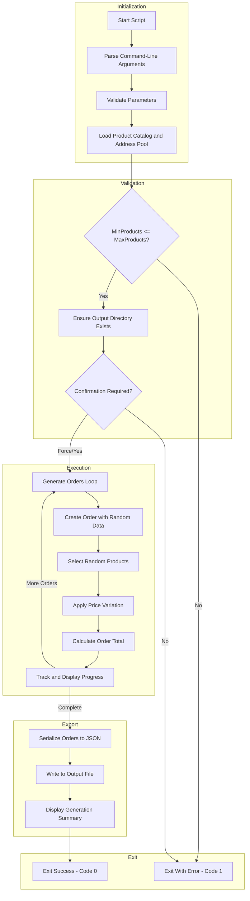

# Generate Sample Order Data for Testing

## Overview

> [!NOTE]
> This script generates **synthetic test data only**. No real customer information is created or transmitted.

This script generates randomized e-commerce orders containing products, customer information, and delivery addresses. The generated data is serialized to JSON format for use in testing, development, and demonstration scenarios with Azure Logic Apps workflows.

Key features include GUID-based order IDs for uniqueness, configurable product counts, price variation simulation (±20%), a global delivery address pool, and random date generation within a defined range (2024-2025).

The script is implemented in **both PowerShell and Bash** to support cross-platform development environments.

## Script Classification

| Attribute | Value |
|-----------|-------|
| **Category** | Test Data Generation Utility |
| **Trigger Mechanism** | Manual execution |
| **azd Hook** | No |

## Supported Environments

### Shells

| Shell | Minimum Version |
|-------|-----------------|
| PowerShell | 7.0+ |
| Bash | 4.0+ |

### Operating Systems

| OS | Supported |
|----|-----------|
| Windows | ✓ |
| Linux | ✓ |
| macOS | ✓ |

## Prerequisites

| Prerequisite | Required | Description |
|--------------|----------|-------------|
| jq | Yes (Bash only) | JSON processor for building output |
| bc | Yes (Bash only) | Arbitrary precision calculator for price calculations |
| uuidgen or `/proc/sys/kernel/random/uuid` | Yes (Bash only) | UUID generation |

## Files

| File | Description |
|------|-------------|
| `Generate-Orders.ps1` | PowerShell implementation |
| `Generate-Orders.sh` | Bash implementation |

## High-Level Script Flow



## Usage

> [!TIP]
> Use `-WhatIf` (PowerShell) or `--dry-run` (Bash) to preview generation without writing files.

### PowerShell

```powershell
# Generate 2000 orders using default settings
./Generate-Orders.ps1

# Generate 100 orders to a custom path
./Generate-Orders.ps1 -OrderCount 100 -OutputPath "C:\temp\orders.json"

# Generate 25 orders with 2-4 products each
./Generate-Orders.ps1 -OrderCount 25 -MinProducts 2 -MaxProducts 4

# Generate without prompts with verbose output
./Generate-Orders.ps1 -OrderCount 500 -Force -Verbose

# Preview what would be generated
./Generate-Orders.ps1 -WhatIf
```

### Bash

```bash
# Generate 2000 orders using default settings
./Generate-Orders.sh

# Generate 100 orders to a custom path
./Generate-Orders.sh --count 100 --output "/tmp/orders.json"

# Generate 25 orders with 2-4 products each
./Generate-Orders.sh --count 25 --min-products 2 --max-products 4

# Generate without prompts with verbose output
./Generate-Orders.sh --count 500 --force --verbose

# Preview what would be generated
./Generate-Orders.sh --dry-run

# Display help
./Generate-Orders.sh --help
```

## Parameters

> [!IMPORTANT]
> Ensure `MinProducts` ≤ `MaxProducts` and `OrderCount` is between 1–10,000.

| Logical Parameter | PowerShell Name | Bash Name | Required | Default | Description |
|-------------------|-----------------|-----------|----------|---------|-------------|
| Order Count | `-OrderCount` | `-c`, `--count` | No | 2000 | Number of orders to generate (1-10000) |
| Output Path | `-OutputPath` | `-o`, `--output` | No | `../infra/data/ordersBatch.json` | Path for JSON output file |
| Min Products | `-MinProducts` | `-m`, `--min-products` | No | 1 | Minimum products per order (1-20) |
| Max Products | `-MaxProducts` | `-M`, `--max-products` | No | 6 | Maximum products per order (1-20) |
| Force | `-Force` | `-f`, `--force` | No | `false` | Skip confirmation prompts |
| Dry Run | `-WhatIf` | `-n`, `--dry-run` | No | `false` | Preview without making changes |
| Verbose | `-Verbose` | `-v`, `--verbose` | No | `false` | Display detailed progress |
| Help | N/A | `-h`, `--help` | No | N/A | Display help message |

## Examples

### Generate Default Order Batch

**PowerShell:**

```powershell
./Generate-Orders.ps1
```

**Bash:**

```bash
./Generate-Orders.sh
```

### Generate Small Test Dataset

**PowerShell:**

```powershell
./Generate-Orders.ps1 -OrderCount 100 -OutputPath "C:\temp\test-orders.json"
```

**Bash:**

```bash
./Generate-Orders.sh --count 100 --output "/tmp/test-orders.json"
```

### Generate Orders for Load Testing

**PowerShell:**

```powershell
./Generate-Orders.ps1 -OrderCount 10000 -MinProducts 3 -MaxProducts 10 -Force
```

**Bash:**

```bash
./Generate-Orders.sh --count 10000 --min-products 3 --max-products 10 --force
```

## Error Handling & Exit Codes

| Exit Code | Description |
|-----------|-------------|
| 0 | All operations completed successfully |
| 1 | Error occurred (validation failed or generation failed) |
| 130 | Script interrupted by user (SIGINT) - Bash only |

### Error Behavior

- **PowerShell**: Uses `SupportsShouldProcess` for `-WhatIf` support. Validates parameter ranges before execution.
- **Bash**: Uses `set -euo pipefail` for strict error handling. Includes signal handlers for graceful interruption.

## Logging & Output

| Output Type | Description |
|-------------|-------------|
| stdout | Progress updates, generation summary |
| stderr | Error messages, warnings |
| JSON file | Generated order data |

### JSON Output Structure

```json
{
  "id": "ORD-XXXXXXXXXXXX",
  "customerId": "CUST-XXXXXXXX",
  "date": "2024-06-15T14:23:45Z",
  "deliveryAddress": "350 Fifth Ave, New York, NY, USA",
  "total": 125.99,
  "products": [
    {
      "id": "OP-XXXXXXXXXXXX",
      "orderId": "ORD-XXXXXXXXXXXX",
      "productId": "PROD-1001",
      "productDescription": "Wireless Mouse",
      "quantity": 2,
      "price": 25.99
    }
  ]
}
```

## Security Considerations

- Generated data is synthetic and contains no real customer information
- Order IDs use GUIDs to ensure uniqueness across runs
- Output file is written to local filesystem only
- No network operations or external data transmission

## Troubleshooting

| Issue | Resolution |
|-------|------------|
| `jq is required but not installed` (Bash) | Install jq: `brew install jq` (macOS), `apt-get install jq` (Ubuntu) |
| `bc is required but not installed` (Bash) | Install bc: `apt-get install bc` (Ubuntu) |
| `MinProducts cannot be greater than MaxProducts` | Ensure MinProducts ≤ MaxProducts |
| `OrderCount out of range` | Use a value between 1 and 10000 |
| Output directory does not exist | The script creates the directory structure automatically |
| Large file generation is slow | Consider reducing order count or running with `--force` to skip confirmations |

## Data Generation Details

### Product Catalog

The script includes a built-in catalog of 20 products with IDs, descriptions, and base prices:

- Electronics (mice, keyboards, monitors)
- Audio (headphones, speakers, microphones)
- Accessories (hubs, stands, organizers)
- Furniture (chairs, desks)
- Peripherals (webcams, tablets)

### Price Variation

Each product's price varies by ±20% from its base price to simulate real-world pricing fluctuations, promotions, and discounts.

### Date Range

Order dates are randomly generated between January 1, 2024 and December 31, 2025 in ISO 8601 format (UTC).

### Address Pool

The script includes 20 global delivery addresses from major cities worldwide (USA, UK, Germany, France, Japan, Canada, Australia, Brazil, Spain, Italy, China, South Korea).

## Development Notes

- Script version: `2.0.1` for both implementations
- GUID-based IDs ensure uniqueness across multiple runs and distributed systems
- Progress tracking provides periodic updates for large batch operations
- Both implementations maintain data structure compatibility

## License & Ownership

| Attribute | Value |
|-----------|-------|
| Author | Evilazaro \| Principal Cloud Solution Architect \| Microsoft |
| Version | 2.0.1 |
| Last Modified | 2026-01-06 |
| Repository | [Azure-LogicApps-Monitoring](https://github.com/Evilazaro/Azure-LogicApps-Monitoring) |

## Related Links

- [Azure Logic Apps Documentation](https://learn.microsoft.com/azure/logic-apps/)
- [JSON Schema Specification](https://json-schema.org/)
