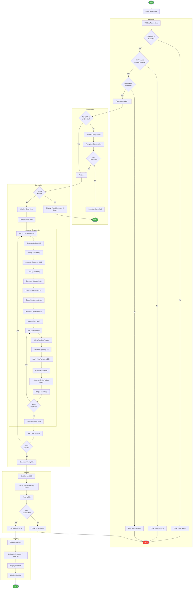

# 📦 Generate-Orders

> [!NOTE]
> **Target Audience**: Developers, QA Engineers, Solution Architects  
> **Reading Time**: ~10 minutes

<details>
<summary>📖 Navigation</summary>

| Previous | Index | Next |
|:---------|:-----:|-----:|
| [sql-managed-identity-config](sql-managed-identity-config.md) | [📚 Index](README.md) | — |

</details>

Generates sample order data for testing Azure Logic Apps monitoring.

## 📑 Table of Contents

- [📋 Overview](#-overview)
- [⚙️ Prerequisites](#️-prerequisites)
- [🎯 Parameters](#-parameters)
- [🌐 Environment Variables](#-environment-variables)
- [⚙️ Functionality](#️-functionality)
- [📖 Usage Examples](#-usage-examples)
- [💻 Platform Differences](#-platform-differences)
- [🚪 Exit Codes](#-exit-codes)
- [🔗 Related Hooks](#-related-hooks)

## 📋 Overview

This script generates random e-commerce orders with products, customer information, and delivery addresses. The generated data is saved as JSON for use in testing and demonstration scenarios.

### ✨ Key Features

- **Unique Order IDs**: Generated using GUIDs/UUIDs to ensure uniqueness across multiple runs
- **Realistic Data**: Product catalog, customer names, and global delivery addresses
- **Price Variation**: Base prices with ±20% variation to simulate real-world pricing
- **Configurable**: Customizable order count, product quantities, and output location
- **Date Range**: Orders dated between January 2024 and December 2025

### 📅 When to Use

- Testing Logic Apps workflow processing
- Load testing the Orders API
- Demonstrating the monitoring solution
- Generating sample data for development

## ⚙️ Prerequisites

### 🔧 Required Tools

| Tool | Minimum Version | Purpose |
|:-----|:---------------:|:--------|
| PowerShell Core | 7.0+ | Script execution (PowerShell version) |
| Bash | 4.0+ | Script execution (Bash version) |
| jq | Latest | JSON generation (Bash version only) |

### 🌐 No Azure Dependencies

This script runs entirely locally and does not require Azure authentication or resources.

## 🎯 Parameters

### PowerShell Parameters

| Parameter | Type | Required | Default | Description |
|:----------|:----:|:--------:|:-------:|:------------|
| `-OrderCount` | Int | No | `2000` | Number of orders to generate (1-10000) |
| `-OutputPath` | String | No | `../infra/data/ordersBatch.json` | Output file path |
| `-MinProducts` | Int | No | `1` | Minimum products per order (1-20) |
| `-MaxProducts` | Int | No | `6` | Maximum products per order (1-20) |
| `-Force` | Switch | No | `$false` | Force execution without prompting |
| `-Verbose` | Switch | No | `$false` | Display detailed diagnostic information |
| `-WhatIf` | Switch | No | `$false` | Show what would be done without making changes |

### Bash Parameters

| Parameter | Type | Required | Default | Description |
|:----------|:----:|:--------:|:-------:|:------------|
| `-c`, `--count` | Int | No | `2000` | Number of orders to generate |
| `-o`, `--output` | String | No | `../infra/data/ordersBatch.json` | Output file path |
| `-m`, `--min-products` | Int | No | `1` | Minimum products per order |
| `-M`, `--max-products` | Int | No | `6` | Maximum products per order |
| `-f`, `--force` | Flag | No | `false` | Force execution without prompting |
| `-n`, `--dry-run` | Flag | No | `false` | Show what would be done |
| `-v`, `--verbose` | Flag | No | `false` | Display detailed diagnostic information |
| `-h`, `--help` | Flag | No | N/A | Display help message |

## 🌐 Environment Variables

### Variables Read

This script does not require any environment variables.

### Variables Set

This script does not set any environment variables.

## ⚙️ Functionality

### 🔄 Execution Flow



### 📄 Generated Data Structure

```json
{
  "orders": [
    {
      "orderId": "a1b2c3d4-e5f6-7890-abcd-ef1234567890",
      "orderDate": "2024-06-15T14:23:45Z",
      "customer": {
        "name": "John Smith",
        "email": "john.smith@example.com"
      },
      "deliveryAddress": "1 Microsoft Way, Redmond, WA, USA",
      "products": [
        {
          "productId": "PROD-1001",
          "description": "Wireless Mouse",
          "price": 28.99,
          "quantity": 2
        },
        {
          "productId": "PROD-2001",
          "description": "Noise Cancelling Headphones",
          "price": 142.49,
          "quantity": 1
        }
      ],
      "totalAmount": 200.47
    }
  ]
}
```

### 🛏️ Product Catalog

The script includes 20 products across various categories:

| Product ID | Description | Base Price |
|:-----------|:------------|----------:|
| PROD-1001 | Wireless Mouse | $25.99 |
| PROD-1002 | Mechanical Keyboard | $89.99 |
| PROD-1003 | USB-C Hub | $34.99 |
| PROD-2001 | Noise Cancelling Headphones | $149.99 |
| PROD-2002 | Bluetooth Speaker | $79.99 |
| PROD-3001 | External SSD 1TB | $119.99 |
| PROD-3002 | Portable Charger | $49.99 |
| PROD-4001 | Webcam 1080p | $69.99 |
| PROD-4002 | Laptop Stand | $39.99 |
| PROD-5001 | Cable Organizer | $12.99 |
| PROD-5002 | Smartphone Holder | $19.99 |
| PROD-6001 | Monitor 27" 4K | $399.99 |
| PROD-6002 | Monitor Arm | $89.99 |
| PROD-7001 | Ergonomic Chair | $299.99 |
| PROD-7002 | Standing Desk | $499.99 |
| PROD-8001 | USB Microphone | $99.99 |
| PROD-8002 | Ring Light | $44.99 |
| PROD-9001 | Graphics Tablet | $199.99 |
| PROD-9002 | Drawing Pen Set | $29.99 |
| PROD-A001 | Wireless Earbuds | $129.99 |

### 🌍 Delivery Addresses

20 global addresses from major cities:

- 221B Baker Street, London, UK
- 350 Fifth Ave, New York, NY, USA
- 1 Microsoft Way, Redmond, WA, USA
- 1 Apple Park Way, Cupertino, CA, USA
- Shibuya Crossing, Tokyo, Japan
- Champs-Élysées, Paris, France
- (and more...)

## 📖 Usage Examples

### PowerShell

```powershell
# Generate 2000 orders using default settings
.\Generate-Orders.ps1

# Generate 100 orders to a custom path
.\Generate-Orders.ps1 -OrderCount 100 -OutputPath "C:\temp\orders.json"

# Generate 25 orders with 2-4 products each
.\Generate-Orders.ps1 -OrderCount 25 -MinProducts 2 -MaxProducts 4

# Force generation without confirmation
.\Generate-Orders.ps1 -Force

# Show what would be generated
.\Generate-Orders.ps1 -WhatIf -Verbose
```

### Bash

```bash
# Generate 2000 orders using default settings
./Generate-Orders.sh

# Generate 100 orders to a custom path
./Generate-Orders.sh --count 100 --output "/tmp/orders.json"

# Generate 25 orders with 2-4 products each
./Generate-Orders.sh --count 25 --min-products 2 --max-products 4

# Force generation without confirmation
./Generate-Orders.sh --force

# Show what would be generated
./Generate-Orders.sh --dry-run --verbose

# Display help
./Generate-Orders.sh --help
```

### 📝 Sample Output

```
═══════════════════════════════════════════════════════════════
  Azure Logic Apps Monitoring - Order Generator
  Version: 2.0.1
═══════════════════════════════════════════════════════════════

Generation Parameters:
  Order Count: 2000
  Products per Order: 1-6
  Output Path: ../infra/data/ordersBatch.json

Are you sure you want to continue? [y/N]: y

───────────────────────────────────────────────────────────────
  Generating Orders
───────────────────────────────────────────────────────────────

Progress: [████████████████████████████████████████] 100%

═══════════════════════════════════════════════════════════════
  Generation Summary
═══════════════════════════════════════════════════════════════

✓ Orders generated: 2000
✓ Total products: 7,234
✓ Total value: $1,847,293.47
✓ Average order value: $923.65
✓ File size: 4.2 MB
✓ Output: ../infra/data/ordersBatch.json

Execution time: 3.7 seconds
```

## 💻 Platform Differences

| Aspect | PowerShell | Bash |
|:-------|:-----------|:-----|
| GUID generation | `[Guid]::NewGuid()` | `uuidgen` or `/proc/sys/kernel/random/uuid` |
| JSON serialization | `ConvertTo-Json` | `jq` |
| Date handling | `[DateTime]::new()` | `date` command |
| Random numbers | `Get-Random` | `$RANDOM` or `shuf` |
| Progress display | `Write-Progress` | Manual progress bar |

## 🚪 Exit Codes

| Code | Meaning |
|:----:|:--------|
| `0` | Success - orders generated and saved |
| `1` | Error - validation failed or write error |
| `130` | Script interrupted by user (SIGINT) |

## 🔗 Related Hooks

| Hook | Relationship |
|:-----|:-------------|
| [deploy-workflow](deploy-workflow.md) | Deploys Logic Apps that process the generated orders |
| [postprovision](postprovision.md) | Configures APIs that receive the generated orders |

## 📤 Using Generated Data

### 🌐 With the Orders API

```bash
# Upload orders to the API
curl -X POST \
  -H "Content-Type: application/json" \
  -d @../infra/data/ordersBatch.json \
  https://api-orders-dev.azurewebsites.net/api/orders/batch
```

### ⚙️ With Logic Apps

The generated JSON can be:

1. Uploaded to a blob storage container for trigger-based processing
2. Posted to a Service Bus queue for message-based processing
3. Used directly in Logic Apps testing via HTTP request

### ✅ Data Validation

```powershell
# Validate JSON structure
$orders = Get-Content ../infra/data/ordersBatch.json | ConvertFrom-Json
$orders.orders.Count  # Should match OrderCount
$orders.orders[0].orderId  # Should be a valid GUID
```

## 🔧 Troubleshooting

### ⚠️ Common Issues

1. **"Output directory not found"**
   - Ensure the parent directory exists
   - Create it manually or specify a different path

2. **"Permission denied" when writing file**
   - Check file permissions on output directory
   - Ensure file isn't open in another application

3. **"jq: command not found" (Bash)**
   - Install jq: `apt-get install jq` or `brew install jq`

4. **Slow generation for large counts**
   - This is expected; 10,000 orders may take 15-30 seconds
   - Use `--verbose` to see progress

---

<div align="center">

**[← sql-managed-identity-config](sql-managed-identity-config.md)** · **[⬆️ Back to Top](#-generate-orders)** · **[📚 Index](README.md)**

</div>

**Version**: 2.0.1  
**Author**: Evilazaro | Principal Cloud Solution Architect | Microsoft  
**Last Modified**: January 2026
