# Generate-Orders

[Home](../../README.md) > [Docs](..) > [Hooks](README.md) > Generate-Orders

> 📦 Generates randomized sample e-commerce order data for testing and development purposes

---

## Table of Contents

- [Overview](#overview)
- [Compatibility](#compatibility)
- [Prerequisites](#prerequisites)
- [Parameters](#parameters)
- [Script Flow](#script-flow)
- [Functions](#functions)
- [Usage](#usage)
- [Environment Variables](#environment-variables)
- [Exit Codes](#exit-codes)
- [Error Handling](#error-handling)
- [Output Format](#output-format)
- [Notes](#notes)
- [See Also](#see-also)

---

## Overview

This script generates randomized sample e-commerce order data for testing and development purposes. The generated orders include realistic customer information, shipping addresses, product details, and order metadata.

The script is useful for:

- Populating development/test databases with sample data
- Performance testing with configurable data volumes
- Demo environments requiring realistic-looking data
- Integration testing of order processing workflows

**Operations Performed:**

1. Validates input parameters (order count within bounds)
2. Initializes random data generators
3. Generates specified number of orders with randomized content
4. Outputs data in JSON format to file or stdout

---

## Compatibility

| Platform    | Script                  | Status |
|:------------|:------------------------|:------:|
| Windows     | `Generate-Orders.ps1`   |   ✅   |
| Linux/macOS | `Generate-Orders.sh`    |   ✅   |

---

## Prerequisites

| Requirement | Details | Installation Guide |
|:------------|:--------|:-------------------|
| **PowerShell** | Version 7.0 or higher | [Install PowerShell](https://docs.microsoft.com/powershell/scripting/install/installing-powershell) |
| **Bash** | Version 4.0 or higher | Pre-installed on Linux/macOS |
| **jq** | JSON processor (Bash only) | [Install jq](https://stedolan.github.io/jq/download/) |

---

## Parameters

### PowerShell

| Parameter | Type | Required | Default | Description |
|:----------|:----:|:--------:|:-------:|:------------|
| `-OrderCount` | Int | No | `2000` | Number of orders to generate (1-10000) |
| `-OutputPath` | String | No | Auto-generated | Output file path for generated JSON |
| `-MinProducts` | Int | No | `1` | Minimum products per order (1-20) |
| `-MaxProducts` | Int | No | `5` | Maximum products per order (1-20) |
| `-Force` | Switch | No | `$false` | Overwrite existing output file |
| `-Verbose` | Switch | No | `$false` | Display detailed diagnostic information |

### Bash

| Parameter | Type | Required | Default | Description |
|:----------|:----:|:--------:|:-------:|:------------|
| `-c, --count` | Int | No | `2000` | Number of orders to generate (1-10000) |
| `-o, --output` | String | No | Auto-generated | Output file path for generated JSON |
| `--min-products` | Int | No | `1` | Minimum products per order (1-20) |
| `--max-products` | Int | No | `5` | Maximum products per order (1-20) |
| `-f, --force` | Flag | No | `false` | Overwrite existing output file |
| `-v, --verbose` | Flag | No | `false` | Display detailed diagnostic information |
| `-h, --help` | Flag | No | N/A | Display help message and exit |

---

## Script Flow

### Execution Flow

```mermaid
%%{init: {'flowchart': {'nodeSpacing': 30, 'rankSpacing': 40, 'curve': 'basis'}}}%%
flowchart TD
    subgraph INIT["🔧 Initialization"]
        direction TB
        A([▶️ Start]):::startNode
        A --> B[🔧 Set Strict Mode]:::config
        B --> C[📋 Parse Arguments]:::data
        C --> D[📋 Initialize Random Seed]:::data
    end

    subgraph VALIDATE["✅ Validation Phase"]
        direction TB
        E{🔍 OrderCount in range 1-10000?}:::validation
        E -->|❌ No| F[❗ Error: Invalid count]:::error
        E -->|✅ Yes| G{🔍 MinProducts <= MaxProducts?}:::validation
        G -->|❌ No| H[❗ Error: Invalid product range]:::error
        G -->|✅ Yes| I{🔍 Output path writable?}:::validation
        I -->|❌ No| J[❗ Error: Cannot write to path]:::error
        I -->|✅ Yes| K{🔍 File exists & no Force?}:::validation
        K -->|✅ Yes| L[❗ Error: File exists]:::error
        K -->|❌ No| M[📋 Load data templates]:::data
    end

    subgraph EXECUTE["⚡ Execution Phase"]
        direction TB
        N[📋 Initialize order collection]:::data
        N --> O[🔁 For i = 1 to OrderCount]:::execution
        O --> P[🎲 Generate random customer]:::execution
        P --> Q[🎲 Generate random address]:::execution
        Q --> R[🎲 Generate random products]:::execution
        R --> S[💰 Calculate order totals]:::execution
        S --> T[📋 Add order to collection]:::data
        T --> U{🔍 More orders?}:::validation
        U -->|✅ Yes| O
        U -->|❌ No| V[📄 Serialize to JSON]:::execution
    end

    subgraph CLEANUP["🧹 Cleanup Phase"]
        direction TB
        W[💾 Write JSON to output file]:::logging
        X[📋 Display generation summary]:::logging
    end

    subgraph EXIT["🚪 Exit Handling"]
        direction TB
        Y([❌ Exit 1]):::errorExit
        Z([✅ Exit 0]):::successExit
    end

    %% Cross-subgraph connections
    D --> E
    F --> Y
    H --> Y
    J --> Y
    L --> Y
    M --> N
    V --> W
    W --> X
    X --> Z

    %% Subgraph styles
    style INIT fill:#e8eaf6,stroke:#303f9f,stroke-width:2px,color:#1a237e
    style VALIDATE fill:#fff8e1,stroke:#ffa000,stroke-width:2px,color:#ff6f00
    style EXECUTE fill:#e0f2f1,stroke:#00796b,stroke-width:2px,color:#004d40
    style CLEANUP fill:#ede7f6,stroke:#512da8,stroke-width:2px,color:#311b92
    style EXIT fill:#eceff1,stroke:#455a64,stroke-width:2px,color:#263238

    classDef startNode fill:#b3e5fc,stroke:#0288d1,stroke-width:3px,color:#01579b
    classDef successExit fill:#c8e6c9,stroke:#388e3c,stroke-width:3px,color:#1b5e20
    classDef errorExit fill:#ffcdd2,stroke:#d32f2f,stroke-width:3px,color:#b71c1c
    classDef config fill:#c5cae9,stroke:#3949ab,stroke-width:2px,color:#1a237e
    classDef data fill:#f0f4c3,stroke:#9e9d24,stroke-width:2px,color:#827717
    classDef validation fill:#fff9c4,stroke:#f9a825,stroke-width:2px,color:#f57f17
    classDef execution fill:#b2dfdb,stroke:#00796b,stroke-width:2px,color:#004d40
    classDef error fill:#ffebee,stroke:#e53935,stroke-width:2px,color:#c62828
    classDef cleanup fill:#e1bee7,stroke:#7b1fa2,stroke-width:2px,color:#4a148c
    classDef logging fill:#d7ccc8,stroke:#6d4c41,stroke-width:2px,color:#3e2723
```



---

## Functions

### PowerShell

| Function | Purpose |
|:---------|:--------|
| `Get-RandomCustomer` | Generates random customer information (name, email, phone) |
| `Get-RandomAddress` | Generates random shipping/billing address |
| `Get-RandomProduct` | Generates random product details (name, SKU, price, quantity) |
| `New-Order` | Creates a complete order object with all components |
| `ConvertTo-OrderJson` | Serializes order collection to JSON format |

### Bash

| Function | Purpose |
|:---------|:--------|
| `cleanup` | Performs cleanup operations on script exit |
| `handle_interrupt` | Handles SIGINT/SIGTERM signals gracefully |
| `log_verbose` | Outputs verbose messages when enabled |
| `log_error` | Outputs error messages to stderr |
| `log_info` | Outputs informational messages |
| `show_help` | Displays comprehensive help information |
| `random_element` | Selects random element from array |
| `random_range` | Generates random number within range |
| `generate_customer` | Generates random customer object |
| `generate_address` | Generates random address object |
| `generate_product` | Generates random product object |
| `generate_order` | Creates complete order with all components |
| `main` | Main execution function orchestrating generation |

---

## Usage

### PowerShell

```powershell
# Generate default 2000 orders
.\Generate-Orders.ps1

# Generate specific number of orders
.\Generate-Orders.ps1 -OrderCount 500

# Generate orders with custom output path
.\Generate-Orders.ps1 -OrderCount 1000 -OutputPath ".\data\test-orders.json"

# Generate orders with custom product range
.\Generate-Orders.ps1 -OrderCount 100 -MinProducts 2 -MaxProducts 10

# Overwrite existing file with verbose output
.\Generate-Orders.ps1 -OrderCount 5000 -Force -Verbose
```

### Bash

```bash
# Generate default 2000 orders
./Generate-Orders.sh

# Generate specific number of orders
./Generate-Orders.sh --count 500

# Generate orders with custom output path
./Generate-Orders.sh --count 1000 --output "./data/test-orders.json"

# Generate orders with custom product range
./Generate-Orders.sh --count 100 --min-products 2 --max-products 10

# Overwrite existing file with verbose output
./Generate-Orders.sh --count 5000 --force --verbose

# Display help
./Generate-Orders.sh --help
```

---

## Environment Variables

| Variable | Description | Required | Default |
|:---------|:------------|:--------:|:-------:|
| N/A | This script does not require environment variables | N/A | N/A |

> ℹ️ **Note**: All configuration is done via command-line parameters.

---

## Exit Codes

| Code | Meaning |
|-----:|:--------|
| 0 | ✅ Orders generated successfully |
| 1 | ❌ Invalid order count (outside 1-10000 range) |
| 1 | ❌ Invalid product range (min > max) |
| 1 | ❌ Output path not writable |
| 1 | ❌ Output file exists and -Force not specified |
| 130 | ❌ Script interrupted by user (SIGINT) |

---

## Error Handling

The script implements comprehensive error handling:

- **Strict Mode**: PowerShell uses `Set-StrictMode -Version Latest`; Bash uses `set -euo pipefail`
- **Parameter Validation**: Validates all numeric parameters are within acceptable ranges
- **File System Checks**: Validates output path is writable before generation
- **Idempotent Behavior**: Requires `-Force` to overwrite existing files
- **Progress Reporting**: Shows generation progress for large datasets
- **Signal Handling**: Bash version handles SIGINT and SIGTERM gracefully

---

## Output Format

The generated JSON follows this structure:

```json
{
  "orders": [
    {
      "orderId": "ORD-2024-001234",
      "orderDate": "2024-01-15T14:32:00Z",
      "status": "pending",
      "customer": {
        "customerId": "CUST-00001",
        "firstName": "John",
        "lastName": "Smith",
        "email": "john.smith@example.com",
        "phone": "+1-555-123-4567"
      },
      "shippingAddress": {
        "street": "123 Main Street",
        "city": "Seattle",
        "state": "WA",
        "zipCode": "98101",
        "country": "USA"
      },
      "billingAddress": {
        "street": "123 Main Street",
        "city": "Seattle",
        "state": "WA",
        "zipCode": "98101",
        "country": "USA"
      },
      "items": [
        {
          "productId": "PROD-001",
          "productName": "Wireless Mouse",
          "sku": "WM-BLK-001",
          "quantity": 2,
          "unitPrice": 29.99,
          "totalPrice": 59.98
        }
      ],
      "subtotal": 59.98,
      "tax": 5.40,
      "shipping": 4.99,
      "total": 70.37
    }
  ],
  "metadata": {
    "generatedAt": "2024-01-15T14:35:00Z",
    "orderCount": 2000,
    "generatorVersion": "2.0.1"
  }
}
```

---

## Notes

| Item | Details |
|:-----|:--------|
| **Script Version** | 2.0.1 |
| **Author** | Evilazaro \| Principal Cloud Solution Architect \| Microsoft |
| **Last Modified** | 2025-01-07 |
| **Max Order Count** | 10,000 |
| **Default Output** | `./data/generated-orders-{timestamp}.json` |

> ℹ️ **Note**: Generated data is randomized but uses realistic patterns for names, addresses, and product information.

> 💡 **Tip**: For performance testing, generate larger datasets (5000-10000 orders). For quick tests, use smaller datasets (100-500 orders).

> ⚠️ **Important**: Generated data is for testing purposes only and does not contain real customer information.

---

## See Also

- [eShop.Orders.API](../../src/eShop.Orders.API/README.md) — Orders API that consumes this data
- [README.md](README.md) — Hooks documentation overview

---

[← Back to Hooks Documentation](README.md)
