# 📦 Generate-Orders

> Generates sample order data for testing Azure Logic Apps monitoring.

> [!NOTE]
> **Target Audience:** Developers and QA Engineers  
> **Reading Time:** ~7 minutes

<details>
<summary>📍 Navigation</summary>

| Previous                            |          Index          |                                    Next |
| :---------------------------------- | :---------------------: | --------------------------------------: |
| [clean-secrets](./clean-secrets.md) | [🪝 Hooks](./README.md) | [deploy-workflow](./deploy-workflow.md) |

</details>

---

## 📋 Overview

This script generates random e-commerce orders with products, customer information, and delivery addresses. The generated data is saved as JSON for use in testing and demonstration scenarios.

Order IDs are generated using GUIDs/UUIDs to ensure uniqueness across multiple runs.

The script performs the following operations:

- Validates parameters and prerequisites
- Generates random orders with configurable product counts
- Applies price variation (±20%) to simulate real-world pricing
- Saves output to JSON file for batch processing
- Provides execution statistics and summary

---

## 📑 Table of Contents

- [📌 Script Metadata](#-script-metadata)
- [🔧 Prerequisites](#-prerequisites)
- [📥 Parameters](#-parameters)
- [🛒 Product Catalog](#-product-catalog)
- [🏠 Delivery Addresses](#-delivery-addresses)
- [🔄 Execution Flow](#-execution-flow)
- [📝 Usage Examples](#-usage-examples)
- [📄 Output Format](#-output-format)
- [⚠️ Exit Codes](#%EF%B8%8F-exit-codes)

[⬅️ Back to Index](./README.md)

> [!TIP]
> Use `--dry-run` to preview the configuration without generating orders.

---

## 📌 Script Metadata

| Property          | PowerShell                                                   | Bash                                                         |
| ----------------- | ------------------------------------------------------------ | ------------------------------------------------------------ |
| **File Name**     | `Generate-Orders.ps1`                                        | `Generate-Orders.sh`                                         |
| **Version**       | 2.0.1                                                        | 2.0.1                                                        |
| **Last Modified** | 2026-01-06                                                   | 2026-01-06                                                   |
| **Author**        | Evilazaro \| Principal Cloud Solution Architect \| Microsoft | Evilazaro \| Principal Cloud Solution Architect \| Microsoft |

---

## 🔧 Prerequisites

| Requirement     | Minimum Version | Notes                                      |
| --------------- | --------------- | ------------------------------------------ |
| PowerShell Core | 7.0             | Required for `.ps1` script                 |
| Bash            | 4.0             | Required for `.sh` script                  |
| jq              | Any             | Required for Bash script (JSON generation) |

---

## 📥 Parameters

### PowerShell (`Generate-Orders.ps1`)

| Parameter      | Type   | Required | Default                          | Description                            |
| -------------- | ------ | -------- | -------------------------------- | -------------------------------------- |
| `-OrderCount`  | Int    | No       | `2000`                           | Number of orders to generate (1-10000) |
| `-OutputPath`  | String | No       | `../infra/data/ordersBatch.json` | Output file path for generated orders  |
| `-MinProducts` | Int    | No       | `1`                              | Minimum products per order (1-20)      |
| `-MaxProducts` | Int    | No       | `6`                              | Maximum products per order (1-20)      |
| `-Force`       | Switch | No       | `$false`                         | Force execution without prompting      |

### Bash (`Generate-Orders.sh`)

| Parameter              | Type   | Required | Default                          | Description                             |
| ---------------------- | ------ | -------- | -------------------------------- | --------------------------------------- |
| `-c`, `--count`        | Number | No       | `2000`                           | Number of orders to generate            |
| `-o`, `--output`       | Path   | No       | `../infra/data/ordersBatch.json` | Output file path                        |
| `-m`, `--min-products` | Number | No       | `1`                              | Minimum products per order              |
| `-M`, `--max-products` | Number | No       | `6`                              | Maximum products per order              |
| `-f`, `--force`        | Flag   | No       | `false`                          | Force execution without prompting       |
| `-n`, `--dry-run`      | Flag   | No       | `false`                          | Show what would be executed             |
| `-v`, `--verbose`      | Flag   | No       | `false`                          | Display detailed diagnostic information |
| `-h`, `--help`         | Flag   | No       | N/A                              | Display help message and exit           |

---

## 🛒 Product Catalog

The script includes a built-in product catalog with 20 products across various categories:

| Product ID | Description                 | Base Price (USD) |
| ---------- | --------------------------- | ---------------- |
| PROD-1001  | Wireless Mouse              | $25.99           |
| PROD-1002  | Mechanical Keyboard         | $89.99           |
| PROD-1003  | USB-C Hub                   | $34.99           |
| PROD-2001  | Noise Cancelling Headphones | $149.99          |
| PROD-2002  | Bluetooth Speaker           | $79.99           |
| PROD-3001  | External SSD 1TB            | $119.99          |
| PROD-3002  | Portable Charger            | $49.99           |
| PROD-4001  | Webcam 1080p                | $69.99           |
| PROD-4002  | Laptop Stand                | $39.99           |
| PROD-5001  | Cable Organizer             | $12.99           |
| PROD-5002  | Smartphone Holder           | $19.99           |
| PROD-6001  | Monitor 27" 4K              | $399.99          |
| PROD-6002  | Monitor Arm                 | $89.99           |
| PROD-7001  | Ergonomic Chair             | $299.99          |
| PROD-7002  | Standing Desk               | $499.99          |
| PROD-8001  | USB Microphone              | $99.99           |
| PROD-8002  | Ring Light                  | $44.99           |
| PROD-9001  | Graphics Tablet             | $199.99          |
| PROD-9002  | Drawing Pen Set             | $29.99           |
| PROD-A001  | Wireless Earbuds            | $129.99          |

**Note:** Prices vary ±20% during order generation to simulate real-world pricing fluctuations.

---

## 🏠 Delivery Addresses

Orders are assigned random addresses from a global pool of 20 addresses spanning major cities worldwide:

- London, UK
- New York, NY, USA
- San Francisco, CA, USA
- Mountain View, CA, USA
- Redmond, WA, USA
- Seattle, WA, USA
- Cupertino, CA, USA
- Berlin, Germany
- Paris, France
- Tokyo, Japan
- Toronto, ON, Canada
- Sydney, NSW, Australia
- Melbourne, VIC, Australia
- São Paulo, Brazil
- Barcelona, Spain
- Milan, Italy
- Shanghai, China
- Seoul, South Korea

---

## 🔄 Execution Flow

```mermaid
---
title: Generate-Orders Execution Flow
---
flowchart TD
    %% ===== STYLE DEFINITIONS =====
    classDef primary fill:#4F46E5,stroke:#3730A3,color:#FFFFFF
    classDef secondary fill:#10B981,stroke:#059669,color:#FFFFFF
    classDef datastore fill:#F59E0B,stroke:#D97706,color:#000000
    classDef trigger fill:#818CF8,stroke:#4F46E5,color:#FFFFFF
    classDef decision fill:#FFFBEB,stroke:#F59E0B,color:#000000
    classDef failed fill:#F44336,stroke:#C62828,color:#FFFFFF
    classDef external fill:#6B7280,stroke:#4B5563,color:#FFFFFF,stroke-dasharray:5 5
    classDef matrix fill:#D1FAE5,stroke:#10B981,color:#000000

    %% ===== TRIGGER =====
    subgraph triggers["🚀 Entry Point"]
        direction TB
        A(["🚀 Start Generate-Orders"])
        B["Parse Arguments"]
    end

    %% ===== HELP =====
    subgraph help["📖 Help"]
        direction TB
        C{"Help Requested?"}
        D["Display Help"]
    end

    %% ===== VALIDATION =====
    subgraph validation["🔍 Validation"]
        direction TB
        E{"Validate Parameters"}
        G["Initialize Statistics"]
        H{"DryRun Mode?"}
        I["Display Configuration"]
    end

    %% ===== INITIALIZATION =====
    subgraph init["⚙️ Initialization"]
        direction TB
        J["Initialize Product Catalog"]
        K["Initialize Address Pool"]
        L["Initialize Order Array"]
    end

    %% ===== ORDER GENERATION =====
    subgraph orderloop["📦 Order Generation Loop"]
        direction TB
        M["Loop: Generate Orders"]
        N["Generate Order ID GUID/UUID"]
        O["Generate Random Order Date"]
        P["Select Random Customer ID"]
        Q["Select Random Address"]
        R["Determine Product Count"]
        Y{"More Orders?"}
    end

    %% ===== PRODUCT GENERATION =====
    subgraph productloop["🛒 Product Generation Loop"]
        direction TB
        S["Loop: Generate Products"]
        T["Select Random Product"]
        U["Apply Price Variation ±20%"]
        V["Set Random Quantity 1-5"]
        W{"More Products?"}
        X["Add Order to Array"]
    end

    %% ===== OUTPUT =====
    subgraph output["📄 Output Generation"]
        direction TB
        AA["Convert to JSON"]
        AB["Write to Output File"]
        AC["Display Summary Statistics"]
        AD["✅ Generation Complete"]
        Z(["🏁 End"])
    end

    %% ===== FAILURE =====
    subgraph failure["❌ Error Handling"]
        direction TB
        F["❌ Exit with Error"]
    end

    %% ===== CONNECTIONS =====
    A -->|"parses"| B
    B -->|"checks"| C

    C -->|"Yes"| D
    D -->|"ends"| Z

    C -->|"No"| E
    E -->|"Invalid"| F
    E -->|"Valid"| G

    G -->|"checks"| H
    H -->|"Yes"| I
    I -->|"ends"| Z

    H -->|"No"| J
    J -->|"initializes"| K
    K -->|"initializes"| L

    L -->|"starts"| M
    M -->|"generates"| N
    N -->|"generates"| O
    O -->|"selects"| P
    P -->|"selects"| Q

    Q -->|"determines"| R
    R -->|"starts"| S
    S -->|"selects"| T
    T -->|"applies"| U
    U -->|"sets"| V

    V -->|"checks"| W
    W -->|"Yes"| S
    W -->|"No"| X

    X -->|"checks"| Y
    Y -->|"Yes"| M
    Y -->|"No"| AA

    AA -->|"writes"| AB
    AB -->|"displays"| AC
    AC -->|"completes"| AD
    AD -->|"ends"| Z

    %% ===== NODE STYLING =====
    class A trigger
    class B,D,G,I,J,K,L,N,O,P,Q,R,T,U,V,X primary
    class C,E,H,W,Y decision
    class M,S matrix
    class AA,AB,AC,AD secondary
    class Z secondary
    class F failed

    %% ===== SUBGRAPH STYLING =====
    style triggers fill:#EEF2FF,stroke:#4F46E5,stroke-width:2px
    style help fill:#F3F4F6,stroke:#6B7280,stroke-width:2px
    style validation fill:#ECFDF5,stroke:#10B981,stroke-width:2px
    style init fill:#E0E7FF,stroke:#4F46E5,stroke-width:2px
    style orderloop fill:#D1FAE5,stroke:#059669,stroke-width:2px
    style productloop fill:#D1FAE5,stroke:#059669,stroke-width:1px
    style output fill:#FEF3C7,stroke:#F59E0B,stroke-width:2px
    style failure fill:#FEE2E2,stroke:#F44336,stroke-width:2px
```



---

## 📝 Usage Examples

### PowerShell

```powershell
# Generate 2000 orders using default settings
.\Generate-Orders.ps1

# Generate 100 orders and save to a custom path
.\Generate-Orders.ps1 -OrderCount 100 -OutputPath "C:\temp\orders.json"

# Generate 25 orders with 2-4 products each
.\Generate-Orders.ps1 -OrderCount 25 -MinProducts 2 -MaxProducts 4

# Generate orders without confirmation prompt
.\Generate-Orders.ps1 -Force
```

### Bash

```bash
# Generate 2000 orders using default settings
./Generate-Orders.sh

# Generate 100 orders and save to a custom path
./Generate-Orders.sh --count 100 --output "/tmp/orders.json"

# Generate 25 orders with 2-4 products each
./Generate-Orders.sh --count 25 --min-products 2 --max-products 4

# Generate orders without confirmation prompt
./Generate-Orders.sh --force
```

---

## 📄 Output Format

Generated orders are saved in JSON format with the following structure:

```json
{
  "orders": [
    {
      "orderId": "550e8400-e29b-41d4-a716-446655440000",
      "orderDate": "2024-06-15T14:23:45Z",
      "customerId": "CUST-0042",
      "deliveryAddress": "1 Microsoft Way, Redmond, WA, USA",
      "products": [
        {
          "productId": "PROD-1002",
          "description": "Mechanical Keyboard",
          "quantity": 2,
          "unitPrice": 85.49
        },
        {
          "productId": "PROD-3001",
          "description": "External SSD 1TB",
          "quantity": 1,
          "unitPrice": 131.99
        }
      ],
      "totalAmount": 302.97
    }
  ]
}
```

---

## ⚠️ Exit Codes

| Code | Meaning                                        |
| ---- | ---------------------------------------------- |
| `0`  | Success - orders generated successfully        |
| `1`  | Error - validation failed or generation errors |

---

## 📊 Output Statistics

The script reports:

- Total orders generated
- Total products across all orders
- Output file path and size
- Generation time

---

## 📚 Related Scripts

| Script                                  | Purpose                                          |
| --------------------------------------- | ------------------------------------------------ |
| [deploy-workflow](./deploy-workflow.md) | Deploys Logic Apps that process generated orders |

---

## 📜 Version History

| Version | Date       | Changes                                                       |
| ------- | ---------- | ------------------------------------------------------------- |
| 2.0.1   | 2026-01-06 | Enhanced parameter validation and execution statistics        |
| 2.0.0   | 2025-11-01 | Switched to GUID/UUID for order IDs, expanded product catalog |
| 1.0.0   | 2025-08-15 | Initial release                                               |

---

> [!IMPORTANT]
> Generated orders use GUID/UUID format for unique order identification across test runs.

## 🔗 Links

- [Repository](https://github.com/Evilazaro/Azure-LogicApps-Monitoring)
- [Azure Logic Apps Documentation](https://learn.microsoft.com/azure/logic-apps/)

---

<div align="center">

**[⬆️ Back to Top](#-generate-orders)** · **[← clean-secrets](./clean-secrets.md)** · **[deploy-workflow →](./deploy-workflow.md)**

</div>
