# Generate-Orders (.ps1 / .sh)


## 📋 Overview

The `Generate-Orders` script is a sophisticated test data generator utility for the Azure Logic Apps Monitoring solution. It creates realistic e-commerce order data with randomized products, customers, delivery addresses, and order metadata, outputting structured JSON files ready for system ingestion. Available in both PowerShell (`.ps1`) and Bash (`.sh`) versions, this cross-platform tool supports development, testing, demonstrations, and load testing scenarios.

As a standalone utility independent of the main deployment workflow, the script generates orders from a 20-product catalog with global delivery addresses across 15 countries. Each order contains 1-6 products (configurable), realistic pricing with variations, unique identifiers, and comprehensive metadata. The generation process is highly customizable through parameters controlling order count (1-10,000), products per order, and output paths.

With built-in progress tracking, comprehensive validation, and detailed summary statistics, the script typically generates 50 orders in under 5 seconds, providing immediate feedback on total revenue, average order value, and file details. It integrates seamlessly with CI/CD pipelines and supports both interactive and automated testing workflows.

## 📑 Table of Contents

- [Overview](#-overview)
- [Purpose](#-purpose)
- [Data Structure](#️-data-structure)
  - [Generated Order Schema](#generated-order-schema)
  - [Product Catalog (20 Products)](#product-catalog-20-products)
  - [Delivery Addresses (20 Locations)](#delivery-addresses-20-locations)
- [Usage](#-usage)
  - [Basic Usage](#basic-usage)
  - [Generate Specific Number of Orders](#generate-specific-number-of-orders)
  - [Custom Output Path](#custom-output-path)
  - [Control Products Per Order](#control-products-per-order)
  - [Combined Options](#combined-options)
  - [WhatIf Mode](#whatif-mode)
- [Parameters](#-parameters)
- [Examples](#-examples)
  - [Example 1: Quick Test Dataset](#example-1-quick-test-dataset)
  - [Example 2: CI/CD Integration](#example-2-cicd-integration)
- [How It Works](#️-how-it-works)
  - [Workflow Diagram](#workflow-diagram)
  - [Integration Points](#integration-points)
- [Performance](#-performance)
  - [Execution Speed](#execution-speed)
  - [Optimization Tips](#optimization-tips)
- [Related Documentation](#-related-documentation)
- [Security Considerations](#-security-considerations)
  - [Data Privacy](#data-privacy)
  - [File System Security](#file-system-security)
  - [Verbose Mode Security](#verbose-mode-security)
  - [Dry-Run Mode Security](#dry-run-mode-security)
  - [Script Integrity](#script-integrity)
  - [Network Isolation](#network-isolation)
- [Best Practices](#-best-practices)
  - [Data Generation Guidelines](#data-generation-guidelines)
  - [File Management](#file-management)
  - [Version Control](#version-control)
- [Performance](#-performance)
  - [Performance Characteristics](#performance-characteristics)
- [Version History](#-version-history)

## 🎯 Purpose

This script helps developers and testers:

- 🎲 **Generate Test Data**: Create realistic order data for development and testing
- 📊 **Load Testing**: Generate large batches of orders for performance testing
- 🔬 **Scenario Testing**: Create controlled test datasets with specific characteristics
- 📈 **Demo Preparation**: Generate sample data for demonstrations and presentations
- 🔄 **Continuous Testing**: Integrate with CI/CD for automated test data generation
- ⚙️ **Independent Tool**: Runs independently from the main deployment workflow

## 🏗️ Data Structure

### Generated Order Schema

Each order contains the following structure:

```json
{
  "orderId": "ORD-20250124-AB12CD34",
  "orderDate": "2024-08-15T14:30:22Z",
  "customerId": "CUST-5A3B9C7D",
  "customerEmail": "customer.5a3b9c7d@example.com",
  "totalAmount": 459.97,
  "orderStatus": "Pending",
  "deliveryAddress": "350 Fifth Ave, New York, NY, USA",
  "products": [
    {
      "productId": "PROD-1002",
      "description": "Mechanical Keyboard",
      "quantity": 1,
      "unitPrice": 89.99,
      "totalPrice": 89.99
    },
    {
      "productId": "PROD-6001",
      "description": "Monitor 27\" 4K",
      "quantity": 1,
      "unitPrice": 369.98,
      "totalPrice": 369.98
    }
  ]
}
```

### Product Catalog (20 Products)

| Product ID | Description                 | Base Price | Category     |
| ---------- | --------------------------- | ---------- | ------------ |
| PROD-1001  | Wireless Mouse              | $25.99     | Peripherals  |
| PROD-1002  | Mechanical Keyboard         | $89.99     | Peripherals  |
| PROD-1003  | USB-C Hub                   | $34.99     | Accessories  |
| PROD-2001  | Noise Cancelling Headphones | $149.99    | Audio        |
| PROD-2002  | Bluetooth Speaker           | $79.99     | Audio        |
| PROD-3001  | External SSD 1TB            | $119.99    | Storage      |
| PROD-3002  | Portable Charger            | $49.99     | Power        |
| PROD-4001  | Webcam 1080p                | $69.99     | Video        |
| PROD-4002  | Laptop Stand                | $39.99     | Furniture    |
| PROD-5001  | Cable Organizer             | $12.99     | Organization |
| PROD-5002  | Smartphone Holder           | $19.99     | Accessories  |
| PROD-6001  | Monitor 27" 4K              | $399.99    | Displays     |
| PROD-6002  | Monitor Arm                 | $89.99     | Furniture    |
| PROD-7001  | Ergonomic Chair             | $299.99    | Furniture    |
| PROD-7002  | Standing Desk               | $499.99    | Furniture    |
| PROD-8001  | USB Microphone              | $99.99     | Audio        |
| PROD-8002  | Ring Light                  | $44.99     | Video        |
| PROD-9001  | Graphics Tablet             | $199.99    | Creative     |
| PROD-9002  | Drawing Pen Set             | $29.99     | Creative     |
| PROD-A001  | Wireless Earbuds            | $129.99    | Audio        |

### Delivery Addresses (20 Locations)

Global coverage including:

- 🇺🇸 United States (5 locations)
- 🇬🇧 United Kingdom (2 locations)
- 🇩🇪 Germany (2 locations)
- 🇯🇵 Japan, 🇫🇷 France, 🇪🇸 Spain, 🇮🇹 Italy, 🇧🇷 Brazil
- 🇨🇳 China, 🇰🇷 South Korea, 🇦🇺 Australia (2 locations)
- 🇨🇦 Canada

## 🚀 Usage

### Basic Usage

**PowerShell (Windows):**

```powershell
# Generate 50 orders (default)
.\Generate-Orders.ps1
```

**Bash (Linux/macOS):**

```bash
# Generate 50 orders (default)
./Generate-Orders.sh
```

**Output:**

```
Generating 50 orders...
Progress: 5/50 (10%)
Progress: 10/50 (20%)
Progress: 15/50 (30%)
Progress: 20/50 (40%)
Progress: 25/50 (50%)
Progress: 30/50 (60%)
Progress: 35/50 (70%)
Progress: 40/50 (80%)
Progress: 45/50 (90%)
Progress: 50/50 (100%)

✓ Successfully generated 50 orders

Summary:
  Output file: ../infra/data/ordersBatch.json
  File size: 45.23 KB
  Products per order: 1-6
  Total revenue: $14527.33
  Average order value: $290.55
  Total products: 187
```

### Generate Specific Number of Orders

**PowerShell (Windows):**

```powershell
# Generate 100 orders
.\Generate-Orders.ps1 -OrderCount 100

# Generate 1000 orders for load testing
.\Generate-Orders.ps1 -OrderCount 1000

# Generate 10 orders for quick testing
.\Generate-Orders.ps1 -OrderCount 10
```

**Bash (Linux/macOS):**

```bash
# Generate 100 orders
./Generate-Orders.sh --order-count 100

# Generate 1000 orders for load testing
./Generate-Orders.sh --order-count 1000

# Generate 10 orders for quick testing
./Generate-Orders.sh --order-count 10
```

### Custom Output Path

**PowerShell (Windows):**

```powershell
# Save to custom location
.\Generate-Orders.ps1 -OutputPath "C:\TestData\orders.json"

# Save to timestamped file
$timestamp = Get-Date -Format "yyyyMMdd-HHmmss"
.\Generate-Orders.ps1 -OutputPath "orders-$timestamp.json"
```

**Bash (Linux/macOS):**

```bash
# Save to custom location
./Generate-Orders.sh --output-path "/tmp/TestData/orders.json"

# Save to timestamped file
timestamp=$(date +"%Y%m%d-%H%M%S")
./Generate-Orders.sh --output-path "orders-$timestamp.json"
```

### Control Products Per Order

**PowerShell (Windows):**

```powershell
# Generate orders with 1-3 products each
.\Generate-Orders.ps1 -MinProducts 1 -MaxProducts 3

# Generate large orders with 5-10 products each
.\Generate-Orders.ps1 -MinProducts 5 -MaxProducts 10

# Generate single-product orders
.\Generate-Orders.ps1 -MinProducts 1 -MaxProducts 1
```

**Bash (Linux/macOS):**

```bash
# Generate orders with 1-3 products each
./Generate-Orders.sh --min-products 1 --max-products 3

# Generate large orders with 5-10 products each
./Generate-Orders.sh --min-products 5 --max-products 10

# Generate single-product orders
./Generate-Orders.sh --min-products 1 --max-products 1
```

### Combined Options

**PowerShell (Windows):**

```powershell
# Custom configuration for load testing
.\Generate-Orders.ps1 `
    -OrderCount 500 `
    -OutputPath "C:\LoadTest\orders.json" `
    -MinProducts 2 `
    -MaxProducts 8 `
    -Verbose
```

**Bash (Linux/macOS):**

```bash
# Custom configuration for load testing
./Generate-Orders.sh \
    --order-count 500 \
    --output-path "/tmp/LoadTest/orders.json" \
    --min-products 2 \
    --max-products 8 \
    --verbose
```

### WhatIf Mode

**PowerShell (Windows):**

```powershell
# Preview what would be generated
.\Generate-Orders.ps1 -WhatIf -Verbose
```

**Bash (Linux/macOS):**

```bash
# Preview what would be generated
./Generate-Orders.sh --dry-run --verbose
```

**Output:**

```
===========================================================
DRY-RUN MODE: Simulating order generation
===========================================================
What if: Generating 50 orders with parameters:
  Min Products: 1
  Max Products: 6
  Output Path: ../infra/data/ordersBatch.json

Estimated Results:
  Total Products: 50-300 (avg: ~175)
  Average Products/Order: 3.5
  Estimated File Size: 40-60 KB (varies with product count)

No files were created or modified.
This was a simulation only.
===========================================================
```

## 🔧 Parameters

### `-OrderCount`

Number of orders to generate.

**Type:** `Int32`  
**Required:** No  
**Default:** `50`  
**Valid Range:** `1-10000`

**PowerShell Examples:**

```powershell
.\Generate-Orders.ps1 -OrderCount 100
.\Generate-Orders.ps1 -OrderCount 1000
```

**Bash Examples:**

```bash
./Generate-Orders.sh --order-count 100
./Generate-Orders.sh --order-count 1000
```

---

### `-OutputPath` (PowerShell) / `--output-path` (Bash)

File path where the JSON output will be saved.

**Type:** `String`  
**Required:** No  
**Default:** `../infra/data/ordersBatch.json` (relative to script location)

**PowerShell Examples:**

```powershell
.\Generate-Orders.ps1 -OutputPath "C:\temp\orders.json"
.\Generate-Orders.ps1 -OutputPath ".\my-orders.json"
```

**Bash Examples:**

```bash
./Generate-Orders.sh --output-path "/tmp/orders.json"
./Generate-Orders.sh --output-path "./my-orders.json"
```

**Note:** The directory will be created automatically if it doesn't exist.

---

### `-MinProducts` (PowerShell) / `--min-products` (Bash)

Minimum number of products per order.

**Type:** `Int32`  
**Required:** No  
**Default:** `1`  
**Valid Range:** `1-20`

**PowerShell Examples:**

```powershell
.\Generate-Orders.ps1 -MinProducts 2
.\Generate-Orders.ps1 -MinProducts 5 -MaxProducts 10
```

**Bash Examples:**

```bash
./Generate-Orders.sh --min-products 2
./Generate-Orders.sh --min-products 5 --max-products 10
```

---

### `-MaxProducts` (PowerShell) / `--max-products` (Bash)

Maximum number of products per order.

**Type:** `Int32`  
**Required:** No  
**Default:** `6`  
**Valid Range:** `1-20`

**PowerShell Examples:**

```powershell
.\Generate-Orders.ps1 -MaxProducts 10
.\Generate-Orders.ps1 -MinProducts 1 -MaxProducts 3
```

**Bash Examples:**

```bash
./Generate-Orders.sh --max-products 10
./Generate-Orders.sh --min-products 1 --max-products 3
```

**Note:** Must be greater than or equal to `MinProducts`.

---

### `-Force` (PowerShell) / `--force` (Bash)

Force execution without prompting for confirmation.

**Type:** `Switch` (PowerShell) / `Boolean` (Bash)  
**Required:** No  
**Default:** `false`

**PowerShell Examples:**

```powershell
.\Generate-Orders.ps1 -Force
.\Generate-Orders.ps1 -OrderCount 1000 -Force
```

**Bash Examples:**

```bash
./Generate-Orders.sh --force
./Generate-Orders.sh --count 1000 --force
```

**Note:** Suppresses confirmation prompts for automated scenarios.

---

### `-Verbose` (PowerShell) / `--verbose` (Bash)

Enable verbose output for detailed debugging information.

**Type:** `Switch` (PowerShell) / `Boolean` (Bash)  
**Required:** No  
**Default:** `false`

**PowerShell Examples:**

```powershell
.\Generate-Orders.ps1 -Verbose
.\Generate-Orders.ps1 -OrderCount 100 -Verbose
```

**Bash Examples:**

```bash
./Generate-Orders.sh --verbose
./Generate-Orders.sh --count 100 --verbose
```

**Note:** Provides detailed logging including parameter validation, progress updates, and statistics calculation.

## 📚 Examples

### Example 1: Quick Test Dataset

**PowerShell (Windows):**

```powershell
# Generate 10 orders for quick testing
cd Z:\Azure-LogicApps-Monitoring\hooks
.\Generate-Orders.ps1 -OrderCount 10

# Use the generated data
$orders = Get-Content ..\infra\data\ordersBatch.json | ConvertFrom-Json
Write-Host "Generated $($orders.Count) orders"
```

**Bash (Linux/macOS):**

```bash
# Generate 10 orders for quick testing
cd /path/to/Azure-LogicApps-Monitoring/hooks
./Generate-Orders.sh --order-count 10

# Use the generated data
orders_count=$(jq 'length' ../infra/data/ordersBatch.json)
echo "Generated $orders_count orders"
```

---

### Example 2: CI/CD Integration

```powershell
# Add to CI/CD pipeline
$ErrorActionPreference = 'Stop'

try {
    # Generate test data
    & ./hooks/Generate-Orders.ps1 -OrderCount 100 -Verbose

    if ($LASTEXITCODE -ne 0) {
        throw "Order generation failed"
    }

    # Verify output file
    $outputFile = "./infra/data/ordersBatch.json"
    if (-not (Test-Path $outputFile)) {
        throw "Output file not created"
    }

    # Validate JSON
    $orders = Get-Content $outputFile | ConvertFrom-Json
    if ($orders.Count -ne 100) {
        throw "Expected 100 orders, got $($orders.Count)"
    }

    Write-Host "✓ Test data generated and validated"
}
catch {
    Write-Error "Test data generation failed: $_"
    exit 1
}
```

---

## 🛠️ How It Works

### Workflow Diagram

The script executes a comprehensive data generation workflow through distinct phases. The Bash implementation uses a 6-phase execution structure with detailed progress tracking and statistics calculation:

```mermaid
flowchart LR
    Start(["🚀 Generate-Orders starts"])
    Validate["1️⃣ Validate Parameters<br/>• OrderCount: 1-10,000<br/>• MinProducts ≤ MaxProducts<br/>• Output path validity"]
    Init["2️⃣ Initialize Data<br/>• Load 20-product catalog<br/>• Load 20 addresses<br/>• Prepare orders array"]
    OrderLoop["3️⃣ Order Generation Loop<br/>For each order"]
    OrderGen["Generate Order<br/>• Order ID & date<br/>• Customer info<br/>• Random address<br/>• Product count"]
    ProductLoop["Product Loop<br/>For each product"]
    ProductGen["Add Product<br/>• Random selection<br/>• Quantity (1-5)<br/>• Price variation<br/>• Calculate total"]
    Finalize["4️⃣ Finalize Order<br/>• Calculate total<br/>• Set status<br/>• Add to array"]
    WriteJSON["5️⃣ Write Output<br/>• Format JSON<br/>• Write to file<br/>• Create directory"]
    Summary["6️⃣ Display Summary<br/>• Total revenue<br/>• Average order<br/>• File size<br/>• Execution time"]
    End(["🏁 Complete"])

    Start --> Validate
    Validate --> Init
    Init --> OrderLoop
    OrderLoop --> OrderGen
    OrderGen --> ProductLoop
    ProductLoop --> ProductGen
    ProductGen --> ProductLoop
    ProductLoop --> Finalize
    Finalize --> OrderLoop
    OrderLoop --> WriteJSON
    WriteJSON --> Summary
    Summary --> End

    classDef startEnd fill:#e8f5e9,stroke:#2e7d32,stroke-width:3px,color:#1b5e20
    classDef process fill:#e3f2fd,stroke:#1976d2,stroke-width:2px,color:#0d47a1
    classDef loop fill:#fff3e0,stroke:#f57c00,stroke-width:2px,color:#e65100
    classDef generate fill:#f3e5f5,stroke:#7b1fa2,stroke-width:2px,color:#4a148c
    classDef output fill:#e0f2f1,stroke:#00796b,stroke-width:2px,color:#004d40

    class Start,End startEnd
    class Validate,Init,Summary process
    class OrderLoop,ProductLoop loop
    class OrderGen,ProductGen,Finalize generate
    class WriteJSON output
```



### Integration Points

| Aspect               | Details                                                                                                                                                                                                                                                                                                                                                                                                              |
| -------------------- | -------------------------------------------------------------------------------------------------------------------------------------------------------------------------------------------------------------------------------------------------------------------------------------------------------------------------------------------------------------------------------------------------------------------- |
| **Called By**        | • Developers manually for test data generation<br/>• CI/CD pipelines during automated testing phases<br/>• Load testing scripts for performance validation<br/>• QA teams for scenario-based testing<br/>• Demo preparation workflows                                                                                                                                                                                |
| **Calls**            | • No external scripts or services<br/>• File system operations for JSON output<br/>• Built-in randomization functions<br/>• PowerShell/Python core libraries only<br/>• Self-contained data generation logic                                                                                                                                                                                                         |
| **Dependencies**     | • **Runtime:** PowerShell 7.0+ or Bash 4.0+<br/>• **Optional:** jq (for enhanced statistics in Bash - total revenue, average order value, product counts)<br/>• **Data:** Internal product catalog (20 items) and address pool (20 locations)<br/>• **File System:** Write access to output directory<br/>• **No External:** No network calls, APIs, or external databases required                                  |
| **Outputs**          | • **Primary:** JSON file with order batch data (default: infra/data/ordersBatch.json)<br/>• **Console:** Progress updates (10% intervals), summary statistics, execution timing<br/>• **Metrics:** Total orders, file size, products per order<br/>• **Enhanced Metrics (Bash with jq):** Total revenue, average order value, total product count<br/>• **Exit Code:** 0 (success) or 1 (failure with error details) |
| **Integration Role** | Serves as a **standalone test data generator** providing realistic order data for development, testing, and demonstration purposes. Operates independently from the main deployment workflow, enabling on-demand data generation without affecting provisioned resources. Critical for load testing, scenario validation, and demo preparation.                                                                      |

## ⚡ Performance

### Execution Speed

| Orders | PowerShell  | Bash (with jq) | Bash (without jq) |
| ------ | ----------- | -------------- | ----------------- |
| 10     | <1 second   | <1 second      | <1 second         |
| 50     | ~2 seconds  | ~3 seconds     | ~2 seconds        |
| 100    | ~4 seconds  | ~5 seconds     | ~3 seconds        |
| 500    | ~18 seconds | ~22 seconds    | ~15 seconds       |
| 1,000  | ~35 seconds | ~42 seconds    | ~28 seconds       |
| 10,000 | ~6 minutes  | ~7 minutes     | ~4.5 minutes      |

**Note:** Times are approximate and vary based on system performance. The Bash script with jq calculates detailed statistics (revenue, averages) which adds minimal overhead (~10-15%).

### Optimization Tips

1. **Batch Processing for Large Datasets:**

   ```bash
   # Generate 10,000 orders in 10 batches of 1,000
   for i in {1..10}; do
       ./Generate-Orders.sh --count 1000 --output-path "orders-batch-${i}.json"
   done
   ```

2. **Install jq for Enhanced Statistics:**

   ```bash
   # Ubuntu/Debian
   sudo apt-get install jq

   # macOS
   brew install jq

   # Windows (via Chocolatey)
   choco install jq
   ```

3. **Disable Verbose Mode for Speed:**

   ```bash
   # Verbose logging adds ~5-10% overhead
   ./Generate-Orders.sh --count 1000  # Faster without --verbose
   ```

4. **Use SSD Storage:**
   - Writing to SSD storage improves performance by 20-30% for large batches
   - Avoid network drives or slow storage for output files

---

## 📖 Related Documentation

- **[postprovision.ps1](./postprovision.md)** - Uses generated orders during provisioning
- **[preprovision.ps1](./preprovision.ps1)** - Pre-provisioning validation
- **[Main README](./README.md)** - Hooks directory overview
- **[Azure Logic Apps](https://learn.microsoft.com/azure/logic-apps/)** - Microsoft documentation

---

## 🔒 Security Considerations

### Data Privacy

**Generated Data Characteristics:**

- All generated data is **synthetic and fictitious**
- Customer IDs, order IDs, and addresses are **randomly generated**
- No personally identifiable information (PII) is used or stored
- Safe for use in public demos, documentation, and screenshots

**Recommendations:**

```bash
# Review generated data before using in production-like environments
jq '.[0]' ../infra/data/ordersBatch.json

# Avoid committing generated test data to public repositories
echo "infra/data/ordersBatch.json" >> .gitignore
```

### File System Security

**Output File Permissions:**

```bash
# PowerShell - Set restrictive permissions
$acl = Get-Acl "orders.json"
$acl.SetAccessRuleProtection($true, $false)
Set-Acl "orders.json" $acl

# Bash - Set owner-only read/write
chmod 600 orders.json
```

**Directory Access:**

```bash
# Ensure output directory has appropriate permissions
# Bash script will fail if directory cannot be created
./Generate-Orders.sh --output-path "/secure/path/orders.json"
```

### Verbose Mode Security

**Verbose Logging Considerations:**

- `--verbose` flag outputs detailed execution information to stderr
- Verbose logs may include:
  - Full file paths
  - Parameter values
  - GUID generation details
  - Statistics calculations
- **Recommendation:** Avoid verbose mode in production log aggregation systems

**Example:**

```bash
# Safe for local development
./Generate-Orders.sh --count 100 --verbose

# Avoid in production logs (disable verbose)
./Generate-Orders.sh --count 100 > production.log 2>&1
```

### Dry-Run Mode Security

**Safe Testing Without Side Effects:**

- `--dry-run` mode performs **zero file system operations**
- Displays estimated results without creating files
- Ideal for:
  - Testing in restricted environments
  - Validating parameters before execution
  - Training and demonstrations
  - CI/CD pipeline validation

**Example:**

```bash
# Test parameters without file creation
./Generate-Orders.sh --count 10000 --dry-run

# Verify no files created
ls -la ../infra/data/  # No new files
```

### Script Integrity

**Validation:**

```bash
# PowerShell - Verify script signature (if signed)
Get-AuthenticodeSignature .\Generate-Orders.ps1

# Bash - Verify script hasn't been modified
sha256sum Generate-Orders.sh
# Compare with known-good hash from repository
```

**Best Practices:**

- Review script contents before first execution
- Store scripts in version-controlled repositories
- Use code scanning tools to detect malicious modifications
- Run scripts with least-privilege accounts

### Network Isolation

**Offline Operation:**

- Scripts operate **completely offline** - no network calls
- No external API dependencies
- No telemetry or data transmission
- Safe for air-gapped or isolated environments

**Verification:**

```bash
# Monitor network activity during execution
# Linux
sudo nethogs

# macOS
sudo nettop

# Windows PowerShell
Get-NetTCPConnection | Where-Object State -eq "Established"
```

---

## 🎓 Best Practices

### Data Generation Guidelines

| Scenario                | Recommended Settings               |
| ----------------------- | ---------------------------------- |
| **Unit Testing**        | 10-20 orders, 1-3 products         |
| **Integration Testing** | 50-100 orders, 1-6 products        |
| **Load Testing**        | 1000-5000 orders, 2-8 products     |
| **Performance Testing** | 5000-10000 orders, varied products |
| **Demo/Presentation**   | 20-50 orders, 2-5 products         |

### File Management

```powershell
# Keep generated files organized
$testDataDir = "C:\TestData"
New-Item -ItemType Directory -Path $testDataDir -Force

# Generate timestamped files
$timestamp = Get-Date -Format "yyyyMMdd-HHmmss"
.\Generate-Orders.ps1 -OutputPath "$testDataDir\orders-$timestamp.json"

# Clean up old files (keep last 5)
Get-ChildItem $testDataDir -Filter "orders-*.json" |
    Sort-Object LastWriteTime -Descending |
    Select-Object -Skip 5 |
    Remove-Item
```

### Version Control

```gitignore
# Add to .gitignore to avoid committing generated test data
infra/data/ordersBatch.json
**/orders-*.json
```

## 📊 Performance

### Performance Characteristics

| Characteristic       | Details                                                                                                                                                                                                                                      |
| -------------------- | -------------------------------------------------------------------------------------------------------------------------------------------------------------------------------------------------------------------------------------------- |
| **Execution Time**   | • 10 orders: ~0.1 seconds<br/>• 50 orders: ~0.3 seconds (default)<br/>• 100 orders: ~0.5 seconds<br/>• 500 orders: ~2.5 seconds<br/>• 1000 orders: ~5 seconds<br/>• 5000 orders: ~25 seconds<br/>• **Scaling:** Linear O(n) with order count |
| **Resource Usage**   | • **Memory:** ~100 MB peak for 1000 orders<br/>• **CPU:** Low-medium utilization during generation<br/>• **Disk I/O:** Single write operation at completion<br/>• **Baseline:** ~20 MB for script initialization                             |
| **Network Impact**   | • **Zero network calls** - completely offline operation<br/>• **No external dependencies** - self-contained execution<br/>• **No API requests** - uses internal data structures<br/>• **Ideal for airgapped environments**                   |
| **Output File Size** | • 10 orders: ~10 KB<br/>• 50 orders: ~45 KB<br/>• 100 orders: ~90 KB<br/>• 500 orders: ~450 KB<br/>• 1000 orders: ~900 KB<br/>• 5000 orders: ~4.5 MB<br/>• **Average:** ~900 bytes per order                                                 |
| **Scalability**      | • **Maximum tested:** 10,000 orders (~50 seconds)<br/>• **Recommended batch size:** 100-1000 orders<br/>• **Memory efficient:** Generates orders sequentially<br/>• **No degradation:** Consistent per-order generation time                 |
| **Optimization**     | • **Fast initialization:** Data structures loaded once<br/>• **Efficient randomization:** Built-in language features<br/>• **Minimal overhead:** Direct JSON serialization<br/>• **Progress tracking:** Optional, minimal impact on speed    |

## 🔄 Version History

| Version   | Date       | Changes                                                       |
| --------- | ---------- | ------------------------------------------------------------- |
| **1.0.0** | 2025-12-24 | **Initial production release**                                |
|           |            | • 20-product catalog with global coverage                     |
|           |            | • 20 delivery addresses across 15 countries                   |
|           |            | • Price variation algorithm (±20%)                            |
|           |            | • Progress tracking with 10% intervals                        |
|           |            | • Comprehensive parameter validation                          |
|           |            | • PowerShell: 419 lines with XML documentation                |
|           |            | • Bash: ~562 lines with basic documentation                   |
| **1.1.0** | 2025-12-29 | **Bash script comprehensive enhancement**                     |
|           |            | • Added `--dry-run` mode for simulation without file creation |
|           |            | • Added `--force` flag for automated scenarios                |
|           |            | • Enhanced verbose logging (~40+ log statements)              |
|           |            | • Implemented 6-phase execution structure                     |
|           |            | • Added jq integration for enhanced statistics:               |
|           |            | - Total revenue calculation                                   |
|           |            | - Average order value                                         |
|           |            | - Total product count across orders                           |
|           |            | • Added comprehensive function documentation blocks           |
|           |            | • Enhanced error messages with actionable guidance            |
|           |            | • Added detailed inline comments for all algorithms           |
|           |            | • Fisher-Yates shuffle algorithm documentation                |
|           |            | • Execution timing with elapsed seconds display               |
|           |            | • Bash script expanded to ~1,250+ lines                       |
|           |            | • Feature parity with PowerShell version achieved             |

## Quick Links

- **Repository**: [Azure-LogicApps-Monitoring](https://github.com/Evilazaro/Azure-LogicApps-Monitoring)
- **Issues**: [Report Bug](https://github.com/Evilazaro/Azure-LogicApps-Monitoring/issues)
- **Test Data Best Practices**: [Learn More](https://learn.microsoft.com/azure/architecture/patterns/)

---

**Last Updated**: December 29, 2025  
**Script Version**: 1.1.0 (Bash), 1.0.0 (PowerShell)  
**Compatibility**: PowerShell 7.0+, Bash 4.0+, Windows/macOS/Linux  
**Optional Dependencies**: jq (for enhanced Bash statistics)

---

**Made with ❤️ by Evilazaro | Principal Cloud Solution Architect | Microsoft**

---

**Made with ❤️ by Evilazaro | Principal Cloud Solution Architect | Microsoft**
