# Generate-Orders

[Home](../../README.md) > [Docs](..) > [Hooks](README.md) > Generate-Orders

> 📦 Generates sample e-commerce order data for testing Azure Logic Apps monitoring and demonstration scenarios

---

## Table of Contents

- [Overview](#overview)
- [Compatibility](#compatibility)
- [Prerequisites](#prerequisites)
- [Parameters](#parameters)
- [Script Flow](#script-flow)
- [Functions](#functions)
- [Usage](#usage)
- [Environment Variables](#environment-variables)
- [Exit Codes](#exit-codes)
- [Error Handling](#error-handling)
- [Notes](#notes)
- [See Also](#see-also)

---

## Overview

This script generates randomized e-commerce orders containing products, customer information, and delivery addresses. The generated data is serialized to JSON format for use in testing, development, and demonstration scenarios with Azure Logic Apps.

**Key Features:**

- GUID-based order IDs ensure uniqueness across multiple runs and distributed systems
- Configurable product count per order with validation
- Price variation simulation (±20%) to mimic real-world pricing fluctuations
- Global delivery address pool for international e-commerce simulation
- Random date generation within a defined range (2024-2025)
- Progress tracking with periodic updates for large batch operations
- ShouldProcess support for `-WhatIf` and `-Confirm` parameters (PowerShell)

**Operations Performed:**

1. Validates parameter ranges and constraints
2. Generates unique order IDs using GUIDs
3. Randomly selects products from a built-in catalog (20 items)
4. Applies price variations to simulate real-world pricing
5. Assigns random delivery addresses from a global pool
6. Outputs JSON file compatible with Logic Apps workflow triggers

---

## Compatibility

| Platform | Script | Status |
|:---------|:-------|:------:|
| Windows | `Generate-Orders.ps1` | ✅ |
| Linux/macOS | `Generate-Orders.sh` | ✅ |

---

## Prerequisites

| Requirement | Details | Installation Guide |
|:------------|:--------|:-------------------|
| **PowerShell** | 7.0 or higher | [Install PowerShell](https://docs.microsoft.com/powershell/scripting/install/installing-powershell) |
| **Bash** | 4.0 or higher | Pre-installed on Linux/macOS |
| **jq** | JSON processor (Bash only) | [Install jq](https://stedolan.github.io/jq/download/) |
| **bc** | Arbitrary precision calculator (Bash only) | Pre-installed on most systems |
| **uuidgen** | UUID generation (Bash only) | Pre-installed or `/proc/sys/kernel/random/uuid` |

---

## Parameters

| Parameter | Type | Required | Default | Description |
|:----------|:----:|:--------:|:-------:|:------------|
| `-OrderCount` / `--count` | Integer | No | `2000` | Number of orders to generate (1-10000) |
| `-OutputPath` / `--output` | String | No | `../infra/data/ordersBatch.json` | Output file path for generated orders |
| `-MinProducts` / `--min-products` | Integer | No | `1` | Minimum products per order (1-20) |
| `-MaxProducts` / `--max-products` | Integer | No | `6` | Maximum products per order (1-20) |
| `-Force` / `--force` | Switch | No | `false` | Suppresses confirmation prompts |
| `-Verbose` / `--verbose` | Switch | No | `false` | Displays detailed progress information |
| `--dry-run` | Switch | No | `false` | Shows what would be generated (Bash only) |
| `-WhatIf` | Switch | No | `false` | Shows what would be executed (PowerShell only) |

---

## Script Flow

### Execution Flow

```mermaid
%%{init: {'flowchart': {'nodeSpacing': 30, 'rankSpacing': 40, 'curve': 'basis'}}}%%
flowchart TD
    subgraph INIT["🔧 Initialization"]
        direction TB
        A([▶️ Start]):::startNode
        A --> B[🔧 Parse Arguments]:::config
        B --> C[📋 Load Product Catalog]:::data
        C --> D[📋 Load Address Pool]:::data
    end

    subgraph VALIDATE["✅ Validation Phase"]
        direction TB
        E{🔍 OrderCount Valid?}:::validation
        E -->|❌ No| F1[❗ Invalid Count]:::error
        E -->|✅ Yes| F{🔍 MinProducts <= MaxProducts?}:::validation
        F -->|❌ No| F2[❗ Invalid Range]:::error
        F -->|✅ Yes| G{🔍 Output Directory Exists?}:::validation
        G -->|❌ No| H[📁 Create Directory]:::data
        G -->|✅ Yes| I[✅ Validation Complete]:::logging
        H --> I
    end

    subgraph EXECUTE["⚡ Execution Phase"]
        direction TB
        J{📋 DryRun/WhatIf?}:::decision
        J -->|Yes| K[📋 Preview Parameters]:::logging
        J -->|No| L[🔄 Start Generation Loop]:::execution
        L --> M[📦 Generate Order ID]:::data
        M --> N[👤 Generate Customer ID]:::data
        N --> O[📅 Generate Random Date]:::data
        O --> P[📍 Select Address]:::data
        P --> Q[🔄 For 1..N Products]:::decision
        Q --> R[📦 Select Product]:::data
        R --> S[💰 Apply Price Variation]:::data
        S --> T[📊 Calculate Order Total]:::data
        T --> U{🔄 More Orders?}:::decision
        U -->|Yes| M
        U -->|No| V[📄 Serialize to JSON]:::data
    end

    subgraph CLEANUP["🧹 Cleanup Phase"]
        direction TB
        W[💾 Write Output File]:::data
        W --> X[📋 Display Summary]:::logging
    end

    subgraph EXIT["🚪 Exit Handling"]
        direction TB
        Y([❌ Exit 1]):::errorExit
        Z([✅ Exit 0]):::successExit
    end

    %% Cross-subgraph connections
    D --> E
    F1 --> Y
    F2 --> Y
    I --> J
    K --> X
    V --> W
    X --> Z

    %% Subgraph styles
    style INIT fill:#e8eaf6,stroke:#303f9f,stroke-width:2px,color:#1a237e
    style VALIDATE fill:#fff8e1,stroke:#ffa000,stroke-width:2px,color:#ff6f00
    style EXECUTE fill:#e0f2f1,stroke:#00796b,stroke-width:2px,color:#004d40
    style CLEANUP fill:#ede7f6,stroke:#512da8,stroke-width:2px,color:#311b92
    style EXIT fill:#eceff1,stroke:#455a64,stroke-width:2px,color:#263238

    %% Node class definitions
    classDef startNode fill:#b3e5fc,stroke:#0288d1,stroke-width:3px,color:#01579b
    classDef successExit fill:#c8e6c9,stroke:#388e3c,stroke-width:3px,color:#1b5e20
    classDef errorExit fill:#ffcdd2,stroke:#d32f2f,stroke-width:3px,color:#b71c1c
    classDef decision fill:#ffe0b2,stroke:#f57c00,stroke-width:2px,color:#e65100
    classDef validation fill:#fff9c4,stroke:#f9a825,stroke-width:2px,color:#f57f17
    classDef execution fill:#b2dfdb,stroke:#00796b,stroke-width:2px,color:#004d40
    classDef error fill:#ffebee,stroke:#e53935,stroke-width:2px,color:#c62828
    classDef logging fill:#d7ccc8,stroke:#6d4c41,stroke-width:2px,color:#3e2723
    classDef config fill:#c5cae9,stroke:#3949ab,stroke-width:2px,color:#1a237e
    classDef data fill:#f0f4c3,stroke:#9e9d24,stroke-width:2px,color:#827717
```



---

## Functions

### PowerShell Functions

| Function | Purpose |
|:---------|:--------|
| `New-OrderProduct` | Generates a product item with random selection and price variation |
| `New-Order` | Generates a complete order with products and metadata |
| `Write-Summary` | Displays execution summary with statistics |

### Bash Functions

| Function | Purpose |
|:---------|:--------|
| `cleanup` | Cleanup handler for script exit |
| `handle_interrupt` | Handles user interruption signals |
| `log_error` / `log_success` / `log_info` | Formatted logging functions |
| `show_help` | Displays usage information |
| `parse_arguments` | Parses command-line arguments |
| `generate_uuid` | Generates UUID using available methods |
| `generate_random_date` | Generates random date in range |
| `generate_order` | Generates a complete order object |
| `display_summary` | Shows execution summary |

---

## Usage

### PowerShell

```powershell
# Generate 2000 orders with default settings
.\Generate-Orders.ps1

# Generate 100 orders to a custom path
.\Generate-Orders.ps1 -OrderCount 100 -OutputPath "C:\temp\orders.json"

# Generate 25 orders with 2-4 products each
.\Generate-Orders.ps1 -OrderCount 25 -MinProducts 2 -MaxProducts 4

# Generate 500 orders without prompts with verbose output
.\Generate-Orders.ps1 -OrderCount 500 -Force -Verbose

# Preview what would be generated
.\Generate-Orders.ps1 -WhatIf
```

### Bash

```bash
# Generate 2000 orders with default settings
./Generate-Orders.sh

# Generate 100 orders to a custom path
./Generate-Orders.sh --count 100 --output "/tmp/orders.json"

# Generate 25 orders with 2-4 products each
./Generate-Orders.sh --count 25 --min-products 2 --max-products 4

# Preview what would be generated
./Generate-Orders.sh --dry-run --verbose

# Display help
./Generate-Orders.sh --help
```

---

## Environment Variables

| Variable | Description | Required | Default |
|:---------|:------------|:--------:|:-------:|
| N/A | This script does not require environment variables | N/A | N/A |

---

## Exit Codes

| Code | Meaning |
|-----:|:--------|
| 0 | ✅ Success - All orders generated |
| 1 | ❌ Error - Validation failed or write error |
| 130 | ⚠️ Interrupted - Script terminated by user |

---

## Error Handling

The script implements robust error handling:

- **Parameter Validation**: Enforces valid ranges for all numeric parameters
- **Constraint Validation**: Ensures MinProducts ≤ MaxProducts
- **Directory Creation**: Automatically creates output directory if needed
- **ShouldProcess Support**: PowerShell supports `-WhatIf` and `-Confirm`
- **Progress Tracking**: Reports progress every 10% for large batches
- **Interrupt Handling**: Graceful shutdown on SIGINT (exit code 130)

---

## Notes

| Item | Details |
|:-----|:--------|
| **Version** | 2.0.1 |
| **Author** | Evilazaro \| Principal Cloud Solution Architect \| Microsoft |
| **Last Modified** | 2026-01-06 |
| **Repository** | [Azure-LogicApps-Monitoring](https://github.com/Evilazaro/Azure-LogicApps-Monitoring) |

**Product Catalog (20 items):**

| ID | Description | Base Price |
|:---|:------------|----------:|
| PROD-1001 | Wireless Mouse | $25.99 |
| PROD-1002 | Mechanical Keyboard | $89.99 |
| PROD-1003 | USB-C Hub | $34.99 |
| PROD-2001 | Noise Cancelling Headphones | $149.99 |
| PROD-2002 | Bluetooth Speaker | $79.99 |
| PROD-3001 | External SSD 1TB | $119.99 |
| PROD-3002 | Portable Charger | $49.99 |
| PROD-4001 | Webcam 1080p | $69.99 |
| PROD-4002 | Laptop Stand | $39.99 |
| PROD-5001 | Cable Organizer | $12.99 |
| PROD-5002 | Smartphone Holder | $19.99 |
| PROD-6001 | Monitor 27" 4K | $399.99 |
| PROD-6002 | Monitor Arm | $89.99 |
| PROD-7001 | Ergonomic Chair | $299.99 |
| PROD-7002 | Standing Desk | $499.99 |
| PROD-8001 | USB Microphone | $99.99 |
| PROD-8002 | Ring Light | $44.99 |
| PROD-9001 | Graphics Tablet | $199.99 |
| PROD-9002 | Drawing Pen Set | $29.99 |
| PROD-A001 | Wireless Earbuds | $129.99 |

**Output JSON Structure:**

```json
{
  "id": "ORD-<UUID>",
  "customerId": "CUST-<UUID>",
  "date": "<ISO 8601 timestamp>",
  "deliveryAddress": "<address string>",
  "total": <decimal>,
  "products": [
    {
      "id": "OP-<UUID>",
      "orderId": "ORD-<UUID>",
      "productId": "PROD-<ID>",
      "productDescription": "<description>",
      "quantity": <integer>,
      "price": <decimal>
    }
  ]
}
```

> ℹ️ **Note**: Price variation of ±20% is applied to simulate real-world pricing fluctuations, promotions, and discounts.

> 💡 **Tip**: Use `-Force` or `--force` for automated scenarios where confirmation prompts should be suppressed.

---

## See Also

- [deploy-workflow.md](deploy-workflow.md) — Deploy Logic Apps workflows
- [README.md](README.md) — Hooks documentation overview

---

[← Back to Hooks Documentation](README.md)
