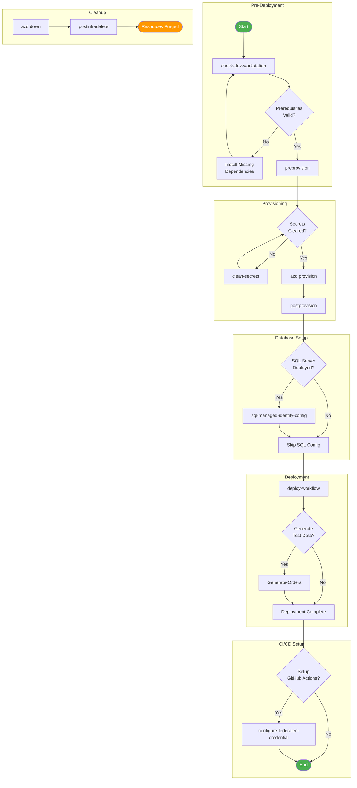

# 📚 Azure Logic Apps Monitoring - Hooks Documentation

This documentation provides comprehensive details for all Azure Developer CLI (azd) hooks used in the Azure Logic Apps Monitoring solution.

## 📑 Table of Contents

- [📋 Overview](#-overview)
- [🔍 Quick Reference](#-quick-reference)
- [🔄 Hook Execution Order](#-hook-execution-order)
- [⚙️ Prerequisites](#️-prerequisites)
- [💻 Platform Compatibility](#-platform-compatibility)
- [⚠️ Error Handling](#️-error-handling)
- [🚀 Getting Started](#-getting-started)
- [🤝 Contributing](#-contributing)
- [🔗 Links](#-links)

## 📋 Overview

Hooks are scripts that execute at specific points during the Azure Developer CLI lifecycle. They automate pre-provisioning validation, post-provisioning configuration, and other deployment-related tasks.

## 🔍 Quick Reference

| Hook | Purpose | Lifecycle Stage |
|:-----|:--------|:----------------|
| [check-dev-workstation](check-dev-workstation.md) | Validate developer workstation prerequisites | Manual/Pre-development |
| [preprovision](preprovision.md) | Validate environment and clear secrets before provisioning | `azd provision` (before) |
| [postprovision](postprovision.md) | Configure .NET user secrets and SQL access after provisioning | `azd provision` (after) |
| [postinfradelete](postinfradelete.md) | Purge soft-deleted Logic Apps after infrastructure deletion | `azd down` (after) |
| [deploy-workflow](deploy-workflow.md) | Deploy Logic Apps workflows to Azure | `azd deploy` (before) |
| [clean-secrets](clean-secrets.md) | Clear .NET user secrets for all projects | Manual/Utility |
| [configure-federated-credential](configure-federated-credential.md) | Configure GitHub Actions OIDC authentication | Manual/CI-CD Setup |
| [sql-managed-identity-config](sql-managed-identity-config.md) | Configure SQL Database with Managed Identity | Post-provisioning |
| [Generate-Orders](Generate-Orders.md) | Generate sample order data for testing | Manual/Testing |

## 🔄 Hook Execution Order



## ⚙️ Prerequisites

### 🔧 Common Requirements

All hooks require the following tools installed and configured:

| Tool | Minimum Version | Purpose |
|:-----|:---------------:|:--------|
| PowerShell Core | 7.0+ | Windows/Cross-platform script execution |
| Bash | 4.0+ | Linux/macOS script execution |
| .NET SDK | 10.0+ | Building and running .NET applications |
| Azure CLI | 2.60.0+ | Azure resource management |
| Azure Developer CLI (azd) | Latest | Deployment orchestration |
| Bicep CLI | 0.30.0+ | Infrastructure as Code |

### 🌐 Environment Variables

Key environment variables used across hooks:

| Variable | Description | Set By |
|:---------|:------------|:------:|
| `AZURE_SUBSCRIPTION_ID` | Azure subscription GUID | azd |
| `AZURE_RESOURCE_GROUP` | Target resource group name | azd |
| `AZURE_LOCATION` | Azure region for deployment | azd |
| `MANAGED_IDENTITY_NAME` | User-assigned managed identity name | azd |

## 💻 Platform Compatibility

All hooks are provided in both PowerShell (`.ps1`) and Bash (`.sh`) versions:

- **PowerShell**: Recommended for Windows, also works on Linux/macOS with PowerShell Core
- **Bash**: Recommended for Linux/macOS, also works on Windows with WSL or Git Bash

Both versions implement identical functionality with platform-appropriate idioms.

## ⚠️ Error Handling

All hooks follow consistent error handling patterns:

1. **Strict Mode**: Scripts enable strict mode to catch errors early
2. **Validation**: Required parameters and dependencies are validated before execution
3. **Exit Codes**: Standardized exit codes indicate success (0) or specific failure types
4. **Logging**: Colored, timestamped output for easy troubleshooting
5. **Cleanup**: Resources are cleaned up properly on both success and failure

## 🚀 Getting Started

### ✅ Validate Your Workstation

Before starting development, validate your environment:

```powershell
# PowerShell
.\hooks\check-dev-workstation.ps1

# or with verbose output
.\hooks\check-dev-workstation.ps1 -Verbose
```

```bash
# Bash
./hooks/check-dev-workstation.sh

# or with verbose output
./hooks/check-dev-workstation.sh --verbose
```

### 🚢 Run the Full Deployment

```bash
# Initialize and deploy
azd init
azd up
```

The hooks will execute automatically at the appropriate lifecycle stages.

## 🤝 Contributing

When modifying hooks:

1. Update both PowerShell and Bash versions to maintain parity
2. Follow existing code style and documentation patterns
3. Test on both Windows and Linux/macOS platforms
4. Update this documentation if adding new hooks or changing behavior

## 🔗 Links

- [Azure Developer CLI Documentation](https://learn.microsoft.com/azure/developer/azure-developer-cli/)
- [Project Repository](https://github.com/Evilazaro/Azure-LogicApps-Monitoring)
- [Azure Logic Apps Documentation](https://learn.microsoft.com/azure/logic-apps/)

---

**Version**: 2.0.0  
**Last Updated**: January 2026  
**Author**: Evilazaro | Principal Cloud Solution Architect | Microsoft
