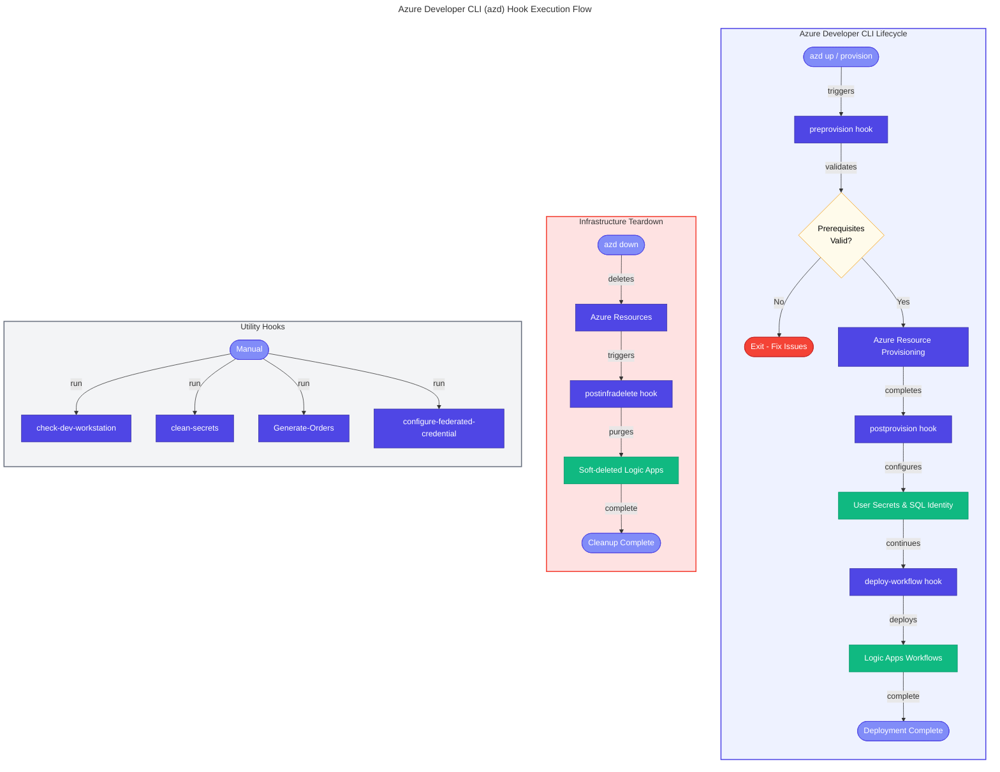

# 📚 Azure Logic Apps Monitoring - Hooks Documentation

This documentation provides comprehensive details for all Azure Developer CLI (azd) hooks used in the Azure Logic Apps Monitoring solution.

## 📋 Table of Contents

| Hook | Description | Execution Phase |
|------|-------------|-----------------|
| [preprovision](preprovision.md) | Pre-provisioning validation and environment preparation | Before `azd provision` |
| [postprovision](postprovision.md) | Post-provisioning configuration of .NET user secrets | After `azd provision` |
| [postinfradelete](postinfradelete.md) | Cleanup of soft-deleted Logic Apps resources | After `azd down` |
| [check-dev-workstation](check-dev-workstation.md) | Developer workstation prerequisite validation | Manual execution |
| [clean-secrets](clean-secrets.md) | Clear .NET user secrets for all projects | Manual / Pre-provisioning |
| [configure-federated-credential](configure-federated-credential.md) | GitHub Actions OIDC authentication setup | Post-provisioning |
| [deploy-workflow](deploy-workflow.md) | Logic Apps Standard workflow deployment | Pre-deployment |
| [Generate-Orders](Generate-Orders.md) | Sample order data generation for testing | Manual execution |
| [sql-managed-identity-config](sql-managed-identity-config.md) | SQL Database managed identity configuration | Post-provisioning |

## 🔄 Hook Execution Flow



## 🛠️ Quick Reference

### Prerequisites

All hooks require:

- **PowerShell 7.0+** or **Bash 4.0+**
- **.NET SDK 10.0+**
- **Azure CLI 2.60.0+**
- **Azure Developer CLI (azd)**

### Environment Variables

Common environment variables used across hooks:

| Variable | Description | Required By |
|----------|-------------|-------------|
| `AZURE_SUBSCRIPTION_ID` | Azure subscription GUID | Most hooks |
| `AZURE_RESOURCE_GROUP` | Resource group name | Most hooks |
| `AZURE_LOCATION` | Azure region | Most hooks |
| `AZURE_TENANT_ID` | Azure AD tenant ID | Authentication hooks |
| `LOGIC_APP_NAME` | Logic App Standard name | deploy-workflow |
| `MANAGED_IDENTITY_NAME` | Managed identity name | sql-managed-identity-config |

### Platform Support

| Platform | Shell | Status |
|----------|-------|--------|
| Windows | PowerShell 7.0+ | ✅ Fully Supported |
| macOS | Bash 4.0+ | ✅ Fully Supported |
| Linux | Bash 4.0+ | ✅ Fully Supported |
| WSL | Bash 4.0+ | ✅ Fully Supported |

## 📖 Usage Patterns

### Running Hooks Manually

```powershell
# PowerShell
.\hooks\preprovision.ps1 -Verbose
.\hooks\check-dev-workstation.ps1
```

```bash
# Bash
./hooks/preprovision.sh --verbose
./hooks/check-dev-workstation.sh
```

### Common Parameters

| Parameter | PowerShell | Bash | Description |
|-----------|------------|------|-------------|
| Force | `-Force` | `--force` | Skip confirmation prompts |
| Verbose | `-Verbose` | `--verbose` | Enable detailed output |
| Help | `-?` | `--help` | Display help message |
| Dry Run | `-WhatIf` | `--dry-run` | Preview changes without executing |

## 🔗 Related Documentation

- [Azure Developer CLI Documentation](https://learn.microsoft.com/azure/developer/azure-developer-cli/)
- [Azure Logic Apps Documentation](https://learn.microsoft.com/azure/logic-apps/)
- [.NET User Secrets](https://learn.microsoft.com/aspnet/core/security/app-secrets)

---

**Version:** 2.0.0  
**Last Updated:** 2026-01-26  
**Maintainer:** Azure Logic Apps Monitoring Team
