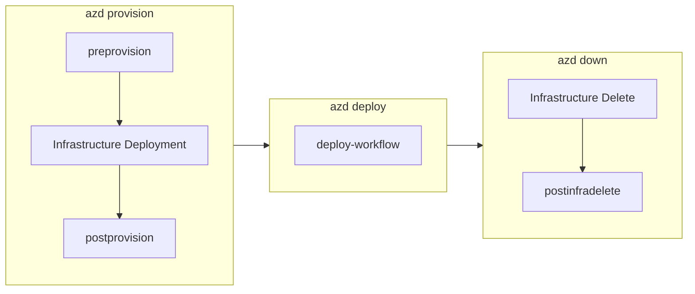

# Hooks Scripts Documentation

This directory contains comprehensive documentation for all automation scripts in the `hooks/` folder of the Azure Logic Apps Monitoring solution.

## Overview

The hooks scripts are executed at various stages of the Azure Developer CLI (azd) lifecycle to automate environment validation, configuration, and deployment tasks. Each script is provided in both PowerShell (`.ps1`) and Bash (`.sh`) variants for cross-platform compatibility.

## Script Categories

### 🚀 Provisioning Lifecycle Scripts

| Script | Description | azd Hook |
|--------|-------------|----------|
| [preprovision](preprovision.md) | Validates prerequisites and clears secrets before provisioning | `preprovision` |
| [postprovision](postprovision.md) | Configures user secrets after Azure resources are provisioned | `postprovision` |
| [postinfradelete](postinfradelete.md) | Purges soft-deleted Logic Apps after infrastructure deletion | `postinfradelete` |

### 🔧 Configuration Scripts

| Script | Description | Usage |
|--------|-------------|-------|
| [clean-secrets](clean-secrets.md) | Clears .NET user secrets for all solution projects | Called by preprovision |
| [configure-federated-credential](configure-federated-credential.md) | Sets up GitHub Actions OIDC authentication | Manual / Setup |
| [sql-managed-identity-config](sql-managed-identity-config.md) | Configures SQL Database managed identity access | Called by postprovision |

### 📦 Deployment Scripts

| Script | Description | azd Hook |
|--------|-------------|----------|
| [deploy-workflow](deploy-workflow.md) | Deploys Logic Apps Standard workflows to Azure | `predeploy` |

### 🛠️ Development Utilities

| Script | Description | Usage |
|--------|-------------|-------|
| [check-dev-workstation](check-dev-workstation.md) | Validates developer workstation prerequisites | Manual |
| [Generate-Orders](Generate-Orders.md) | Generates sample order data for testing | Manual |

## Script Execution Flow

## Quick Reference

### Required Prerequisites

All scripts require:

- **PowerShell Core 7.0+** or **Bash 4.0+**
- **.NET SDK 10.0+**
- **Azure CLI 2.60.0+**
- **Azure Developer CLI (azd)**

### Common Parameters

| Parameter | PowerShell | Bash | Description |
|-----------|------------|------|-------------|
| Force | `-Force` | `--force` | Skip confirmation prompts |
| Verbose | `-Verbose` | `--verbose` | Enable detailed output |
| Dry Run | `-WhatIf` | `--dry-run` | Preview without changes |
| Help | `Get-Help .\script.ps1` | `--help` | Display help |

## Environment Variables

Scripts rely on environment variables set by azd during provisioning:

| Variable | Description |
|----------|-------------|
| `AZURE_SUBSCRIPTION_ID` | Azure subscription GUID |
| `AZURE_RESOURCE_GROUP` | Resource group name |
| `AZURE_LOCATION` | Azure region |
| `LOGIC_APP_NAME` | Logic Apps Standard name |
| `SQL_SERVER_FQDN` | SQL Server endpoint |
| `SQL_DATABASE_NAME` | SQL database name |
| `MANAGED_IDENTITY_NAME` | Managed identity name |

## Security Notes

- All scripts use Azure CLI session for authentication
- No credentials are hardcoded
- Sensitive values are stored using .NET user secrets
- SQL Database access uses Managed Identity (passwordless)
- GitHub Actions use OIDC federated credentials (no secrets)

## Contributing

When modifying or adding scripts:

1. Maintain both PowerShell and Bash versions
2. Update corresponding documentation
3. Follow established error handling patterns
4. Include comprehensive logging
5. Support common parameters (Force, Verbose, etc.)

## Version Information

| Component | Version |
|-----------|---------|
| preprovision | 2.3.0 |
| postprovision | 2.0.1 |
| postinfradelete | 2.0.0 |
| clean-secrets | 2.0.1 |
| configure-federated-credential | 1.0.0 |
| deploy-workflow | 2.0.1 |
| check-dev-workstation | 1.0.0 |
| Generate-Orders | 2.0.1 |
| sql-managed-identity-config | 1.0.0 |

---

*Documentation generated on 2026-01-26*
