# Hooks Documentation

[Home](../../README.md) > [Docs](..) > Hooks

> 🪝 Azure Developer CLI hook scripts for provisioning, deployment, and development workflows

---

## Table of Contents

- [Overview](#overview)
- [Script Index](#script-index)
- [Hook Lifecycle](#hook-lifecycle)
- [Prerequisites](#prerequisites)
- [Quick Start](#quick-start)
- [Script Categories](#script-categories)
- [Cross-Platform Support](#cross-platform-support)
- [Environment Variables](#environment-variables)
- [Error Handling](#error-handling)
- [Contributing](#contributing)

---

## Overview

This directory contains Azure Developer CLI (azd) hook scripts that automate various aspects of the Azure Logic Apps Monitoring solution deployment and development lifecycle. Each script is provided in both PowerShell (`.ps1`) and Bash (`.sh`) versions for cross-platform compatibility.

**Key Features:**

- 🔄 **Cross-platform**: All scripts work on Windows, Linux, and macOS
- 🔐 **Secure**: Token-based authentication, no stored credentials
- 🔁 **Idempotent**: Safe to re-run without side effects
- 📋 **Comprehensive logging**: Detailed output for troubleshooting
- ✅ **Validation**: Built-in prerequisite checks

---

## Script Index

| Script | Purpose | Category |
|:-------|:--------|:--------:|
| [preprovision.md](preprovision.md) | Pre-provisioning validation and setup | 🔧 Setup |
| [postprovision.md](postprovision.md) | Post-provisioning configuration | ⚙️ Config |
| [postinfradelete.md](postinfradelete.md) | Cleanup after infrastructure deletion | 🧹 Cleanup |
| [check-dev-workstation.md](check-dev-workstation.md) | Developer workstation validation | ✅ Validation |
| [clean-secrets.md](clean-secrets.md) | Clear .NET user secrets | 🔐 Security |
| [configure-federated-credential.md](configure-federated-credential.md) | GitHub OIDC authentication setup | 🔑 Auth |
| [deploy-workflow.md](deploy-workflow.md) | Logic Apps workflow deployment | 🚀 Deploy |
| [Generate-Orders.md](Generate-Orders.md) | Sample order data generation | 📦 Data |
| [sql-managed-identity-config.md](sql-managed-identity-config.md) | SQL Database managed identity setup | 🗄️ Database |

---

## Hook Lifecycle

```mermaid
%%{init: {'flowchart': {'nodeSpacing': 30, 'rankSpacing': 40, 'curve': 'basis'}}}%%
flowchart TD
    subgraph PREPROVISION["🔧 Pre-Provisioning"]
        direction TB
        A([▶️ azd up]):::startNode
        A --> B[🔍 preprovision]:::validation
        B --> C[🔧 Validate Tools]:::config
        C --> D[🧹 Clear Secrets]:::cleanup
    end

    subgraph PROVISION["⚡ Provisioning"]
        direction TB
        E[☁️ Deploy Infra]:::external
        E --> F[📦 Deploy Apps]:::execution
    end

    subgraph POSTPROVISION["⚙️ Post-Provisioning"]
        direction TB
        G[🔐 Configure ACR]:::auth
        G --> H[🗄️ SQL Identity]:::data
        H --> I[🔧 User Secrets]:::config
    end

    subgraph PREDEPLOY["🚀 Pre-Deploy"]
        direction TB
        J[📦 Package Workflow]:::data
        J --> K[🔄 Resolve Vars]:::config
    end

    subgraph DEPLOY["🚀 Deployment"]
        direction TB
        L[⚡ Deploy Workflow]:::execution
    end

    subgraph CLEANUP["🧹 Post-Delete"]
        direction TB
        M[🧹 Purge Logic Apps]:::cleanup
        M --> N([✅ Complete]):::successExit
    end

    %% Cross-subgraph connections
    D --> E
    F --> G
    I --> J
    K --> L
    L --> N

    %% Subgraph styles
    style PREPROVISION fill:#e8eaf6,stroke:#303f9f,stroke-width:2px,color:#1a237e
    style PROVISION fill:#e0f2f1,stroke:#00796b,stroke-width:2px,color:#004d40
    style POSTPROVISION fill:#fff8e1,stroke:#ffa000,stroke-width:2px,color:#ff6f00
    style PREDEPLOY fill:#fce4ec,stroke:#c2185b,stroke-width:2px,color:#880e4f
    style DEPLOY fill:#e0f2f1,stroke:#00796b,stroke-width:2px,color:#004d40
    style CLEANUP fill:#ede7f6,stroke:#512da8,stroke-width:2px,color:#311b92

    %% Node class definitions
    classDef startNode fill:#b3e5fc,stroke:#0288d1,stroke-width:3px,color:#01579b
    classDef successExit fill:#c8e6c9,stroke:#388e3c,stroke-width:3px,color:#1b5e20
    classDef validation fill:#fff9c4,stroke:#f9a825,stroke-width:2px,color:#f57f17
    classDef auth fill:#b2ebf2,stroke:#0097a7,stroke-width:2px,color:#006064
    classDef execution fill:#b2dfdb,stroke:#00796b,stroke-width:2px,color:#004d40
    classDef external fill:#bbdefb,stroke:#1976d2,stroke-width:2px,color:#0d47a1
    classDef cleanup fill:#e1bee7,stroke:#7b1fa2,stroke-width:2px,color:#4a148c
    classDef config fill:#c5cae9,stroke:#3949ab,stroke-width:2px,color:#1a237e
    classDef data fill:#f0f4c3,stroke:#9e9d24,stroke-width:2px,color:#827717
```



---

## Prerequisites

All scripts share common prerequisites. Individual scripts may have additional requirements.

| Requirement | Version | Purpose | Installation |
|:------------|:--------|:--------|:-------------|
| **PowerShell** | 7.0+ | Windows/cross-platform scripting | [Install](https://docs.microsoft.com/powershell/scripting/install/installing-powershell) |
| **Bash** | 4.0+ | Linux/macOS scripting | Pre-installed |
| **.NET SDK** | 10.0+ | Building .NET applications | [Install](https://dotnet.microsoft.com/download) |
| **Azure CLI** | 2.60.0+ | Azure resource management | [Install](https://docs.microsoft.com/cli/azure/install-azure-cli) |
| **Azure Developer CLI** | Latest | Deployment automation | [Install](https://learn.microsoft.com/azure/developer/azure-developer-cli/install-azd) |
| **Bicep CLI** | 0.30.0+ | Infrastructure as Code | [Install](https://docs.microsoft.com/azure/azure-resource-manager/bicep/install) |

---

## Quick Start

### Validate Development Environment

```powershell
# PowerShell (Windows/Linux/macOS)
./hooks/check-dev-workstation.ps1
```

```bash
# Bash (Linux/macOS)
./hooks/check-dev-workstation.sh
```

### Full Deployment Workflow

```bash
# Initialize and provision Azure resources
azd up

# Deploy Logic Apps workflows
./hooks/deploy-workflow.sh

# Generate test data
./hooks/Generate-Orders.sh --count 100
```

---

## Script Categories

### 🔧 Setup & Validation

Scripts that prepare and validate the development environment:

- **[preprovision](preprovision.md)** - Validates prerequisites and clears secrets before provisioning
- **[check-dev-workstation](check-dev-workstation.md)** - Validates developer workstation configuration

### ⚙️ Configuration

Scripts that configure Azure resources after provisioning:

- **[postprovision](postprovision.md)** - Configures user secrets and managed identities
- **[sql-managed-identity-config](sql-managed-identity-config.md)** - Configures SQL Database authentication

### 🚀 Deployment

Scripts that deploy application components:

- **[deploy-workflow](deploy-workflow.md)** - Deploys Logic Apps Standard workflows

### 🔐 Security & Authentication

Scripts that manage authentication and credentials:

- **[clean-secrets](clean-secrets.md)** - Clears .NET user secrets
- **[configure-federated-credential](configure-federated-credential.md)** - Sets up GitHub OIDC

### 🧹 Cleanup

Scripts that clean up resources:

- **[postinfradelete](postinfradelete.md)** - Purges soft-deleted Logic Apps

### 📦 Data & Testing

Scripts for test data generation:

- **[Generate-Orders](Generate-Orders.md)** - Generates sample e-commerce orders

---

## Cross-Platform Support

All scripts are available in both PowerShell and Bash versions:

| Platform | Extension | Execution |
|:---------|:----------|:----------|
| Windows | `.ps1` | `.\script.ps1` or `pwsh script.ps1` |
| Linux | `.sh` | `./script.sh` or `bash script.sh` |
| macOS | `.sh` | `./script.sh` or `bash script.sh` |

> ℹ️ **Note**: PowerShell scripts also work on Linux/macOS with PowerShell Core installed.

---

## Environment Variables

Common environment variables used across scripts:

| Variable | Description | Set By |
|:---------|:------------|:-------|
| `AZURE_SUBSCRIPTION_ID` | Azure subscription GUID | azd |
| `AZURE_RESOURCE_GROUP` | Target resource group name | azd |
| `AZURE_LOCATION` | Azure region for deployment | azd |
| `AZURE_TENANT_ID` | Azure AD tenant ID | azd |
| `MANAGED_IDENTITY_CLIENT_ID` | Managed identity client ID | azd/infra |
| `LOGIC_APP_NAME` | Logic App resource name | azd/infra |

---

## Error Handling

All scripts follow consistent error handling patterns:

| Exit Code | Meaning |
|----------:|:--------|
| 0 | ✅ Success — All operations completed successfully |
| 1 | ❌ General error — Operation failed |
| 2 | ❌ Invalid arguments — Unknown or malformed options |
| 130 | ⚠️ Interrupted — User cancelled (Ctrl+C) |

---

## Contributing

When adding new hook scripts:

1. Create both `.ps1` and `.sh` versions
2. Follow existing parameter naming conventions
3. Include comprehensive help documentation
4. Add error handling with meaningful exit codes
5. Update this README with the new script entry
6. Create documentation in this folder following the template

---

[← Back to Documentation](../README.md) | [↑ Back to Top](#hooks-documentation)
