# Azure Logic Apps Monitoring - Developer Inner Loop Workflow


## 📋 Table of Contents

- [🎯 Overview](#-overview)
  - [📜 Available Scripts](#available-scripts)
- [🔄 Developer Inner Loop Workflow](#-developer-inner-loop-workflow)
  - [💻 Development Modes](#development-modes)
  - [🏠 Local Development Workflow (Inner Loop)](#local-development-workflow-inner-loop)
  - [☁️ Azure Deployment Workflow](#azure-deployment-workflow)
  - [📊 Workflow Phases](#workflow-phases)
  - [⚖️ Comparison: Local vs. Azure Development](#comparison-local-vs-azure-development)
  - [🔀 Hybrid Development Mode](#hybrid-development-mode)
  - [🔧 Troubleshooting Local Development](#troubleshooting-local-development)
- [🚀 Quick Start Guide](#-quick-start-guide)
  - [🛤️ Choose Your Development Path](#choose-your-development-path)
  - [⚡ Azure Developer CLI Overview](#azure-developer-cli-overview)
  - [🪝 azd Lifecycle Hooks](#azd-lifecycle-hooks)
  - [🆕 First-Time Setup](#first-time-setup)
  - [🔁 Subsequent Development Cycles](#subsequent-development-cycles)
  - [🔐 Manual Secret Management](#manual-secret-management)
- [🔁 CI/CD Pipeline Integration](#cicd-pipeline-integration)
  - [🐙 GitHub Actions](#github-actions)
  - [🔷 Azure DevOps](#azure-devops)
- [✅ Best Practices](#-best-practices)
  - [🔄 Development Workflow](#development-workflow)
  - [⚙️ Script Execution](#script-execution)
  - [🔒 Secret Management](#secret-management)
  - [☁️ Azure Resource Management](#azure-resource-management)
  - [🌐 Cross-Platform Development](#cross-platform-development)
- [🛠️ Troubleshooting](#-troubleshooting)
  - [📝 Using Verbose Mode](#using-verbose-mode)
  - [🐛 Debug Mode](#debug-mode)
  - [❓ Getting Help](#getting-help)
- [📖 Related Documentation](#-related-documentation)
  - [📜 Script Documentation](#script-documentation)
  - [☁️ Azure Documentation](#azure-documentation)
  - [📂 Repository Documentation](#repository-documentation)

---

## 🎯 Overview

This directory contains automation scripts that streamline the Azure Logic Apps Monitoring solution's development lifecycle. These scripts integrate seamlessly with Azure Developer CLI (azd) to validate prerequisites, provision infrastructure, configure secrets, set up SQL Database managed identity access, and generate test data—ensuring developers can focus on building features rather than managing environment setup.

The scripts support cross-platform execution (Windows, Linux, and macOS) with dual implementations in PowerShell and Bash. They execute automatically as part of the azd lifecycle hooks during `azd provision` and `azd up` commands, eliminating manual configuration steps and reducing the risk of environment-related deployment failures. Whether you're onboarding a new team member, reprovisioning infrastructure, or troubleshooting configuration issues, these scripts provide a consistent and reliable workflow.

By automating environment validation, secret management, SQL managed identity configuration, and test data generation, the hooks directory reduces time-to-productivity for developers while maintaining configuration consistency across development, testing, and production environments. Each script is designed with safety in mind, offering dry-run modes, verbose logging, and force options for CI/CD integration.

### Available Scripts

| Script                   | PowerShell                        | Bash                             | Purpose                                        | Documentation                                                         |
| ------------------------ | --------------------------------- | -------------------------------- | ---------------------------------------------- | --------------------------------------------------------------------- |
| **Environment Check**    | `check-dev-workstation.ps1`       | `check-dev-workstation.sh`       | Validate workstation prerequisites             | [📄 check-dev-workstation.md](./check-dev-workstation.md)             |
| **Pre-Provisioning**     | `preprovision.ps1`                | `preprovision.sh`                | Validate and prepare for deployment            | [📄 preprovision.md](./preprovision.md)                               |
| **Post-Provisioning**    | `postprovision.ps1`               | `postprovision.sh`               | Configure secrets after deployment             | [📄 postprovision.md](./postprovision.md)                             |
| **SQL Managed Identity** | `sql-managed-identity-config.ps1` | `sql-managed-identity-config.sh` | Configure SQL Database managed identity access | [📄 sql-managed-identity-config.md](./sql-managed-identity-config.md) |
| **Secrets Management**   | `clean-secrets.ps1`               | `clean-secrets.sh`               | Clear .NET user secrets                        | [📄 clean-secrets.md](./clean-secrets.md)                             |
| **Test Data**            | `Generate-Orders.ps1`             | `Generate-Orders.sh`             | Generate sample order data                     | [📄 Generate-Orders.md](./Generate-Orders.md)                         |
| **Workflow Deployment**  | `deploy-workflow.ps1`             | `deploy-workflow.sh`             | Deploy Logic Apps Standard workflows           | [📄 deploy-workflow.md](./deploy-workflow.md)                         |
| **Infra Delete Cleanup** | `postinfradelete.ps1`             | `postinfradelete.sh`             | Purge soft-deleted Logic Apps after azd down   | [📄 postinfradelete.md](./postinfradelete.md)                         |

---

## 🔄 Developer Inner Loop Workflow

The Developer Inner Loop consists of iterative cycles through validation, provisioning, configuration, and testing phases. This section covers both **Azure deployment workflow** and **local development workflow** using .NET Aspire.

### Development Modes

The solution supports two primary development modes:

| Mode                  | Database             | Service Bus          | Monitoring           | Setup Time | Cost        |
| --------------------- | -------------------- | -------------------- | -------------------- | ---------- | ----------- |
| **Local Development** | SQL Server container | Service Bus emulator | Aspire Dashboard     | ~1 min     | Free        |
| **Azure Deployment**  | Azure SQL Database   | Azure Service Bus    | Application Insights | ~10 min    | Pay-per-use |

### Local Development Workflow (Inner Loop)

This is the fastest path for daily development, running entirely on your local workstation with containerized dependencies.

#### Prerequisites

| Component                  | Version | Purpose                 | Installation                                                                     |
| -------------------------- | ------- | ----------------------- | -------------------------------------------------------------------------------- |
| **.NET SDK**               | 10.0+   | Application runtime     | `winget install Microsoft.DotNet.SDK.10`                                         |
| **Docker Desktop**         | Latest  | Container orchestration | [docker.com/products/docker-desktop](https://docker.com/products/docker-desktop) |
| **.NET Aspire Workload**   | 9.5+    | Aspire orchestration    | `dotnet workload install aspire`                                                 |
| **Visual Studio 2022**     | 17.13+  | IDE (optional)          | [visualstudio.com](https://visualstudio.microsoft.com)                           |
| **VS Code + C# Extension** | Latest  | IDE (optional)          | [code.visualstudio.com](https://code.visualstudio.com)                           |

#### Quick Start (Local Development)

```powershell
# 1. Ensure Docker Desktop is running
docker ps

# 2. Navigate to AppHost project
cd app.AppHost

# 3. Run the application (starts all services + containers)
dotnet run

# 4. Access services:
#    - Aspire Dashboard: https://localhost:17267
#    - Web App: Check Dashboard for dynamically assigned port
#    - Orders API: Check Dashboard for dynamically assigned port
```

**What Happens Automatically:**

- SQL Server container starts with persistent volume
- Azure Service Bus emulator container starts
- Database schema is created (`EnsureCreatedAsync()`)
- Service Bus topic and subscription are created
- All services register with service discovery
- Health checks are configured
- OpenTelemetry tracing is enabled

#### Local Inner Loop Cycle

```mermaid
---
title: Local Development Inner Loop Cycle
---
flowchart LR
    %% ===== CLASS DEFINITIONS =====
    classDef primary fill:#4F46E5,stroke:#3730A3,color:#FFFFFF
    classDef secondary fill:#10B981,stroke:#059669,color:#FFFFFF
    classDef datastore fill:#F59E0B,stroke:#D97706,color:#000000
    classDef external fill:#6B7280,stroke:#4B5563,color:#FFFFFF,stroke-dasharray: 5 5
    classDef failed fill:#F44336,stroke:#C62828,color:#FFFFFF
    classDef trigger fill:#818CF8,stroke:#4F46E5,color:#FFFFFF
    classDef decision fill:#FFFBEB,stroke:#F59E0B,color:#000000
    classDef input fill:#F3F4F6,stroke:#6B7280,color:#000000

    %% ===== START/END NODES =====
    Start([Local Dev Start])
    End([Docker Auto-Cleanup])

    Start -->|"Initialize"| SetupPhase

    %% ===== ENVIRONMENT SETUP PHASE =====
    subgraph SetupPhase["1️⃣ Environment Setup"]
        direction TB
        Docker[Docker Running?]
        StartDocker[Start Docker Desktop]
        Run[Run AppHost<br/>dotnet run]
        Ready([Environment Ready<br/>~30-60 seconds])

        Docker -->|"No"| StartDocker
        Docker -->|"Yes"| Run
        StartDocker -->|"Started"| Run
        Run -->|"Containers Ready"| Ready
    end
    style SetupPhase fill:#EEF2FF,stroke:#4F46E5,stroke-width:2px

    %% ===== INNER LOOP PHASE =====
    subgraph DevLoop["🔄 INNER LOOP (10-30 seconds/iteration)"]
        direction LR
        Code[💻 Edit Code<br/>C#, Razor, JSON] -->|"Save File"| HotReload[⚡ Hot Reload<br/>1-3 seconds]
        HotReload -->|"Reload Complete"| Test[🧪 Test Changes<br/>Browser/Postman]
        Test -->|"View Results"| Logs[📊 View Logs<br/>Aspire Dashboard]
        Logs -->|"Evaluate"| Review{Works?}
        Review -->|"Yes - Continue"| Code
        Review -->|"No - Fix Issue"| Debug[🐛 Debug<br/>Breakpoints in IDE]
        Debug -->|"Apply Fix"| Code
    end
    style DevLoop fill:#FEF3C7,stroke:#F59E0B,stroke-width:2px

    %% ===== SHUTDOWN PHASE =====
    subgraph ShutdownPhase["3️⃣ Shutdown"]
        direction TB
        Stop[Stop Development<br/>Ctrl+C]
    end
    style ShutdownPhase fill:#FEE2E2,stroke:#EF4444,stroke-width:2px

    %% ===== PHASE CONNECTIONS =====
    SetupPhase -->|"Environment Ready"| DevLoop
    DevLoop -->|"Development Complete"| ShutdownPhase
    ShutdownPhase -->|"Cleanup"| End

    %% ===== NODE STYLING =====
    class Start,End trigger
    class Ready secondary
    class Code,Run,StartDocker,Stop primary
    class HotReload secondary
    class Test input
    class Logs datastore
    class Review decision
    class Debug failed
    class Docker decision
```



#### Local Development Features

**Hot Reload (Built-in .NET 10):**

- C# code changes apply automatically (1-3 seconds)
- Razor component updates reflect immediately
- JSON configuration changes reload services
- No manual restart required for most changes

**Debugging:**

- Set breakpoints in Visual Studio or VS Code
- Step through code across multiple services
- Inspect variables, call stacks, and threads
- Attach debugger to any running service

**Observability (Aspire Dashboard):**

- **Resources Tab**: View all services, containers, status
- **Logs Tab**: Real-time log streaming with filtering
- **Traces Tab**: Distributed tracing (OpenTelemetry)
- **Metrics Tab**: Performance counters and gauges
- **Console Tab**: Container stdout/stderr

**Service Discovery:**

- Services reference each other by name (e.g., `orders-api`)
- Aspire resolves to `http://localhost:<dynamic-port>`
- No hardcoded URLs needed in code

#### Database Management (Local)

**Automatic Setup:**

```csharp
// In Program.cs - runs automatically on startup
await dbContext.Database.EnsureCreatedAsync();
```

**Manual Migrations (if using EF migrations):**

```powershell
cd src\eShop.Orders.API

# Add migration after model changes
dotnet ef migrations add AddNewColumn

# Apply migration
dotnet ef database update

# Rollback migration
dotnet ef database update PreviousMigrationName
```

**View Connection String:**

```powershell
# Check what connection string Aspire configured
dotnet user-secrets list --project src\eShop.Orders.API | Select-String "ConnectionStrings"
```

#### Service Bus Testing (Local)

The Service Bus emulator runs automatically in a container:

**Verify Emulator:**

```powershell
# Check if Service Bus emulator is running
docker ps | Select-String "servicebus"

# View emulator logs
docker logs <container-id>
```

**Publish Test Message:**

```powershell
# Use Orders API endpoint to create order (auto-publishes to Service Bus)
Invoke-RestMethod -Method Post -Uri "https://localhost:<api-port>/api/orders" `
  -ContentType "application/json" `
  -Body '{"customerId": "123", "items": [{"productId": "P1", "quantity": 2}]}'
```

**View Messages in Aspire Dashboard:**

1. Navigate to "Traces" tab
2. Filter by `Azure.Messaging.ServiceBus`
3. See message publish and receive traces

### Azure Deployment Workflow

For production-like environments, integration testing, or team collaboration:

### Workflow Phases

```mermaid
---
title: Developer Workflow Phases - Local vs Azure
---
flowchart LR
    %% ===== CLASS DEFINITIONS =====
    classDef primary fill:#4F46E5,stroke:#3730A3,color:#FFFFFF
    classDef secondary fill:#10B981,stroke:#059669,color:#FFFFFF
    classDef datastore fill:#F59E0B,stroke:#D97706,color:#000000
    classDef external fill:#6B7280,stroke:#4B5563,color:#FFFFFF,stroke-dasharray: 5 5
    classDef failed fill:#F44336,stroke:#C62828,color:#FFFFFF
    classDef trigger fill:#818CF8,stroke:#4F46E5,color:#FFFFFF
    classDef decision fill:#FFFBEB,stroke:#F59E0B,color:#000000
    classDef input fill:#F3F4F6,stroke:#6B7280,color:#000000

    %% ===== START NODE =====
    Start([👨‍💻 Developer Starts Work]) -->|"Choose Path"| ModeChoice{Development<br/>Mode?}

    ModeChoice -->|"Local Development"| LocalSetup
    ModeChoice -->|"Azure Deployment"| AzureSetup

    %% ===== LOCAL DEVELOPMENT PHASE =====
    subgraph LocalSetup["🏠 LOCAL DEVELOPMENT (Fast)"]
        direction LR
        LocalPrereq["1️⃣ Prerequisites<br/>Docker, .NET 10, Aspire"]
        LocalPrereq -->|"Check Complete"| LocalRun["2️⃣ Run AppHost<br/>dotnet run (~1 min)"]
        LocalRun -->|"Services Started"| LocalReady["✅ Environment Ready<br/>Containers + Services"]
    end
    style LocalSetup fill:#ECFDF5,stroke:#10B981,stroke-width:2px

    %% ===== AZURE DEPLOYMENT PHASE =====
    subgraph AzureSetup["☁️ AZURE DEPLOYMENT (Complete)"]
        direction LR
        Validate["1️⃣ Validate Environment<br/>check-dev-workstation + preprovision<br/>⏱️ ~20 sec"]
        Validate -->|"Validate"| CheckValid{✅ Prerequisites OK?}
        CheckValid -->|"No - Missing Tools"| Fix[🔧 Install/Update Tools]
        Fix -->|"Retry Validation"| Validate
        CheckValid -->|"Yes - Continue"| Provision

        Provision["2️⃣ Provision Infrastructure<br/>azd provision<br/>⏱️ ~5-10 min"]
        Provision -->|"Check Status"| CheckDeploy{✅ Deployed OK?}
        CheckDeploy -->|"No - Failed"| Debug[🐛 Debug & Fix]
        Debug -->|"Retry Provision"| Provision
        CheckDeploy -->|"Yes - Success"| Configure

        Configure["3️⃣ Configure Secrets<br/>postprovision (includes SQL managed identity)<br/>⏱️ ~20-30 sec"]
    end
    style AzureSetup fill:#EEF2FF,stroke:#4F46E5,stroke-width:2px

    %% ===== TRANSITION CONNECTIONS =====
    LocalReady -->|"Start Development"| LocalLoop([Local Inner Loop])
    Configure -->|"Configuration Complete"| AzureReady([✅ Azure Environment Ready])
    AzureReady -->|"Start Development"| DevLoop

    %% ===== DEVELOPER INNER LOOP =====
    subgraph DevLoop["🔄 DEVELOPER INNER LOOP (Both Modes)"]
        direction LR
        Code[💻 Write Code] -->|"Execute Tests"| Test[🧪 Test Locally]
        Test -->|"Evaluate Results"| Review{Works?}
        Review -->|"Yes - Continue"| Code
        Review -->|"Needs Infra Changes"| ExitLoop[ ]
    end
    style DevLoop fill:#FEF3C7,stroke:#F59E0B,stroke-width:2px

    %% ===== LOOP BACK CONNECTIONS =====
    ExitLoop -->|"Reconfigure"| ModeChoice
    LocalLoop -->|"Enter Loop"| Code

    %% ===== NODE STYLING =====
    class Start trigger
    class LocalReady,AzureReady,LocalLoop secondary
    class LocalPrereq,LocalRun,Validate,Provision,Configure,Code primary
    class Test input
    class ModeChoice,CheckValid,CheckDeploy,Review decision
    class Fix,Debug failed
    class ExitLoop external
```



### Comparison: Local vs. Azure Development

| Aspect              | Local Development            | Azure Development             |
| ------------------- | ---------------------------- | ----------------------------- |
| **Startup Time**    | ~1 minute                    | ~10 minutes                   |
| **Database**        | SQL Server container         | Azure SQL Database            |
| **Authentication**  | SQL (sa user)                | Entra ID (Managed Identity)   |
| **Service Bus**     | Emulator container           | Azure Service Bus             |
| **Monitoring**      | Aspire Dashboard             | Application Insights + Aspire |
| **Cost**            | Free                         | Azure consumption charges     |
| **Network Latency** | < 1ms (localhost)            | 5-50ms (internet)             |
| **Isolation**       | Per-developer                | Shared (team environment)     |
| **Secrets**         | User secrets                 | User secrets + Key Vault      |
| **Best For**        | Daily development, debugging | Integration tests, staging    |

### Hybrid Development Mode

Run locally but connect to Azure resources (best of both worlds):

```powershell
# 1. Provision Azure resources once
azd provision

# 2. User secrets are configured automatically by postprovision
# 3. Start AppHost - it detects Azure config and uses Azure services
cd app.AppHost
dotnet run

# Result: Local code execution + Azure SQL + Azure Service Bus
```

**Benefits:**

- Fast local debugging with hot reload
- Real Azure services for integration testing
- Managed identity testing
- Firewall and network policy testing

**When to Use:**

- Testing Entra ID authentication flows
- Validating Azure-specific configurations
- Reproducing production issues locally
- Performance testing with real Azure latency

### Troubleshooting Local Development

#### Issue: "SQL Server container fails to start"

```powershell
# Check Docker resources (need at least 4GB RAM)
# Docker Desktop → Settings → Resources

# View container logs
docker logs <sql-container-id>

# Manually start SQL Server container
docker run -e "ACCEPT_EULA=Y" -e "SA_PASSWORD=P@ssw0rd!" `
  -p 1433:1433 --name sqlserver `
  -d mcr.microsoft.com/mssql/server:2022-latest
```

#### Issue: "Port already in use (17267)"

```powershell
# Find process using port
netstat -ano | findstr :17267

# Kill process (replace <PID>)
Stop-Process -Id <PID> -Force

# Or edit launchSettings.json to use different port
```

#### Issue: "Service discovery not working"

```powershell
# Verify services are registered
# Check Aspire Dashboard → Resources tab

# Restart AppHost
# Stop (Ctrl+C) and run again
dotnet run
```

#### Issue: "Hot Reload not working"

```powershell
# Verify .NET SDK version
dotnet --version  # Must be 10.0+

# Run with explicit watch mode
dotnet watch --project app.AppHost

# Enable verbose output
$env:DOTNET_WATCH_SUPPRESS_LAUNCH_BROWSER = "true"
dotnet watch run
```

#### Issue: "Database schema not created"

```powershell
# Check if EnsureCreatedAsync is called in Program.cs
# src\eShop.Orders.API\Program.cs line ~115

# View database initialization logs
# Check Aspire Dashboard → Logs → orders-api

# Manually create database
cd src\eShop.Orders.API
dotnet ef database update
```

---

## 🚀 Quick Start Guide

### Choose Your Development Path

#### Option 1: Local Development (Fastest - Recommended for Daily Work)

**Prerequisites**: .NET SDK 10.0+, Docker Desktop, Aspire workload

```powershell
# Windows
cd Z:\app

# Install .NET Aspire workload (first time only)
dotnet workload install aspire

# Ensure Docker Desktop is running
docker ps

# Start application with all dependencies
cd app.AppHost
dotnet run

# Access services:
# - Aspire Dashboard: https://localhost:17267
# - Services: Check dashboard for dynamic ports
```

```bash
# Linux/macOS
cd /path/to/app

# Install .NET Aspire workload (first time only)
dotnet workload install aspire

# Ensure Docker is running
docker ps

# Start application with all dependencies
cd app.AppHost
dotnet run

# Access services:
# - Aspire Dashboard: https://localhost:17267
# - Services: Check dashboard for dynamic ports
```

**Result**: Complete development environment in ~1 minute, all dependencies containerized.

#### Option 2: Azure Deployment (Full Cloud Environment)

**Prerequisites**: Azure subscription, Azure CLI, Azure Developer CLI

### Azure Developer CLI Overview

Azure Developer CLI (azd) is a command-line tool that accelerates the time from development to deployment by providing a consistent workflow for building, deploying, and monitoring cloud applications on Azure. It abstracts the complexity of infrastructure provisioning, application deployment, and environment management into simple, repeatable commands that work across different Azure services and application architectures.

The azd workflow is built around a convention-based approach using an `azure.yaml` file that defines your application's structure, services, and deployment targets. When you run commands like `azd up` or `azd provision`, azd orchestrates the entire deployment process—from validating prerequisites to deploying infrastructure with Bicep templates, configuring application secrets, and deploying application code. This automation eliminates manual steps and ensures consistency across team members and environments.

For the Azure Logic Apps Monitoring solution, azd integrates with custom lifecycle hooks (preprovision and postprovision scripts) to validate development environments, configure .NET user secrets with Azure resource information, and generate test data automatically. This seamless integration means developers can provision a complete, ready-to-use environment with a single command, reducing setup time from hours to minutes while maintaining configuration accuracy and security best practices.

### azd Lifecycle Hooks

#### Understanding azure.yaml

The `azure.yaml` file serves as the central configuration for Azure Developer CLI, defining your application's metadata, services, infrastructure location, and lifecycle hooks. This declarative file tells azd how to build, package, and deploy your application, where to find your infrastructure-as-code templates (Bicep or Terraform), and what custom scripts to execute at specific points in the deployment lifecycle. The azure.yaml configuration ensures that every team member follows the same deployment process, reducing environment inconsistencies and configuration drift.

```yaml
# yaml-language-server: $schema=https://raw.githubusercontent.com/Azure/azure-dev/main/schemas/v1.0/azure.yaml.json

# ==============================================================================
# AZURE DEVELOPER CLI (azd) CONFIGURATION
# ==============================================================================
#
# Project:      Azure Logic Apps Monitoring Solution
# Description:  Infrastructure-as-Code deployment configuration for the Azure
#               Logic Apps Monitoring solution using .NET Aspire orchestration.
#
# Architecture: .NET Aspire AppHost → Azure Container Apps
#               ├── eShop.Orders.API (REST API)
#               └── eShop.Web.App (Frontend)
#
# Quick Start:
#   1. azd auth login           # Authenticate with Azure
#   2. azd env new <env-name>   # Create new environment
#   3. azd up                   # Provision and deploy
#
# Documentation: https://learn.microsoft.com/azure/developer/azure-developer-cli/
# Last Modified: 2026-01-13
# ==============================================================================

# ------------------------------------------------------------------------------
# PROJECT METADATA
# ------------------------------------------------------------------------------
name: azure-logicapps-monitoring

metadata:
  template: azure-logicapps-monitoring@1.0.0
  description: "Azure Logic Apps Monitoring solution with .NET Aspire orchestration"
  author: "Evilazaro"
  repository: "https://github.com/Evilazaro/Azure-LogicApps-Monitoring"

# Minimum version constraints to ensure compatibility
requiredVersions:
  azd: ">= 1.11.0"

# ------------------------------------------------------------------------------
# INFRASTRUCTURE CONFIGURATION
# ------------------------------------------------------------------------------
infra:
  provider: bicep # IaC provider: 'bicep' (recommended) or 'terraform'
  path: infra # Relative path to infrastructure templates directory
  module: main # Entry point module name (resolves to infra/main.bicep)

# ------------------------------------------------------------------------------
# LIFECYCLE HOOKS
# ------------------------------------------------------------------------------
# Hook Execution Order:
#   azd provision: preprovision → [bicep deploy] → postprovision
#   azd deploy:    predeploy → [app deploy] → postdeploy
#   azd down:      [resource deletion] → postinfradelete

hooks:
  # PREPROVISION: Validate environment and build solution before provisioning
  preprovision:
    posix:
      shell: sh
      run: |
        # Build and test solution before provisioning
        echo "Building and testing solution..."
        dotnet clean app.sln --verbosity quiet
        dotnet restore app.sln
        dotnet build app.sln --configuration Release --no-restore
        dotnet test app.sln --configuration Release --no-build
        # Run preprovision validation
        ./hooks/preprovision.sh --force --verbose
      continueOnError: false
      interactive: true
    windows:
      shell: pwsh
      run: |
        # Build and test solution before provisioning
        Write-Host "Building and testing solution..." -ForegroundColor Cyan
        dotnet clean app.sln --verbosity quiet
        dotnet restore app.sln
        dotnet build app.sln --configuration Release --no-restore
        dotnet test app.sln --configuration Release --no-build
        # Run preprovision validation
        ./hooks/preprovision.ps1 -Force -Verbose
      continueOnError: false
      interactive: true

  # POSTPROVISION: Configure secrets and generate test data
  postprovision:
    posix:
      shell: sh
      run: |
        ./hooks/postprovision.sh --force --verbose
        ./hooks/Generate-Orders.sh --force --verbose
      continueOnError: false
      interactive: true
    windows:
      shell: pwsh
      run: |
        ./hooks/postprovision.ps1 -Force -Verbose
        ./hooks/Generate-Orders.ps1 -Force -Verbose
      continueOnError: false
      interactive: true

  # PREDEPLOY: Deploy Logic Apps workflows and configure connections
  predeploy:
    posix:
      shell: sh
      run: ./hooks/deploy-workflow.sh
      continueOnError: false
      interactive: true
    windows:
      shell: pwsh
      run: ./hooks/deploy-workflow.ps1
      continueOnError: false
      interactive: true

  # POSTDEPLOY: Validate deployment success
  postdeploy:
    posix:
      shell: sh
      run: |
        echo "Deployment completed successfully!"
        echo "Validating deployed resources..."
      continueOnError: false
      interactive: true
    windows:
      shell: pwsh
      run: |
        Write-Host "Deployment completed successfully!" -ForegroundColor Green
        Write-Host "Validating deployed resources..." -ForegroundColor Cyan
      continueOnError: false
      interactive: true

  # POSTINFRADELETE: Clean up remaining resources after azd down
  postinfradelete:
    posix:
      shell: sh
      run: ./hooks/postinfradelete.sh --force --verbose
      continueOnError: false
      interactive: true
    windows:
      shell: pwsh
      run: ./hooks/postinfradelete.ps1 -Force -Verbose
      continueOnError: false
      interactive: true

# ------------------------------------------------------------------------------
# APPLICATION SERVICES
# ------------------------------------------------------------------------------
# Service Topology:
#   app.AppHost (Aspire Orchestrator)
#   ├── eShop.Orders.API    → REST API for order management
#   ├── eShop.Web.App       → Blazor frontend application
#   └── Azure resources     → SQL, Service Bus, Storage, App Insights

services:
  # .NET Aspire AppHost orchestrating the monitoring solution
  app:
    language: dotnet
    project: ./app.AppHost/app.AppHost.csproj
    host: containerapp

# ------------------------------------------------------------------------------
# CI/CD PIPELINE CONFIGURATION
# ------------------------------------------------------------------------------
pipeline:
  provider: github # CI/CD provider: 'github' or 'azdo'
```

For this project, azure.yaml defines the .NET Aspire AppHost which internally orchestrates the Orders API and Web App services, specifies the Bicep infrastructure templates in the `infra/` directory, and declares preprovision, postprovision, predeploy, postdeploy, and postinfradelete hooks that execute platform-specific scripts. The preprovision hook now includes comprehensive build and test validation to prevent failed deployments due to code issues. The hooks section is particularly powerful because it allows you to inject custom validation, configuration, and data generation logic into the azd workflow without modifying azd itself. This extensibility makes azd suitable for complex enterprise scenarios where standard deployment workflows need augmentation with organization-specific requirements.

The azure.yaml format supports both Windows (PowerShell) and POSIX (Bash) environments, allowing the same configuration file to work seamlessly across developer workstations regardless of operating system. This cross-platform support, combined with the ability to define custom hooks, makes azd an ideal orchestrator for complex, multi-service applications that require careful coordination of infrastructure, configuration, and application deployment.

#### Lifecycle Hooks Overview

Lifecycle hooks are extension points in the Azure Developer CLI workflow that allow you to execute custom scripts before (preprovision) or after (postprovision) infrastructure provisioning. These hooks enable you to add validation logic, environment preparation steps, secret management, or post-deployment configuration that goes beyond azd's built-in capabilities. Hooks execute in the context of the azd command, inheriting environment variables set by azd and able to access deployment outputs from your Bicep templates.

The preprovision hook is your opportunity to validate that the development environment is properly configured before azd attempts to deploy infrastructure. This is where you check for required tools (Azure CLI, .NET SDK, PowerShell), verify Azure authentication, ensure resource providers are registered, and clear stale configuration that might interfere with the new deployment. By catching configuration issues early, preprovision hooks prevent failed deployments and save developers time troubleshooting errors that could have been detected upfront.

The postprovision hook executes after infrastructure is successfully deployed but before application code deployment. At this stage, azd has set environment variables containing Azure resource names, connection strings, and endpoints from your Bicep template outputs. The postprovision hook uses these values to configure .NET user secrets, set up SQL Database managed identity access, authenticate to Azure Container Registry, or perform any other configuration that requires knowledge of the deployed infrastructure. This automation ensures that developers have a fully configured, ready-to-use environment immediately after provisioning completes.

#### Execution Flow


### First-Time Setup

#### Windows (PowerShell)

```powershell
# 1. Navigate to repository root
cd Z:\Azure-LogicApps-Monitoring

# 2. Validate your workstation (optional but recommended)
.\hooks\check-dev-workstation.ps1

# 3. Provision infrastructure (preprovision runs automatically)
azd provision

# 4. Generate test data (optional)
.\hooks\Generate-Orders.ps1 -OrderCount 100

# 5. Start local development
azd up
```

#### Linux/macOS (Bash)

```bash
# 1. Navigate to repository root
cd /path/to/Azure-LogicApps-Monitoring

# 2. Make scripts executable
chmod +x hooks/*.sh

# 3. Validate your workstation (optional but recommended)
./hooks/check-dev-workstation.sh

# 4. Provision infrastructure (preprovision runs automatically)
azd provision

# 5. Generate test data (optional)
./hooks/Generate-Orders.sh --order-count 100

# 6. Start local development
azd up
```

### Subsequent Development Cycles

```powershell
# Check for environment changes
.\hooks\check-dev-workstation.ps1

# Re-provision if infrastructure changed
azd provision

# Generate fresh test data
.\hooks\Generate-Orders.ps1
```

### Manual Secret Management

```powershell
# Clear all secrets
.\hooks\clean-secrets.ps1 -Force

# Reconfigure secrets without reprovisioning
.\hooks\postprovision.ps1 -Force
```

---

## CI/CD Pipeline Integration

The repository includes production-ready GitHub Actions workflows for continuous integration and deployment:

| Workflow                  | File                                                                       | Purpose                                            |
| ------------------------- | -------------------------------------------------------------------------- | -------------------------------------------------- |
| **CI - Build Validation** | [`.github/workflows/ci.yml`](../../.github/workflows/ci.yml)               | Validates .NET and Bicep code on every push and PR |
| **Azure Developer CLI**   | [`.github/workflows/azure-dev.yml`](../../.github/workflows/azure-dev.yml) | Provisions infrastructure and deploys to Azure     |

### GitHub Actions

Example workflow using the hooks scripts:

```yaml
name: Deploy to Azure

on:
  push:
    branches: [main]
  workflow_dispatch:

jobs:
  deploy:
    runs-on: ubuntu-latest
    steps:
      - name: Checkout code
        uses: actions/checkout@v4

      - name: Setup PowerShell
        uses: actions/setup-powershell@v1
        with:
          pwsh-version: "7.4"

      - name: Install Azure Developer CLI
        run: |
          curl -fsSL https://aka.ms/install-azd.sh | bash

      - name: Azure Login
        uses: azure/login@v1
        with:
          creds: ${{ secrets.AZURE_CREDENTIALS }}

      - name: Check workstation prerequisites
        run: |
          chmod +x hooks/check-dev-workstation.sh
          ./hooks/check-dev-workstation.sh --verbose

      - name: Provision infrastructure
        run: azd provision --no-prompt
        env:
          AZURE_SUBSCRIPTION_ID: ${{ secrets.AZURE_SUBSCRIPTION_ID }}
          AZURE_LOCATION: eastus

      - name: Generate test data
        run: |
          chmod +x hooks/Generate-Orders.sh
          ./hooks/Generate-Orders.sh --order-count 100 --verbose
```

### Azure DevOps

```yaml
trigger:
  branches:
    include:
      - main

pool:
  vmImage: "ubuntu-latest"

steps:
  - task: PowerShell@2
    displayName: "Install Azure Developer CLI"
    inputs:
      targetType: "inline"
      script: |
        curl -fsSL https://aka.ms/install-azd.sh | bash

  - task: AzureCLI@2
    displayName: "Check workstation prerequisites"
    inputs:
      azureSubscription: "$(azureServiceConnection)"
      scriptType: "bash"
      scriptLocation: "scriptPath"
      scriptPath: "hooks/check-dev-workstation.sh"
      arguments: "--verbose"

  - task: AzureCLI@2
    displayName: "Provision infrastructure"
    inputs:
      azureSubscription: "$(azureServiceConnection)"
      scriptType: "bash"
      scriptLocation: "inlineScript"
      inlineScript: |
        azd provision --no-prompt
    env:
      AZURE_SUBSCRIPTION_ID: $(azureSubscriptionId)
      AZURE_LOCATION: eastus

  - task: PowerShell@2
    displayName: "Generate test data"
    inputs:
      targetType: "filePath"
      filePath: "hooks/Generate-Orders.ps1"
      arguments: "-OrderCount 100 -Force -Verbose"
```

---

## ✅ Best Practices

### Development Workflow

1. **Always run check-dev-workstation first** on new workstations or after updates
2. **Let azd manage the lifecycle** - don't call preprovision/postprovision manually unless needed
3. **Use -Verbose for troubleshooting** to get detailed diagnostic information
4. **Verify SQL Database access** after provisioning - the sql-managed-identity-config script runs automatically
5. **Generate fresh test data** after each provisioning for consistent testing
6. **Clear secrets before reprovisioning** to avoid stale configuration issues

### Script Execution

1. **Use -Force in CI/CD pipelines** to skip interactive prompts
2. **Enable verbose logging in CI/CD** for audit trails and troubleshooting
3. **Set continueOnError: false** in azd hooks to fail fast on errors
4. **Test scripts locally** before committing to version control
5. **Keep scripts executable** on Unix systems: `chmod +x hooks/*.sh`

### Secret Management

1. **Never commit secrets** to version control
2. **Use .NET user secrets** for local development
3. **Use Azure Key Vault** for production secrets
4. **Clear secrets regularly** during development to prevent stale data
5. **Validate secrets configuration** after postprovision execution

### Azure Resource Management

1. **Register resource providers** before first deployment
2. **Check Azure quotas** before large deployments
3. **Use consistent naming** across environments
4. **Tag resources appropriately** for cost tracking
5. **Clean up unused resources** with `azd down`
6. **Ensure Entra ID admin access** for SQL Server when using managed identities
7. **Verify managed identity permissions** match application requirements (db_datareader, db_datawriter, etc.)

### Cross-Platform Development

1. **Test on multiple platforms** (Windows, Linux, macOS)
2. **Use cross-platform tools** (PowerShell 7+, Azure CLI, .NET SDK)
3. **Maintain both .ps1 and .sh versions** of scripts
4. **Use consistent line endings** (LF) for shell scripts
5. **Validate scripts** with ShellCheck (Bash) and PSScriptAnalyzer (PowerShell)

---

## 🛠️ Troubleshooting

### Using Verbose Mode

All scripts in the hooks folder include comprehensive error detection and provide clear, actionable error messages with resolution guidance. Common issues are automatically detected and reported with installation links and fix commands.

### Debug Mode

All scripts include comprehensive error detection and provide clear, actionable guidance when issues occur. Enable verbose output for detailed diagnostics:

```powershell
# Windows
$VerbosePreference = 'Continue'
.\hooks\check-dev-workstation.ps1 -Verbose
.\hooks\preprovision.ps1 -Verbose
.\hooks\postprovision.ps1 -Verbose
.\hooks\Generate-Orders.ps1 -Verbose

# Linux/macOS
./hooks/check-dev-workstation.sh --verbose
./hooks/preprovision.sh --verbose
./hooks/postprovision.sh --verbose
./hooks/Generate-Orders.sh --verbose
```

### Getting Help

For additional assistance:

1. **Review detailed script documentation**:

   - [check-dev-workstation.md](./check-dev-workstation.md)
   - [VALIDATION-WORKFLOW.md](./VALIDATION-WORKFLOW.md)
   - [postprovision.md](./postprovision.md)
   - [clean-secrets.md](./clean-secrets.md)
   - [Generate-Orders.md](./Generate-Orders.md)

2. **Check Azure Developer CLI documentation**: <https://learn.microsoft.com/azure/developer/azure-developer-cli/>

3. **Review Azure CLI documentation**: <https://learn.microsoft.com/cli/azure/>

4. **Open an issue**: [GitHub Issues](https://github.com/Evilazaro/Azure-LogicApps-Monitoring/issues)

---

## 📖 Related Documentation

### Script Documentation

- [check-dev-workstation.md](./check-dev-workstation.md) - Workstation validation details
- [preprovision.md](./preprovision.md) - Pre-provisioning validation and deployment preparation
- [VALIDATION-WORKFLOW.md](./VALIDATION-WORKFLOW.md) - Complete deployment workflow documentation
- [postprovision.md](./postprovision.md) - Post-provisioning configuration
- [sql-managed-identity-config.md](./sql-managed-identity-config.md) - SQL Database managed identity configuration
- [clean-secrets.md](./clean-secrets.md) - Secret management details
- [Generate-Orders.md](./Generate-Orders.md) - Test data generation details

### Azure Documentation

- [Azure Developer CLI](https://learn.microsoft.com/azure/developer/azure-developer-cli/)
- [Azure CLI](https://learn.microsoft.com/cli/azure/)
- [Bicep](https://learn.microsoft.com/azure/azure-resource-manager/bicep/)
- [.NET User Secrets](https://learn.microsoft.com/aspnet/core/security/app-secrets)
- [Azure Resource Providers](https://learn.microsoft.com/azure/azure-resource-manager/management/resource-providers-and-types)

### Repository Documentation

- [README.md](../README.md) - Project overview
- [azure.yaml](../azure.yaml) - azd configuration
- [infra/README.md](../infra/README.md) - Infrastructure documentation

---

<div align="center">

**Made with ❤️ by Evilazaro | Principal Cloud Solution Architect | Microsoft**

[⬆ Back to Top](#azure-logic-apps-monitoring---developer-inner-loop-workflow)

</div>
