# Hooks Documentation

[Home](../../README.md) > [Docs](..) > Hooks

> 🔧 **Summary**: Azure Developer CLI hook scripts for provisioning, deployment, and development workflow automation.

---

## Table of Contents

- [Overview](#overview)
- [Script Categories](#script-categories)
- [Prerequisites](#prerequisites)
- [Script Reference](#script-reference)
- [Execution Order](#execution-order)
- [Cross-Platform Compatibility](#cross-platform-compatibility)
- [See Also](#see-also)

---

## Overview

This folder contains hook scripts that are automatically executed by the Azure Developer CLI (`azd`) at various stages of the deployment lifecycle. Each hook is implemented as both a PowerShell (`.ps1`) and Bash (`.sh`) script to ensure cross-platform compatibility.

**Purpose**:

- Automate pre-provisioning validations and environment setup
- Configure Azure resources after infrastructure deployment
- Manage secrets and credentials securely
- Support local development workflows

---

## Script Categories

### 🔧 Provisioning Hooks

| Script | Purpose |
|:-------|:--------|
| [preprovision](preprovision.md) | Pre-provisioning validation and environment setup |
| [postprovision](postprovision.md) | Post-provisioning configuration and secrets setup |
| [postinfradelete](postinfradelete.md) | Cleanup after infrastructure deletion |

### 🚀 Deployment Hooks

| Script | Purpose |
|:-------|:--------|
| [deploy-workflow](deploy-workflow.md) | Deploy Logic Apps Standard workflows to Azure |

### 🔐 Security & Configuration

| Script | Purpose |
|:-------|:--------|
| [configure-federated-credential](configure-federated-credential.md) | Configure GitHub Actions OIDC authentication |
| [sql-managed-identity-config](sql-managed-identity-config.md) | Configure SQL Database managed identity access |
| [clean-secrets](clean-secrets.md) | Clear .NET user secrets |

### 🛠️ Development Tools

| Script | Purpose |
|:-------|:--------|
| [check-dev-workstation](check-dev-workstation.md) | Validate developer workstation prerequisites |
| [Generate-Orders](Generate-Orders.md) | Generate sample order data for testing |

---

## Prerequisites

| Requirement | Version | Installation |
|:------------|:--------|:-------------|
| **PowerShell** | 7.0+ | [Install PowerShell](https://docs.microsoft.com/powershell/scripting/install/installing-powershell) |
| **Bash** | 4.0+ | Pre-installed on Linux/macOS |
| **.NET SDK** | 10.0+ | [Install .NET](https://dotnet.microsoft.com/download) |
| **Azure CLI** | 2.60.0+ | [Install Azure CLI](https://docs.microsoft.com/cli/azure/install-azure-cli) |
| **Azure Developer CLI** | Latest | [Install azd](https://learn.microsoft.com/azure/developer/azure-developer-cli/install-azd) |
| **Bicep CLI** | 0.30.0+ | [Install Bicep](https://docs.microsoft.com/azure/azure-resource-manager/bicep/install) |

---

## Script Reference

| Script | PowerShell | Bash | Description |
|:-------|:-----------|:-----|:------------|
| check-dev-workstation | ✅ | ✅ | Validates developer workstation prerequisites |
| clean-secrets | ✅ | ✅ | Clears .NET user secrets for all projects |
| configure-federated-credential | ✅ | ✅ | Configures GitHub Actions OIDC authentication |
| deploy-workflow | ✅ | ✅ | Deploys Logic Apps Standard workflows |
| Generate-Orders | ✅ | ✅ | Generates sample order data for testing |
| postinfradelete | ✅ | ✅ | Purges soft-deleted Logic Apps after infrastructure deletion |
| postprovision | ✅ | ✅ | Configures secrets and managed identity access |
| preprovision | ✅ | ✅ | Validates and prepares environment for provisioning |
| sql-managed-identity-config | ✅ | ✅ | Configures SQL Database managed identity users |

---

## Execution Order

```mermaid
%%{init: {'flowchart': {'nodeSpacing': 30, 'rankSpacing': 40, 'curve': 'basis'}}}%%
flowchart TD
    subgraph PROVISION["🔧 Provisioning Phase"]
        direction TB
        A([▶️ azd up]):::startNode
        A --> B[📋 preprovision]:::execution
        B --> C[⚡ Infrastructure Deploy]:::external
        C --> D[📋 postprovision]:::execution
    end

    subgraph DEPLOY["🚀 Deployment Phase"]
        direction TB
        E[📋 deploy-workflow]:::execution
    end

    subgraph TEARDOWN["🧹 Teardown Phase"]
        direction TB
        F([▶️ azd down]):::startNode
        F --> G[⚡ Infrastructure Delete]:::external
        G --> H[📋 postinfradelete]:::cleanup
    end

    D --> E
    
    style PROVISION fill:#e8eaf6,stroke:#303f9f,stroke-width:2px,color:#1a237e
    style DEPLOY fill:#e0f2f1,stroke:#00796b,stroke-width:2px,color:#004d40
    style TEARDOWN fill:#ede7f6,stroke:#512da8,stroke-width:2px,color:#311b92

    classDef startNode fill:#b3e5fc,stroke:#0288d1,stroke-width:3px,color:#01579b
    classDef execution fill:#b2dfdb,stroke:#00796b,stroke-width:2px,color:#004d40
    classDef external fill:#bbdefb,stroke:#1976d2,stroke-width:2px,color:#0d47a1
    classDef cleanup fill:#e1bee7,stroke:#7b1fa2,stroke-width:2px,color:#4a148c
```

---

## Cross-Platform Compatibility

All scripts are implemented in both PowerShell and Bash to support:

| Platform | Script Type | Status |
|:---------|:------------|:------:|
| Windows | `.ps1` | ✅ |
| Linux | `.sh` | ✅ |
| macOS | `.sh` | ✅ |
| WSL | Both | ✅ |

> ℹ️ **Note**: The Azure Developer CLI (`azd`) automatically selects the appropriate script based on your operating system.

---

## See Also

- [Azure Developer CLI Documentation](https://learn.microsoft.com/azure/developer/azure-developer-cli/)
- [azd Extensibility and Hooks](https://learn.microsoft.com/azure/developer/azure-developer-cli/azd-extensibility)

---

[← Back to Documentation](../README.md) | [↑ Back to Top](#hooks-documentation)
