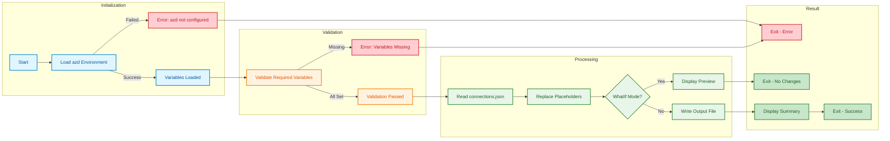
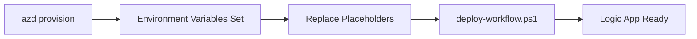

# Replace-ConnectionPlaceholders (.ps1 / .sh)


## 📋 Overview

The `Replace-ConnectionPlaceholders` script is an essential utility in the Azure Logic Apps Monitoring deployment workflow that replaces placeholder tokens in the `connections.json` file with actual environment variable values. Available in both PowerShell (`.ps1`) and Bash (`.sh`) versions, this cross-platform tool ensures that Azure Logic Apps Standard API connections are properly configured with the correct subscription ID, resource group, managed identity, and runtime URLs.

As a key component of the deployment pipeline, the script automatically loads environment variables from the active Azure Developer CLI (azd) environment, validates that all required variables are present, and performs token replacement in a safe and predictable manner. The replacement process supports both in-place modifications and separate output files, making it suitable for both local development and CI/CD pipeline integration.

With built-in WhatIf/dry-run mode for previewing changes, verbose logging for troubleshooting, and comprehensive error handling, the script typically completes in under 2 seconds. It integrates seamlessly with azd lifecycle hooks, enabling fully automated connection configuration during `azd provision` and `azd up` commands.

## 📑 Table of Contents

- [📋 Overview](#-overview)
- [🎯 Purpose](#-purpose)
- [📦 Placeholders Replaced](#-placeholders-replaced)
- [🚀 Usage](#-usage)
  - [💻 PowerShell](#powershell)
  - [🐚 Bash](#bash)
  - [👁️ Preview Mode (WhatIf/Dry-Run)](#preview-mode-whatifdry-run)
  - [📝 Verbose Mode](#verbose-mode)
- [🔧 Parameters](#-parameters)
  - [💻 PowerShell Parameters](#powershell-parameters)
  - [🐚 Bash Parameters](#bash-parameters)
- [📚 Examples](#-examples)
  - [⚡ Example 1: Standard Execution](#example-1-standard-execution)
  - [🔁 Example 2: CI/CD Integration](#example-2-cicd-integration)
- [🛠️ How It Works](#️-how-it-works)
  - [📊 Workflow Diagram](#workflow-diagram)
  - [🔗 Integration Points](#integration-points)
- [� Prerequisites](#-prerequisites)
  - [🔧 Required Tools](#required-tools)
  - [📝 Required Environment Variables](#required-environment-variables)
- [🐛 Troubleshooting](#-troubleshooting)
  - [❓ Common Issues](#common-issues)
  - [🔧 Debug Mode](#debug-mode)
- [�📖 Related Documentation](#-related-documentation)
- [🔐 Security Considerations](#-security-considerations)
  - [✅ Safe Operations](#safe-operations)
  - [🔑 Sensitive Value Handling](#sensitive-value-handling)
- [🎓 Best Practices](#-best-practices)
  - [📋 When to Use This Script](#when-to-use-this-script)
  - [🔄 Development Workflow Integration](#development-workflow-integration)
- [📊 Performance](#-performance)
  - [⚡ Performance Characteristics](#performance-characteristics)
- [📜 Version History](#-version-history)

---

## 🎯 Purpose

This script helps developers and operators:

- ✅ **Replace Placeholders**: Substitute placeholder tokens with actual environment variable values
- ✅ **Load azd Environment**: Automatically load variables from the active azd environment
- ✅ **Validate Configuration**: Ensure all required environment variables are set before replacement
- ✅ **Preview Changes**: Use WhatIf/dry-run mode to see changes without modifying files
- ✅ **Cross-Platform Support**: Run on Windows, Linux, or macOS with identical behavior
- ✅ **CI/CD Integration**: Seamlessly integrate with automated deployment pipelines

---

## 📦 Placeholders Replaced

The script replaces the following placeholder tokens in `connections.json`:

| Placeholder                             | Environment Variable                 | Description                             |
| --------------------------------------- | ------------------------------------ | --------------------------------------- |
| `${AZURE_SUBSCRIPTION_ID}`              | `AZURE_SUBSCRIPTION_ID`              | Azure subscription ID                   |
| `${AZURE_RESOURCE_GROUP}`               | `AZURE_RESOURCE_GROUP`               | Azure resource group name               |
| `${MANAGED_IDENTITY_NAME}`              | `MANAGED_IDENTITY_NAME`              | User-assigned managed identity name     |
| `${SERVICE_BUS_CONNECTION_RUNTIME_URL}` | `SERVICE_BUS_CONNECTION_RUNTIME_URL` | Service Bus API connection runtime URL  |
| `${AZURE_BLOB_CONNECTION_RUNTIME_URL}`  | `AZURE_BLOB_CONNECTION_RUNTIME_URL`  | Blob Storage API connection runtime URL |

---

## 🚀 Usage

### PowerShell

**Basic Usage:**

```powershell
# Standard execution (uses default connections.json path)
.\Replace-ConnectionPlaceholders.ps1
```

**Custom Input/Output Paths:**

```powershell
# Specify custom input file
.\Replace-ConnectionPlaceholders.ps1 -ConnectionsFilePath "./custom/connections.json"

# Specify custom output file
.\Replace-ConnectionPlaceholders.ps1 -OutputFilePath "./output/connections.json"
```

### Bash

**Basic Usage:**

```bash
# Standard execution (uses default connections.json path)
./replace-connection-placeholders.sh
```

**Custom Input/Output Paths:**

```bash
# Specify custom input file
./replace-connection-placeholders.sh -f "./custom/connections.json"

# Specify custom output file
./replace-connection-placeholders.sh -o "./output/connections.json"
```

### Preview Mode (WhatIf/Dry-Run)

**PowerShell:**

```powershell
# Preview changes without modifying files
.\Replace-ConnectionPlaceholders.ps1 -WhatIf
```

**Bash:**

```bash
# Preview changes without modifying files
./replace-connection-placeholders.sh --dry-run
```

**Output:**

```
What if: Performing operation "Replace Placeholders" on target "connections.json"
  Input file: D:\app\workflows\OrdersManagement\...\connections.json
  Output file: D:\app\workflows\OrdersManagement\...\connections.json

  Placeholders to replace:
    ${AZURE_SUBSCRIPTION_ID} → 12345678-1234-1234-1234-123456789012
    ${AZURE_RESOURCE_GROUP} → rg-logicapps-dev
    ${MANAGED_IDENTITY_NAME} → id-logicapps-dev
    ${SERVICE_BUS_CONNECTION_RUNTIME_URL} → https://servicebus-****
    ${AZURE_BLOB_CONNECTION_RUNTIME_URL} → https://blob-****

No changes were made. This was a simulation.
```

### Verbose Mode

**PowerShell:**

```powershell
# Enable detailed logging
.\Replace-ConnectionPlaceholders.ps1 -Verbose
```

**Bash:**

```bash
# Enable detailed logging
./replace-connection-placeholders.sh --verbose
```

---

## � Parameters

### PowerShell Parameters

| Parameter              | Type   | Required | Default                                              | Description                                     |
| ---------------------- | ------ | -------- | ---------------------------------------------------- | ----------------------------------------------- |
| `-ConnectionsFilePath` | String | No       | `../workflows/OrdersManagement/.../connections.json` | Path to the connections.json file               |
| `-OutputFilePath`      | String | No       | Same as input                                        | Output file path (overwrites input if not set)  |
| `-WhatIf`              | Switch | No       | -                                                    | Shows what changes would be made without saving |
| `-Verbose`             | Switch | No       | -                                                    | Enables detailed logging                        |
| `-Confirm`             | Switch | No       | -                                                    | Prompts for confirmation before making changes  |

### Bash Parameters

| Parameter   | Short | Required | Default                                              | Description                                     |
| ----------- | ----- | -------- | ---------------------------------------------------- | ----------------------------------------------- |
| `--file`    | `-f`  | No       | `../workflows/OrdersManagement/.../connections.json` | Path to the connections.json file               |
| `--output`  | `-o`  | No       | Same as input                                        | Output file path (overwrites input if not set)  |
| `--dry-run` | `-n`  | No       | -                                                    | Shows what changes would be made without saving |
| `--verbose` | `-v`  | No       | -                                                    | Enables detailed logging                        |
| `--help`    | `-h`  | No       | -                                                    | Displays help message                           |

---

## 📚 Examples

### Example 1: Standard Execution

**PowerShell:**

```powershell
.\Replace-ConnectionPlaceholders.ps1
```

**Bash:**

```bash
./replace-connection-placeholders.sh
```

**Output:**

```
=== Connection Placeholders Replacement Script ===

[1/4] Loading azd environment...
  Loading azd environment variables...
  Loaded 15 environment variables from azd.

[2/4] Validating environment variables...
  ✓ All required environment variables are set.

[3/4] Processing connections file...
  Input file: D:\app\workflows\OrdersManagement\OrdersManagementLogicApp\connections.json
  Reading connections file...
  Replacing placeholders with environment variable values...

[4/4] Writing output file...
  Output file: D:\app\workflows\OrdersManagement\OrdersManagementLogicApp\connections.json
  ✓ Successfully replaced all placeholders in connections.json

=== Replacement Summary ===
  AZURE_SUBSCRIPTION_ID: 12345678-1234-1234-1234-123456789012
  AZURE_RESOURCE_GROUP: rg-logicapps-dev
  MANAGED_IDENTITY_NAME: id-logicapps-dev
  SERVICE_BUS_CONNECTION_RUNTIME_URL: https://servicebus-****
  AZURE_BLOB_CONNECTION_RUNTIME_URL: https://blob-****

Operation completed successfully in 1.2 seconds.
```

### Example 2: CI/CD Integration

**GitHub Actions:**

```yaml
- name: Replace Connection Placeholders
  run: |
    pwsh -NoProfile -File ./hooks/Replace-ConnectionPlaceholders.ps1
  env:
    AZURE_SUBSCRIPTION_ID: ${{ secrets.AZURE_SUBSCRIPTION_ID }}
    AZURE_RESOURCE_GROUP: ${{ vars.AZURE_RESOURCE_GROUP }}
```

**Azure DevOps:**

```yaml
- task: PowerShell@2
  displayName: 'Replace Connection Placeholders'
  inputs:
    filePath: './hooks/Replace-ConnectionPlaceholders.ps1'
    pwsh: true
```

---

## 🛠️ How It Works

### Workflow Diagram



### Integration Points

| Integration       | Description                                          |
| ----------------- | ---------------------------------------------------- |
| **azd Hooks**     | Can be configured as a predeploy hook in azure.yaml  |
| **CI/CD**         | Supports GitHub Actions, Azure DevOps, Jenkins       |
| **Local Dev**     | Manual execution for local testing and development   |
| **deploy-workflow** | Called by deploy-workflow.ps1 for workflow deployment |

---

## � Prerequisites

### Required Tools

| Tool                   | Version | Purpose                          | Installation                          |
| ---------------------- | ------- | -------------------------------- | ------------------------------------- |
| **PowerShell Core**    | 7.0+    | Script execution (PowerShell)    | `winget install Microsoft.PowerShell` |
| **Bash**               | 4.0+    | Script execution (Bash)          | Included in Linux/macOS               |
| **Azure Developer CLI**| Latest  | Environment variable management  | `winget install Microsoft.Azd`        |

### Required Environment Variables

The following environment variables must be set (via azd or manually):

| Variable                             | Description                             | Set By                |
| ------------------------------------ | --------------------------------------- | --------------------- |
| `AZURE_SUBSCRIPTION_ID`              | Azure subscription GUID                 | azd / manual          |
| `AZURE_RESOURCE_GROUP`               | Resource group name                     | azd / manual          |
| `MANAGED_IDENTITY_NAME`              | Managed identity display name           | azd / manual          |
| `SERVICE_BUS_CONNECTION_RUNTIME_URL` | Service Bus API connection runtime URL  | azd / manual          |
| `AZURE_BLOB_CONNECTION_RUNTIME_URL`  | Blob Storage API connection runtime URL | azd / manual          |

### Environment Setup

Before running the script, ensure either:

1. **azd Environment Active**: `azd env select <env-name>`
2. **Variables Set Manually**: Export each required environment variable

---

## 🐛 Troubleshooting

### Common Issues

#### "Could not load azd environment variables"

**Symptoms:** Script fails at initialization with azd-related error.

**Solutions:**

```powershell
# Verify azd is installed
azd version

# List available environments
azd env list

# Select an environment
azd env select <env-name>

# Verify environment variables
azd env get-values
```

#### "Required environment variables are not set"

**Symptoms:** Script fails validation with missing variable errors.

**Solutions:**

```powershell
# Run azd provision to create resources and set variables
azd provision

# Or manually set missing variables
azd env set AZURE_SUBSCRIPTION_ID "12345678-1234-1234-1234-123456789012"
azd env set AZURE_RESOURCE_GROUP "rg-logicapps-dev"
```

#### "Connections file not found"

**Symptoms:** Script fails with file not found error.

**Solutions:**

```powershell
# Verify the default path exists
Test-Path "../workflows/OrdersManagement/OrdersManagementLogicApp/connections.json"

# Specify custom path if needed
.\Replace-ConnectionPlaceholders.ps1 -ConnectionsFilePath "path/to/connections.json"
```

#### "Permission denied" (Bash)

**Symptoms:** Script fails to execute.

**Solutions:**

```bash
# Make script executable
chmod +x ./replace-connection-placeholders.sh

# Run with bash explicitly
bash ./replace-connection-placeholders.sh
```

### Debug Mode

**PowerShell:**

```powershell
# Enable verbose output for detailed logging
.\Replace-ConnectionPlaceholders.ps1 -Verbose
```

**Bash:**

```bash
# Enable verbose output for detailed logging
./replace-connection-placeholders.sh --verbose
```

---

## �📖 Related Documentation

- [Azure Logic Apps API Connections](https://learn.microsoft.com/azure/logic-apps/logic-apps-azure-resource-manager-templates-overview#api-connections)
- [Azure Developer CLI Hooks](https://learn.microsoft.com/azure/developer/azure-developer-cli/azd-extensibility)
- [Managed Identity for Logic Apps](https://learn.microsoft.com/azure/logic-apps/logic-apps-securing-a-logic-app)
- [📄 deploy-workflow.md](./deploy-workflow.md) - Workflow deployment script
- [📄 postprovision.md](./postprovision.md) - Post-provisioning configuration

---

## 🔐 Security Considerations

### Safe Operations

The script performs safe, non-destructive operations:

- ✅ **Read-Only Source**: Original connections.json is read, not modified (when using `-OutputFilePath`)
- ✅ **WhatIf Mode**: Preview changes without making modifications
- ✅ **Confirmation Support**: `-Confirm` parameter for interactive approval
- ✅ **No Network Calls**: All operations are local file manipulations
- ✅ **No Credential Storage**: Environment variables are loaded, not persisted

### Sensitive Value Handling

The script handles sensitive values appropriately:

- **Masked Output**: Connection URLs are masked in summary output (showing only first characters)
- **No Logging of Secrets**: Full values are never written to logs or console
- **Environment Isolation**: Variables come from azd environment, not stored in files

---

## 🎓 Best Practices

### When to Use This Script

| Scenario                  | Recommendation                                       |
| ------------------------- | ---------------------------------------------------- |
| **azd provision**         | Automatically via hooks or manually after provision  |
| **Local Development**     | Run manually after selecting azd environment         |
| **CI/CD Pipeline**        | Include in deployment steps with force mode          |
| **Environment Switch**    | Run after `azd env select <env-name>`                |
| **Troubleshooting**       | Use `-Verbose` flag for detailed output              |

### Development Workflow Integration



**Recommended Workflow:**

1. Run `azd provision` to create Azure resources
2. Environment variables are automatically set
3. Run `Replace-ConnectionPlaceholders.ps1` to configure connections
4. Run `deploy-workflow.ps1` to deploy the workflow
5. Verify in Azure Portal

---

## 📊 Performance

### Performance Characteristics

| Metric               | Value        | Notes                          |
| -------------------- | ------------ | ------------------------------ |
| **Typical Duration** | 1-2 seconds  | Depends on file size           |
| **Memory Usage**     | < 50 MB      | File loaded into memory        |
| **CPU Usage**        | Minimal      | String replacement operations  |
| **File I/O**         | 2 operations | Read input, write output       |

---

<div align="center">

**Made with ❤️ by Evilazaro | Principal Cloud Solution Architect | Microsoft**

[⬆ Back to Top](#check-dev-workstation-ps1--sh)

</div>
