# Azure Logic Apps Monitoring - Complete Validation Workflow

## 📑 Table of Contents

- [📋 Available Scripts Overview](#-available-scripts-overview)
  - [🔗 Script Dependencies](#script-dependencies)
- [🔄 Visual Workflow](#visual-workflow)
  - [🚀 Complete Deployment Flow](#complete-deployment-flow)
  - [✅ Pre-Provisioning Validation Flow](#pre-provisioning-validation-flow-preprovisionps1sh)
  - [🎛️ Parameter Modes](#parameter-modes)
  - [⚠️ Failure Handling Flow](#failure-handling-flow)
  - [🔌 Integration Points](#integration-points)
- [📜 Script Details](#script-details)
  - [🔍 check-dev-workstation](#check-dev-workstation)
  - [✅ preprovision](#preprovision)
  - [⚙️ postprovision](#postprovision)
  - [🔐 sql-managed-identity-config](#sql-managed-identity-config)
  - [🧹 clean-secrets](#clean-secrets)
  - [📊 Generate-Orders](#generate-orders)
- [📋 Validation Matrix](#validation-matrix)
- [⏱️ Complete Deployment Timeline](#complete-deployment-timeline)
- [✅ Success Criteria](#success-criteria)
  - [🔧 Pre-Provisioning (preprovision)](#pre-provisioning-preprovision)
  - [⚙️ Post-Provisioning (postprovision)](#post-provisioning-postprovision)
  - [🔐 SQL Managed Identity Configuration](#sql-managed-identity-configuration-sql-managed-identity-config)
- [📖 Related Documentation](#related-documentation)
  - [📜 Script Versions Reference](#script-versions-reference)
- [💻 Local Developer Workstation Development Workflow](#-local-developer-workstation-development-workflow)
  - [🏗️ Local Development Architecture](#local-development-architecture)
  - [📋 Prerequisites for Local Development](#prerequisites-for-local-development)
  - [🔄 Local Development Workflow Steps](#local-development-workflow-steps)
  - [🔁 Inner Loop Development Cycle](#inner-loop-development-cycle)
  - [⚙️ Configuration Management (Local Development)](#configuration-management-local-development)
  - [🔧 Troubleshooting Local Development](#troubleshooting-local-development)
  - [🐛 Debugging Best Practices](#debugging-best-practices)
  - [⚖️ Local vs. Azure Development Comparison](#local-vs-azure-development-comparison)
  - [🔀 When to Switch from Local to Azure](#when-to-switch-from-local-to-azure)
  - [🛑 Stopping Local Development](#stopping-local-development)
  - [🧹 Cleaning Up Local Resources](#cleaning-up-local-resources)
- [📊 Complete Development Workflow Timeline](#-complete-development-workflow-timeline)

---

This document provides a comprehensive guide to the complete validation and deployment workflow for the Azure Logic Apps Monitoring Solution, orchestrating all lifecycle hooks into a cohesive end-to-end process. From initial workstation validation through Azure infrastructure provisioning, post-deployment configuration, and test data generation, this workflow ensures consistent, repeatable deployments across development teams using the Azure Developer CLI (azd) automation framework.

Beyond deployment automation, this guide covers the complete local development workflow using .NET Aspire orchestration with Docker containers and emulators, enabling developers to build and test the solution without Azure costs. The document includes detailed Mermaid diagrams visualizing each workflow stage, a validation matrix mapping checks to tools, timeline estimates for planning, success criteria for each phase, and troubleshooting guidance for common issues—making it the definitive reference for both new team members onboarding and experienced developers optimizing their development cycle.

---

**Complete Deployment Workflow Order**:

1. 🔍 **check-dev-workstation** (.ps1 or .sh) - Quick workstation validation (optional but recommended)
2. ✅ **preprovision** (.ps1 or .sh) - Comprehensive pre-provisioning validation
3. 🚀 **azd provision** - Deploy Azure infrastructure with Bicep
4. ⚙️ **postprovision** (.ps1 or .sh) - Configure .NET user secrets (automatic)
5. 🔐 **sql-managed-identity-config** (.ps1 or .sh) - Configure SQL Database managed identity access (automatic)
6. 📊 **Generate-Orders** (.ps1 or .sh) - Generate test data (optional, manual)
7. 🗑️ **postinfradelete** (.ps1 or .sh) - Purge soft-deleted Logic Apps after azd down (automatic)

---

## 📋 Available Scripts Overview

This workflow uses multiple automation scripts from the hooks directory:

| Script                          | Version | Purpose                                      | Execution               | Duration  |
| ------------------------------- | ------- | -------------------------------------------- | ----------------------- | --------- |
| **check-dev-workstation**       | 1.0.0   | Validate workstation prerequisites           | Manual (recommended)    | 3-5 sec   |
| **preprovision**                | 2.3.0   | Pre-deployment validation & secrets clearing | Automatic via azd       | 14-22 sec |
| **postprovision**               | 2.0.1   | Configure .NET user secrets post-deployment  | Automatic via azd       | 10-20 sec |
| **postinfradelete**             | 2.0.0   | Purge soft-deleted Logic Apps after azd down | Automatic via azd       | 5-15 sec  |
| **sql-managed-identity-config** | 1.0.0   | Configure SQL Database managed identity      | Called by postprovision | 5-10 sec  |
| **clean-secrets**               | 2.0.1   | Clear .NET user secrets utility              | Called by other scripts | 2-4 sec   |
| **Generate-Orders**             | 2.0.1   | Generate test order data                     | Manual (optional)       | 1-5 sec   |

### Script Dependencies

```mermaid
flowchart TD
    subgraph PreProvGroup["🛠️ Pre-Provisioning"]
        direction TB
        CheckDev[check-dev-workstation]
        PreProv[preprovision]
        CleanSecrets1[clean-secrets]
        CheckDev -.optional.-> PreProv
        PreProv --> CleanSecrets1
    end

    subgraph ProvGroup["☁️ Azure Provisioning"]
        direction TB
        AzdProv[azd provision]
    end

    subgraph PostProvGroup["⚙️ Post-Provisioning"]
        direction TB
        PostProv[postprovision]
        CleanSecrets2[clean-secrets]
        SqlConfig[sql-managed-identity-config]
        PostProv --> CleanSecrets2
        PostProv --> SqlConfig
    end

    subgraph DeleteGroup["🗑️ Infrastructure Deletion"]
        direction TB
        AzdDown[azd down]
        PostInfraDelete[postinfradelete]
        AzdDown --> PostInfraDelete
    end

    subgraph OptionalGroup["📊 Optional"]
        direction TB
        GenOrders[Generate-Orders]
    end

    CleanSecrets1 --> AzdProv
    AzdProv --> PostProv
    GenOrders -.optional manual.-> PostProv

    classDef optionalClass fill:#fff3cd,stroke:#ffc107,stroke-width:2px,stroke-dasharray: 5 5,color:#856404
    classDef automaticClass fill:#d4edda,stroke:#28a745,stroke-width:2px,color:#155724
    classDef utilityClass fill:#e2e3e5,stroke:#6c757d,stroke-width:2px,color:#383d41
    classDef deleteClass fill:#f8d7da,stroke:#dc3545,stroke-width:2px,color:#721c24

    class CheckDev,GenOrders optionalClass
    class PreProv,AzdProv,PostProv,SqlConfig automaticClass
    class CleanSecrets1,CleanSecrets2 utilityClass
    class AzdDown,PostInfraDelete deleteClass
```



---

## Visual Workflow

### Complete Deployment Flow


### Pre-Provisioning Validation Flow (preprovision.ps1/sh)

### Pre-Provisioning Validation Flow (preprovision.ps1/sh)



```mermaid
flowchart LR
    Start["PREPROVISION (.PS1/.SH) START<br/>Version 2.3.0<br/>Last Modified: 2026-01-06"]

    subgraph RuntimeCheck["1️⃣ Runtime Validation"]
        direction TB
        Step1["Runtime Version<br/>PowerShell: 7.0+ | Bash: 4.0+"]
        Decision1{Pass?}
        Error1["ERROR: Upgrade PowerShell"]
        Step1 --> Decision1
        Decision1 -->|✗ FAIL| Error1
    end

    subgraph PrereqCheck["2️⃣ Prerequisites Validation"]
        direction TB
        Step2["Prerequisites Validation"]
        Prereqs["Validate Prerequisites:<br/>2.1 .NET SDK (10.0+)<br/>2.2 Azure Developer CLI<br/>2.3 Azure CLI (2.60.0+)<br/>2.4 Bicep CLI (0.30.0+)<br/>2.5 Resource Providers (8)<br/>2.6 Azure Quota (info)"]
        Decision2{All Pass?}
        Error2["ERROR: Fix prerequisites"]
        Step2 --> Prereqs
        Prereqs --> Decision2
        Decision2 -->|✗ ANY FAIL| Error2
    end

    subgraph SecretsPhase["3️⃣ Clear User Secrets"]
        direction TB
        Step3["Clear User Secrets<br/>Execute: clean-secrets.ps1<br/>Projects: Orders.API, Web.App, AppHost"]
        Decision3{Skip?}
        ClearSecrets["Clear all project secrets"]
        Skip["SKIPPED<br/>--validate-only<br/>--skip-secrets-clear<br/>--dry-run"]
        Step3 --> Decision3
        Decision3 -->|No| ClearSecrets
        Decision3 -->|Yes| Skip
    end

    subgraph ResultPhase["4️⃣ Result"]
        direction TB
        Summary["EXECUTION SUMMARY<br/>Status: ✓ SUCCESS<br/>Duration: 14-22 seconds<br/>Exit Code: 0"]
        Ready["READY FOR DEPLOYMENT<br/>azd provision | azd up"]
        Summary --> Ready
    end

    Start --> RuntimeCheck
    Decision1 -->|✓ PASS| PrereqCheck
    Decision2 -->|✓ ALL PASS| SecretsPhase
    ClearSecrets --> ResultPhase
    Skip --> ResultPhase

    classDef successClass fill:#d4edda,stroke:#28a745,stroke-width:2px,color:#155724
    classDef errorClass fill:#f8d7da,stroke:#dc3545,stroke-width:2px,color:#721c24
    classDef processClass fill:#cfe2ff,stroke:#0d6efd,stroke-width:2px,color:#084298
    classDef decisionClass fill:#fff3cd,stroke:#ffc107,stroke-width:2px,color:#856404
    classDef skipClass fill:#e2e3e5,stroke:#6c757d,stroke-width:2px,color:#383d41

    class Start,Summary,Ready successClass
    class Error1,Error2 errorClass
    class Step1,Step2,Prereqs,Step3,ClearSecrets processClass
    class Decision1,Decision2,Decision3 decisionClass
    class Skip skipClass
```

### Parameter Modes


### Failure Handling Flow


### Integration Points


## Script Details

### check-dev-workstation

**Version:** 1.0.0  
**Purpose:** Quick prerequisite validation (wrapper around preprovision --validate-only)  
**Execution:** Manual (recommended before main workflow)  
**Duration:** 3-5 seconds  
**Documentation:** [check-dev-workstation.md](./check-dev-workstation.md)

**Validates:**

- PowerShell 7.0+ (Windows) or Bash 4.0+ (Linux/macOS)
- .NET SDK 10.0+
- Azure Developer CLI (azd)
- Azure CLI 2.60.0+
- Bicep CLI 0.30.0+
- Azure authentication status
- 8 Azure Resource Providers registration

### preprovision

**Version:** 2.3.0  
**Last Modified:** 2026-01-06  
**Purpose:** Comprehensive pre-deployment validation and secrets clearing  
**Execution:** Automatic via azd hooks  
**Duration:** 14-22 seconds  
**Documentation:** Current document

**Operations:**

1. Validate runtime version (PowerShell 7.0+ or Bash 4.0+)
2. Validate all prerequisites (same as check-dev-workstation)
3. Clear user secrets via clean-secrets script (unless skipped)
4. Exit with code 0 (success) or 1 (failure)

**Parameters:**

- `--force` / `-Force`: Skip confirmation prompts
- `--skip-secrets-clear` / `-SkipSecretsClear`: Skip secrets clearing
- `--validate-only` / `-ValidateOnly`: Only validate without changes
- `--verbose` / `-Verbose`: Detailed logging
- `--dry-run` / `-WhatIf`: Preview mode (PowerShell only)

### postprovision

**Version:** 2.0.1  
**Last Modified:** 2026-01-06  
**Purpose:** Configure .NET user secrets with Azure resource information  
**Execution:** Automatic via azd hooks after provisioning  
**Duration:** 10-20 seconds  
**Documentation:** [postprovision.md](./postprovision.md)

**Operations:**

1. Validate environment variables set by azd
2. Authenticate to Azure Container Registry (if configured)
3. Clear old secrets via clean-secrets script
4. Set new secrets across 3 projects:
   - app.AppHost (23 secrets)
   - eShop.Orders.API (3+ secrets including ConnectionStrings:OrderDb)
   - eShop.Web.App (1 secret for Application Insights)
5. Call sql-managed-identity-config to configure database access
6. Validate all secrets were set correctly

**Required Environment Variables:**

- `AZURE_SUBSCRIPTION_ID`
- `AZURE_RESOURCE_GROUP`
- `AZURE_LOCATION`
- `AZURE_SERVICEBUS_NAMESPACE`
- `AZURE_STORAGE_ACCOUNT_NAME`
- `AZURE_APP_INSIGHTS_CONNECTION_STRING`
- Plus 20 more from Bicep outputs

### sql-managed-identity-config

**Version:** 1.0.0  
**Last Modified:** 2026-01-06  
**Purpose:** Configure SQL Database user with managed identity authentication  
**Execution:** Automatic via postprovision script  
**Duration:** 5-10 seconds  
**Documentation:** [sql-managed-identity-config.md](./sql-managed-identity-config.md)

**Operations:**

1. Validate Azure CLI authentication (version 2.60.0+)
2. Validate sqlcmd utility availability
3. Construct connection details for Azure environment
4. Acquire Entra ID access token for Azure SQL Database
5. Generate T-SQL script to:
   - Create contained database user from external provider
   - Assign database roles (default: db_datareader, db_datawriter)
6. Execute SQL script with comprehensive error handling
7. Return JSON result object (Success/Error with details)

**Parameters:**

- `--sql-server-name`: Azure SQL Server name (required)
- `--database-name`: Target database name (required)
- `--principal-name`: Managed identity display name (required)
- `--database-roles`: Comma-separated roles (default: db_datareader,db_datawriter)
- `--azure-environment`: Azure cloud (default: AzureCloud)
- `--command-timeout`: SQL timeout in seconds (default: 120, range: 30-600)
- `--verbose`: Detailed logging

**Security Features:**

- Azure AD token authentication (no passwords)
- SQL injection protection via parameter sanitization
- TLS 1.2+ encryption enforced
- Token lifetime validation
- Idempotent execution (safe to re-run)

**Multi-Cloud Support:**

- AzureCloud (Public Azure)
- AzureUSGovernment
- AzureChinaCloud
- AzureGermanCloud

### clean-secrets

**Version:** 2.0.1  
**Purpose:** Clear .NET user secrets utility  
**Execution:** Called by preprovision and postprovision scripts  
**Duration:** 2-4 seconds  
**Documentation:** [clean-secrets.md](./clean-secrets.md)

**Clears secrets from:**

- app.AppHost/app.AppHost.csproj
- src/eShop.Orders.API/eShop.Orders.API.csproj
- src/eShop.Web.App/eShop.Web.App.csproj

### Generate-Orders

**Version:** 2.0.1  
**Purpose:** Generate test order data for development/testing  
**Execution:** Manual (optional, not part of deployment workflow)  
**Duration:** 1-5 seconds  
**Documentation:** [Generate-Orders.md](./Generate-Orders.md)

**Features:**

- Generates 1-10,000 orders with realistic data
- 20-product catalog with pricing variations
- Global delivery addresses (15 countries)
- Configurable products per order (1-6)
- JSON output format
- Progress tracking and statistics

### postinfradelete

**Version:** 2.0.0  
**Last Modified:** 2026-01-09  
**Purpose:** Purge soft-deleted Logic Apps Standard after azd down  
**Execution:** Automatic via azd hooks after infrastructure deletion  
**Duration:** 5-15 seconds  
**Documentation:** [postinfradelete.md](./postinfradelete.md)

**Operations:**

1. Validate required environment variables (AZURE_SUBSCRIPTION_ID, AZURE_LOCATION)
2. Verify Azure CLI installation and authentication
3. Query Azure REST API for soft-deleted Logic Apps in the region
4. Filter by resource group or Logic App name pattern (optional)
5. Purge matching soft-deleted Logic Apps permanently
6. Report results with detailed logging

**Features:**

- Automatic soft-delete recovery bypass
- Resource group and name pattern filtering
- Cross-platform execution (Windows, Linux, macOS)
- CI/CD integration with force mode
- WhatIf/dry-run support (PowerShell)

---

## Validation Matrix

| Component          | Check Type | Version Check | Auth Check | Registration Check |
| ------------------ | ---------- | ------------- | ---------- | ------------------ |
| PowerShell         | ✓          | ✓ (7.0+)      | ✗          | ✗                  |
| .NET SDK           | ✓          | ✓ (10.0+)     | ✗          | ✗                  |
| azd                | ✓          | ✓ (any)       | ✗          | ✗                  |
| Azure CLI          | ✓          | ✓ (2.60.0+)   | ✓          | ✗                  |
| Bicep CLI          | ✓          | ✓ (0.30.0+)   | ✗          | ✗                  |
| Resource Providers | ✓          | ✗             | ✗          | ✓ (8 providers)    |
| Azure Quota        | ℹ          | ✗             | ✗          | ✗                  |

Legend:

- ✓ : Check performed and required
- ✗ : Check not performed
- ℹ : Informational only

## Complete Deployment Timeline

```
┌─────────────────────────────────────────────────────────────────────┐
│  Complete azd up Timeline (from start to ready)                    │
│                                                                     │
│  PHASE 1: Pre-Provisioning Validation (preprovision)               │
│  0s     │ Start, Display Header                                    │
│  0.5s   │ Runtime Version Check (PowerShell/Bash)                  │
│  1.0s   │ .NET SDK 10.0+ Check                                     │
│  1.5s   │ Azure Developer CLI Check                                │
│  2.0s   │ Azure CLI 2.60.0+ Version Check                          │
│  3.0s   │ Azure Authentication Check                               │
│  4.0s   │ Bicep CLI 0.30.0+ Check                                  │
│  5-12s  │ Resource Provider Checks (8 providers)                   │
│  13s    │ Quota Information Display                                │
│  14-20s │ Execute clean-secrets (if not skipped)                   │
│  20s    │ Display Summary & Exit                                   │
│         │                                                           │
│         │ Subtotal: 14-22 seconds                                  │
│                                                                     │
│  PHASE 2: Azure Infrastructure Provisioning                        │
│  0-300s │ Deploy Bicep templates (5-10 minutes)                    │
│         │ - SQL Database & Server                                  │
│         │ - Service Bus Namespace, Topics, Subscriptions           │
│         │ - Container Registry                                     │
│         │ - Container Apps Environment                             │
│         │ - Application Insights & Log Analytics                   │
│         │ - Storage Accounts                                       │
│         │ - Managed Identities                                     │
│         │                                                           │
│         │ Subtotal: 5-10 minutes (300-600 seconds)                 │
│                                                                     │
│  PHASE 3: Post-Provisioning Configuration (postprovision)          │
│  0s     │ Start, Display Header                                    │
│  0.5s   │ Validate 26 Environment Variables                        │
│  1-2s   │ Azure Container Registry Authentication (if configured)  │
│  2-4s   │ Execute clean-secrets                                    │
│  4-14s  │ Set 26 Secrets Across 2 Projects                        │
│         │ - app.AppHost (14 secrets)                               │
│         │ - eShop.Orders.API (12 secrets)                          │
│  14s    │ Call sql-managed-identity-config                         │
│         │                                                           │
│         │ Subtotal (before SQL config): 10-15 seconds              │
│                                                                     │
│  PHASE 4: SQL Managed Identity Configuration                       │
│  0s     │ Start sql-managed-identity-config                        │
│  0.5s   │ Validate Azure CLI Authentication                        │
│  1.0s   │ Validate sqlcmd Utility                                  │
│  1.5s   │ Construct Connection Details                             │
│  2-3s   │ Acquire Entra ID Access Token                            │
│  3-8s   │ Generate & Execute SQL Script                            │
│         │ - Create database user from external provider            │
│         │ - Assign database roles                                  │
│  8-10s  │ Display Summary & Return JSON Result                     │
│         │                                                           │
│         │ Subtotal: 5-10 seconds                                   │
│                                                                     │
│  PHASE 5: Final Validation & Summary                               │
│  0-5s   │ Validate All Secrets Set Correctly                       │
│  5s     │ Display Comprehensive Summary                            │
│         │                                                           │
│         │ Subtotal: 5 seconds                                      │
│                                                                     │
│  ═════════════════════════════════════════════════════════════════  │
│  TOTAL TIME: 340-657 seconds (5.7 - 11 minutes)                    │
│  ═════════════════════════════════════════════════════════════════  │
│                                                                     │
│  Breakdown:                                                         │
│    • Pre-provisioning:     14-22 seconds                           │
│    • Azure provisioning:   300-600 seconds (5-10 min)              │
│    • Post-provisioning:    10-15 seconds                           │
│    • SQL configuration:    5-10 seconds                            │
│    • Final validation:     5 seconds                               │
│                                                                     │
│  Optional Scripts (Manual):                                         │
│    • check-dev-workstation:  3-5 seconds (before preprovision)     │
│    • Generate-Orders:        1-5 seconds (after deployment)        │
└─────────────────────────────────────────────────────────────────────┘
```

## Success Criteria

### Pre-Provisioning (preprovision)

```
┌─────────────────────────────────────────────────────────────────┐
│  All validations must PASS for successful execution:           │
│                                                                 │
│  ✓ Runtime: PowerShell 7.0+ OR Bash 4.0+                      │
│  ✓ .NET SDK 10.0+                                              │
│  ✓ Azure Developer CLI (any version)                           │
│  ✓ Azure CLI 2.60.0+                                           │
│  ✓ Azure authenticated (az account show succeeds)              │
│  ✓ Bicep CLI 0.30.0+                                           │
│  ✓ All 8 resource providers registered                         │
│  ℹ  Quota information displayed (non-blocking)                 │
│                                                                 │
│  Optional: User secrets cleared (unless --skip-secrets-clear)  │
│                                                                 │
│  Result: Exit code 0, ready for Azure deployment               │
└─────────────────────────────────────────────────────────────────┘
```

### Post-Provisioning (postprovision)

```
┌─────────────────────────────────────────────────────────────────┐
│  All operations must SUCCEED for successful execution:         │
│                                                                 │
│  ✓ All environment variables set by azd                        │
│  ✓ Azure Container Registry authentication (if configured)     │
│  ✓ Old secrets cleared successfully                            │
│  ✓ All new secrets set across 3 projects                       │
│  ✓ SQL managed identity configured successfully                │
│  ✓ All secrets validated after configuration                   │
│                                                                 │
│  Configured Projects:                                           │
│    • app.AppHost: 23 secrets                                   │
│    • eShop.Orders.API: 3+ secrets (incl. OrderDb connection)   │
│    • eShop.Web.App: 1 secret (Application Insights)            │
│                                                                 │
│  Result: Exit code 0, application ready for local development  │
└─────────────────────────────────────────────────────────────────┘
```

### SQL Managed Identity Configuration (sql-managed-identity-config)

```
┌─────────────────────────────────────────────────────────────────┐
│  All steps must SUCCEED for successful execution:              │
│                                                                 │
│  ✓ Azure CLI authenticated with valid token                    │
│  ✓ sqlcmd utility available and functional                     │
│  ✓ SQL Server connection details constructed                   │
│  ✓ Entra ID access token acquired for SQL Database             │
│  ✓ T-SQL script generated with proper escaping                 │
│  ✓ SQL script executed successfully                            │
│  ✓ Database user created (or already exists)                   │
│  ✓ Database roles assigned to user                             │
│                                                                 │
│  Security Requirements:                                         │
│    • Must be authenticated as SQL Server Entra ID admin        │
│    • Access token must be valid JWT format                     │
│    • TLS 1.2+ encryption enforced on connection                │
│                                                                 │
│  Result: JSON output with Success: true, managed identity has  │
│          database access with assigned roles                   │
└─────────────────────────────────────────────────────────────────┘
```

## Related Documentation

This document focuses on the validation workflow. For detailed information about each script, refer to:

- **[README.md](./README.md)** - Complete hooks directory overview and developer inner loop workflow
- **[check-dev-workstation.md](./check-dev-workstation.md)** - Workstation validation script documentation
- **[preprovision.md](./preprovision.md)** - Pre-provisioning validation script documentation
- **[postprovision.md](./postprovision.md)** - Post-provisioning configuration script documentation
- **[postinfradelete.md](./postinfradelete.md)** - Post-infrastructure delete cleanup script documentation
- **[sql-managed-identity-config.md](./sql-managed-identity-config.md)** - SQL managed identity configuration documentation
- **[clean-secrets.md](./clean-secrets.md)** - Secrets management utility documentation
- **[deploy-workflow.md](./deploy-workflow.md)** - Logic Apps workflow deployment documentation
- **[Generate-Orders.md](./Generate-Orders.md)** - Test data generation script documentation

### Script Versions Reference

| Script                      | PowerShell Version | Bash Version | Last Modified |
| --------------------------- | ------------------ | ------------ | ------------- |
| check-dev-workstation       | 1.0.0              | 1.0.0        | 2026-01-07    |
| preprovision                | 2.3.0              | 2.3.0        | 2026-01-06    |
| postprovision               | 2.0.1              | 2.0.1        | 2026-01-06    |
| postinfradelete             | 2.0.0              | 2.0.0        | 2026-01-09    |
| sql-managed-identity-config | 1.0.0              | 1.0.0        | 2026-01-06    |
| clean-secrets               | 2.0.1              | 2.0.1        | 2026-01-06    |
| Generate-Orders             | 2.0.1              | 2.0.1        | 2026-01-06    |
| deploy-workflow             | 2.0.1              | 2.0.1        | 2026-01-07    |

---

## 💻 Local Developer Workstation Development Workflow

This section covers the inner loop development workflow for running the application locally on a developer workstation using .NET Aspire. The workflow leverages containerized dependencies (SQL Server, Service Bus emulator) for a complete local development experience without requiring Azure resources.

### Local Development Architecture

The application uses **.NET Aspire** as an orchestration framework that manages the lifecycle of application projects and their dependencies. In local mode, Aspire automatically provisions and configures:

- **SQL Server Container** with persistent volume for database operations
- **Azure Service Bus Emulator** for message queue functionality
- **Application Insights** telemetry collection (optional, requires connection string)
- **Service Discovery** for inter-service communication
- **Health Checks** and monitoring endpoints

### Prerequisites for Local Development

Before starting local development, ensure you have:

| Tool/Component                        | Version | Purpose                        | Validation Command          |
| ------------------------------------- | ------- | ------------------------------ | --------------------------- |
| **.NET SDK**                          | 10.0+   | Application runtime            | `dotnet --version`          |
| **Docker Desktop**                    | Latest  | Container orchestration        | `docker --version`          |
| **Visual Studio 2022** or **VS Code** | Latest  | IDE with Aspire support        | -                           |
| **.NET Aspire Workload**              | 9.5+    | Aspire orchestration           | `dotnet workload list`      |
| **PowerShell**                        | 7.0+    | Script execution (Windows)     | `$PSVersionTable.PSVersion` |
| **Azure CLI** (Optional)              | 2.60.0+ | For Azure integration features | `az --version`              |

#### Installing .NET Aspire Workload

```powershell
# Install .NET Aspire workload
dotnet workload install aspire

# Verify installation
dotnet workload list
```

### Local Development Workflow Steps

#### 1️⃣ Initial Setup (First Time Only)

```powershell
# Navigate to repository root
cd Z:\app

# Ensure Docker Desktop is running
docker ps

# Restore all project dependencies
dotnet restore app.sln

# Build the solution
dotnet build app.sln --no-restore
```

#### 2️⃣ Start the .NET Aspire AppHost

The AppHost orchestrates all services and dependencies:

**Option A: Using Visual Studio 2022**

1. Open `app.sln` in Visual Studio 2022
2. Set `app.AppHost` as the startup project
3. Press `F5` or click "Start Debugging"
4. The Aspire Dashboard will open automatically in your browser

**Option B: Using Visual Studio Code**

1. Open the workspace in VS Code
2. Press `F5` or use "Run and Debug" panel
3. Select "https" launch profile
4. The Aspire Dashboard will open at `https://localhost:17267`

**Option C: Using Command Line**

```powershell
# Navigate to AppHost project
cd app.AppHost

# Run the AppHost (launches all services)
dotnet run --launch-profile https

# Or with specific ASPNETCORE_ENVIRONMENT
$env:ASPNETCORE_ENVIRONMENT = "Development"
dotnet run
```

#### 3️⃣ Access the Aspire Dashboard

Once the AppHost starts, the **Aspire Dashboard** provides comprehensive observability:

- **URL**: `https://localhost:17267` (https) or `http://localhost:15175` (http)
- **Resources Tab**: View all running services, containers, and their status
- **Logs Tab**: Real-time log streaming from all components
- **Traces Tab**: Distributed tracing with OpenTelemetry
- **Metrics Tab**: Performance metrics and counters

**Monitored Resources:**

- `orders-api` - eShop Orders API service
- `web-app` - eShop Web Application (Blazor)
- `OrdersDatabase` - SQL Server container (localhost mode)
- `messaging` - Azure Service Bus emulator

#### 4️⃣ Access Application Endpoints

| Service              | URL                              | Description                   |
| -------------------- | -------------------------------- | ----------------------------- |
| **Web App**          | `https://localhost:5001`         | Blazor web interface          |
| **Orders API**       | `https://localhost:7001`         | RESTful API with Swagger      |
| **API Swagger UI**   | `https://localhost:7001/swagger` | Interactive API documentation |
| **API Health**       | `https://localhost:7001/health`  | Health check endpoint         |
| **Aspire Dashboard** | `https://localhost:17267`        | Observability dashboard       |

> **Note**: Exact ports are dynamically assigned by Aspire. Check the Aspire Dashboard "Resources" tab for actual URLs.

#### 5️⃣ Database Management (Local Development)

**Automatic Database Creation:**

- The application uses `EnsureCreatedAsync()` in development mode
- Database schema is created automatically on first run
- Located in SQL Server container with persistent volume

**Manual Database Operations:**

```powershell
# Navigate to Orders API project
cd src\eShop.Orders.API

# List Entity Framework migrations
dotnet ef migrations list

# Add a new migration (after model changes)
dotnet ef migrations add MigrationName

# Apply migrations to database
dotnet ef database update

# View current database connection string (from user secrets)
dotnet user-secrets list | Select-String "ConnectionStrings:OrderDb"
```

**Connection String Format (Local):**

```
Server=localhost,5433;Database=OrderDb;User Id=sa;Password=<generated-password>;TrustServerCertificate=True;
```

#### 6️⃣ Service Bus Configuration (Local Development)

**Automatic Emulator Setup:**

- Aspire starts the Azure Service Bus emulator automatically
- Topic: `ordersplaced`
- Subscription: `orderprocessingsub`
- Connection managed via Aspire service discovery

**Verify Service Bus Connectivity:**

```powershell
# Check if Service Bus emulator container is running
docker ps | Select-String "servicebus"

# View Service Bus configuration in Aspire Dashboard
# Navigate to Resources tab → messaging resource
```

### Inner Loop Development Cycle

The inner loop represents the rapid code-compile-test cycle during active development:


**Key Inner Loop Features:**

1. **Hot Reload** (.NET 10):

   - C# code changes apply without restart
   - Razor component changes reflect immediately
   - Static assets update in real-time

2. **Debugging**:

   - Set breakpoints in Visual Studio/VS Code
   - Step through code across services
   - Inspect variables and call stacks

3. **Observability**:

   - Real-time logs in Aspire Dashboard
   - Distributed tracing across services
   - Performance metrics monitoring

4. **Fast Feedback**:
   - Changes visible in 1-3 seconds
   - No manual restart required
   - Automatic browser refresh (Blazor)

### Configuration Management (Local Development)

**.NET User Secrets** are used for local configuration:

**View Current Secrets:**

```powershell
# AppHost secrets
dotnet user-secrets list --project app.AppHost

# Orders API secrets
dotnet user-secrets list --project src\eShop.Orders.API

# Web App secrets
dotnet user-secrets list --project src\eShop.Web.App
```

**Set Manual Secret (if needed):**

```powershell
# Example: Add Application Insights connection string
dotnet user-secrets set "APPLICATIONINSIGHTS_CONNECTION_STRING" "InstrumentationKey=..." --project app.AppHost
```

**Secrets Location:**

- Windows: `%APPDATA%\Microsoft\UserSecrets\<user-secrets-id>\secrets.json`
- macOS/Linux: `~/.microsoft/usersecrets/<user-secrets-id>/secrets.json`

### Troubleshooting Local Development

#### Issue: "Docker container fails to start"

```powershell
# Check Docker Desktop is running
docker info

# Verify Docker resources (at least 4GB RAM recommended)
# Docker Desktop → Settings → Resources

# Clean up old containers
docker system prune -a --volumes
```

#### Issue: "Port already in use"

```powershell
# Find process using port (Windows)
netstat -ano | findstr :17267

# Kill process (replace PID)
Stop-Process -Id <PID> -Force

# Or change ports in launchSettings.json
```

#### Issue: "Database connection fails"

```powershell
# Check SQL Server container status
docker ps | Select-String "sql"

# View container logs
docker logs <container-id>

# Restart AppHost to recreate container
# Stop (Ctrl+C) and restart dotnet run
```

#### Issue: "Service Bus not configured"

The application gracefully handles missing Service Bus:

- A warning is logged: "Service Bus is not configured"
- NoOpOrdersMessageHandler is used instead
- Orders API continues to function without message publishing

To enable Service Bus:

```powershell
# Ensure Docker is running
docker ps

# Restart AppHost - it will auto-provision emulator
cd app.AppHost
dotnet run
```

#### Issue: "Hot Reload not working"

```powershell
# Verify .NET SDK version
dotnet --version  # Must be 10.0+

# Enable Hot Reload explicitly
$env:DOTNET_WATCH_RESTART_ON_RUDE_EDIT = "true"

# Or restart with watch
dotnet watch --project app.AppHost
```

### Debugging Best Practices

1. **Set Strategic Breakpoints**:

   - Controllers: `OrdersController.cs`
   - Services: `OrderService.cs`, `OrdersMessageHandler.cs`
   - Repository: `OrderRepository.cs`
   - AppHost: `AppHost.cs` (for service configuration)

2. **Use Conditional Breakpoints**:

   ```csharp
   // Break only for specific order IDs
   if (orderId == "12345") { }  // Set breakpoint here
   ```

3. **Leverage Aspire Dashboard**:

   - Monitor distributed traces to identify slow operations
   - Check logs for exceptions across all services
   - View metrics to detect performance bottlenecks

4. **Enable Detailed Logging**:
   ```json
   // appsettings.Development.json
   {
     "Logging": {
       "LogLevel": {
         "Default": "Debug",
         "Microsoft.EntityFrameworkCore": "Information"
       }
     }
   }
   ```

### Local vs. Azure Development Comparison

| Aspect             | Local Development       | Azure Development              |
| ------------------ | ----------------------- | ------------------------------ |
| **Database**       | SQL Server container    | Azure SQL Database             |
| **Authentication** | SQL authentication (sa) | Entra ID (Managed Identity)    |
| **Service Bus**    | Local emulator          | Azure Service Bus              |
| **Monitoring**     | Aspire Dashboard        | Application Insights           |
| **Cost**           | Free (local resources)  | Pay-per-use                    |
| **Setup Time**     | ~2 minutes              | ~10 minutes (azd provision)    |
| **Network**        | localhost               | HTTPS with TLS                 |
| **Secrets**        | User secrets            | Azure Key Vault / User secrets |

### When to Switch from Local to Azure

Move from local development to Azure when you need:

1. **Integration Testing**: Test with real Azure services
2. **Performance Testing**: Validate under production-like load
3. **Security Testing**: Test Managed Identity and RBAC
4. **Team Collaboration**: Share a common environment
5. **CI/CD Validation**: Test deployment pipelines

**Transition Command:**

```powershell
# Provision Azure infrastructure
azd provision

# Application automatically detects Azure configuration
# and switches from containers to Azure services
```

### Stopping Local Development

```powershell
# Stop the AppHost
# Press Ctrl+C in the terminal running dotnet run

# Or stop debugging in Visual Studio/VS Code

# Containers are automatically stopped by Aspire
# Verify cleanup
docker ps
```

### Cleaning Up Local Resources

```powershell
# Remove all stopped containers and volumes
docker system prune -a --volumes

# Remove only Aspire-created resources
docker ps -a --filter "name=aspire" --format "{{.ID}}" | ForEach-Object { docker rm -f $_ }

# Clear user secrets (if needed)
.\hooks\clean-secrets.ps1 -Force
```

---

## 📊 Complete Development Workflow Timeline

```
┌─────────────────────────────────────────────────────────────────────┐
│  SCENARIO 1: Local Development Only (No Azure)                     │
│                                                                     │
│  PHASE 1: Initial Setup (First Time - One Time)                    │
│  0s     │ Install prerequisites (.NET 10, Docker, Aspire workload)│
│  60s    │ Clone repository & restore dependencies                  │
│  120s   │                                                           │
│         │ Subtotal: ~2 minutes                                     │
│                                                                     │
│  PHASE 2: Start Development Environment                            │
│  0s     │ Start Docker Desktop                                     │
│  10s    │ Run AppHost (dotnet run)                                 │
│  30s    │ Aspire provisions SQL + Service Bus containers           │
│  45s    │ Database schema created automatically                    │
│  60s    │ All services healthy, Dashboard accessible               │
│         │                                                           │
│         │ Subtotal: ~1 minute                                      │
│                                                                     │
│  PHASE 3: Inner Loop Development (Repeating)                       │
│  0-5s   │ Edit code (.cs, .razor, .json)                          │
│  1-3s   │ Hot reload applies changes                               │
│  2-5s   │ Test in browser/API                                      │
│  0-60s  │ Debug with breakpoints (if needed)                       │
│         │                                                           │
│         │ Per-iteration: 3-73 seconds                              │
│         │ Typical iteration: ~10 seconds                           │
│                                                                     │
│  ═════════════════════════════════════════════════════════════════  │
│  TOTAL LOCAL DEV STARTUP: ~3 minutes (first time with install)     │
│  TOTAL LOCAL DEV STARTUP: ~1 minute (subsequent times)             │
│  INNER LOOP CYCLE: ~10 seconds per code change                     │
│  ═════════════════════════════════════════════════════════════════  │
└─────────────────────────────────────────────────────────────────────┘

┌─────────────────────────────────────────────────────────────────────┐
│  SCENARIO 2: Full Azure Deployment (From Previous Section)         │
│                                                                     │
│  TOTAL TIME: 340-657 seconds (5.7 - 11 minutes)                    │
│                                                                     │
│  Phases:                                                            │
│    • Pre-provisioning:     14-22 seconds                           │
│    • Azure provisioning:   300-600 seconds (5-10 min)              │
│    • Post-provisioning:    10-15 seconds                           │
│    • SQL configuration:    5-10 seconds                            │
│    • Final validation:     5 seconds                               │
│                                                                     │
│  After deployment, local code runs against Azure resources         │
│  with user secrets configured automatically                         │
└─────────────────────────────────────────────────────────────────────┘

┌─────────────────────────────────────────────────────────────────────┐
│  SCENARIO 3: Hybrid Development (Local + Azure)                    │
│                                                                     │
│  Run locally but connect to Azure SQL and Service Bus:             │
│    1. Provision Azure (5-11 minutes)                               │
│    2. Configure user secrets (automatic via postprovision)          │
│    3. Start AppHost locally (30-60 seconds)                        │
│    4. AppHost detects Azure config, skips local containers          │
│                                                                     │
│  Best for: Integration testing with real Azure services            │
└─────────────────────────────────────────────────────────────────────┘
```

---

<div align="center">

**Made with ❤️ by Evilazaro | Principal Cloud Solution Architect | Microsoft**

[⬆ Back to Top](#azure-logic-apps-monitoring---complete-validation-workflow)

</div>
