# Azure Logic Apps Monitoring - Complete Validation Workflow

**Complete Deployment Workflow Order**:

1. 🔍 **check-dev-workstation** (.ps1 or .sh) - Quick workstation validation (optional but recommended)
2. ✅ **preprovision** (.ps1 or .sh) - Comprehensive pre-provisioning validation
3. 🚀 **azd provision** - Deploy Azure infrastructure with Bicep
4. ⚙️ **postprovision** (.ps1 or .sh) - Configure .NET user secrets (automatic)
5. 🔐 **sql-managed-identity-config** (.ps1 or .sh) - Configure SQL Database managed identity access (automatic)
6. 📊 **Generate-Orders** (.ps1 or .sh) - Generate test data (optional, manual)

---

## 📋 Available Scripts Overview

This workflow uses multiple automation scripts from the hooks directory:

| Script                          | Version | Purpose                                      | Execution               | Duration  |
| ------------------------------- | ------- | -------------------------------------------- | ----------------------- | --------- |
| **check-dev-workstation**       | 2.0.1   | Validate workstation prerequisites           | Manual (recommended)    | 3-5 sec   |
| **preprovision**                | 2.0.1   | Pre-deployment validation & secrets clearing | Automatic via azd       | 14-22 sec |
| **postprovision**               | 2.0.1   | Configure .NET user secrets post-deployment  | Automatic via azd       | 10-20 sec |
| **sql-managed-identity-config** | 1.0.0   | Configure SQL Database managed identity      | Called by postprovision | 5-10 sec  |
| **clean-secrets**               | 2.0.1   | Clear .NET user secrets utility              | Called by other scripts | 2-4 sec   |
| **Generate-Orders**             | 2.0.1   | Generate test order data                     | Manual (optional)       | 1-5 sec   |

### Script Dependencies

```mermaid
flowchart TD
    subgraph PreProvGroup["🛠️ Pre-Provisioning"]
        direction TB
        CheckDev[check-dev-workstation]
        PreProv[preprovision]
        CleanSecrets1[clean-secrets]
        CheckDev -.optional.-> PreProv
        PreProv --> CleanSecrets1
    end

    subgraph ProvGroup["☁️ Azure Provisioning"]
        direction TB
        AzdProv[azd provision]
    end

    subgraph PostProvGroup["⚙️ Post-Provisioning"]
        direction TB
        PostProv[postprovision]
        CleanSecrets2[clean-secrets]
        SqlConfig[sql-managed-identity-config]
        PostProv --> CleanSecrets2
        PostProv --> SqlConfig
    end

    subgraph OptionalGroup["📊 Optional"]
        direction TB
        GenOrders[Generate-Orders]
    end

    CleanSecrets1 --> AzdProv
    AzdProv --> PostProv
    GenOrders -.optional manual.-> PostProv

    classDef optionalClass fill:#fff3cd,stroke:#ffc107,stroke-width:2px,stroke-dasharray: 5 5,color:#856404
    classDef automaticClass fill:#d4edda,stroke:#28a745,stroke-width:2px,color:#155724
    classDef utilityClass fill:#e2e3e5,stroke:#6c757d,stroke-width:2px,color:#383d41

    class CheckDev,GenOrders optionalClass
    class PreProv,AzdProv,PostProv,SqlConfig automaticClass
    class CleanSecrets1,CleanSecrets2 utilityClass
```



---

## Visual Workflow

### Complete Deployment Flow


### Pre-Provisioning Validation Flow (preprovision.ps1/sh)

### Pre-Provisioning Validation Flow (preprovision.ps1/sh)



```mermaid
flowchart LR
    Start["PREPROVISION (.PS1/.SH) START<br/>Version 2.0.1<br/>Last Modified: 2025-12-29"]

    subgraph RuntimeCheck["1️⃣ Runtime Validation"]
        direction TB
        Step1["Runtime Version<br/>PowerShell: 7.0+ | Bash: 4.0+"]
        Decision1{Pass?}
        Error1["ERROR: Upgrade PowerShell"]
        Step1 --> Decision1
        Decision1 -->|✗ FAIL| Error1
    end

    subgraph PrereqCheck["2️⃣ Prerequisites Validation"]
        direction TB
        Step2["Prerequisites Validation"]
        Prereqs["Validate Prerequisites:<br/>2.1 .NET SDK (10.0+)<br/>2.2 Azure Developer CLI<br/>2.3 Azure CLI (2.60.0+)<br/>2.4 Bicep CLI (0.30.0+)<br/>2.5 Resource Providers (8)<br/>2.6 Azure Quota (info)"]
        Decision2{All Pass?}
        Error2["ERROR: Fix prerequisites"]
        Step2 --> Prereqs
        Prereqs --> Decision2
        Decision2 -->|✗ ANY FAIL| Error2
    end

    subgraph SecretsPhase["3️⃣ Clear User Secrets"]
        direction TB
        Step3["Clear User Secrets<br/>Execute: clean-secrets.ps1<br/>Projects: Orders.API, Web.App, AppHost"]
        Decision3{Skip?}
        ClearSecrets["Clear all project secrets"]
        Skip["SKIPPED<br/>--validate-only<br/>--skip-secrets-clear<br/>--dry-run"]
        Step3 --> Decision3
        Decision3 -->|No| ClearSecrets
        Decision3 -->|Yes| Skip
    end

    subgraph ResultPhase["4️⃣ Result"]
        direction TB
        Summary["EXECUTION SUMMARY<br/>Status: ✓ SUCCESS<br/>Duration: 14-22 seconds<br/>Exit Code: 0"]
        Ready["READY FOR DEPLOYMENT<br/>azd provision | azd up"]
        Summary --> Ready
    end

    Start --> RuntimeCheck
    Decision1 -->|✓ PASS| PrereqCheck
    Decision2 -->|✓ ALL PASS| SecretsPhase
    ClearSecrets --> ResultPhase
    Skip --> ResultPhase

    classDef successClass fill:#d4edda,stroke:#28a745,stroke-width:2px,color:#155724
    classDef errorClass fill:#f8d7da,stroke:#dc3545,stroke-width:2px,color:#721c24
    classDef processClass fill:#cfe2ff,stroke:#0d6efd,stroke-width:2px,color:#084298
    classDef decisionClass fill:#fff3cd,stroke:#ffc107,stroke-width:2px,color:#856404
    classDef skipClass fill:#e2e3e5,stroke:#6c757d,stroke-width:2px,color:#383d41

    class Start,Summary,Ready successClass
    class Error1,Error2 errorClass
    class Step1,Step2,Prereqs,Step3,ClearSecrets processClass
    class Decision1,Decision2,Decision3 decisionClass
    class Skip skipClass
```

### Parameter Modes


### Failure Handling Flow

```mermaid
flowchart LR
    subgraph Detection["🔍 Detection"]
        direction TB
        Failure["Validation Failure<br/>in Step 2"]
    end

    subgraph Reporting["📝 Reporting"]
        direction TB
        Display["Display error with ✗ symbol"]
        Instructions["Show installation/fix instructions"]
        SetFlag["Set prerequisitesFailed = true"]
        Continue["Continue checking remaining"]
        Display --> Instructions
        Instructions --> SetFlag
        SetFlag --> Continue
    end

    subgraph ExitPhase["🚪 Exit"]
        direction TB
        ThrowError["After all checks:<br/>Throw error and exit code 1"]
        FailureSummary["Display failure summary<br/>with duration"]
        ThrowError --> FailureSummary
    end

    Detection --> Reporting
    Reporting --> ExitPhase

    classDef failureClass fill:#f8d7da,stroke:#dc3545,stroke-width:2px,color:#721c24
    classDef processClass fill:#fff3cd,stroke:#ffc107,stroke-width:2px,color:#856404

    class Failure,ThrowError,FailureSummary failureClass
    class Display,Instructions,SetFlag,Continue processClass
```



### Integration Points

```mermaid
flowchart TD
    CheckDev["1️⃣ check-dev-workstation (.ps1/.sh)<br/>(optional but recommended)<br/>Version: 2.0.1"]
    CheckDev --> AZD

    subgraph AZD["Azure Developer CLI (azd)"]
        AzdYaml["azure.yaml<br/>hooks:<br/>  preprovision:<br/>    windows: preprovision.ps1<br/>    posix: preprovision.sh<br/>  postprovision:<br/>    windows: postprovision.ps1<br/>    posix: postprovision.sh"]
        AzdYaml --> AzdCmd["azd provision | azd up"]
        AzdCmd --> Execute["2️⃣ Execute preprovision (.ps1/.sh)<br/>Version: 2.0.1"]
        Execute --> Validate{Validation<br/>passes?}
        Validate -->|✓| Deploy["Continue with deployment<br/>Bicep: infra/main.bicep"]
        Deploy --> Post["3️⃣ Execute postprovision (.ps1/.sh)<br/>Version: 2.0.1"]
        Post --> SqlConfig["4️⃣ Execute sql-managed-identity-config<br/>Version: 1.0.0 (2025-12-29)"]
        SqlConfig --> Ready["✓ Ready for development"]
        Validate -->|✗| Stop["Stop deployment"]
    end

    subgraph Utilities["Utility Scripts (Called by others)"]
        CleanSec["clean-secrets (.ps1/.sh)<br/>Version: 2.0.1<br/>Called by: preprovision & postprovision"]
        GenOrd["Generate-Orders (.ps1/.sh)<br/>Version: 2.0.1<br/>Manual execution (optional)"]
    end

    subgraph GitHub["GitHub Actions Integration"]
        GHAction1["- name: Check workstation<br/>  run: |<br/>    # Windows: pwsh check-dev-workstation.ps1<br/>    # Linux: bash check-dev-workstation.sh"]
        GHAction2["- name: Pre-provision<br/>  run: |<br/>    # Windows: pwsh preprovision.ps1 -Force<br/>    # Linux: bash preprovision.sh --force"]
        GHAction3["- name: Deploy<br/>  run: azd up --no-prompt"]
        GHAction1 --> GHAction2
        GHAction2 --> GHAction3
    end

    subgraph AzureDevOps["Azure DevOps Pipeline Integration"]
        ADOTask1["- task: PowerShell@2<br/>  inputs:<br/>    filePath: hooks/check-dev-workstation.ps1"]
        ADOTask2["- task: PowerShell@2<br/>  inputs:<br/>    filePath: hooks/preprovision.ps1<br/>    arguments: -Force"]
        ADOTask3["- task: AzureCLI@2<br/>  inputs:<br/>    scriptType: pscore<br/>    scriptLocation: inlineScript<br/>    inlineScript: azd up --no-prompt"]
        ADOTask1 --> ADOTask2
        ADOTask2 --> ADOTask3
    end

    Execute -.calls.-> CleanSec
    Post -.calls.-> CleanSec
    Ready -.manual.-> GenOrd

    classDef devClass fill:#fff3cd,stroke:#fd7e14,stroke-width:3px
    classDef azdClass fill:#cfe2ff,stroke:#0d6efd,stroke-width:2px
    classDef ciClass fill:#e2d5f1,stroke:#6f42c1,stroke-width:2px
    classDef successClass fill:#d4edda,stroke:#28a745,stroke-width:2px
    classDef failClass fill:#f8d7da,stroke:#dc3545,stroke-width:2px
    classDef utilClass fill:#e2e3e5,stroke:#6c757d,stroke-width:2px

    class CheckDev devClass
    class AzdYaml,AzdCmd,Execute azdClass
    class GHAction1,GHAction2,GHAction3,ADOTask1,ADOTask2,ADOTask3 ciClass
    class Deploy,Post,SqlConfig,Ready successClass
    class Stop failClass
    class CleanSec,GenOrd utilClass
```



## Script Details

### check-dev-workstation

**Version:** 2.0.1  
**Purpose:** Quick prerequisite validation (wrapper around preprovision --validate-only)  
**Execution:** Manual (recommended before main workflow)  
**Duration:** 3-5 seconds  
**Documentation:** [check-dev-workstation.md](./check-dev-workstation.md)

**Validates:**

- PowerShell 7.0+ (Windows) or Bash 4.0+ (Linux/macOS)
- .NET SDK 10.0+
- Azure Developer CLI (azd)
- Azure CLI 2.60.0+
- Bicep CLI 0.30.0+
- Azure authentication status
- 8 Azure Resource Providers registration

### preprovision

**Version:** 2.0.1  
**Last Modified:** 2025-12-29  
**Purpose:** Comprehensive pre-deployment validation and secrets clearing  
**Execution:** Automatic via azd hooks  
**Duration:** 14-22 seconds  
**Documentation:** Current document

**Operations:**

1. Validate runtime version (PowerShell 7.0+ or Bash 4.0+)
2. Validate all prerequisites (same as check-dev-workstation)
3. Clear user secrets via clean-secrets script (unless skipped)
4. Exit with code 0 (success) or 1 (failure)

**Parameters:**

- `--force` / `-Force`: Skip confirmation prompts
- `--skip-secrets-clear` / `-SkipSecretsClear`: Skip secrets clearing
- `--validate-only` / `-ValidateOnly`: Only validate without changes
- `--verbose` / `-Verbose`: Detailed logging
- `--dry-run` / `-WhatIf`: Preview mode (PowerShell only)

### postprovision

**Version:** 2.0.1  
**Last Modified:** 2025-12-29  
**Purpose:** Configure .NET user secrets with Azure resource information  
**Execution:** Automatic via azd hooks after provisioning  
**Duration:** 10-20 seconds  
**Documentation:** [postprovision.md](./postprovision.md)

**Operations:**

1. Validate environment variables set by azd
2. Authenticate to Azure Container Registry (if configured)
3. Clear old secrets via clean-secrets script
4. Set new secrets across 3 projects:
   - app.AppHost (23 secrets)
   - eShop.Orders.API (3+ secrets including ConnectionStrings:OrderDb)
   - eShop.Web.App (1 secret for Application Insights)
5. Call sql-managed-identity-config to configure database access
6. Validate all secrets were set correctly

**Required Environment Variables:**

- `AZURE_SUBSCRIPTION_ID`
- `AZURE_RESOURCE_GROUP`
- `AZURE_LOCATION`
- `AZURE_SERVICEBUS_NAMESPACE`
- `AZURE_STORAGE_ACCOUNT_NAME`
- `AZURE_APP_INSIGHTS_CONNECTION_STRING`
- Plus 20 more from Bicep outputs

### sql-managed-identity-config

**Version:** 1.0.0  
**Last Modified:** PowerShell: 2025-12-26 | Bash: 2025-12-29  
**Purpose:** Configure SQL Database user with managed identity authentication  
**Execution:** Automatic via postprovision script  
**Duration:** 5-10 seconds  
**Documentation:** No dedicated markdown (embedded help in scripts)

**Operations:**

1. Validate Azure CLI authentication (version 2.60.0+)
2. Validate sqlcmd utility availability
3. Construct connection details for Azure environment
4. Acquire Entra ID access token for Azure SQL Database
5. Generate T-SQL script to:
   - Create contained database user from external provider
   - Assign database roles (default: db_datareader, db_datawriter)
6. Execute SQL script with comprehensive error handling
7. Return JSON result object (Success/Error with details)

**Parameters:**

- `--sql-server-name`: Azure SQL Server name (required)
- `--database-name`: Target database name (required)
- `--principal-name`: Managed identity display name (required)
- `--database-roles`: Comma-separated roles (default: db_datareader,db_datawriter)
- `--azure-environment`: Azure cloud (default: AzureCloud)
- `--command-timeout`: SQL timeout in seconds (default: 120, range: 30-600)
- `--verbose`: Detailed logging

**Security Features:**

- Azure AD token authentication (no passwords)
- SQL injection protection via parameter sanitization
- TLS 1.2+ encryption enforced
- Token lifetime validation
- Idempotent execution (safe to re-run)

**Multi-Cloud Support:**

- AzureCloud (Public Azure)
- AzureUSGovernment
- AzureChinaCloud
- AzureGermanCloud

### clean-secrets

**Version:** 2.0.1  
**Purpose:** Clear .NET user secrets utility  
**Execution:** Called by preprovision and postprovision scripts  
**Duration:** 2-4 seconds  
**Documentation:** [clean-secrets.md](./clean-secrets.md)

**Clears secrets from:**

- app.AppHost/app.AppHost.csproj
- src/eShop.Orders.API/eShop.Orders.API.csproj
- src/eShop.Web.App/eShop.Web.App.csproj

### Generate-Orders

**Version:** 2.0.1  
**Purpose:** Generate test order data for development/testing  
**Execution:** Manual (optional, not part of deployment workflow)  
**Duration:** 1-5 seconds  
**Documentation:** [Generate-Orders.md](./Generate-Orders.md)

**Features:**

- Generates 1-10,000 orders with realistic data
- 20-product catalog with pricing variations
- Global delivery addresses (15 countries)
- Configurable products per order (1-6)
- JSON output format
- Progress tracking and statistics

---

## Validation Matrix

| Component          | Check Type | Version Check | Auth Check | Registration Check |
| ------------------ | ---------- | ------------- | ---------- | ------------------ |
| PowerShell         | ✓          | ✓ (7.0+)      | ✗          | ✗                  |
| .NET SDK           | ✓          | ✓ (10.0+)     | ✗          | ✗                  |
| azd                | ✓          | ✓ (any)       | ✗          | ✗                  |
| Azure CLI          | ✓          | ✓ (2.60.0+)   | ✓          | ✗                  |
| Bicep CLI          | ✓          | ✓ (0.30.0+)   | ✗          | ✗                  |
| Resource Providers | ✓          | ✗             | ✗          | ✓ (8 providers)    |
| Azure Quota        | ℹ          | ✗             | ✗          | ✗                  |

Legend:

- ✓ : Check performed and required
- ✗ : Check not performed
- ℹ : Informational only

## Complete Deployment Timeline

```
┌─────────────────────────────────────────────────────────────────────┐
│  Complete azd up Timeline (from start to ready)                    │
│                                                                     │
│  PHASE 1: Pre-Provisioning Validation (preprovision)               │
│  0s     │ Start, Display Header                                    │
│  0.5s   │ Runtime Version Check (PowerShell/Bash)                  │
│  1.0s   │ .NET SDK 10.0+ Check                                     │
│  1.5s   │ Azure Developer CLI Check                                │
│  2.0s   │ Azure CLI 2.60.0+ Version Check                          │
│  3.0s   │ Azure Authentication Check                               │
│  4.0s   │ Bicep CLI 0.30.0+ Check                                  │
│  5-12s  │ Resource Provider Checks (8 providers)                   │
│  13s    │ Quota Information Display                                │
│  14-20s │ Execute clean-secrets (if not skipped)                   │
│  20s    │ Display Summary & Exit                                   │
│         │                                                           │
│         │ Subtotal: 14-22 seconds                                  │
│                                                                     │
│  PHASE 2: Azure Infrastructure Provisioning                        │
│  0-300s │ Deploy Bicep templates (5-10 minutes)                    │
│         │ - SQL Database & Server                                  │
│         │ - Service Bus Namespace, Topics, Subscriptions           │
│         │ - Container Registry                                     │
│         │ - Container Apps Environment                             │
│         │ - Application Insights & Log Analytics                   │
│         │ - Storage Accounts                                       │
│         │ - Managed Identities                                     │
│         │                                                           │
│         │ Subtotal: 5-10 minutes (300-600 seconds)                 │
│                                                                     │
│  PHASE 3: Post-Provisioning Configuration (postprovision)          │
│  0s     │ Start, Display Header                                    │
│  0.5s   │ Validate 26 Environment Variables                        │
│  1-2s   │ Azure Container Registry Authentication (if configured)  │
│  2-4s   │ Execute clean-secrets                                    │
│  4-14s  │ Set 26 Secrets Across 2 Projects                        │
│         │ - app.AppHost (14 secrets)                               │
│         │ - eShop.Orders.API (12 secrets)                          │
│  14s    │ Call sql-managed-identity-config                         │
│         │                                                           │
│         │ Subtotal (before SQL config): 10-15 seconds              │
│                                                                     │
│  PHASE 4: SQL Managed Identity Configuration                       │
│  0s     │ Start sql-managed-identity-config                        │
│  0.5s   │ Validate Azure CLI Authentication                        │
│  1.0s   │ Validate sqlcmd Utility                                  │
│  1.5s   │ Construct Connection Details                             │
│  2-3s   │ Acquire Entra ID Access Token                            │
│  3-8s   │ Generate & Execute SQL Script                            │
│         │ - Create database user from external provider            │
│         │ - Assign database roles                                  │
│  8-10s  │ Display Summary & Return JSON Result                     │
│         │                                                           │
│         │ Subtotal: 5-10 seconds                                   │
│                                                                     │
│  PHASE 5: Final Validation & Summary                               │
│  0-5s   │ Validate All Secrets Set Correctly                       │
│  5s     │ Display Comprehensive Summary                            │
│         │                                                           │
│         │ Subtotal: 5 seconds                                      │
│                                                                     │
│  ═════════════════════════════════════════════════════════════════  │
│  TOTAL TIME: 340-657 seconds (5.7 - 11 minutes)                    │
│  ═════════════════════════════════════════════════════════════════  │
│                                                                     │
│  Breakdown:                                                         │
│    • Pre-provisioning:     14-22 seconds                           │
│    • Azure provisioning:   300-600 seconds (5-10 min)              │
│    • Post-provisioning:    10-15 seconds                           │
│    • SQL configuration:    5-10 seconds                            │
│    • Final validation:     5 seconds                               │
│                                                                     │
│  Optional Scripts (Manual):                                         │
│    • check-dev-workstation:  3-5 seconds (before preprovision)     │
│    • Generate-Orders:        1-5 seconds (after deployment)        │
└─────────────────────────────────────────────────────────────────────┘
```

## Success Criteria

### Pre-Provisioning (preprovision)

```
┌─────────────────────────────────────────────────────────────────┐
│  All validations must PASS for successful execution:           │
│                                                                 │
│  ✓ Runtime: PowerShell 7.0+ OR Bash 4.0+                      │
│  ✓ .NET SDK 10.0+                                              │
│  ✓ Azure Developer CLI (any version)                           │
│  ✓ Azure CLI 2.60.0+                                           │
│  ✓ Azure authenticated (az account show succeeds)              │
│  ✓ Bicep CLI 0.30.0+                                           │
│  ✓ All 8 resource providers registered                         │
│  ℹ  Quota information displayed (non-blocking)                 │
│                                                                 │
│  Optional: User secrets cleared (unless --skip-secrets-clear)  │
│                                                                 │
│  Result: Exit code 0, ready for Azure deployment               │
└─────────────────────────────────────────────────────────────────┘
```

### Post-Provisioning (postprovision)

```
┌─────────────────────────────────────────────────────────────────┐
│  All operations must SUCCEED for successful execution:         │
│                                                                 │
│  ✓ All environment variables set by azd                        │
│  ✓ Azure Container Registry authentication (if configured)     │
│  ✓ Old secrets cleared successfully                            │
│  ✓ All new secrets set across 3 projects                       │
│  ✓ SQL managed identity configured successfully                │
│  ✓ All secrets validated after configuration                   │
│                                                                 │
│  Configured Projects:                                           │
│    • app.AppHost: 23 secrets                                   │
│    • eShop.Orders.API: 3+ secrets (incl. OrderDb connection)   │
│    • eShop.Web.App: 1 secret (Application Insights)            │
│                                                                 │
│  Result: Exit code 0, application ready for local development  │
└─────────────────────────────────────────────────────────────────┘
```

### SQL Managed Identity Configuration (sql-managed-identity-config)

```
┌─────────────────────────────────────────────────────────────────┐
│  All steps must SUCCEED for successful execution:              │
│                                                                 │
│  ✓ Azure CLI authenticated with valid token                    │
│  ✓ sqlcmd utility available and functional                     │
│  ✓ SQL Server connection details constructed                   │
│  ✓ Entra ID access token acquired for SQL Database             │
│  ✓ T-SQL script generated with proper escaping                 │
│  ✓ SQL script executed successfully                            │
│  ✓ Database user created (or already exists)                   │
│  ✓ Database roles assigned to user                             │
│                                                                 │
│  Security Requirements:                                         │
│    • Must be authenticated as SQL Server Entra ID admin        │
│    • Access token must be valid JWT format                     │
│    • TLS 1.2+ encryption enforced on connection                │
│                                                                 │
│  Result: JSON output with Success: true, managed identity has  │
│          database access with assigned roles                   │
└─────────────────────────────────────────────────────────────────┘
```

## Related Documentation

This document focuses on the validation workflow. For detailed information about each script, refer to:

- **[README.md](./README.md)** - Complete hooks directory overview and developer inner loop workflow
- **[check-dev-workstation.md](./check-dev-workstation.md)** - Workstation validation script documentation
- **[postprovision.md](./postprovision.md)** - Post-provisioning configuration script documentation
- **[clean-secrets.md](./clean-secrets.md)** - Secrets management utility documentation
- **[Generate-Orders.md](./Generate-Orders.md)** - Test data generation script documentation

### Script Versions Reference

| Script                      | PowerShell Version | Bash Version | Last Modified |
| --------------------------- | ------------------ | ------------ | ------------- |
| check-dev-workstation       | 2.0.1              | 2.0.1        | 2025-12-29    |
| preprovision                | 2.0.1              | 2.0.1        | 2025-12-29    |
| postprovision               | 2.0.1              | 2.0.1        | 2025-12-29    |
| sql-managed-identity-config | 1.0.0              | 1.0.0        | 2025-12-29    |
| clean-secrets               | 2.0.1              | 2.0.1        | 2025-12-29    |
| Generate-Orders             | 2.0.1              | 2.0.1        | 2025-12-29    |

---

## 💻 Local Developer Workstation Development Workflow

This section covers the inner loop development workflow for running the application locally on a developer workstation using .NET Aspire. The workflow leverages containerized dependencies (SQL Server, Service Bus emulator) for a complete local development experience without requiring Azure resources.

### Local Development Architecture

The application uses **.NET Aspire** as an orchestration framework that manages the lifecycle of application projects and their dependencies. In local mode, Aspire automatically provisions and configures:

- **SQL Server Container** with persistent volume for database operations
- **Azure Service Bus Emulator** for message queue functionality
- **Application Insights** telemetry collection (optional, requires connection string)
- **Service Discovery** for inter-service communication
- **Health Checks** and monitoring endpoints

### Prerequisites for Local Development

Before starting local development, ensure you have:

| Tool/Component                        | Version | Purpose                        | Validation Command          |
| ------------------------------------- | ------- | ------------------------------ | --------------------------- |
| **.NET SDK**                          | 10.0+   | Application runtime            | `dotnet --version`          |
| **Docker Desktop**                    | Latest  | Container orchestration        | `docker --version`          |
| **Visual Studio 2022** or **VS Code** | Latest  | IDE with Aspire support        | -                           |
| **.NET Aspire Workload**              | 9.5+    | Aspire orchestration           | `dotnet workload list`      |
| **PowerShell**                        | 7.0+    | Script execution (Windows)     | `$PSVersionTable.PSVersion` |
| **Azure CLI** (Optional)              | 2.60.0+ | For Azure integration features | `az --version`              |

#### Installing .NET Aspire Workload

```powershell
# Install .NET Aspire workload
dotnet workload install aspire

# Verify installation
dotnet workload list
```

### Local Development Workflow Steps

#### 1️⃣ Initial Setup (First Time Only)

```powershell
# Navigate to repository root
cd Z:\app

# Ensure Docker Desktop is running
docker ps

# Restore all project dependencies
dotnet restore app.sln

# Build the solution
dotnet build app.sln --no-restore
```

#### 2️⃣ Start the .NET Aspire AppHost

The AppHost orchestrates all services and dependencies:

**Option A: Using Visual Studio 2022**

1. Open `app.sln` in Visual Studio 2022
2. Set `app.AppHost` as the startup project
3. Press `F5` or click "Start Debugging"
4. The Aspire Dashboard will open automatically in your browser

**Option B: Using Visual Studio Code**

1. Open the workspace in VS Code
2. Press `F5` or use "Run and Debug" panel
3. Select "https" launch profile
4. The Aspire Dashboard will open at `https://localhost:17267`

**Option C: Using Command Line**

```powershell
# Navigate to AppHost project
cd app.AppHost

# Run the AppHost (launches all services)
dotnet run --launch-profile https

# Or with specific ASPNETCORE_ENVIRONMENT
$env:ASPNETCORE_ENVIRONMENT = "Development"
dotnet run
```

#### 3️⃣ Access the Aspire Dashboard

Once the AppHost starts, the **Aspire Dashboard** provides comprehensive observability:

- **URL**: `https://localhost:17267` (https) or `http://localhost:15175` (http)
- **Resources Tab**: View all running services, containers, and their status
- **Logs Tab**: Real-time log streaming from all components
- **Traces Tab**: Distributed tracing with OpenTelemetry
- **Metrics Tab**: Performance metrics and counters

**Monitored Resources:**

- `orders-api` - eShop Orders API service
- `web-app` - eShop Web Application (Blazor)
- `OrdersDatabase` - SQL Server container (localhost mode)
- `messaging` - Azure Service Bus emulator

#### 4️⃣ Access Application Endpoints

| Service              | URL                              | Description                   |
| -------------------- | -------------------------------- | ----------------------------- |
| **Web App**          | `https://localhost:5001`         | Blazor web interface          |
| **Orders API**       | `https://localhost:7001`         | RESTful API with Swagger      |
| **API Swagger UI**   | `https://localhost:7001/swagger` | Interactive API documentation |
| **API Health**       | `https://localhost:7001/health`  | Health check endpoint         |
| **Aspire Dashboard** | `https://localhost:17267`        | Observability dashboard       |

> **Note**: Exact ports are dynamically assigned by Aspire. Check the Aspire Dashboard "Resources" tab for actual URLs.

#### 5️⃣ Database Management (Local Development)

**Automatic Database Creation:**

- The application uses `EnsureCreatedAsync()` in development mode
- Database schema is created automatically on first run
- Located in SQL Server container with persistent volume

**Manual Database Operations:**

```powershell
# Navigate to Orders API project
cd src\eShop.Orders.API

# List Entity Framework migrations
dotnet ef migrations list

# Add a new migration (after model changes)
dotnet ef migrations add MigrationName

# Apply migrations to database
dotnet ef database update

# View current database connection string (from user secrets)
dotnet user-secrets list | Select-String "ConnectionStrings:OrderDb"
```

**Connection String Format (Local):**

```
Server=localhost,5433;Database=OrderDb;User Id=sa;Password=<generated-password>;TrustServerCertificate=True;
```

#### 6️⃣ Service Bus Configuration (Local Development)

**Automatic Emulator Setup:**

- Aspire starts the Azure Service Bus emulator automatically
- Topic: `ordersplaced`
- Subscription: `orderprocessingsub`
- Connection managed via Aspire service discovery

**Verify Service Bus Connectivity:**

```powershell
# Check if Service Bus emulator container is running
docker ps | Select-String "servicebus"

# View Service Bus configuration in Aspire Dashboard
# Navigate to Resources tab → messaging resource
```

### Inner Loop Development Cycle

The inner loop represents the rapid code-compile-test cycle during active development:


**Key Inner Loop Features:**

1. **Hot Reload** (.NET 10):

   - C# code changes apply without restart
   - Razor component changes reflect immediately
   - Static assets update in real-time

2. **Debugging**:

   - Set breakpoints in Visual Studio/VS Code
   - Step through code across services
   - Inspect variables and call stacks

3. **Observability**:

   - Real-time logs in Aspire Dashboard
   - Distributed tracing across services
   - Performance metrics monitoring

4. **Fast Feedback**:
   - Changes visible in 1-3 seconds
   - No manual restart required
   - Automatic browser refresh (Blazor)

### Configuration Management (Local Development)

**.NET User Secrets** are used for local configuration:

**View Current Secrets:**

```powershell
# AppHost secrets
dotnet user-secrets list --project app.AppHost

# Orders API secrets
dotnet user-secrets list --project src\eShop.Orders.API

# Web App secrets
dotnet user-secrets list --project src\eShop.Web.App
```

**Set Manual Secret (if needed):**

```powershell
# Example: Add Application Insights connection string
dotnet user-secrets set "APPLICATIONINSIGHTS_CONNECTION_STRING" "InstrumentationKey=..." --project app.AppHost
```

**Secrets Location:**

- Windows: `%APPDATA%\Microsoft\UserSecrets\<user-secrets-id>\secrets.json`
- macOS/Linux: `~/.microsoft/usersecrets/<user-secrets-id>/secrets.json`

### Troubleshooting Local Development

#### Issue: "Docker container fails to start"

```powershell
# Check Docker Desktop is running
docker info

# Verify Docker resources (at least 4GB RAM recommended)
# Docker Desktop → Settings → Resources

# Clean up old containers
docker system prune -a --volumes
```

#### Issue: "Port already in use"

```powershell
# Find process using port (Windows)
netstat -ano | findstr :17267

# Kill process (replace PID)
Stop-Process -Id <PID> -Force

# Or change ports in launchSettings.json
```

#### Issue: "Database connection fails"

```powershell
# Check SQL Server container status
docker ps | Select-String "sql"

# View container logs
docker logs <container-id>

# Restart AppHost to recreate container
# Stop (Ctrl+C) and restart dotnet run
```

#### Issue: "Service Bus not configured"

The application gracefully handles missing Service Bus:

- A warning is logged: "Service Bus is not configured"
- NoOpOrdersMessageHandler is used instead
- Orders API continues to function without message publishing

To enable Service Bus:

```powershell
# Ensure Docker is running
docker ps

# Restart AppHost - it will auto-provision emulator
cd app.AppHost
dotnet run
```

#### Issue: "Hot Reload not working"

```powershell
# Verify .NET SDK version
dotnet --version  # Must be 10.0+

# Enable Hot Reload explicitly
$env:DOTNET_WATCH_RESTART_ON_RUDE_EDIT = "true"

# Or restart with watch
dotnet watch --project app.AppHost
```

### Debugging Best Practices

1. **Set Strategic Breakpoints**:

   - Controllers: `OrdersController.cs`
   - Services: `OrderService.cs`, `OrdersMessageHandler.cs`
   - Repository: `OrderRepository.cs`
   - AppHost: `AppHost.cs` (for service configuration)

2. **Use Conditional Breakpoints**:

   ```csharp
   // Break only for specific order IDs
   if (orderId == "12345") { }  // Set breakpoint here
   ```

3. **Leverage Aspire Dashboard**:

   - Monitor distributed traces to identify slow operations
   - Check logs for exceptions across all services
   - View metrics to detect performance bottlenecks

4. **Enable Detailed Logging**:
   ```json
   // appsettings.Development.json
   {
     "Logging": {
       "LogLevel": {
         "Default": "Debug",
         "Microsoft.EntityFrameworkCore": "Information"
       }
     }
   }
   ```

### Local vs. Azure Development Comparison

| Aspect             | Local Development       | Azure Development              |
| ------------------ | ----------------------- | ------------------------------ |
| **Database**       | SQL Server container    | Azure SQL Database             |
| **Authentication** | SQL authentication (sa) | Entra ID (Managed Identity)    |
| **Service Bus**    | Local emulator          | Azure Service Bus              |
| **Monitoring**     | Aspire Dashboard        | Application Insights           |
| **Cost**           | Free (local resources)  | Pay-per-use                    |
| **Setup Time**     | ~2 minutes              | ~10 minutes (azd provision)    |
| **Network**        | localhost               | HTTPS with TLS                 |
| **Secrets**        | User secrets            | Azure Key Vault / User secrets |

### When to Switch from Local to Azure

Move from local development to Azure when you need:

1. **Integration Testing**: Test with real Azure services
2. **Performance Testing**: Validate under production-like load
3. **Security Testing**: Test Managed Identity and RBAC
4. **Team Collaboration**: Share a common environment
5. **CI/CD Validation**: Test deployment pipelines

**Transition Command:**

```powershell
# Provision Azure infrastructure
azd provision

# Application automatically detects Azure configuration
# and switches from containers to Azure services
```

### Stopping Local Development

```powershell
# Stop the AppHost
# Press Ctrl+C in the terminal running dotnet run

# Or stop debugging in Visual Studio/VS Code

# Containers are automatically stopped by Aspire
# Verify cleanup
docker ps
```

### Cleaning Up Local Resources

```powershell
# Remove all stopped containers and volumes
docker system prune -a --volumes

# Remove only Aspire-created resources
docker ps -a --filter "name=aspire" --format "{{.ID}}" | ForEach-Object { docker rm -f $_ }

# Clear user secrets (if needed)
.\hooks\clean-secrets.ps1 -Force
```

---

## 📊 Complete Development Workflow Timeline

```
┌─────────────────────────────────────────────────────────────────────┐
│  SCENARIO 1: Local Development Only (No Azure)                     │
│                                                                     │
│  PHASE 1: Initial Setup (First Time - One Time)                    │
│  0s     │ Install prerequisites (.NET 10, Docker, Aspire workload)│
│  60s    │ Clone repository & restore dependencies                  │
│  120s   │                                                           │
│         │ Subtotal: ~2 minutes                                     │
│                                                                     │
│  PHASE 2: Start Development Environment                            │
│  0s     │ Start Docker Desktop                                     │
│  10s    │ Run AppHost (dotnet run)                                 │
│  30s    │ Aspire provisions SQL + Service Bus containers           │
│  45s    │ Database schema created automatically                    │
│  60s    │ All services healthy, Dashboard accessible               │
│         │                                                           │
│         │ Subtotal: ~1 minute                                      │
│                                                                     │
│  PHASE 3: Inner Loop Development (Repeating)                       │
│  0-5s   │ Edit code (.cs, .razor, .json)                          │
│  1-3s   │ Hot reload applies changes                               │
│  2-5s   │ Test in browser/API                                      │
│  0-60s  │ Debug with breakpoints (if needed)                       │
│         │                                                           │
│         │ Per-iteration: 3-73 seconds                              │
│         │ Typical iteration: ~10 seconds                           │
│                                                                     │
│  ═════════════════════════════════════════════════════════════════  │
│  TOTAL LOCAL DEV STARTUP: ~3 minutes (first time with install)     │
│  TOTAL LOCAL DEV STARTUP: ~1 minute (subsequent times)             │
│  INNER LOOP CYCLE: ~10 seconds per code change                     │
│  ═════════════════════════════════════════════════════════════════  │
└─────────────────────────────────────────────────────────────────────┘

┌─────────────────────────────────────────────────────────────────────┐
│  SCENARIO 2: Full Azure Deployment (From Previous Section)         │
│                                                                     │
│  TOTAL TIME: 340-657 seconds (5.7 - 11 minutes)                    │
│                                                                     │
│  Phases:                                                            │
│    • Pre-provisioning:     14-22 seconds                           │
│    • Azure provisioning:   300-600 seconds (5-10 min)              │
│    • Post-provisioning:    10-15 seconds                           │
│    • SQL configuration:    5-10 seconds                            │
│    • Final validation:     5 seconds                               │
│                                                                     │
│  After deployment, local code runs against Azure resources         │
│  with user secrets configured automatically                         │
└─────────────────────────────────────────────────────────────────────┘

┌─────────────────────────────────────────────────────────────────────┐
│  SCENARIO 3: Hybrid Development (Local + Azure)                    │
│                                                                     │
│  Run locally but connect to Azure SQL and Service Bus:             │
│    1. Provision Azure (5-11 minutes)                               │
│    2. Configure user secrets (automatic via postprovision)          │
│    3. Start AppHost locally (30-60 seconds)                        │
│    4. AppHost detects Azure config, skips local containers          │
│                                                                     │
│  Best for: Integration testing with real Azure services            │
└─────────────────────────────────────────────────────────────────────┘
```

---

<div align="center">

**Made with ❤️ by Evilazaro | Principal Cloud Solution Architect | Microsoft**

[⬆ Back to Top](#-azure-logic-apps-monitoring-solution)

</div>
