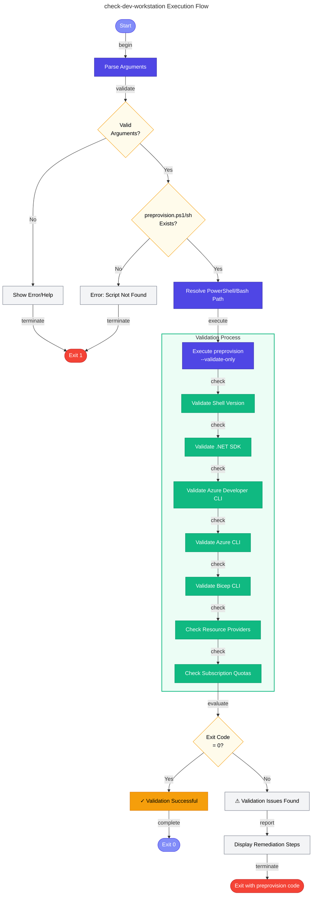

# 🖥️ check-dev-workstation

> [!NOTE]
> **Target Audience**: Developers, DevOps Engineers  
> **Reading Time**: ~8 minutes

<details>
<summary>📖 Navigation</summary>

| Previous | Index | Next |
|:---------|:-----:|-----:|
| [README](README.md) | [📚 Index](README.md) | [preprovision](preprovision.md) |

</details>

Validates developer workstation prerequisites for Azure Logic Apps Monitoring solution.

## 📑 Table of Contents

- [📋 Overview](#-overview)
- [⚙️ Prerequisites](#️-prerequisites)
- [🎯 Parameters](#-parameters)
- [🌐 Environment Variables](#-environment-variables)
- [⚙️ Functionality](#️-functionality)
- [📖 Usage Examples](#-usage-examples)
- [💻 Platform Differences](#-platform-differences)
- [🚪 Exit Codes](#-exit-codes)
- [🔗 Related Hooks](#-related-hooks)

## 📋 Overview

This script performs comprehensive validation of the development environment to ensure all required tools, software dependencies, and Azure configurations are properly set up before beginning development work on the Azure Logic Apps Monitoring solution.

The script acts as a **wrapper** around `preprovision.ps1`/`preprovision.sh` in `ValidateOnly` mode, providing a developer-friendly way to check workstation readiness **without performing any modifications** to the environment.

### 📅 When to Use

- Before starting development on the project
- After setting up a new development environment
- When troubleshooting environment-related issues
- As part of onboarding new team members

## ⚙️ Prerequisites

### 🔧 Required Tools

| Tool | Minimum Version | Purpose |
|:-----|:---------------:|:--------|
| PowerShell Core | 7.0+ | Script execution (PowerShell version) |
| Bash | 4.0+ | Script execution (Bash version) |
| .NET SDK | 10.0+ | Application development |
| Azure Developer CLI (azd) | Latest | Deployment orchestration |
| Azure CLI (az) | 2.60.0+ | Azure resource management |
| Bicep CLI | 0.30.0+ | Infrastructure as Code |

### 📂 Required Files

- `preprovision.ps1` / `preprovision.sh` must exist in the same directory

### 🔐 Required Permissions

- Execute permissions on the hook scripts
- Azure CLI must be authenticated (`az login`)

## 🎯 Parameters

### PowerShell Parameters

| Parameter | Type | Required | Default | Description |
|:----------|:----:|:--------:|:-------:|:------------|
| `-Verbose` | Switch | No | `$false` | Displays detailed diagnostic information during validation |

### Bash Parameters

| Parameter | Type | Required | Default | Description |
|:----------|:----:|:--------:|:-------:|:------------|
| `-v`, `--verbose` | Flag | No | `false` | Display detailed diagnostic information during validation |
| `-h`, `--help` | Flag | No | N/A | Display help message and exit |

## 🌐 Environment Variables

### Variables Read

This script does not directly read environment variables. The underlying `preprovision` script validates:

| Variable | Description |
|:---------|:------------|
| Various Azure CLI authentication state | Checked during Azure CLI validation |

### Variables Set

This script does not set any environment variables.

## ⚙️ Functionality

### 🔄 Execution Flow



### ✅ Validations Performed

The script delegates to `preprovision` which performs:

1. **PowerShell/Bash Version** - Verifies minimum version requirements
2. **.NET SDK Version** - Confirms .NET SDK 10.0+ is installed
3. **Azure Developer CLI** - Validates `azd` is available
4. **Azure CLI** - Checks `az` version 2.60.0+ and authentication status
5. **Bicep CLI** - Verifies Bicep version 0.30.0+
6. **Azure Resource Providers** - Checks required providers are registered
7. **Azure Subscription Quotas** - Informational check on resource quotas

### ⚠️ Error Handling

- **Strict Mode**: Both scripts enable strict mode for robust error handling
- **Exit Code Propagation**: Exit codes from `preprovision` are preserved and returned
- **Cleanup**: Resources are cleaned up via `try-finally` (PowerShell) or `trap EXIT` (Bash)

## 📖 Usage Examples

### PowerShell

```powershell
# Standard validation
.\check-dev-workstation.ps1

# Validation with detailed diagnostic output
.\check-dev-workstation.ps1 -Verbose
```

### Bash

```bash
# Standard validation
./check-dev-workstation.sh

# Validation with detailed diagnostic output
./check-dev-workstation.sh --verbose

# Display help
./check-dev-workstation.sh --help
```

### 📝 Sample Output

```
ℹ Starting developer workstation validation...
═══════════════════════════════════════════════════════════════
  Azure Logic Apps Monitoring - Prerequisites Validation
═══════════════════════════════════════════════════════════════

✓ PowerShell version 7.4.0 is compatible
✓ .NET SDK version 10.0.100 is compatible
✓ Azure Developer CLI is available
✓ Azure CLI version 2.65.0 is compatible
✓ Logged in to Azure as user@example.com
✓ Bicep CLI version 0.30.3 is compatible
✓ All required Resource Providers are registered

═══════════════════════════════════════════════════════════════
  Validation Summary
═══════════════════════════════════════════════════════════════
✓ All prerequisites validated successfully
```

## 💻 Platform Differences

| Aspect | PowerShell | Bash |
|:-------|:-----------|:-----|
| Shebang | `#!/usr/bin/env pwsh` | `#!/usr/bin/env bash` |
| Verbose flag | `-Verbose` (switch) | `-v` or `--verbose` (flag) |
| Help flag | N/A (use `Get-Help`) | `-h` or `--help` |
| Error handling | `try-catch-finally` | `trap EXIT`, `set -euo pipefail` |
| Child process | `& $pwshPath @args` | Direct script execution |
| Exit code capture | `$LASTEXITCODE` | `$?` |

### Implementation Notes

- **PowerShell**: Runs `preprovision.ps1` in a child `pwsh` process to isolate exit behavior
- **Bash**: Captures output and exit code separately for cleaner handling

## 🚪 Exit Codes

| Code | Meaning |
|:----:|:--------|
| `0` | Validation successful - all prerequisites met |
| `1` | General error - missing script or invalid arguments |
| `>1` | Validation failed - see `preprovision` exit codes for specifics |
| `130` | Script interrupted by user (SIGINT) |

## 🔗 Related Hooks

| Hook | Relationship |
|:-----|:-------------|
| [preprovision](preprovision.md) | **Parent script** - This script wraps `preprovision` in validate-only mode |
| [postprovision](postprovision.md) | Runs after provisioning; `check-dev-workstation` validates prerequisites for it |

## 🔧 Troubleshooting

### ⚠️ Common Issues

1. **"Required script not found"**
   - Ensure `preprovision.ps1`/`preprovision.sh` exists in the same directory as this script

2. **"Unable to locate 'pwsh' executable"**
   - Install PowerShell Core 7.0+
   - Ensure `pwsh` is in your PATH

3. **Validation failures**
   - Review the specific error messages from `preprovision`
   - Install missing tools or update to required versions
   - Run `az login` if Azure CLI authentication is required

---

<div align="center">

**[← README](README.md)** · **[⬆️ Back to Top](#-check-dev-workstation)** · **[preprovision →](preprovision.md)**

</div>

**Version**: 1.0.0  
**Author**: Evilazaro | Principal Cloud Solution Architect | Microsoft  
**Last Modified**: January 2026
