# 📋 check-dev-workstation Hook

Developer workstation prerequisite validation wrapper that checks if all required tools and configurations are properly set up for development.

---

## 📖 Overview

| Property | Value |
|----------|-------|
| **Hook Name** | check-dev-workstation |
| **Version** | 1.0.0 |
| **Execution Phase** | Manual execution |
| **Author** | Evilazaro \| Principal Cloud Solution Architect \| Microsoft |

The `check-dev-workstation` hook is a developer-friendly wrapper around the `preprovision` script that runs in validation-only mode. It provides a quick way to verify workstation readiness without making any changes to the environment.

---

## ⚙️ Prerequisites

### Required Tools

| Tool | Minimum Version | Purpose |
|------|-----------------|---------|
| PowerShell | 7.0+ | Script execution (Windows/cross-platform) |
| Bash | 4.0+ | Script execution (Linux/macOS) |

### Required Files

| File | Location | Purpose |
|------|----------|---------|
| `preprovision.ps1` | Same directory | Underlying validation script (PowerShell) |
| `preprovision.sh` | Same directory | Underlying validation script (Bash) |

---

## 🔧 Parameters/Arguments

### PowerShell Parameters

| Parameter | Type | Required | Default | Description |
|-----------|------|----------|---------|-------------|
| `-Verbose` | Switch | No | `$false` | Display detailed diagnostic information |

### Bash Arguments

| Argument | Required | Default | Description |
|----------|----------|---------|-------------|
| `-v`, `--verbose` | No | `false` | Display detailed diagnostic information |
| `-h`, `--help` | No | - | Display help message |

---

## 🌍 Environment Variables

### Variables Read

This hook inherits all environment variable requirements from the `preprovision` script:

| Variable | Description | Required |
|----------|-------------|----------|
| `AZURE_SUBSCRIPTION_ID` | Azure subscription GUID | For quota checks |
| `AZURE_LOCATION` | Target Azure region | For quota checks |

### Variables Set

This hook does not set environment variables.

---

## 📝 Functionality

The check-dev-workstation script performs these operations:

1. **Script Location Validation**
   - Verifies `preprovision` script exists in the same directory
   - Exits with error if dependency is missing

2. **PowerShell/Bash Executable Resolution**
   - Locates the shell executable for child process execution
   - Uses `Get-Command`, `$PSHOME`, or standard path resolution

3. **Child Process Execution**
   - Executes `preprovision` script with `-ValidateOnly` flag
   - Streams output directly to console
   - Captures exit code for result determination

4. **Result Reporting**
   - Reports success if all validations pass
   - Provides guidance for addressing failures

### Validations Performed (via preprovision)

- PowerShell/Bash version compatibility
- .NET SDK 10.0+ installation
- Azure Developer CLI (azd) availability
- Azure CLI 2.60.0+ with authentication
- Bicep CLI 0.30.0+ installation
- Azure Resource Provider registrations
- Azure subscription quota requirements

---

## 🔄 Execution Flow

```mermaid
---
title: check-dev-workstation Execution Flow
---
flowchart TD
    %% ===== CLASS DEFINITIONS =====
    classDef primary fill:#4F46E5,stroke:#3730A3,color:#FFFFFF
    classDef secondary fill:#10B981,stroke:#059669,color:#FFFFFF
    classDef datastore fill:#F59E0B,stroke:#D97706,color:#000000
    classDef external fill:#6B7280,stroke:#4B5563,color:#FFFFFF,stroke-dasharray:5 5
    classDef failed fill:#F44336,stroke:#C62828,color:#FFFFFF
    classDef trigger fill:#818CF8,stroke:#4F46E5,color:#FFFFFF
    classDef decision fill:#FFFBEB,stroke:#F59E0B,color:#000000
    classDef input fill:#F3F4F6,stroke:#6B7280,color:#000000

    A([Start check-dev-workstation]) -->|begin| B[Parse Arguments]
    B -->|setup| C[Set Strict Mode]

    %% ===== DEPENDENCY CHECK =====
    subgraph DependencyCheck["Dependency Validation"]
        direction TB
        C -->|locate| D[Resolve Script Directory]
        D -->|check| E{preprovision Script<br/>Exists?}
        E -->|No| F[Display Missing Script Error]
        F -->|guidance| G[Show Troubleshooting Steps]
        G -->|exit| H([Exit 1])
        E -->|Yes| I[Script Found ✓]
    end

    %% ===== SHELL RESOLUTION =====
    subgraph ShellResolution["Shell Executable Resolution"]
        direction TB
        I -->|resolve| J{PowerShell?}
        J -->|Yes| K[Find pwsh via Get-Command]
        K -->|fallback| L[Check PSHOME Directory]
        J -->|No| M[Use Current Bash Shell]
        L -->|result| N{pwsh<br/>Found?}
        N -->|No| O[Display Shell Error]
        O -->|exit| H
        N -->|Yes| P[Shell Resolved ✓]
        M -->|success| P
    end

    %% ===== CHILD PROCESS =====
    subgraph ChildProcess["Child Process Execution"]
        direction TB
        P -->|build| Q[Build Arguments Array]
        Q -->|add| R[Add -ValidateOnly Flag]
        R -->|add| S[Add Verbosity Settings]
        S -->|execute| T[[preprovision Script]]
        T -->|stream| U[Output to Console]
        U -->|capture| V[Capture Exit Code]
    end

    %% ===== RESULT HANDLING =====
    subgraph ResultHandling["Result Evaluation"]
        direction TB
        V -->|evaluate| W{Exit Code<br/>= 0?}
        W -->|Yes| X[Display Success Message]
        X -->|guidance| Y[Environment Ready]
        Y -->|exit| Z([Exit 0])
        W -->|No| AA[Display Warning Message]
        AA -->|guidance| AB[Address Issues Above]
        AB -->|exit| AC([Exit with Original Code])
    end

    %% ===== CLEANUP =====
    subgraph Cleanup["Finally Block"]
        direction TB
        Z -->|restore| AD[Restore Preferences]
        AC -->|restore| AD
        H -->|restore| AD
        AD -->|log| AE[Log Completion]
    end

    %% ===== SUBGRAPH STYLES =====
    style DependencyCheck fill:#EEF2FF,stroke:#4F46E5,stroke-width:2px
    style ShellResolution fill:#ECFDF5,stroke:#10B981,stroke-width:2px
    style ChildProcess fill:#FEF3C7,stroke:#F59E0B,stroke-width:2px
    style ResultHandling fill:#F3F4F6,stroke:#6B7280,stroke-width:2px
    style Cleanup fill:#E0E7FF,stroke:#4F46E5,stroke-width:2px

    %% ===== NODE CLASS ASSIGNMENTS =====
    class A,Z trigger
    class B,C,D,K,L,M,Q,R,S,U,V,X,Y,AA,AB,AD,AE primary
    class I,P secondary
    class E,J,N,W decision
    class F,G,O input
    class H,AC failed
    class T external
```



---

## 💻 Usage Examples

### PowerShell

```powershell
# Standard validation
.\hooks\check-dev-workstation.ps1

# Verbose output for troubleshooting
.\hooks\check-dev-workstation.ps1 -Verbose
```

### Bash

```bash
# Standard validation
./hooks/check-dev-workstation.sh

# Verbose output for troubleshooting
./hooks/check-dev-workstation.sh --verbose

# Display help
./hooks/check-dev-workstation.sh --help
```

---

## 🔀 Platform Differences

| Feature | PowerShell | Bash |
|---------|------------|------|
| Child process | `& $pwshPath @args` | Direct script execution |
| Exit code capture | `$LASTEXITCODE` | `$?` |
| Executable resolution | `Get-Command` + `$PSHOME` | `command -v` |
| Argument passing | Splatting `@preprovisionArgs` | Direct arguments |

---

## 🚪 Exit Codes

| Code | Description |
|------|-------------|
| `0` | Success - All validations passed |
| `1` | General error - Missing dependencies or validation failure |
| `>1` | Validation failed - See preprovision exit codes |
| `130` | Script interrupted by user (Ctrl+C) |

---

## 🔗 Related Hooks

- [preprovision](preprovision.md) - The underlying validation script
- [clean-secrets](clean-secrets.md) - Secrets cleanup (not executed in validate-only mode)

---

## 📋 Typical Output

### Successful Validation

```
═══════════════════════════════════════════════════════════
  Pre-provisioning Validation v2.3.0
═══════════════════════════════════════════════════════════

[1/7] Validating PowerShell version...
  ✓ PowerShell 7.4.0 is compatible

[2/7] Validating .NET SDK...
  ✓ .NET SDK 10.0.100 is compatible

[3/7] Validating Azure Developer CLI...
  ✓ azd version 1.5.0

[4/7] Validating Azure CLI...
  ✓ Azure CLI 2.60.0 is compatible
  ✓ Authenticated as: user@example.com

[5/7] Validating Bicep CLI...
  ✓ Bicep CLI 0.30.0 is compatible

[6/7] Checking Resource Providers...
  ✓ All required providers registered

[7/7] Checking Subscription Quotas...
  ✓ Sufficient quotas available

═══════════════════════════════════════════════════════════
  ✓ Workstation validation completed successfully
  Your development environment is properly configured
═══════════════════════════════════════════════════════════
```

### Failed Validation

```
═══════════════════════════════════════════════════════════
  Pre-provisioning Validation v2.3.0
═══════════════════════════════════════════════════════════

[1/7] Validating PowerShell version...
  ✓ PowerShell 7.4.0 is compatible

[2/7] Validating .NET SDK...
  ✗ .NET SDK not found
    Install from: https://dotnet.microsoft.com/download/dotnet/10.0

═══════════════════════════════════════════════════════════
  ⚠ Workstation validation completed with issues
  Please address the warnings/errors above before proceeding
═══════════════════════════════════════════════════════════
```

---

**Last Modified:** 2026-01-26
