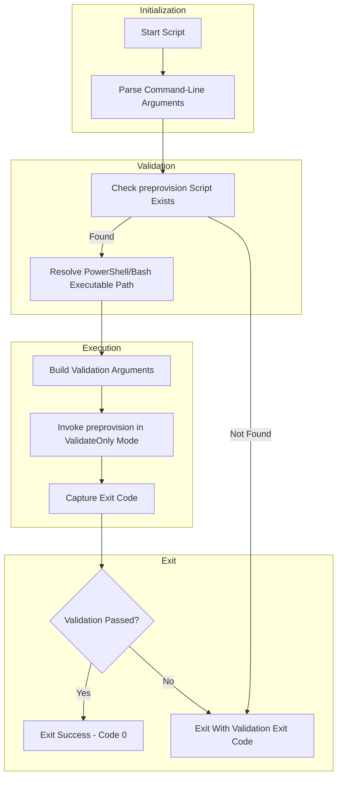

# Validate Developer Workstation Prerequisites

## Overview

This script validates that a developer workstation has all required tools, software dependencies, and Azure configurations properly set up for the Azure Logic Apps Monitoring solution. It acts as a wrapper around `preprovision.ps1`/`preprovision.sh` in validation-only mode, providing a developer-friendly way to check workstation readiness without performing any modifications to the environment.

The script is implemented in **both PowerShell and Bash** to support cross-platform development environments.

## Script Classification

| Attribute | Value |
|-----------|-------|
| **Category** | Environment Validation Utility |
| **Trigger Mechanism** | Manual execution |
| **azd Hook** | No |

## Supported Environments

### Shells

| Shell | Minimum Version |
|-------|-----------------|
| PowerShell | 7.0+ |
| Bash | 4.0+ |

### Operating Systems

| OS | Supported |
|----|-----------|
| Windows | ✓ |
| Linux | ✓ |
| macOS | ✓ |

## Prerequisites

| Prerequisite | Required | Description |
|--------------|----------|-------------|
| PowerShell 7.0+ | Yes (for .ps1) | PowerShell Core for cross-platform execution |
| Bash 4.0+ | Yes (for .sh) | Required for associative arrays and modern features |
| `preprovision.ps1` / `preprovision.sh` | Yes | Must exist in the same directory as this script |

## Files

| File | Description |
|------|-------------|
| `check-dev-workstation.ps1` | PowerShell implementation |
| `check-dev-workstation.sh` | Bash implementation |
| `preprovision.ps1` / `preprovision.sh` | Underlying validation script (invoked automatically) |

## High-Level Script Flow



## Usage

### PowerShell

```powershell
# Standard validation
./check-dev-workstation.ps1

# Validation with detailed diagnostic output
./check-dev-workstation.ps1 -Verbose
```

### Bash

```bash
# Standard validation
./check-dev-workstation.sh

# Validation with detailed diagnostic output
./check-dev-workstation.sh --verbose

# Display help message
./check-dev-workstation.sh --help
```

## Parameters

| Logical Parameter | PowerShell Name | Bash Name | Required | Description |
|-------------------|-----------------|-----------|----------|-------------|
| Verbose Mode | `-Verbose` | `-v`, `--verbose` | No | Displays detailed diagnostic information during validation |
| Help | N/A | `-h`, `--help` | No | Displays help message and exits |

## Examples

### Standard Workstation Validation

**PowerShell:**

```powershell
./check-dev-workstation.ps1
```

**Bash:**

```bash
./check-dev-workstation.sh
```

### Validation with Verbose Output

**PowerShell:**

```powershell
./check-dev-workstation.ps1 -Verbose
```

**Bash:**

```bash
./check-dev-workstation.sh --verbose
```

## Error Handling & Exit Codes

| Exit Code | Description |
|-----------|-------------|
| 0 | All validations passed successfully |
| 1 | Script execution error (e.g., missing `preprovision.ps1`/`preprovision.sh`) |
| 130 | Script interrupted by user (SIGINT) - Bash only |
| Other | Exit code from preprovision script indicating specific validation failures |

### Error Behavior

- **PowerShell**: Uses `try/catch` with `$ErrorActionPreference = 'Stop'`. Throws terminating errors for critical failures.
- **Bash**: Uses `set -euo pipefail` for strict error handling. Registers signal handlers for graceful interruption handling.

## Logging & Output

| Output Type | Description |
|-------------|-------------|
| stdout | Validation results and status messages |
| stderr | Error messages and verbose diagnostic output (Bash) |
| Verbose stream | Detailed diagnostic information when `-Verbose` is enabled (PowerShell) |

### Output Format

- Validation results are streamed in real-time from the underlying preprovision script
- PowerShell uses `Write-Verbose`, `Write-Information`, and `Write-Warning` for structured output
- Bash uses color-coded prefixes (`[VERBOSE]`, `ERROR:`) for visual distinction

## Security Considerations

- The script does not modify any system configuration
- No credentials or secrets are handled directly
- Spawns a child process to execute preprovision, isolating exit behavior
- On Windows, adds `-ExecutionPolicy Bypass` for script execution in child process

## Troubleshooting

| Issue | Resolution |
|-------|------------|
| `Required script not found: preprovision.ps1` | Ensure `preprovision.ps1` exists in the same directory as `check-dev-workstation.ps1` |
| `Unable to locate 'pwsh' executable` | Verify PowerShell Core 7.0+ is properly installed and in PATH |
| Script exits immediately without output | Run with `-Verbose` (PowerShell) or `--verbose` (Bash) for diagnostic details |
| Permission denied errors | Ensure execute permissions on both the wrapper and preprovision scripts |

## Development Notes

- The script version is `1.0.0` for both implementations
- PowerShell implementation uses `CmdletBinding()` for advanced parameter handling
- Bash implementation uses POSIX-compatible constructs where possible for broader compatibility
- Both implementations maintain functional parity in validation behavior

## License & Ownership

| Attribute | Value |
|-----------|-------|
| Author | Evilazaro \| Principal Cloud Solution Architect \| Microsoft |
| Version | 1.0.0 |
| Last Modified | 2026-01-07 |
| Repository | [Azure-LogicApps-Monitoring](https://github.com/Evilazaro/Azure-LogicApps-Monitoring) |
