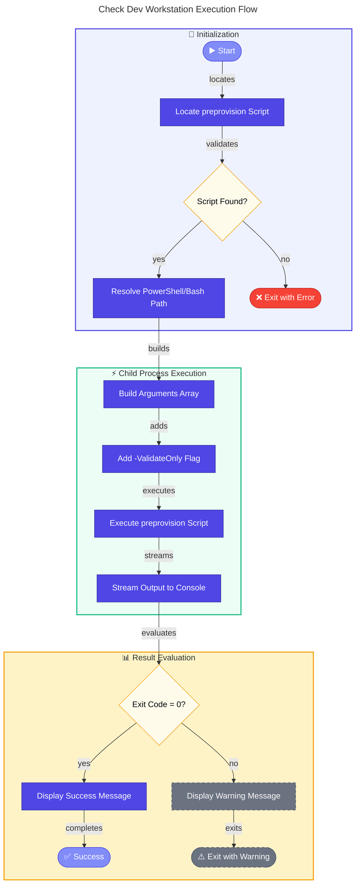

# 💻 check-dev-workstation

> [!NOTE]
> **Target Audience:** Developers, New Team Members, CI/CD Engineers  
> **Estimated Reading Time:** 6 minutes

<details>
<summary>📍 <strong>Navigation</strong></summary>
<br>

| Previous | Index | Next |
|:---------|:-----:|-----:|
| [sql-managed-identity-config](sql-managed-identity-config.md) | [📑 Index](README.md) | [clean-secrets](clean-secrets.md) |

</details>

---

## 📑 Table of Contents

- [📋 Overview](#-overview)
- [📝 Description](#-description)
- [📊 Workflow Diagram](#-workflow-diagram)
- [✅ Prerequisites](#-prerequisites)
- [⚙️ Parameters/Arguments](#️-parametersarguments)
- [📥 Input/Output Specifications](#-inputoutput-specifications)
- [💻 Usage Examples](#-usage-examples)
- [⚠️ Error Handling and Exit Codes](#️-error-handling-and-exit-codes)
- [🔒 Security Considerations](#-security-considerations)
- [🚧 Known Limitations](#-known-limitations)
- [🔗 Related Scripts](#-related-scripts)
- [📜 Changelog](#-changelog)

---

## 📋 Overview

Developer-friendly validation wrapper script that checks workstation prerequisites for the Azure Logic Apps Monitoring solution without making any changes to the environment.

[⬆️ Back to top](#-check-dev-workstation)

---

## 📝 Description

This script provides a convenient way for developers to validate their workstation setup before beginning development work on the Azure Logic Apps Monitoring solution. It acts as a wrapper around the `preprovision` script, executing it in validation-only mode to check all prerequisites without performing any modifications.

The script performs comprehensive validation including checking PowerShell/Bash version compatibility, .NET SDK availability and version, Azure Developer CLI (azd) installation, Azure CLI installation and authentication status, Bicep CLI availability, Azure Resource Provider registrations, and Azure subscription quota requirements.

Unlike the preprovision script which can clear secrets and modify the environment, this wrapper is completely read-only and safe to run at any time. It provides clear, actionable feedback on any issues found, helping developers quickly identify and resolve configuration problems before they impact development work.

[⬆️ Back to top](#-check-dev-workstation)

---

## 📊 Workflow Diagram



[⬆️ Back to top](#-check-dev-workstation)

---

## ✅ Prerequisites

| Category | Requirement | Version | Verification Command | Required |
|:---------|:------------|:--------|:---------------------|:--------:|
| Runtime | PowerShell Core | >= 7.0 | `$PSVersionTable.PSVersion` | ✅ |
| Runtime | Bash | >= 4.0 | `bash --version` | ✅ |
| Script | preprovision.ps1 / preprovision.sh | N/A | Must exist in same directory | ✅ |

> [!NOTE]
> All other prerequisites are validated by this script, not required to run it.

[⬆️ Back to top](#-check-dev-workstation)

---

## ⚙️ Parameters/Arguments

### PowerShell Parameters

| Parameter | Type | Required | Default | Description |
|:----------|:-----|:--------:|:--------|:------------|
| `-Verbose` | `[switch]` | ❌ | `$false` | Displays detailed diagnostic information during validation |

### Bash Arguments

| Position/Flag | Type | Required | Default | Description |
|:--------------|:-----|:--------:|:--------|:------------|
| `-v`, `--verbose` | flag | ❌ | `false` | Display detailed diagnostic information during validation |
| `-h`, `--help` | flag | ❌ | N/A | Display help message and exit |

[⬆️ Back to top](#-check-dev-workstation)

---

## 📥 Input/Output Specifications

### Inputs

**Environment Variables Read:**

> [!NOTE]
> None — all validation is performed by preprovision script.

**Files/Paths Expected:**

- `preprovision.ps1` (PowerShell) or `preprovision.sh` (Bash) — Must exist in the same directory

### Outputs

**Exit Codes:**

| Exit Code | Meaning |
|:---------:|:--------|
| `0` | Validation successful — All prerequisites met |
| `1` | General error — Missing script or invalid execution |
| `>1` | Validation failed — See preprovision exit codes for details |
| `130` | Script interrupted by user (Ctrl+C) |

**stdout Output:**

- Formatted validation results from preprovision script
- Success or warning summary message
- Troubleshooting steps on error

[⬆️ Back to top](#-check-dev-workstation)

---

## 💻 Usage Examples

### Basic Usage

```powershell
# PowerShell: Check workstation prerequisites
.\check-dev-workstation.ps1
```

```bash
# Bash: Check workstation prerequisites
./check-dev-workstation.sh
```

### Advanced Usage

```powershell
# PowerShell: Verbose validation with detailed output
.\check-dev-workstation.ps1 -Verbose
```

```bash
# Bash: Verbose validation with detailed output
./check-dev-workstation.sh --verbose

# Bash: Display help
./check-dev-workstation.sh --help
```

### CI/CD Pipeline Usage

```yaml
# Azure DevOps Pipeline - Validation gate
- task: PowerShell@2
  displayName: 'Validate build agent prerequisites'
  inputs:
    targetType: 'filePath'
    filePath: '$(System.DefaultWorkingDirectory)/hooks/check-dev-workstation.ps1'
    pwsh: true
  continueOnError: false

# GitHub Actions
- name: Validate runner prerequisites
  shell: bash
  run: |
    chmod +x ./hooks/check-dev-workstation.sh
    ./hooks/check-dev-workstation.sh --verbose
```

[⬆️ Back to top](#-check-dev-workstation)

---

## ⚠️ Error Handling and Exit Codes

| Exit Code | Meaning | Recovery Action |
|:---------:|:--------|:----------------|
| `0` | Success — All prerequisites met | N/A |
| `1` | General error | Check if preprovision script exists |
| `2+` | Validation failure | Address specific issues from preprovision output |
| `130` | User interrupted | Re-run script when ready |

### Error Handling Approach

**PowerShell:**

- Try/Catch/Finally for structured error handling
- Child process execution isolates failures
- Original preferences restored in finally block
- Detailed troubleshooting steps provided on error

**Bash:**

- `set -euo pipefail` for strict error handling
- Trap handlers for EXIT, INT, and TERM signals
- Graceful interrupt handling (Ctrl+C)
- Color-coded error messages

[⬆️ Back to top](#-check-dev-workstation)

---

## 🔒 Security Considerations

### 🔑 Credential Handling

- [x] No credentials handled directly
- [x] Read-only operation - no modifications to environment
- [x] Delegates authentication checks to preprovision script

### Required Permissions

| Permission/Role | Scope | Justification |
|:----------------|:------|:--------------|
| None | Local | Only reads local configuration |
| Reader | Azure (via preprovision) | Validates Azure access |

### 🌐 Network Security

| Property | Value |
|:---------|:------|
| **Endpoints accessed** | None directly (preprovision handles Azure calls) |
| **TLS requirements** | N/A |
| **Firewall rules needed** | N/A |

### 📝 Logging Security

> [!TIP]
> **Security Features:**
>
> - **Sensitive data masking:** Yes — preprovision handles masking
> - **Audit trail:** Standard console output

[⬆️ Back to top](#-check-dev-workstation)

---

## 🚧 Known Limitations

> [!WARNING]
> **Important Notes:**
>
> - Requires preprovision script in the same directory
> - Cannot fix issues — only reports them
> - PowerShell version must execute child processes correctly
> - Some validation requires Azure CLI authentication
> - Windows may require execution policy bypass

[⬆️ Back to top](#-check-dev-workstation)

---

## 🔗 Related Scripts

| Script | Relationship | Description |
|:-------|:-------------|:------------|
| [preprovision.md](preprovision.md) | Called by | Underlying validation logic |
| [postprovision.md](postprovision.md) | Related | Post-provisioning configuration |
| [clean-secrets.md](clean-secrets.md) | Related | Secrets management utility |

[⬆️ Back to top](#-check-dev-workstation)

---

## 📜 Changelog

| Version | Date | Changes |
|:-------:|:----:|:--------|
| 1.0.0 | 2026-01-07 | Initial release |

[⬆️ Back to top](#-check-dev-workstation)

---

<div align="center">

**[⬅️ Previous: sql-managed-identity-config](sql-managed-identity-config.md)** · **[📑 Index](README.md)** · **[Next: clean-secrets ➡️](clean-secrets.md)**

</div>
