# 🔍 check-dev-workstation

> Validates developer workstation prerequisites for Azure Logic Apps Monitoring solution.

> [!NOTE]
> **Target Audience:** Developers and New Team Members  
> **Reading Time:** ~5 minutes

<details>
<summary>📍 Navigation</summary>

| Previous                                |         Index          |                                Next |
| :-------------------------------------- | :--------------------: | ----------------------------------: |
| [postinfradelete](./postinfradelete.md) | [🪝 Hooks](./index.md) | [clean-secrets](./clean-secrets.md) |

</details>

---

## 📋 Overview

This script performs comprehensive validation of the development environment to ensure all required tools, software dependencies, and Azure configurations are properly set up before beginning development work on the Azure Logic Apps Monitoring solution.

The script acts as a wrapper around `preprovision` in ValidateOnly mode, providing a developer-friendly way to check workstation readiness without performing any modifications to the environment.

### Validations Performed

- PowerShell version (7.0+) / Bash version (4.0+)
- .NET SDK version (10.0+)
- Azure Developer CLI (azd)
- Azure CLI (2.60.0+) with active authentication
- Bicep CLI (0.30.0+)
- Azure Resource Provider registrations
- Azure subscription quota requirements

---

## 📑 Table of Contents

- [📌 Script Metadata](#-script-metadata)
- [🔧 Prerequisites](#-prerequisites)
- [📥 Parameters](#-parameters)
- [🔄 Execution Flow](#-execution-flow)
- [📝 Usage Examples](#-usage-examples)
- [⚠️ Exit Codes](#%EF%B8%8F-exit-codes)
- [🛠️ Troubleshooting](#%EF%B8%8F-troubleshooting)
- [📚 Related Scripts](#-related-scripts)
- [📜 Version History](#-version-history)

[⬅️ Back to Index](./index.md)

> [!TIP]
> Run this script when onboarding to the project or after system updates to ensure your environment is properly configured.

---

## 📌 Script Metadata

| Property          | PowerShell                                                   | Bash                                                         |
| ----------------- | ------------------------------------------------------------ | ------------------------------------------------------------ |
| **File Name**     | `check-dev-workstation.ps1`                                  | `check-dev-workstation.sh`                                   |
| **Version**       | 1.0.0                                                        | 1.0.0                                                        |
| **Last Modified** | 2026-01-07                                                   | 2026-01-07                                                   |
| **Author**        | Evilazaro \| Principal Cloud Solution Architect \| Microsoft | Evilazaro \| Principal Cloud Solution Architect \| Microsoft |

---

## 🔧 Prerequisites

| Requirement                            | Minimum Version | Notes                         |
| -------------------------------------- | --------------- | ----------------------------- |
| PowerShell Core                        | 7.0             | Required for `.ps1` script    |
| Bash                                   | 4.0             | Required for `.sh` script     |
| `preprovision.ps1` / `preprovision.sh` | N/A             | Must be in the same directory |

---

## 📥 Parameters

### PowerShell (`check-dev-workstation.ps1`)

| Parameter  | Type   | Required | Default  | Description                                                |
| ---------- | ------ | -------- | -------- | ---------------------------------------------------------- |
| `-Verbose` | Switch | No       | `$false` | Displays detailed diagnostic information during validation |

### Bash (`check-dev-workstation.sh`)

| Parameter         | Type | Required | Default | Description                                               |
| ----------------- | ---- | -------- | ------- | --------------------------------------------------------- |
| `-v`, `--verbose` | Flag | No       | `false` | Display detailed diagnostic information during validation |
| `-h`, `--help`    | Flag | No       | N/A     | Display help message and exit                             |

---

## 🔄 Execution Flow

```mermaid
flowchart TD
    A[🚀 Start check-dev-workstation] --> B{preprovision script exists?}
    B -->|No| Z[❌ Exit with Error]
    B -->|Yes| C[Resolve PowerShell/Bash Path]

    C --> D[Build Execution Arguments]
    D --> E[Execute preprovision --validate-only]

    E --> F{Validation Exit Code}
    F -->|0| G[✅ Workstation Validated Successfully]
    F -->|Non-zero| H[⚠️ Validation Issues Found]

    G --> I[Display Success Message]
    H --> J[Display Warning Message]

    I --> K[Exit 0]
    J --> L[Exit with preprovision exit code]

    K --> M[🏁 End]
    L --> M
```



---

## 📝 Usage Examples

### PowerShell

```powershell
# Standard workstation validation with normal output
.\check-dev-workstation.ps1

# Validation with detailed diagnostic output for troubleshooting
.\check-dev-workstation.ps1 -Verbose
```

### Bash

```bash
# Standard workstation validation with normal output
./check-dev-workstation.sh

# Validation with detailed diagnostic output for troubleshooting
./check-dev-workstation.sh --verbose

# Display help message
./check-dev-workstation.sh --help
```

---

## ⚠️ Exit Codes

| Code  | Meaning                                                     |
| ----- | ----------------------------------------------------------- |
| `0`   | Success - all prerequisites met                             |
| `1`   | General error - missing script or invalid arguments         |
| `>1`  | Validation failed - see preprovision exit codes for details |
| `130` | Script interrupted by user (Ctrl+C)                         |

---

## 🛠️ Troubleshooting

If validation fails, the script provides actionable guidance:

1. Ensure `preprovision.ps1`/`preprovision.sh` is in the same directory as this script
2. Verify PowerShell Core 7.0+ / Bash 4.0+ is properly installed
3. Check that you have execute permissions on the scripts
4. Run with `-Verbose` / `--verbose` flag for detailed diagnostic information

---

## 📚 Related Scripts

| Script                            | Purpose                                                          |
| --------------------------------- | ---------------------------------------------------------------- |
| [preprovision](./preprovision.md) | The underlying validation script (called with `--validate-only`) |

---

## 📜 Version History

| Version | Date       | Changes                                                      |
| ------- | ---------- | ------------------------------------------------------------ |
| 1.0.0   | 2026-01-07 | Initial release - wrapper for preprovision ValidateOnly mode |

---

> [!IMPORTANT]
> This script only validates prerequisites—it does not install missing tools. Use `preprovision` with `-AutoInstall` for automated installation.

## 🔗 Links

- [Repository](https://github.com/Evilazaro/Azure-LogicApps-Monitoring)
- [preprovision.ps1](./preprovision.md) - The underlying validation script

---

<div align="center">

**[⬆️ Back to Top](#-check-dev-workstation)** · **[← postinfradelete](./postinfradelete.md)** · **[clean-secrets →](./clean-secrets.md)**

</div>
