# check-dev-workstation

[Home](../../README.md) > [Docs](..) > [Hooks](README.md) > check-dev-workstation

> 🔍 Validates developer workstation prerequisites for Azure Logic Apps Monitoring solution

---

## Table of Contents

- [Overview](#overview)
- [Compatibility](#compatibility)
- [Prerequisites](#prerequisites)
- [Parameters](#parameters)
- [Script Flow](#script-flow)
- [Functions](#functions)
- [Usage](#usage)
- [Environment Variables](#environment-variables)
- [Exit Codes](#exit-codes)
- [Error Handling](#error-handling)
- [Notes](#notes)
- [See Also](#see-also)

---

## Overview

This script performs comprehensive validation of the development environment to ensure all required tools, software dependencies, and Azure configurations are properly set up before beginning development work on the Azure Logic Apps Monitoring solution.

The script acts as a wrapper around `preprovision.ps1`/`preprovision.sh` in ValidateOnly mode, providing a developer-friendly way to check workstation readiness without performing any modifications to the environment.

**Operations Performed:**

1. Validates script prerequisites (preprovision.ps1/preprovision.sh exists)
2. Executes preprovision script in ValidateOnly mode
3. Validates all required development tools and versions
4. Checks Azure CLI authentication status
5. Reports validation results with actionable guidance

---

## Compatibility

| Platform    | Script                       | Status |
|:------------|:-----------------------------|:------:|
| Windows     | `check-dev-workstation.ps1`  |   ✅   |
| Linux/macOS | `check-dev-workstation.sh`   |   ✅   |

---

## Prerequisites

| Requirement | Details | Installation Guide |
|:------------|:--------|:-------------------|
| **PowerShell** | Version 7.0 or higher | [Install PowerShell](https://docs.microsoft.com/powershell/scripting/install/installing-powershell) |
| **Bash** | Version 4.0 or higher | Pre-installed on Linux/macOS |
| **preprovision script** | Must exist in the same directory | Included in repository |
| **.NET SDK** | Version 10.0 or higher (validated) | [Install .NET](https://dotnet.microsoft.com/download) |
| **Azure Developer CLI** | Latest version (validated) | [Install azd](https://learn.microsoft.com/azure/developer/azure-developer-cli/install-azd) |
| **Azure CLI** | Version 2.60.0 or higher (validated) | [Install Azure CLI](https://docs.microsoft.com/cli/azure/install-azure-cli) |
| **Bicep CLI** | Version 0.30.0 or higher (validated) | [Install Bicep](https://docs.microsoft.com/azure/azure-resource-manager/bicep/install) |

---

## Parameters

### PowerShell

| Parameter | Type | Required | Default | Description |
|:----------|:----:|:--------:|:-------:|:------------|
| `-Verbose` | Switch | No | `$false` | Displays detailed diagnostic information during validation |

### Bash

| Parameter | Type | Required | Default | Description |
|:----------|:----:|:--------:|:-------:|:------------|
| `-v, --verbose` | Flag | No | `false` | Display detailed diagnostic information during validation |
| `-h, --help` | Flag | No | N/A | Display help message and exit |

---

## Script Flow

### Execution Flow

```mermaid
%%{init: {'flowchart': {'nodeSpacing': 30, 'rankSpacing': 40, 'curve': 'basis'}}}%%
flowchart TD
    subgraph INIT["🔧 Initialization"]
        direction TB
        A([▶️ Start]):::startNode
        A --> B[🔧 Set Strict Mode]:::config
        B --> C[📋 Parse Arguments]:::data
    end

    subgraph VALIDATE["✅ Validation Phase"]
        direction TB
        D{🔍 preprovision script exists?}:::validation
        D -->|❌ No| E[❗ Error: Script not found]:::error
        D -->|✅ Yes| F[📋 Resolve pwsh/bash path]:::logging
    end

    subgraph EXECUTE["⚡ Execution Phase"]
        direction TB
        G[⚡ Execute preprovision --validate-only]:::execution
        G --> H[📋 Capture output and exit code]:::logging
        H --> I{🔍 Exit code = 0?}:::validation
    end

    subgraph CLEANUP["🧹 Cleanup Phase"]
        direction TB
        J[📋 Display validation results]:::logging
        K[🧹 Restore preferences]:::cleanup
    end

    subgraph EXIT["🚪 Exit Handling"]
        direction TB
        L([❌ Exit 1]):::errorExit
        M([✅ Exit 0]):::successExit
    end

    %% Cross-subgraph connections
    C --> D
    E --> L
    F --> G
    I -->|❌ Issues found| J
    I -->|✅ All passed| J
    J --> K
    K --> M

    %% Subgraph styles
    style INIT fill:#e8eaf6,stroke:#303f9f,stroke-width:2px,color:#1a237e
    style VALIDATE fill:#fff8e1,stroke:#ffa000,stroke-width:2px,color:#ff6f00
    style EXECUTE fill:#e0f2f1,stroke:#00796b,stroke-width:2px,color:#004d40
    style CLEANUP fill:#ede7f6,stroke:#512da8,stroke-width:2px,color:#311b92
    style EXIT fill:#eceff1,stroke:#455a64,stroke-width:2px,color:#263238

    classDef startNode fill:#b3e5fc,stroke:#0288d1,stroke-width:3px,color:#01579b
    classDef successExit fill:#c8e6c9,stroke:#388e3c,stroke-width:3px,color:#1b5e20
    classDef errorExit fill:#ffcdd2,stroke:#d32f2f,stroke-width:3px,color:#b71c1c
    classDef config fill:#c5cae9,stroke:#3949ab,stroke-width:2px,color:#1a237e
    classDef data fill:#f0f4c3,stroke:#9e9d24,stroke-width:2px,color:#827717
    classDef validation fill:#fff9c4,stroke:#f9a825,stroke-width:2px,color:#f57f17
    classDef execution fill:#b2dfdb,stroke:#00796b,stroke-width:2px,color:#004d40
    classDef error fill:#ffebee,stroke:#e53935,stroke-width:2px,color:#c62828
    classDef cleanup fill:#e1bee7,stroke:#7b1fa2,stroke-width:2px,color:#4a148c
    classDef logging fill:#d7ccc8,stroke:#6d4c41,stroke-width:2px,color:#3e2723
```



---

## Functions

### PowerShell

| Function | Purpose |
|:---------|:--------|
| `Main Execution Block` | Orchestrates validation workflow via child pwsh process |

### Bash

| Function | Purpose |
|:---------|:--------|
| `cleanup` | Performs cleanup on script exit |
| `handle_interrupt` | Handles SIGINT/SIGTERM signals gracefully |
| `log_verbose` | Outputs verbose messages when enabled |
| `log_error` | Outputs error messages to stderr |
| `log_warning` | Outputs warning messages to stderr |
| `show_help` | Displays comprehensive help information |
| `main` | Main execution function orchestrating validation |

---

## Usage

### PowerShell

```powershell
# Standard validation
.\check-dev-workstation.ps1

# Validation with verbose output
.\check-dev-workstation.ps1 -Verbose
```

### Bash

```bash
# Standard validation
./check-dev-workstation.sh

# Validation with verbose output
./check-dev-workstation.sh --verbose

# Display help
./check-dev-workstation.sh --help
```

---

## Environment Variables

| Variable | Description | Required | Default |
|:---------|:------------|:--------:|:-------:|
| N/A | This script does not require environment variables | N/A | N/A |

> ℹ️ **Note**: Environment variables may be required by the underlying `preprovision` script for Azure authentication validation.

---

## Exit Codes

| Code | Meaning |
|-----:|:--------|
| 0 | ✅ All validations passed successfully |
| 1 | ❌ Script execution error (e.g., missing preprovision script) |
| 130 | ❌ Script interrupted by user (SIGINT) |
| >1 | ❌ Validation failed - see preprovision exit codes for details |

---

## Error Handling

The script implements comprehensive error handling:

- **Strict Mode**: PowerShell uses `Set-StrictMode -Version Latest`; Bash uses `set -euo pipefail`
- **Child Process Execution**: Runs preprovision in a child process to capture exit codes reliably
- **Preference Restoration**: Original preferences are restored in finally/cleanup blocks
- **Signal Handling**: Bash version handles SIGINT and SIGTERM gracefully
- **Actionable Guidance**: Provides troubleshooting steps on failure

---

## Notes

| Item | Details |
|:-----|:--------|
| **Script Version** | 1.0.0 |
| **Author** | Evilazaro \| Principal Cloud Solution Architect \| Microsoft |
| **Last Modified** | 2026-01-07 |
| **Purpose** | Development environment validation wrapper |

> ℹ️ **Note**: This script is a wrapper that delegates to `preprovision.ps1`/`preprovision.sh` with the `--validate-only` flag. It does not make any changes to the system.

> 💡 **Tip**: Run this script before starting development to ensure your workstation has all required tools and configurations.

---

## See Also

- [preprovision.md](preprovision.md) — The underlying validation script
- [README.md](README.md) — Hooks documentation overview

---

[← Back to Hooks Documentation](README.md)
