# check-dev-workstation

[Home](../../README.md) > [Docs](..) > [Hooks](README.md) > check-dev-workstation

> ✅ Validates developer workstation prerequisites for the Azure Logic Apps Monitoring solution

---

## Table of Contents

- [Overview](#overview)
- [Compatibility](#compatibility)
- [Prerequisites](#prerequisites)
- [Parameters](#parameters)
- [Script Flow](#script-flow)
- [Functions](#functions)
- [Usage](#usage)
- [Environment Variables](#environment-variables)
- [Exit Codes](#exit-codes)
- [Error Handling](#error-handling)
- [Notes](#notes)
- [See Also](#see-also)

---

## Overview

This script performs comprehensive validation of the development environment to ensure all required tools, software dependencies, and Azure configurations are properly set up before beginning development work on the Azure Logic Apps Monitoring solution.

The script acts as a wrapper around `preprovision.ps1`/`preprovision.sh` in ValidateOnly mode, providing a developer-friendly way to check workstation readiness without performing any modifications to the environment.

**Operations Performed:**

1. Validates PowerShell/Bash version compatibility
2. Validates .NET SDK version (10.0+)
3. Validates Azure Developer CLI (azd) availability
4. Validates Azure CLI (2.60.0+) with active authentication
5. Validates Bicep CLI (0.30.0+)
6. Checks Azure Resource Provider registrations
7. Reports validation results with actionable guidance

---

## Compatibility

| Platform    | Script                     | Status |
|:------------|:---------------------------|:------:|
| Windows     | `check-dev-workstation.ps1` |   ✅   |
| Linux/macOS | `check-dev-workstation.sh`  |   ✅   |

---

## Prerequisites

| Requirement | Details | Installation Guide |
|:------------|:--------|:-------------------|
| **PowerShell** | 7.0 or higher | [Install PowerShell](https://docs.microsoft.com/powershell/scripting/install/installing-powershell) |
| **Bash** | 4.0 or higher | Pre-installed on Linux/macOS |
| **preprovision script** | Must exist in same directory | Included in repository |

---

## Parameters

| Parameter | Type | Required | Default | Description |
|:----------|:----:|:--------:|:-------:|:------------|
| `-Verbose` / `--verbose` | Switch | No | `false` | Displays detailed diagnostic information |
| `--help` / `-h` | Switch | No | N/A | Displays help message (Bash only) |

---

## Script Flow

### Execution Flow

```mermaid
%%{init: {'flowchart': {'nodeSpacing': 30, 'rankSpacing': 40, 'curve': 'basis'}}}%%
flowchart TD
    subgraph INIT["🔧 Initialization"]
        direction TB
        A([▶️ Start]):::startNode
        A --> B[🔧 Parse Arguments]:::config
        B --> C{🔍 preprovision Exists?}:::validation
        C -->|❌ No| D[❗ Script Not Found]:::error
        C -->|✅ Yes| E[📋 Log Script Info]:::logging
    end

    subgraph VALIDATE["✅ Validation Phase"]
        direction TB
        F[🔧 Resolve pwsh/bash Path]:::config
        F --> G[📋 Build Arguments]:::data
        G --> H[⚡ Execute preprovision]:::execution
        H --> I[📋 Stream Output]:::logging
    end

    subgraph EXECUTE["⚡ Execution Phase"]
        direction TB
        J[🔍 Validate PowerShell/Bash]:::validation
        J --> K[🔍 Validate .NET SDK]:::validation
        K --> L[🔍 Validate azd]:::validation
        L --> M[🔍 Validate Azure CLI]:::validation
        M --> N[🔍 Validate Bicep]:::validation
        N --> O[🔍 Check Providers]:::validation
    end

    subgraph CLEANUP["🧹 Cleanup Phase"]
        direction TB
        P{📋 Exit Code = 0?}:::decision
        P -->|Yes| Q[✅ Validation Passed]:::logging
        P -->|No| R[⚠️ Issues Found]:::warning
    end

    subgraph EXIT["🚪 Exit Handling"]
        direction TB
        S([❌ Exit 1]):::errorExit
        T([✅ Exit 0]):::successExit
    end

    %% Cross-subgraph connections
    D --> S
    E --> F
    I --> J
    O --> P
    Q --> T
    R --> S

    %% Subgraph styles
    style INIT fill:#e8eaf6,stroke:#303f9f,stroke-width:2px,color:#1a237e
    style VALIDATE fill:#fff8e1,stroke:#ffa000,stroke-width:2px,color:#ff6f00
    style EXECUTE fill:#e0f2f1,stroke:#00796b,stroke-width:2px,color:#004d40
    style CLEANUP fill:#ede7f6,stroke:#512da8,stroke-width:2px,color:#311b92
    style EXIT fill:#eceff1,stroke:#455a64,stroke-width:2px,color:#263238

    %% Node class definitions
    classDef startNode fill:#b3e5fc,stroke:#0288d1,stroke-width:3px,color:#01579b
    classDef successExit fill:#c8e6c9,stroke:#388e3c,stroke-width:3px,color:#1b5e20
    classDef errorExit fill:#ffcdd2,stroke:#d32f2f,stroke-width:3px,color:#b71c1c
    classDef decision fill:#ffe0b2,stroke:#f57c00,stroke-width:2px,color:#e65100
    classDef validation fill:#fff9c4,stroke:#f9a825,stroke-width:2px,color:#f57f17
    classDef execution fill:#b2dfdb,stroke:#00796b,stroke-width:2px,color:#004d40
    classDef error fill:#ffebee,stroke:#e53935,stroke-width:2px,color:#c62828
    classDef warning fill:#ffecb3,stroke:#ffa000,stroke-width:2px,color:#ff6f00
    classDef logging fill:#d7ccc8,stroke:#6d4c41,stroke-width:2px,color:#3e2723
    classDef config fill:#c5cae9,stroke:#3949ab,stroke-width:2px,color:#1a237e
    classDef data fill:#f0f4c3,stroke:#9e9d24,stroke-width:2px,color:#827717
```



---

## Functions

### PowerShell Functions

| Function | Purpose |
|:---------|:--------|
| N/A | Script uses inline logic to invoke preprovision.ps1 |

> ℹ️ **Note**: This script spawns a child PowerShell process to execute preprovision.ps1, ensuring that any exit calls in the validation script do not terminate the wrapper process.

### Bash Functions

| Function | Purpose |
|:---------|:--------|
| `cleanup` | Cleanup function executed on script exit |
| `handle_interrupt` | Handles SIGINT/SIGTERM signals gracefully |
| `log_verbose` | Outputs verbose diagnostic messages |
| `log_error` | Outputs error messages to stderr |
| `log_warning` | Outputs warning messages to stderr |
| `show_help` | Displays comprehensive help information |
| `main` | Main execution function orchestrating validation |

---

## Usage

### PowerShell

```powershell
# Standard workstation validation
.\check-dev-workstation.ps1

# Validation with detailed diagnostic output
.\check-dev-workstation.ps1 -Verbose
```

### Bash

```bash
# Standard workstation validation
./check-dev-workstation.sh

# Validation with detailed diagnostic output
./check-dev-workstation.sh --verbose

# Display help
./check-dev-workstation.sh --help
```

---

## Environment Variables

| Variable | Description | Required | Default |
|:---------|:------------|:--------:|:-------:|
| N/A | This script does not require environment variables | N/A | N/A |

> ℹ️ **Note**: This script validates the development environment rather than relying on specific environment variables. Azure authentication is checked but not required.

---

## Exit Codes

| Code | Meaning |
|-----:|:--------|
| 0 | ✅ Validation successful - All prerequisites met |
| 1 | ❌ General error - Missing script or validation failure |
| 130 | ⚠️ Script interrupted by user (Ctrl+C) |
| >1 | ❌ Validation failed - See preprovision exit codes |

---

## Error Handling

The script implements robust error handling:

- **Missing Script Detection**: Fails fast if preprovision script is not found
- **Child Process Execution**: Runs preprovision in a child process to isolate exit calls
- **Exit Code Preservation**: Captures and propagates exit codes from preprovision
- **Interrupt Handling**: Graceful shutdown on SIGINT/SIGTERM (exit code 130)
- **Troubleshooting Guidance**: Provides actionable steps on failure

---

## Notes

| Item | Details |
|:-----|:--------|
| **Version** | 1.0.0 |
| **Author** | Evilazaro \| Principal Cloud Solution Architect \| Microsoft |
| **Last Modified** | 2026-01-07 |
| **Repository** | [Azure-LogicApps-Monitoring](https://github.com/Evilazaro/Azure-LogicApps-Monitoring) |

**Validations Performed:**

| Check | Minimum Version | Purpose |
|:------|:----------------|:--------|
| PowerShell/Bash | 7.0+ / 4.0+ | Script execution environment |
| .NET SDK | 10.0+ | Building .NET applications |
| Azure Developer CLI | Latest | Deployment automation |
| Azure CLI | 2.60.0+ | Azure resource management |
| Bicep CLI | 0.30.0+ | Infrastructure as Code |
| Resource Providers | N/A | Required Azure services |

> 💡 **Tip**: Run this script before starting development to ensure your workstation has all required tools configured correctly.

---

## See Also

- [preprovision.md](preprovision.md) — The underlying validation script
- [clean-secrets.md](clean-secrets.md) — .NET user secrets management
- [README.md](README.md) — Hooks documentation overview

---

[← Back to Hooks Documentation](README.md)
