# check-dev-workstation (.ps1 / .sh)


## 📋 Overview

The `check-dev-workstation` script is a critical first-step validation tool in the Developer Inner Loop Workflow for Azure Logic Apps Monitoring. It performs comprehensive environment validation to ensure your workstation meets all prerequisites before development begins. Available in both PowerShell (`.ps1`) and Bash (`.sh`) versions, this script provides cross-platform compatibility for Windows, Linux, and macOS environments.

As a lightweight wrapper around the preprovision script in validation-only mode, it executes read-only checks without modifying any configuration. The script validates essential components including PowerShell 7.0+, .NET SDK 10.0+, Azure CLI 2.60.0+, Bicep CLI 0.30.0+, Azure authentication status, and registration of eight critical Azure resource providers. This non-destructive validation typically completes in 3-5 seconds, providing immediate feedback on environment readiness.

Running this script before `preprovision.ps1` and `postprovision.ps1` helps developers identify configuration issues early, avoid deployment failures, and save valuable development time by ensuring all prerequisites are properly installed and configured.

## 📑 Table of Contents

- [📋 Overview](#-overview)
- [🎯 Purpose](#-purpose)
- [🔍 What It Validates](#-what-it-validates)
  - [☁️ Azure Resource Providers Validated](#azure-resource-providers-validated)
- [🚀 Usage](#-usage)
  - [💻 Basic Usage](#basic-usage)
  - [📝 Verbose Mode](#verbose-mode)
- [📊 Exit Codes](#-exit-codes)
- [🔧 Parameters](#-parameters)
- [📚 Examples](#-examples)
- [🛠️ How It Works](#️-how-it-works)
  - [🔄 Internal Process Flow](#internal-process-flow)
  - [🔗 Integration Points](#integration-points)
- [📖 Related Documentation](#-related-documentation)
- [🔐 Security Considerations](#-security-considerations)
  - [✅ Safe Operations](#safe-operations)
  - [🔑 Authentication Requirements](#authentication-requirements)
- [🎓 Best Practices](#-best-practices)
  - [⏰ When to Use This Script](#when-to-use-this-script)
  - [🔄 Development Workflow Integration](#development-workflow-integration)
  - [👥 Team Standards](#team-standards)
- [📊 Performance](#-performance)
  - [⚡ Performance Characteristics](#performance-characteristics)
- [📜 Version History](#-version-history)

## 🎯 Purpose

This script helps developers:

- ✅ **Verify Environment**: Check that all required tools and SDKs are properly installed
- ✅ **Detect Issues Early**: Identify configuration problems before starting development work
- ✅ **Save Time**: Avoid deployment failures due to missing prerequisites
- ✅ **Non-Destructive**: Performs read-only checks without modifying any configuration
- ✅ **Fast Validation**: Quick prerequisite check before running `preprovision.ps1`

## 🔍 What It Validates

The script performs comprehensive validation of:

| Category               | Validation                | Minimum Version | Purpose                           |
| ---------------------- | ------------------------- | --------------- | --------------------------------- |
| **Runtime**            | PowerShell                | 7.0+            | Cross-platform scripting engine   |
| **SDK**                | .NET SDK                  | 10.0+           | Application development framework |
| **Azure Tools**        | Azure Developer CLI (azd) | Latest          | Infrastructure provisioning       |
| **Azure Tools**        | Azure CLI                 | 2.60.0+         | Azure resource management         |
| **Infrastructure**     | Bicep CLI                 | 0.30.0+         | Infrastructure as Code            |
| **Authentication**     | Azure Login               | Active          | Azure subscription access         |
| **Resource Providers** | Azure Providers           | Registered      | 8 required providers              |

### Azure Resource Providers Validated

1. `Microsoft.App` - Container Apps
2. `Microsoft.ServiceBus` - Service Bus messaging
3. `Microsoft.Storage` - Storage accounts
4. `Microsoft.Web` - Logic Apps and App Services
5. `Microsoft.ContainerRegistry` - Container registries
6. `Microsoft.Insights` - Application Insights
7. `Microsoft.OperationalInsights` - Log Analytics
8. `Microsoft.ManagedIdentity` - Managed identities

## 🚀 Usage

### Basic Usage

**PowerShell (Windows):**

```powershell
# Standard validation
.\check-dev-workstation.ps1
```

**Bash (Linux/macOS):**

```bash
# Standard validation
./check-dev-workstation.sh
```

**Output Example:**

```
[12:34:56] ✓ PowerShell 7.4.1 (required: 7.0+)
[12:34:57] ✓ .NET SDK 10.0.0 (required: 10.0+)
[12:34:58] ✓ Azure Developer CLI 1.5.0
[12:34:59] ✓ Azure CLI 2.62.0 (required: 2.60.0+)
[12:35:00] ✓ Bicep CLI 0.30.23 (required: 0.30.0+)
[12:35:01] ✓ Azure login verified
[12:35:02] ✓ All 8 resource providers registered

Validation completed successfully! ✓
Your workstation is ready for development.
```

### Verbose Mode

**PowerShell (Windows):**

```powershell
# Get detailed diagnostic information
.\check-dev-workstation.ps1 -Verbose
```

**Bash (Linux/macOS):**

```bash
# Get detailed diagnostic information
./check-dev-workstation.sh --verbose
```

**Output Example (PowerShell):**

```
VERBOSE: Starting developer workstation validation...
VERBOSE: Using validation script: Z:\app\hooks\preprovision.ps1
VERBOSE: Script version: 1.0.0
[Validation output from preprovision.ps1]
VERBOSE: ✓ Workstation validation completed successfully
VERBOSE: Your development environment is properly configured for Azure deployment
VERBOSE: Workstation validation process completed
```

**Output Example (Bash):**

```
[VERBOSE] Starting developer workstation validation...
[VERBOSE] Using validation script: /app/hooks/preprovision.sh
[VERBOSE] Script version: 1.0.0
[Validation output from preprovision.sh]
[VERBOSE] ✓ Workstation validation completed successfully
[VERBOSE] Your development environment is properly configured for Azure deployment
```

## 📊 Exit Codes

The script uses standard exit codes to indicate validation status:

| Exit Code | Status     | Description                                                       |
| --------- | ---------- | ----------------------------------------------------------------- |
| `0`       | ✅ Success | All validations passed - workstation is ready                     |
| `1`       | ❌ Failure | Script error (preprovision script not found or invalid arguments) |
| `>1`      | ❌ Failure | Validation failed - exit code propagated from preprovision script |

### Example: Checking Exit Code

**PowerShell (Windows):**

```powershell
.\check-dev-workstation.ps1
if ($LASTEXITCODE -eq 0) {
    Write-Host "✓ Environment validated successfully"
} else {
    Write-Host "✗ Environment validation failed"
}
```

**Bash (Linux/macOS):**

```bash
./check-dev-workstation.sh
if [ $? -eq 0 ]; then
    echo "✓ Environment validated successfully"
else
    echo "✗ Environment validation failed"
fi
```

## 🔧 Parameters

### `-Verbose` (PowerShell) / `--verbose` (Bash)

Enables detailed diagnostic output for troubleshooting.

**Type:** `SwitchParameter` (PowerShell) / `Flag` (Bash)  
**Required:** No  
**Default:** `$false` / `false`

**PowerShell Usage:**

```powershell
.\check-dev-workstation.ps1 -Verbose
```

**Bash Usage:**

```bash
./check-dev-workstation.sh --verbose
```

**Use Cases:**

- Troubleshooting validation failures
- Understanding the validation sequence
- Debugging environment configuration issues
- Generating detailed logs for support requests

## 📚 Examples

### Example 1: Quick Check Before Starting Work

**PowerShell (Windows):**

```powershell
# Run a quick validation before starting development
.\check-dev-workstation.ps1

# If successful, proceed with development
# If failed, review error messages and install missing components
```

**Bash (Linux/macOS):**

```bash
# Run a quick validation before starting development
./check-dev-workstation.sh

# If successful, proceed with development
# If failed, review error messages and install missing components
```

### Example 2: Automated CI/CD Pre-Flight Check

**PowerShell (Windows):**

```powershell
# Add to CI/CD pipeline
.\check-dev-workstation.ps1
if ($LASTEXITCODE -ne 0) {
    Write-Error "Environment validation failed"
    exit 1
}

# Continue with build/deploy process
Write-Host "Environment validated - proceeding with build..."
```

**Bash (Linux/macOS):**

```bash
# Add to CI/CD pipeline
./check-dev-workstation.sh
if [ $? -ne 0 ]; then
    echo "ERROR: Environment validation failed" >&2
    exit 1
fi

# Continue with build/deploy process
echo "Environment validated - proceeding with build..."
```

## 🛠️ How It Works

### Internal Process Flow

The script executes a streamlined validation workflow through four distinct phases:

```mermaid
%%{init: {'theme': 'base', 'themeVariables': { 'primaryColor': '#e3f2fd', 'primaryTextColor': '#0d47a1', 'primaryBorderColor': '#1976d2', 'lineColor': '#64b5f6', 'secondaryColor': '#fff3e0', 'tertiaryColor': '#e8f5e9'}}}%%
flowchart LR
    %% ===================================================================
    %% WORKFLOW: check-dev-workstation Process Flow
    %% Description: Validates developer workstation prerequisites
    %% ===================================================================

    %% --- Entry and Exit Points ---
    Start(["🚀 check-dev-workstation starts"])
    End(["🏁 Script completes"])

    Start --> Initialization

    %% --- Phase 1: Initialization ---
    subgraph Initialization["1️⃣ Initialization Phase"]
        direction TB
        Init["Script Initialization"]
        InitDetails["• Set StrictMode/strict mode<br/>• Configure error preferences<br/>• Validate prerequisites"]
        Init --> InitDetails
    end

    %% --- Phase 2: Path Resolution ---
    subgraph PathResolution["2️⃣ Path Resolution Phase"]
        direction TB
        Path["Locate Scripts"]
        PathDetails["• Locate preprovision script<br/>• Verify script exists<br/>• Prepare execution context"]
        Path --> PathDetails
    end

    %% --- Phase 3: Validation Execution ---
    subgraph ValidationPhase["3️⃣ Validation Phase"]
        direction TB
        Delegate["Validation Delegation"]
        DelegateDetails["• Invoke preprovision -ValidateOnly<br/>• Pass -Verbose flag if set<br/>• Monitor execution"]
        Check{"All validations<br/>passed?"}
        Delegate --> DelegateDetails
        DelegateDetails --> Check
    end

    %% --- Phase 4: Result Processing ---
    subgraph ResultPhase["4️⃣ Result Phase"]
        direction TB
        Success["✅ Success Path"]
        SuccessDetails["• Format success message<br/>• Exit code: 0<br/>• Display summary"]
        Failure["❌ Failure Path"]
        FailureDetails["• Format error details<br/>• Exit code: non-zero<br/>• Show remediation steps"]
        Success --> SuccessDetails
        Failure --> FailureDetails
    end

    %% --- Flow Connections ---
    Initialization --> PathResolution
    PathResolution --> ValidationPhase
    Check -->|"Yes"| Success
    Check -->|"No"| Failure
    SuccessDetails --> End
    FailureDetails --> End

    %% --- Style Definitions ---
    %% Color palette follows modern WCAG AA compliant guidelines
    %% Indigo: Primary/Process | Green: Success | Amber: Decisions | Red: Errors
    classDef startEndStyle fill:#D1FAE5,stroke:#10B981,stroke-width:3px,color:#065F46
    classDef processStyle fill:#EEF2FF,stroke:#4F46E5,stroke-width:2px,color:#312E81
    classDef detailStyle fill:#F3F4F6,stroke:#6B7280,stroke-width:1px,color:#374151
    classDef decisionStyle fill:#FEF3C7,stroke:#F59E0B,stroke-width:2px,color:#92400E
    classDef successStyle fill:#D1FAE5,stroke:#10B981,stroke-width:2px,color:#065F46
    classDef failureStyle fill:#FEE2E2,stroke:#EF4444,stroke-width:2px,color:#991B1B

    %% --- Apply Styles ---
    class Start,End startEndStyle
    class Init,Path,Delegate processStyle
    class InitDetails,PathDetails,DelegateDetails,SuccessDetails,FailureDetails detailStyle
    class Check decisionStyle
    class Success successStyle
    class Failure failureStyle
```



**Process Details:**

1. **Script Initialization**: Establishes strict error handling (PowerShell: `Set-StrictMode -Version Latest`, Bash: `set -euo pipefail`) and sets error action preference to `Stop` for fail-fast behavior
2. **Path Resolution**: Validates that the preprovision script exists in the same directory (`$PSScriptRoot/preprovision.ps1` or `$SCRIPT_DIR/preprovision.sh`)
3. **Validation Delegation**: Executes preprovision with `-ValidateOnly` (PowerShell) or `--validate-only` (Bash) flag, capturing all output via stream redirection (`2>&1`)
4. **Result Processing**: Captures exit code, displays formatted output to stdout, and exits with appropriate status code (0 for success, error code for failure)

### Integration Points

| Aspect               | Details                                                                                                                                                                                                                                                  |
| -------------------- | -------------------------------------------------------------------------------------------------------------------------------------------------------------------------------------------------------------------------------------------------------- |
| **Called By**        | • Manual execution by developers during workstation setup<br/>• CI/CD pipelines for environment pre-flight checks<br/>• Automated scripts and scheduled tasks<br/>• Team onboarding workflows                                                            |
| **Calls**            | • `preprovision.ps1` with `-ValidateOnly` flag (PowerShell)<br/>• `preprovision.sh` with `--validate-only` flag (Bash)<br/>• All validation logic delegated to preprovision scripts                                                                      |
| **Dependencies**     | • **Runtime:** PowerShell 7.0+ (cross-platform)<br/>• **Scripts:** preprovision script in same directory<br/>• **Tools:** Azure CLI, .NET SDK 10.0+, Bicep CLI, Azure Developer CLI<br/>• **Azure:** Active Azure subscription and authentication        |
| **Outputs**          | • **Exit Code:** `0` (success) or `1` (failure)<br/>• **Console Output:** Formatted validation messages with timestamps<br/>• **Verbose Logs:** Detailed diagnostic information (optional)<br/>• **Summary:** Pass/fail status for each validation check |
| **Integration Role** | Acts as a **gateway validation layer** ensuring environment readiness before any provisioning or deployment operations. Provides fail-fast feedback to prevent downstream errors in the development workflow.                                            |

## 📖 Related Documentation

- **[preprovision.ps1](./preprovision.ps1)** - Comprehensive pre-provisioning validation (called by this script)
- **[VALIDATION-WORKFLOW.md](./VALIDATION-WORKFLOW.md)** - Visual workflow diagrams
- **[clean-secrets.md](./clean-secrets.md)** - User secrets management
- **[postprovision.md](./postprovision.md)** - Post-provisioning configuration
- **[Main README](./README.md)** - Hooks directory overview

## 🔐 Security Considerations

### Safe Operations

This script is **completely safe** to run on developer workstations because it:

- ✅ **Read-Only Operations**: Only performs validation checks
- ✅ **No Modifications**: Does not modify any files or configurations
- ✅ **No Secrets**: Does not access or display sensitive information
- ✅ **No Network Changes**: Does not create or modify Azure resources
- ✅ **Idempotent**: Can be run multiple times without side effects

### Authentication Requirements

- **Azure Subscription Access**: Requires authenticated Azure CLI session
- **Permissions Needed**: Read-only access to check:
  - Subscription details
  - Resource provider registration status
  - No write permissions required

## 🎓 Best Practices

### When to Use This Script

| Scenario                     | Recommended Use                                  |
| ---------------------------- | ------------------------------------------------ |
| **New Developer Onboarding** | Run before first `azd provision`                 |
| **After Tool Updates**       | Run after updating Azure CLI, .NET SDK, or Bicep |
| **CI/CD Pre-Flight**         | Run in pipeline before deployment jobs           |
| **Troubleshooting**          | Run with `-Verbose` when diagnosing issues       |
| **Regular Maintenance**      | Run weekly to verify environment health          |

### Development Workflow Integration

**PowerShell (Windows):**

```powershell
# Typical development workflow

# Step 1: Validate environment
.\check-dev-workstation.ps1 -Verbose

# Step 2: If validation passes, provision infrastructure
azd provision

# Step 3: Run application locally
azd up
```

**Bash (Linux/macOS):**

```bash
# Typical development workflow

# Step 1: Validate environment
./check-dev-workstation.sh --verbose

# Step 2: If validation passes, provision infrastructure
azd provision

# Step 3: Run application locally
azd up
```

### Team Standards

**Recommended Practices:**

1. **First Day Setup**: Run before starting any development
2. **Pull Request Checks**: Include in PR validation
3. **Sprint Kickoff**: Validate at beginning of each sprint
4. **Onboarding Docs**: Link in team onboarding documentation

## 📊 Performance

### Performance Characteristics

| Characteristic     | Details                                                                                                                                                                                                                                                                                                                                                     |
| ------------------ | ----------------------------------------------------------------------------------------------------------------------------------------------------------------------------------------------------------------------------------------------------------------------------------------------------------------------------------------------------------- |
| **Execution Time** | • **Standard validation:** 3-5 seconds<br/>• **With -Verbose flag:** 5-8 seconds<br/>• **With slow network:** 10-15 seconds (Azure provider checks)<br/>• **Fast path:** Sub-second for local tool checks only<br/>• **Blocking operations:** Azure CLI queries for authentication and provider status                                                      |
| **Resource Usage** | • **Memory:** ~50 MB peak during execution<br/>• **CPU:** Low utilization - validation checks only<br/>• **Disk I/O:** Minimal - reads preprovision script, no writes<br/>• **Baseline:** Lightweight wrapper with minimal overhead                                                                                                                         |
| **Network Impact** | • **Azure CLI queries:** Authentication status and resource provider registration<br/>• **API calls:** Read-only operations via Azure CLI<br/>• **Bandwidth:** < 1 KB for provider status checks<br/>• **Offline mode:** Partial - local tools validated, Azure checks fail gracefully<br/>• **No modifications:** Zero write operations to Azure resources |
| **Scalability**    | • **Consistent performance:** Same execution time regardless of repository size<br/>• **No degradation:** Independent of project complexity<br/>• **Parallel safe:** Can run simultaneously in multiple terminals<br/>• **Cache benefits:** Azure CLI caches authentication tokens                                                                          |
| **Optimization**   | • **Delegation pattern:** Leverages existing preprovision script logic<br/>• **No redundancy:** Single validation pass with -ValidateOnly flag<br/>• **Early exit:** Stops immediately on critical failures<br/>• **Efficient checks:** Version comparisons use native commands                                                                             |

## 📜 Version History

| Version | Date       | Author                          | Changes                                                                                                                                                         |
| ------- | ---------- | ------------------------------- | --------------------------------------------------------------------------------------------------------------------------------------------------------------- |
| 1.0.0   | 2025-12-24 | Azure-LogicApps-Monitoring Team | • Initial release<br/>• Cross-platform validation wrapper for preprovision scripts<br/>• Support for -Verbose/-v flag<br/>• Bash and PowerShell implementations |
| 1.0.0   | 2026-01-07 | Azure-LogicApps-Monitoring Team | • Applied PowerShell best practices (OutputType attribute, $script: scope prefix)<br/>• Updated copyright years<br/>• Synchronized documentation                |

---

<div align="center">

**Made with ❤️ by Evilazaro | Principal Cloud Solution Architect | Microsoft**

[⬆ Back to Top](#check-dev-workstation-ps1--sh)

</div>
