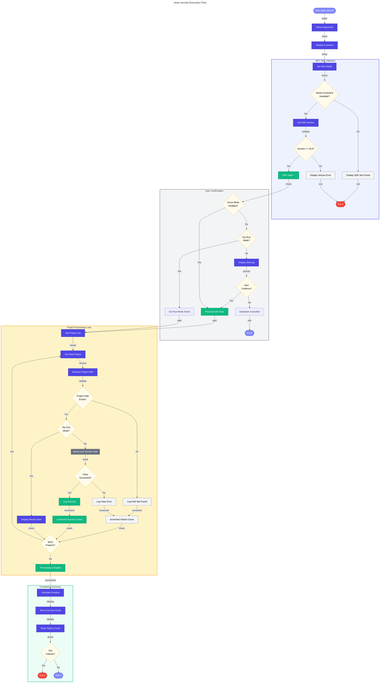

# 📋 clean-secrets Hook

Clears .NET user secrets for all projects in the solution to ensure a clean configuration state.

---

## 📖 Overview

| Property | Value |
|----------|-------|
| **Hook Name** | clean-secrets |
| **Version** | 2.0.1 |
| **Execution Phase** | Manual / Called by preprovision |
| **Author** | Evilazaro \| Principal Cloud Solution Architect \| Microsoft |

The `clean-secrets` hook clears all .NET user secrets from configured projects to ensure a clean state. This is useful before re-provisioning or when troubleshooting configuration issues.

---

## ⚙️ Prerequisites

### Required Tools

| Tool | Minimum Version | Purpose |
|------|-----------------|---------|
| PowerShell | 7.0+ | Script execution (Windows/cross-platform) |
| Bash | 4.0+ | Script execution (Linux/macOS) |
| .NET SDK | 10.0+ | User secrets management |

### Required Permissions

- Write access to user profile directory (for user secrets storage)

---

## 🔧 Parameters/Arguments

### PowerShell Parameters

| Parameter | Type | Required | Default | Description |
|-----------|------|----------|---------|-------------|
| `-Force` | Switch | No | `$false` | Skip confirmation prompts |
| `-WhatIf` | Switch | No | `$false` | Preview changes without executing |
| `-Verbose` | Switch | No | `$false` | Enable detailed output |

### Bash Arguments

| Argument | Required | Default | Description |
|----------|----------|---------|-------------|
| `-f`, `--force` | No | `false` | Skip confirmation prompts |
| `-n`, `--dry-run` | No | `false` | Preview changes without executing |
| `-v`, `--verbose` | No | `false` | Enable verbose output |
| `-h`, `--help` | No | - | Display help message |

---

## 🌍 Environment Variables

### Variables Read

This hook does not read environment variables.

### Variables Set

This hook does not set environment variables.

---

## 📝 Functionality

The clean-secrets script performs these operations:

1. **.NET SDK Validation**
   - Verifies .NET SDK is installed and accessible
   - Validates SDK version meets minimum requirements (10.0+)
   - Exits with error if SDK is not available

2. **Project Path Resolution**
   - Resolves paths to configured projects relative to script location
   - Validates each project directory exists

3. **User Secrets Clearing**
   - Clears secrets for each configured project:
     - `app.AppHost`
     - `eShop.Orders.API`
     - `eShop.Web.App`
   - Uses `dotnet user-secrets clear` command
   - Tracks success/failure for each project

4. **Summary Report**
   - Displays count of successful operations
   - Reports any failures encountered
   - Shows execution duration

### Projects Configured

| Project | Path | Description |
|---------|------|-------------|
| app.AppHost | `../app.AppHost/` | .NET Aspire AppHost project |
| eShop.Orders.API | `../src/eShop.Orders.API/` | Orders API service |
| eShop.Web.App | `../src/eShop.Web.App/` | Web application frontend |

---

## 🔄 Execution Flow



---

## 💻 Usage Examples

### PowerShell

```powershell
# Standard execution with confirmation
.\hooks\clean-secrets.ps1

# Force execution without confirmation
.\hooks\clean-secrets.ps1 -Force

# Preview what would be cleared
.\hooks\clean-secrets.ps1 -WhatIf

# Verbose output with force
.\hooks\clean-secrets.ps1 -Force -Verbose
```

### Bash

```bash
# Standard execution with confirmation
./hooks/clean-secrets.sh

# Force execution without confirmation
./hooks/clean-secrets.sh --force

# Preview what would be cleared
./hooks/clean-secrets.sh --dry-run

# Verbose output with force
./hooks/clean-secrets.sh --force --verbose
```

---

## 🔀 Platform Differences

| Feature | PowerShell | Bash |
|---------|------------|------|
| Confirmation | `ShouldProcess` with `ConfirmImpact='High'` | Interactive prompt |
| Dry run | `-WhatIf` common parameter | `--dry-run` flag |
| Project config | `$script:Projects` hashtable array | Associative array `PROJECTS` |
| Path resolution | `Join-Path` + `GetFullPath` | `cd` + `pwd` |

---

## 🚪 Exit Codes

| Code | Description |
|------|-------------|
| `0` | Success - All secrets cleared or dry run completed |
| `1` | Error - SDK validation failed or clear operation failed |
| `130` | Script interrupted by user (Ctrl+C) |

---

## 🔗 Related Hooks

- [preprovision](preprovision.md) - Calls clean-secrets during pre-provisioning
- [postprovision](postprovision.md) - Calls clean-secrets before configuring new secrets

---

## 📋 Typical Output

### Successful Execution

```
═══════════════════════════════════════════════════════════
  Clean User Secrets v2.0.1
═══════════════════════════════════════════════════════════

Validating .NET SDK...
  ✓ .NET SDK 10.0.100 detected

Clearing user secrets for 3 projects...

[1/3] app.AppHost
  Path: /app/app.AppHost/
  ✓ User secrets cleared

[2/3] eShop.Orders.API
  Path: /app/src/eShop.Orders.API/
  ✓ User secrets cleared

[3/3] eShop.Web.App
  Path: /app/src/eShop.Web.App/
  ✓ User secrets cleared

═══════════════════════════════════════════════════════════
  Summary
═══════════════════════════════════════════════════════════
  Total projects:  3
  Successful:      3
  Failed:          0
  Duration:        1.2 seconds
═══════════════════════════════════════════════════════════
```

### Dry Run Output

```
═══════════════════════════════════════════════════════════
  Clean User Secrets v2.0.1 (DRY RUN)
═══════════════════════════════════════════════════════════

The following operations would be performed:

[1/3] Would clear secrets for: app.AppHost
      Path: /app/app.AppHost/

[2/3] Would clear secrets for: eShop.Orders.API
      Path: /app/src/eShop.Orders.API/

[3/3] Would clear secrets for: eShop.Web.App
      Path: /app/src/eShop.Web.App/

═══════════════════════════════════════════════════════════
  No changes made (dry run mode)
═══════════════════════════════════════════════════════════
```

---

**Last Modified:** 2026-01-26
