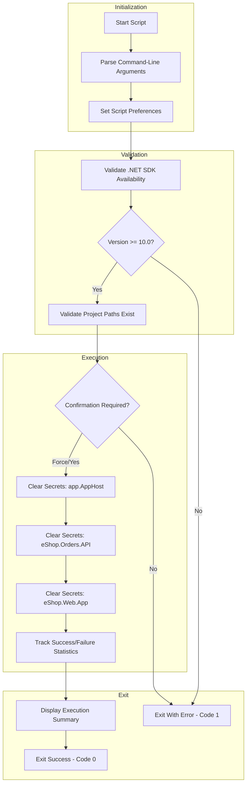

# Clear .NET User Secrets for All Projects

## Overview

> [!CAUTION]
> This script permanently removes user secrets. Use `-WhatIf` or `--dry-run` to preview changes before execution.

This script clears all .NET user secrets from the configured projects in the Azure Logic Apps Monitoring solution to ensure a clean state. This is essential before re-provisioning Azure resources, when troubleshooting configuration issues, when rotating secrets or credentials, or when setting up a fresh development environment.

The script is implemented in **both PowerShell and Bash** to support cross-platform development environments.

## Script Classification

| Attribute | Value |
|-----------|-------|
| **Category** | Secrets Management Utility |
| **Trigger Mechanism** | Manual execution or invoked by preprovision scripts |
| **azd Hook** | No (utility script) |

## Supported Environments

### Shells

| Shell | Minimum Version |
|-------|-----------------|
| PowerShell | 7.0+ |
| Bash | 4.0+ |

### Operating Systems

| OS | Supported |
|----|-----------|
| Windows | ✓ |
| Linux | ✓ |
| macOS | ✓ |

## Prerequisites

| Prerequisite | Required | Description |
|--------------|----------|-------------|
| .NET SDK 10.0+ | Yes | Required for `dotnet user-secrets` command |
| Project files | Yes | Target project `.csproj` files must exist |

### Target Projects

> [!NOTE]
> The following projects must exist in the expected directory structure for the script to function correctly.

The script clears user secrets for the following projects:

- `app.AppHost/app.AppHost.csproj`
- `src/eShop.Orders.API/eShop.Orders.API.csproj`
- `src/eShop.Web.App/eShop.Web.App.csproj`

## Files

| File | Description |
|------|-------------|
| `clean-secrets.ps1` | PowerShell implementation |
| `clean-secrets.sh` | Bash implementation |

## High-Level Script Flow



## Usage

> [!TIP]
> Always use `--dry-run` or `-WhatIf` first to preview which secrets will be cleared.

### PowerShell

```powershell
# Clear secrets with confirmation prompt
./clean-secrets.ps1

# Clear secrets without confirmation
./clean-secrets.ps1 -Force

# Preview what would be cleared (dry-run)
./clean-secrets.ps1 -WhatIf

# Clear with verbose output
./clean-secrets.ps1 -Verbose
```

### Bash

```bash
# Clear secrets with confirmation prompt
./clean-secrets.sh

# Clear secrets without confirmation
./clean-secrets.sh --force

# Preview what would be cleared (dry-run)
./clean-secrets.sh --dry-run

# Clear with verbose output
./clean-secrets.sh --verbose

# Display help
./clean-secrets.sh --help
```

## Parameters

| Logical Parameter | PowerShell Name | Bash Name | Required | Description |
|-------------------|-----------------|-----------|----------|-------------|
| Force | `-Force` | `-f`, `--force` | No | Skips confirmation prompts and forces execution |
| Dry Run | `-WhatIf` | `-n`, `--dry-run` | No | Shows what would be executed without making changes |
| Verbose | `-Verbose` | `-v`, `--verbose` | No | Displays detailed diagnostic information |
| Confirm | `-Confirm` | N/A | No | Prompts for confirmation before each operation (PowerShell only) |
| Help | N/A | `-h`, `--help` | No | Displays help message and exits (Bash only) |

## Examples

### Clear All User Secrets with Confirmation

**PowerShell:**

```powershell
./clean-secrets.ps1
```

**Bash:**

```bash
./clean-secrets.sh
```

### Force Clear Without Prompts (CI/CD)

**PowerShell:**

```powershell
./clean-secrets.ps1 -Force
```

**Bash:**

```bash
./clean-secrets.sh --force
```

### Preview Changes Without Executing

**PowerShell:**

```powershell
./clean-secrets.ps1 -WhatIf -Verbose
```

**Bash:**

```bash
./clean-secrets.sh --dry-run --verbose
```

## Error Handling & Exit Codes

| Exit Code | Description |
|-----------|-------------|
| 0 | All operations completed successfully |
| 1 | Error occurred (validation failed or operation failed) |
| 130 | Script interrupted by user (SIGINT) - Bash only |

### Error Behavior

- **PowerShell**: Uses `SupportsShouldProcess` with `ConfirmImpact = 'High'`. Strict mode enabled with `Set-StrictMode -Version Latest`.
- **Bash**: Uses `set -euo pipefail` for strict error handling. Includes cleanup trap for graceful exit.

## Logging & Output

| Output Type | Description |
|-------------|-------------|
| stdout | Status messages, success indicators, execution summary |
| stderr | Error messages, warnings |
| Color-coded output | Visual distinction for success (green), warnings (yellow), errors (red) |

### Execution Summary

Both implementations provide an execution summary including:

- Total projects processed
- Successful operations count
- Failed operations count
- Total execution time

## Security Considerations

- User secrets are stored in the local user profile (not in source control)
- The `dotnet user-secrets clear` command removes all secrets for a project
- No secrets are logged or displayed during execution
- Script does not transmit any data externally

## Troubleshooting

| Issue | Resolution |
|-------|------------|
| `.NET SDK not found in PATH` | Install .NET SDK 10.0+ and ensure `dotnet` is in PATH |
| `dotnet command failed to execute` | Verify .NET SDK installation with `dotnet --version` |
| `Project file not found` | Ensure project structure matches expected layout relative to script location |
| `Permission denied` | Ensure execute permissions on script and write access to user secrets store |
| Secrets not cleared after running | Verify you're running against the correct project paths |

## Development Notes

- Script version: `2.0.1` for both implementations
- PowerShell implementation uses `SupportsShouldProcess` for `-WhatIf` and `-Confirm` support
- Bash implementation provides equivalent `--dry-run` functionality
- Both implementations track and report execution statistics

## License & Ownership

| Attribute | Value |
|-----------|-------|
| Author | Evilazaro \| Principal Cloud Solution Architect \| Microsoft |
| Version | 2.0.1 |
| Last Modified | 2026-01-06 |
| Repository | [Azure-LogicApps-Monitoring](https://github.com/Evilazaro/Azure-LogicApps-Monitoring) |

## Related Links

- [.NET User Secrets Documentation](https://learn.microsoft.com/dotnet/core/tools/dotnet-user-secrets)
- [Safe Storage of App Secrets](https://learn.microsoft.com/aspnet/core/security/app-secrets)
