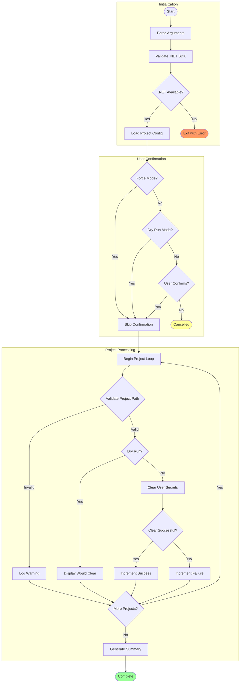

# 🧹 clean-secrets

---

## 📑 Table of Contents

- [📋 Overview](#-overview)
- [📝 Description](#-description)
- [📊 Workflow Diagram](#-workflow-diagram)
- [✅ Prerequisites](#-prerequisites)
- [⚙️ Parameters/Arguments](#️-parametersarguments)
- [📥 Input/Output Specifications](#-inputoutput-specifications)
- [💻 Usage Examples](#-usage-examples)
- [⚠️ Error Handling and Exit Codes](#️-error-handling-and-exit-codes)
- [🔒 Security Considerations](#-security-considerations)
- [🚧 Known Limitations](#-known-limitations)
- [🔗 Related Scripts](#-related-scripts)
- [📜 Changelog](#-changelog)

---

## 📋 Overview

Clears .NET user secrets for all projects in the Azure Logic Apps Monitoring solution to ensure a clean configuration state before re-provisioning or troubleshooting.

[⬆️ Back to top](#-clean-secrets)

---

## 📝 Description

This utility script clears all .NET user secrets from the configured projects in the solution. User secrets in .NET provide a way to store sensitive configuration data outside of the project tree, but these secrets can become stale or misconfigured over time, leading to application issues.

The script targets three specific projects: `app.AppHost` (the Aspire application host), `eShop.Orders.API` (the orders REST API), and `eShop.Web.App` (the web frontend). For each project, it validates that the project path exists, then executes `dotnet user-secrets clear` to remove all stored secrets.

This script is typically called by the preprovision script but can also be run standalone when troubleshooting configuration issues or preparing for a fresh deployment. The script includes comprehensive validation, detailed logging, and execution statistics to provide visibility into the cleanup operation.

[⬆️ Back to top](#-clean-secrets)

---

## 📊 Workflow Diagram



[⬆️ Back to top](#-clean-secrets)

---

## ✅ Prerequisites

| Category | Requirement | Version | Verification Command | Required |
|:---------|:------------|:--------|:---------------------|:--------:|
| Runtime | PowerShell Core | >= 7.0 | `$PSVersionTable.PSVersion` | ✅ |
| Runtime | Bash | >= 4.0 | `bash --version` | ✅ |
| SDK | .NET SDK | >= 10.0 | `dotnet --version` | ✅ |

[⬆️ Back to top](#-clean-secrets)

---

## ⚙️ Parameters/Arguments

### PowerShell Parameters

| Parameter | Type | Required | Default | Description |
|:----------|:-----|:--------:|:--------|:------------|
| `-Force` | `[switch]` | ❌ | `$false` | Skips confirmation prompts |
| `-WhatIf` | `[switch]` | ❌ | `$false` | Shows what would be cleared without making changes |
| `-Verbose` | `[switch]` | ❌ | `$false` | Displays detailed diagnostic information |

### Bash Arguments

| Position/Flag | Type | Required | Default | Description |
|:--------------|:-----|:--------:|:--------|:------------|
| `-f`, `--force` | flag | ❌ | `false` | Skip confirmation prompts and force execution |
| `-n`, `--dry-run` | flag | ❌ | `false` | Show what would be executed without making changes |
| `-v`, `--verbose` | flag | ❌ | `false` | Display detailed diagnostic information |
| `-h`, `--help` | flag | ❌ | N/A | Display help message and exit |

[⬆️ Back to top](#-clean-secrets)

---

## 📥 Input/Output Specifications

### Inputs

**Environment Variables Read:**

> **ℹ️ Note:** None required.

**Files/Paths Expected:**

- `../app.AppHost/` — AppHost project directory (relative to script)
- `../src/eShop.Orders.API/` — Orders API project directory
- `../src/eShop.Web.App/` — Web App project directory

### Outputs

**Exit Codes:**

| Exit Code | Meaning |
|:---------:|:--------|
| `0` | Success — All secrets cleared |
| `1` | Error — One or more operations failed |

**stdout Output:**

- Progress messages with timestamps
- Project validation status
- Clear operation results
- Execution summary with statistics

**Files Modified:**

- User secrets removed from `%APPDATA%\Microsoft\UserSecrets\` (Windows)
- User secrets removed from `~/.microsoft/usersecrets/` (macOS/Linux)

[⬆️ Back to top](#-clean-secrets)

---

## 💻 Usage Examples

### Basic Usage

```powershell
# PowerShell: Clear all user secrets with confirmation prompt
.\clean-secrets.ps1
```

```bash
# Bash: Clear all user secrets with confirmation prompt
./clean-secrets.sh
```

### Advanced Usage

```powershell
# PowerShell: Preview what would be cleared without making changes
.\clean-secrets.ps1 -WhatIf -Verbose

# PowerShell: Force clear without confirmation
.\clean-secrets.ps1 -Force
```

```bash
# Bash: Preview what would be cleared without making changes
./clean-secrets.sh --dry-run --verbose

# Bash: Force clear without confirmation
./clean-secrets.sh --force
```

### CI/CD Pipeline Usage

```yaml
# Azure DevOps Pipeline
- task: PowerShell@2
  displayName: 'Clear user secrets'
  inputs:
    targetType: 'filePath'
    filePath: '$(System.DefaultWorkingDirectory)/hooks/clean-secrets.ps1'
    arguments: '-Force'
    pwsh: true

# GitHub Actions
- name: Clear user secrets
  shell: bash
  run: |
    chmod +x ./hooks/clean-secrets.sh
    ./hooks/clean-secrets.sh --force
```

[⬆️ Back to top](#-clean-secrets)

---

## ⚠️ Error Handling and Exit Codes

| Exit Code | Meaning | Recovery Action |
|:---------:|:--------|:----------------|
| `0` | Success | N/A |
| `1` | Error | Check project paths exist, verify .NET SDK |

### Error Handling Approach

**PowerShell:**

- `Set-StrictMode -Version Latest` for strict mode
- `$ErrorActionPreference = 'Stop'` for fail-fast
- `SupportsShouldProcess` for WhatIf support
- Continues processing remaining projects on individual failures

**Bash:**

- `set -euo pipefail` for strict error handling
- Trap handlers for cleanup and interrupt
- Success/failure counters for reporting
- Non-fatal errors logged but execution continues

[⬆️ Back to top](#-clean-secrets)

---

## 🔒 Security Considerations

### 🔑 Credential Handling

- [x] No hardcoded secrets
- [x] Removes stored credentials (intentional operation)
- [x] No network access required

### Required Permissions

| Permission/Role | Scope | Justification |
|:----------------|:------|:--------------|
| File System Write | User secrets directory | Remove secret files |

### 🌐 Network Security

| Property | Value |
|:---------|:------|
| **Endpoints accessed** | None |
| **TLS requirements** | N/A |
| **Firewall rules needed** | None |

### 📝 Logging Security

> **✅ Security Features:**
>
> - **Sensitive data masking:** Secret values never logged (only cleared)
> - **Audit trail:** Timestamped operation logs

[⬆️ Back to top](#-clean-secrets)

---

## 🚧 Known Limitations

> **⚠️ Important Notes:**
>
> - Only clears secrets for predefined projects (not configurable)
> - Requires projects to have been initialized with user secrets
> - Cannot selectively clear individual secrets
> - Project paths are relative to script location
> - Does not validate secret content before clearing

[⬆️ Back to top](#-clean-secrets)

---

## 🔗 Related Scripts

| Script | Relationship | Description |
|:-------|:-------------|:------------|
| [preprovision.md](preprovision.md) | Called by | Pre-provisioning validation and setup |
| [postprovision.md](postprovision.md) | Related | Configures secrets after provisioning |
| [check-dev-workstation.md](check-dev-workstation.md) | Related | Workstation validation |

[⬆️ Back to top](#-clean-secrets)

---

## 📜 Changelog

| Version | Date | Changes |
|:-------:|:----:|:--------|
| 2.0.1 | 2026-01-06 | Improved error handling, added execution statistics |
| 2.0.0 | 2025-12-01 | Added dry-run support, enhanced logging |
| 1.0.0 | 2025-01-01 | Initial release |

[⬆️ Back to top](#-clean-secrets)
