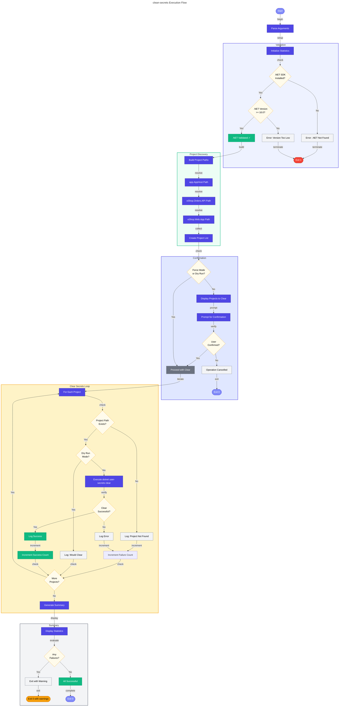

# 🧹 clean-secrets

> [!NOTE]
> **Target Audience**: Developers, DevOps Engineers  
> **Reading Time**: ~8 minutes

<details>
<summary>📖 Navigation</summary>

| Previous | Index | Next |
|:---------|:-----:|-----:|
| [deploy-workflow](deploy-workflow.md) | [📚 Index](README.md) | [configure-federated-credential](configure-federated-credential.md) |

</details>

Clears .NET user secrets for all projects in the solution.

## 📑 Table of Contents

- [📋 Overview](#-overview)
- [⚙️ Prerequisites](#️-prerequisites)
- [🎯 Parameters](#-parameters)
- [🌐 Environment Variables](#-environment-variables)
- [⚙️ Functionality](#️-functionality)
- [📖 Usage Examples](#-usage-examples)
- [💻 Platform Differences](#-platform-differences)
- [🚪 Exit Codes](#-exit-codes)
- [🔗 Related Hooks](#-related-hooks)

## 📋 Overview

This script clears all .NET user secrets from the configured projects to ensure a clean state. This is useful before re-provisioning or when troubleshooting configuration issues.

### 🔑 Key Operations

- Validates .NET SDK availability and version
- Validates project paths and structure
- Clears user secrets for `app.AppHost` project
- Clears user secrets for `eShop.Orders.API` project
- Clears user secrets for `eShop.Web.App` project
- Provides comprehensive logging and execution statistics

### 📅 When to Use

- Before re-provisioning to ensure clean secret state
- When troubleshooting authentication/configuration issues
- When rotating credentials or connection strings
- As part of environment reset procedures

## ⚙️ Prerequisites

### 🔧 Required Tools

| Tool | Minimum Version | Purpose |
|:-----|:---------------:|:--------|
| PowerShell Core | 7.0+ | Script execution (PowerShell version) |
| Bash | 4.0+ | Script execution (Bash version) |
| .NET SDK | 10.0+ | User secrets management |

### 📂 Required Files

Projects must exist at expected paths relative to the script directory:

| Project | Relative Path |
|:--------|:--------------|
| `app.AppHost` | `../app.AppHost/` |
| `eShop.Orders.API` | `../src/eShop.Orders.API/` |
| `eShop.Web.App` | `../src/eShop.Web.App/` |

## 🎯 Parameters

### PowerShell Parameters

| Parameter | Type | Required | Default | Description |
|:----------|:----:|:--------:|:-------:|:------------|
| `-Force` | Switch | No | `$false` | Skip confirmation prompts and force execution |
| `-Verbose` | Switch | No | `$false` | Display detailed diagnostic information |
| `-WhatIf` | Switch | No | `$false` | Show what would be cleared without making changes |

### Bash Parameters

| Parameter | Type | Required | Default | Description |
|:----------|:----:|:--------:|:-------:|:------------|
| `-f`, `--force` | Flag | No | `false` | Skip confirmation prompts and force execution |
| `-n`, `--dry-run` | Flag | No | `false` | Show what would be cleared without making changes |
| `-v`, `--verbose` | Flag | No | `false` | Display detailed diagnostic information |
| `-h`, `--help` | Flag | No | N/A | Display help message and exit |

## 🌐 Environment Variables

### Variables Read

This script does not require any environment variables.

### Variables Set

This script does not set any environment variables.

## ⚙️ Functionality

### 🔄 Execution Flow



### 💻 Clear Command

For each project, the script executes:

```bash
dotnet user-secrets clear --project <project-path>
```

This removes all secrets stored in the user secrets store for that project.

### 📂 User Secrets Storage Location

| Platform | Location |
|:---------|:---------|
| Windows | `%APPDATA%\Microsoft\UserSecrets\<user_secrets_id>\secrets.json` |
| Linux/macOS | `~/.microsoft/usersecrets/<user_secrets_id>/secrets.json` |

The `user_secrets_id` is defined in each project's `.csproj` file.

## 📖 Usage Examples

### PowerShell

```powershell
# Clear secrets with confirmation prompt
.\clean-secrets.ps1

# Clear secrets without confirmation
.\clean-secrets.ps1 -Force

# Show what would be cleared without making changes
.\clean-secrets.ps1 -WhatIf -Verbose

# Verbose output for troubleshooting
.\clean-secrets.ps1 -Verbose
```

### Bash

```bash
# Clear secrets with confirmation prompt
./clean-secrets.sh

# Clear secrets without confirmation
./clean-secrets.sh --force

# Show what would be cleared without making changes
./clean-secrets.sh --dry-run --verbose

# Display help
./clean-secrets.sh --help
```

### 📝 Sample Output

```
═══════════════════════════════════════════════════════════════
  Azure Logic Apps Monitoring - Clean User Secrets
  Version: 2.0.1
═══════════════════════════════════════════════════════════════

───────────────────────────────────────────────────────────────
  Prerequisites Validation
───────────────────────────────────────────────────────────────

✓ .NET SDK version 10.0.100 is installed

───────────────────────────────────────────────────────────────
  Project Validation
───────────────────────────────────────────────────────────────

✓ app.AppHost: ../app.AppHost/
✓ eShop.Orders.API: ../src/eShop.Orders.API/
✓ eShop.Web.App: ../src/eShop.Web.App/

───────────────────────────────────────────────────────────────
  Confirmation
───────────────────────────────────────────────────────────────

The following projects will have their user secrets cleared:
  • app.AppHost
  • eShop.Orders.API
  • eShop.Web.App

Are you sure you want to continue? [y/N]: y

───────────────────────────────────────────────────────────────
  Clearing User Secrets
───────────────────────────────────────────────────────────────

✓ Cleared user secrets for app.AppHost
✓ Cleared user secrets for eShop.Orders.API
✓ Cleared user secrets for eShop.Web.App

═══════════════════════════════════════════════════════════════
  Summary
═══════════════════════════════════════════════════════════════

Total projects: 3
  ✓ Succeeded: 3
  ✗ Failed: 0

Execution time: 2.3 seconds

✓ All user secrets cleared successfully
```

## 💻 Platform Differences

| Aspect | PowerShell | Bash |
|:-------|:-----------|:-----|
| Confirmation | `SupportsShouldProcess` | Interactive `read` prompt |
| WhatIf | Native `-WhatIf` | `--dry-run` flag |
| Path joining | `Join-Path` | String concatenation |
| Process execution | `&` operator | Direct command |

## 🚪 Exit Codes

| Code | Meaning |
|:----:|:--------|
| `0` | Success - all secrets cleared |
| `1` | Error - validation failed or secrets clear failed |
| `130` | Script interrupted by user (SIGINT) |

## 🔗 Related Hooks

| Hook | Relationship |
|:-----|:-------------|
| [preprovision](preprovision.md) | Calls this script to clear secrets before provisioning |
| [postprovision](postprovision.md) | Sets new secrets after this script clears them |

## 🔧 Troubleshooting

### ⚠️ Common Issues

1. **".NET SDK not found"**
   - Install .NET SDK 10.0+ from <https://dot.net>
   - Ensure `dotnet` is in your PATH

2. **"Project path not found"**
   - Verify the script is run from the repository root
   - Check that project directories exist at expected locations

3. **"User secrets clear failed"**
   - Verify the project has a valid `UserSecretsId` in its `.csproj`
   - Check file permissions on the secrets directory

### ✅ Verifying Secrets Are Cleared

After running the script, verify secrets are cleared:

```bash
# List secrets for a project (should show empty or error)
dotnet user-secrets list --project ./app.AppHost
```

---

<div align="center">

**[← deploy-workflow](deploy-workflow.md)** · **[⬆️ Back to Top](#-clean-secrets)** · **[configure-federated-credential →](configure-federated-credential.md)**

</div>

**Version**: 2.0.1  
**Author**: Evilazaro | Principal Cloud Solution Architect | Microsoft  
**Last Modified**: January 2026
