# 🧹 clean-secrets (.ps1 / .sh)


> [!NOTE]
> 🎯 **For Developers**: Safely clears .NET user secrets from all projects.  
> ⏱️ **Execution time:** 2-4 seconds

<details>
<summary>📍 <strong>Quick Navigation</strong></summary>

| Previous | Index | Next |
|:---------|:------:|--------:|
| [← sql-managed-identity-config](sql-managed-identity-config.md) | [📑 Hooks Index](README.md) | [Generate-Orders →](Generate-Orders.md) |

</details>

## 📋 Overview

The `clean-secrets` script is a utility tool in the Developer Inner Loop Workflow that safely clears .NET user secrets from all projects in the Azure Logic Apps Monitoring solution. Available in both PowerShell (`.ps1`) and Bash (`.sh`) versions, it provides cross-platform support for managing local development secrets stored in user-specific directories.

This script operates as a helper utility called by both `preprovision` and `postprovision` scripts to ensure a clean state before configuring new secrets. It validates .NET SDK availability, confirms user intent (unless forced), and systematically clears secrets from three target projects: app.AppHost, eShop.Orders.API, and eShop.Web.App. The operation is non-destructive to project files, only removing secrets from the local user secrets storage.

By providing multiple execution modes (interactive, force, preview, verbose), the script supports various workflows from manual troubleshooting to automated CI/CD pipelines, completing typical operations in 2-4 seconds with comprehensive error handling and detailed logging capabilities.

## 📑 Table of Contents

- [📋 Overview](#-overview)
- [🎯 Purpose](#-purpose)
- [🏗️ Target Projects](#️-target-projects)
  - [🔧 How User Secrets Work](#how-user-secrets-work)
- [🚀 Usage](#-usage)
  - [💻 Basic Usage](#basic-usage)
  - [⚡ Force Mode (No Confirmation)](#force-mode-no-confirmation)
  - [👁️ Preview Mode (WhatIf)](#preview-mode-whatif)
  - [📝 Verbose Mode](#verbose-mode)
  - [🔗 Combined Options](#combined-options)
- [🔧 Parameters](#-parameters)
- [📚 Examples](#-examples)
  - [🔄 Example 1: Clean Secrets Before Re-provisioning](#example-1-clean-secrets-before-re-provisioning)
  - [🔁 Example 2: CI/CD Pipeline Integration](#example-2-cicd-pipeline-integration)
- [🛠️ How It Works](#%EF%B8%8F-how-it-works)
  - [🔄 Internal Process Flow](#internal-process-flow)
  - [🔗 Integration Points](#integration-points)
- [📖 Related Documentation](#-related-documentation)
- [🔐 Security Considerations](#-security-considerations)
  - [✅ Safe Operations](#safe-operations)
  - [🗑️ What Gets Deleted](#what-gets-deleted)
  - [⏰ When to Run](#when-to-run)
- [🎓 Best Practices](#-best-practices)
  - [📋 When to Use This Script](#when-to-use-this-script)
  - [🔄 Development Workflow Integration](#development-workflow-integration)
  - [👥 Team Standards](#team-standards)
- [📊 Performance](#-performance)
  - [⚡ Performance Characteristics](#performance-characteristics)
- [📜 Version History](#-version-history)

## 🎯 Purpose

This script helps developers and operators:

- 🧹 **Clear Secrets**: Remove all user secrets from configured projects
- 🔄 **Reset State**: Prepare for fresh configuration during re-provisioning
- 🔍 **Troubleshoot**: Eliminate stale secrets when debugging configuration issues
- ✅ **Safe Execution**: Validate .NET SDK availability before making changes
- 📊 **Detailed Logging**: Track which secrets are cleared and provide execution summary
- 🔗 **Workflow Integration**: Automatically invoked by preprovision and postprovision scripts

## 🏗️ Target Projects

The script clears user secrets from three projects:

| Project        | Path                                           | Secret ID Required |
| -------------- | ---------------------------------------------- | ------------------ |
| **App Host**   | `app.AppHost/app.AppHost.csproj`               | Yes                |
| **Orders API** | `src/eShop.Orders.API/eShop.Orders.API.csproj` | Yes                |
| **Web App**    | `src/eShop.Web.App/eShop.Web.App.csproj`       | Yes                |

### How User Secrets Work

.NET user secrets are stored in:

- **Windows**: `%APPDATA%\Microsoft\UserSecrets\<user-secrets-id>\secrets.json`
- **Linux/macOS**: `~/.microsoft/usersecrets/<user-secrets-id>/secrets.json`

Each project has a unique `UserSecretsId` in its `.csproj` file:

```xml
<PropertyGroup>
  <UserSecretsId>12345678-1234-1234-1234-123456789012</UserSecretsId>
</PropertyGroup>
```

## 🚀 Usage

### Basic Usage

**PowerShell (Windows):**

```powershell
# Interactive mode - prompts for confirmation
.\clean-secrets.ps1
```

**Bash (Linux/macOS):**

```bash
# Interactive mode - prompts for confirmation
./clean-secrets.sh
```

**Confirmation Prompt:**

```
Confirm
Are you sure you want to clear user secrets for all projects?
This action will remove all stored secrets from:
  - app.AppHost
  - eShop.Orders.API
  - eShop.Web.App

[Y] Yes  [A] Yes to All  [N] No  [L] No to All  [S] Suspend  [?] Help (default is "N"):
```

### Force Mode (No Confirmation)

**PowerShell (Windows):**

```powershell
# Skip all confirmation prompts
.\clean-secrets.ps1 -Force
```

**Bash (Linux/macOS):**

```bash
# Skip all confirmation prompts
./clean-secrets.sh --force
```

**Output:**

```
[10:15:30] Starting user secrets cleanup...
[10:15:31] ✓ .NET SDK validated (version 10.0.0)
[10:15:32] ✓ Cleared secrets for app.AppHost
[10:15:33] ✓ Cleared secrets for eShop.Orders.API
[10:15:34] ✓ Cleared secrets for eShop.Web.App

Summary:
  Total projects: 3
  Cleared successfully: 3
  Errors: 0

Operation completed successfully in 4.2 seconds.
```

### Preview Mode (WhatIf)

**PowerShell (Windows):**

```powershell
# Show what would be cleared without making changes
.\clean-secrets.ps1 -WhatIf
```

**Bash (Linux/macOS):**

```bash
# Show what would be cleared without making changes
./clean-secrets.sh --dry-run
```

**Output:**

```
What if: Performing operation "Clear User Secrets" on target "app.AppHost".
What if: Performing operation "Clear User Secrets" on target "eShop.Orders.API".
What if: Performing operation "Clear User Secrets" on target "eShop.Web.App".

No changes were made. This was a simulation.
```

### Verbose Mode

**PowerShell (Windows):**

```powershell
# Get detailed execution information
.\clean-secrets.ps1 -Verbose
```

**Bash (Linux/macOS):**

```bash
# Get detailed execution information
./clean-secrets.sh --verbose
```

**Output:**

```
VERBOSE: Script started at 2025-12-24 10:15:30
VERBOSE: Validating .NET SDK availability...
VERBOSE: Found .NET SDK version: 10.0.0
VERBOSE: .NET SDK validation: PASS
VERBOSE: Processing project: app.AppHost
VERBOSE: Project path: Z:\Azure-LogicApps-Monitoring\app.AppHost\app.AppHost.csproj
VERBOSE: Executing: dotnet user-secrets clear --project "app.AppHost.csproj"
VERBOSE: Successfully cleared secrets for app.AppHost
VERBOSE: Processing project: eShop.Orders.API
...
```

### Combined Options

**PowerShell (Windows):**

```powershell
# Preview with verbose output
.\clean-secrets.ps1 -WhatIf -Verbose

# Force execution with verbose logging
.\clean-secrets.ps1 -Force -Verbose
```

**Bash (Linux/macOS):**

```bash
# Preview with verbose output
./clean-secrets.sh --dry-run --verbose

# Force execution with verbose logging
./clean-secrets.sh --force --verbose
```

## 🔧 Parameters

### `-Force` (PowerShell) / `--force` (Bash)

Skips all confirmation prompts and forces immediate execution.

**Type:** `SwitchParameter` (PowerShell) / `Flag` (Bash)  
**Required:** No  
**Default:** `$false` / `false`  
**Confirm Impact:** High (requires confirmation without `-Force`/`--force`)

**PowerShell Example:**

```powershell
.\clean-secrets.ps1 -Force
```

**Bash Example:**

```bash
./clean-secrets.sh --force
```

**Use Cases:**

- Automated CI/CD pipelines
- Scripted provisioning workflows
- Batch operations
- Non-interactive environments

---

### `-WhatIf` (PowerShell) / `--dry-run` (Bash)

Shows what operations would be performed without making actual changes.

**Type:** `SwitchParameter` (PowerShell built-in) / `Flag` (Bash)  
**Required:** No  
**Default:** `$false` / `false`

**PowerShell Example:**

```powershell
.\clean-secrets.ps1 -WhatIf
```

**Bash Example:**

```bash
./clean-secrets.sh --dry-run
```

**Use Cases:**

- Verifying script behavior before execution
- Auditing planned changes
- Training and demonstrations
- Testing script logic

---

### `-Confirm`

Prompts for confirmation before each operation.

**Type:** `SwitchParameter` (built-in)  
**Required:** No  
**Default:** `$true` (due to `ConfirmImpact = 'High'`)

**Example:**

```powershell
# Explicitly request confirmation
.\clean-secrets.ps1 -Confirm

# Suppress confirmation (same as -Force)
.\clean-secrets.ps1 -Confirm:$false
```

---

### `-Verbose` (PowerShell) / `--verbose` (Bash)

Enables detailed diagnostic output for troubleshooting.

**Type:** `SwitchParameter` (PowerShell built-in) / `Flag` (Bash)  
**Required:** No  
**Default:** `$false` / `false`

**PowerShell Example:**

```powershell
.\clean-secrets.ps1 -Verbose
```

**Bash Example:**

```bash
./clean-secrets.sh --verbose
```

**Use Cases:**

- Troubleshooting failures
- Debugging script execution
- Generating detailed logs
- Understanding internal operations

## 📚 Examples

### Example 1: Clean Secrets Before Re-provisioning

**PowerShell (Windows):**

```powershell
# Scenario: About to run 'azd provision' and want clean state
cd Z:\Azure-LogicApps-Monitoring\hooks

# Clear all existing secrets
.\clean-secrets.ps1 -Force

# Proceed with provisioning
cd ..
azd provision
```

**Bash (Linux/macOS):**

```bash
# Scenario: About to run 'azd provision' and want clean state
cd /path/to/Azure-LogicApps-Monitoring/hooks

# Clear all existing secrets
./clean-secrets.sh --force

# Proceed with provisioning
cd ..
azd provision
```

---

### Example 2: CI/CD Pipeline Integration

**PowerShell (Windows):**

```powershell
# In CI/CD pipeline script
$ErrorActionPreference = 'Stop'

try {
    # Clear secrets non-interactively
    & ./hooks/clean-secrets.ps1 -Force

    if ($LASTEXITCODE -ne 0) {
        throw "Failed to clear secrets"
    }

    Write-Host "✓ Secrets cleared successfully"
}
catch {
    Write-Error "Secret clearing failed: $_"
    exit 1
}
```

**Bash (Linux/macOS):**

```bash
# In CI/CD pipeline script
set -e  # Exit on error

# Clear secrets non-interactively
if ./hooks/clean-secrets.sh --force; then
    echo "✓ Secrets cleared successfully"
else
    echo "ERROR: Secret clearing failed" >&2
    exit 1
fi
```

---

## 🛠️ How It Works

### Internal Process Flow

The script executes a systematic workflow through four distinct phases:

```mermaid
---
title: clean-secrets Process Flow
---
flowchart LR
    %% ===== STYLE DEFINITIONS =====
    classDef primary fill:#4F46E5,stroke:#3730A3,color:#FFFFFF
    classDef secondary fill:#10B981,stroke:#059669,color:#FFFFFF
    classDef datastore fill:#F59E0B,stroke:#D97706,color:#000000
    classDef external fill:#6B7280,stroke:#4B5563,color:#FFFFFF,stroke-dasharray: 5 5
    classDef failed fill:#F44336,stroke:#C62828,color:#FFFFFF
    classDef trigger fill:#818CF8,stroke:#4F46E5,color:#FFFFFF
    classDef decision fill:#FFFBEB,stroke:#F59E0B,color:#000000
    classDef input fill:#F3F4F6,stroke:#6B7280,color:#000000

    %% ===== ENTRY AND EXIT POINTS =====
    Start(["🚀 clean-secrets starts"]):::trigger
    End(["🏁 Script completes"]):::secondary

    Start -->|"begins"| Initialization

    %% ===== PHASE 1: INITIALIZATION & VALIDATION =====
    subgraph Initialization["1️⃣ Initialization Phase"]
        direction TB
        Init["Script Initialization"]:::primary
        InitDetails["• Set StrictMode/strict mode<br/>• Parse command-line args<br/>• Configure preferences"]:::input
        DotNet["Validate .NET SDK"]:::primary
        DotNetDetails["• Check dotnet in PATH<br/>• Verify version ≥ 10.0<br/>• Test SDK execution"]:::input
        Init -->|"configures"| InitDetails
        InitDetails -->|"validates"| DotNet
        DotNet -->|"checks"| DotNetDetails
    end

    %% ===== PHASE 2: PROJECT DISCOVERY =====
    subgraph Discovery["2️⃣ Discovery Phase"]
        direction TB
        Projects["Discover Projects"]:::primary
        ProjectDetails["• app.AppHost<br/>• eShop.Orders.API<br/>• eShop.Web.App"]:::datastore
        Validate["Validate Paths"]:::primary
        ValidateDetails["• Check directory exists<br/>• Locate .csproj files<br/>• Build valid project list"]:::input
        Projects -->|"discovers"| ProjectDetails
        ProjectDetails -->|"validates"| Validate
        Validate -->|"checks"| ValidateDetails
    end

    %% ===== PHASE 3: CONFIRMATION =====
    subgraph Confirmation["3️⃣ Confirmation Phase"]
        direction TB
        CheckForce{"Force mode<br/>enabled?"}:::decision
        Prompt["Prompt User"]:::primary
        PromptDetails["• Display project list<br/>• Request confirmation<br/>• Handle user response"]:::input
        Skip["Skip Confirmation"]:::secondary
        CheckForce -->|"No"| Prompt
        CheckForce -->|"Yes"| Skip
        Prompt -->|"displays"| PromptDetails
    end

    %% ===== PHASE 4: EXECUTION =====
    subgraph Execution["4️⃣ Execution Phase"]
        direction TB
        Clear["Clear Secrets"]:::primary
        ClearDetails["• Execute dotnet user-secrets clear<br/>• Track success/failure<br/>• Log results"]:::input
        Summary["Display Summary"]:::secondary
        SummaryDetails["• Total projects<br/>• Successfully cleared<br/>• Failed operations"]:::input
        Clear -->|"executes"| ClearDetails
        ClearDetails -->|"generates"| Summary
        Summary -->|"displays"| SummaryDetails
    end

    %% ===== FLOW CONNECTIONS =====
    Initialization -->|"proceeds to"| Discovery
    Discovery -->|"proceeds to"| Confirmation
    PromptDetails -->|"proceeds to"| Execution
    Skip -->|"proceeds to"| Execution
    SummaryDetails -->|"completes"| End

    %% ===== SUBGRAPH STYLES =====
    style Initialization fill:#EEF2FF,stroke:#4F46E5,stroke-width:2px
    style Discovery fill:#D1FAE5,stroke:#10B981,stroke-width:2px
    style Confirmation fill:#FEF3C7,stroke:#F59E0B,stroke-width:2px
    style Execution fill:#F3E8FF,stroke:#A855F7,stroke-width:2px
```



**Process Details:**

1. **Initialization Phase**: Sets strict mode, parses command-line arguments (`-Force`, `-WhatIf`, `-Verbose`), validates .NET SDK availability and version (≥10.0)
2. **Discovery Phase**: Locates configured projects (app.AppHost, eShop.Orders.API, eShop.Web.App), validates paths exist, and identifies `.csproj` files
3. **Confirmation Phase**: Unless `-Force` is specified, prompts user for confirmation before clearing secrets
4. **Execution Phase**: Executes `dotnet user-secrets clear` for each valid project, tracks results, and displays execution summary

### Integration Points

| Aspect           | Details                                                                                                                                                                                                                         |
| ---------------- | ------------------------------------------------------------------------------------------------------------------------------------------------------------------------------------------------------------------------------- |
| **Called By**    | • `preprovision.ps1/.sh` - Clears secrets before infrastructure provisioning<br/>• `postprovision.ps1/.sh` - Clears before setting new secrets<br/>• Manual execution for troubleshooting<br/>• CI/CD pipelines for clean state |
| **Calls**        | • `dotnet user-secrets clear --project <path>` - Core operation<br/>• `dotnet --version` - SDK validation                                                                                                                       |
| **Dependencies** | • **Runtime:** .NET SDK 10.0+ (required)<br/>• **Tools:** dotnet CLI in PATH<br/>• **Projects:** Valid .csproj files with UserSecretsId                                                                                         |
| **Outputs**      | • **Exit Code:** `0` (success) or `1` (failure)<br/>• **Console Output:** Progress messages and summary<br/>• **Side Effect:** Deleted secrets.json files from user secrets storage                                             |
| **Storage**      | • **Windows:** `%APPDATA%\Microsoft\UserSecrets\<id>\secrets.json`<br/>• **Linux/macOS:** `~/.microsoft/usersecrets/<id>/secrets.json`                                                                                          |

## 📖 Related Documentation

- **[postprovision.ps1](./postprovision.md)** - Sets user secrets after provisioning (inverse operation)
- **[preprovision.ps1](./preprovision.ps1)** - Calls this script during pre-provisioning
- **[check-dev-workstation.md](./check-dev-workstation.md)** - Environment validation
- **[Main README](./README.md)** - Hooks directory overview
- **[.NET User Secrets](https://learn.microsoft.com/aspnet/core/security/app-secrets)** - Official Microsoft documentation

## 🔐 Security Considerations

### Safe Operations

✅ **Safe to Run:**

- Only modifies user-secrets storage (not project files)
- Does not modify source code
- Does not affect production environments
- Local operation only (no network calls)
- Idempotent (can run multiple times safely)

### What Gets Deleted

This script clears:

- Connection strings stored in user secrets
- API keys stored in user secrets
- Azure resource information stored in user secrets
- Application configuration stored in user secrets

This script does **NOT** affect:

- appsettings.json files
- appsettings.Development.json files
- Environment variables
- Azure Key Vault secrets
- Production secrets
- Source code

### When to Run

| Scenario                   | Safe to Run? | Notes                    |
| -------------------------- | ------------ | ------------------------ |
| **Local Development**      | ✅ Yes       | Standard use case        |
| **Before Provisioning**    | ✅ Yes       | Ensures clean state      |
| **CI/CD Pipeline**         | ✅ Yes       | Use `-Force` flag        |
| **Production Environment** | ⚠️ No        | Never affects production |
| **Shared Workstation**     | ⚠️ Caution   | Other users affected     |

## 🎓 Best Practices

### When to Use This Script

| Situation                     | Recommendation    |
| ----------------------------- | ----------------- |
| **Before `azd provision`**    | ✅ Recommended    |
| **After failed provisioning** | ✅ Recommended    |
| **Configuration errors**      | ✅ Recommended    |
| **Switching environments**    | ✅ Recommended    |
| **Team onboarding**           | ✅ Recommended    |
| **Regular development**       | ⚠️ Only if needed |

### Development Workflow Integration

```powershell
# Typical re-provisioning workflow

# Step 1: Clear old secrets
.\hooks\clean-secrets.ps1 -Force

# Step 2: Provision fresh infrastructure
azd provision

# Step 3: Verify new secrets were set
dotnet user-secrets list --project app.AppHost\app.AppHost.csproj

# Step 4: Run application
azd up
```

### Team Standards

**Recommended Practices:**

1. **Document Usage**: Add to team's runbook
2. **CI/CD Integration**: Include in deployment scripts
3. **Error Handling**: Always check exit codes
4. **Verbose Logging**: Use `-Verbose` in CI/CD for audit trails
5. **Regular Execution**: Clear secrets before each provisioning

## 📊 Performance

### Performance Characteristics

| Characteristic     | Details                                                                                                                                                                                                                                                                                                     |
| ------------------ | ----------------------------------------------------------------------------------------------------------------------------------------------------------------------------------------------------------------------------------------------------------------------------------------------------------- |
| **Execution Time** | • **Standard execution:** 2-4 seconds (3 projects)<br/>• **With -Verbose flag:** 3-5 seconds<br/>• **Large number of secrets:** 5-8 seconds<br/>• **Per-project time:** ~1 second (dotnet user-secrets clear)<br/>• **Scaling:** Linear O(n) with number of projects                                        |
| **Resource Usage** | • **Memory:** ~30 MB peak during execution<br/>• **CPU:** Low utilization - dotnet CLI operations only<br/>• **Disk I/O:** Minimal delete operations on secrets.json files<br/>• **Process spawning:** 3 dotnet CLI child processes<br/>• **Baseline:** Lightweight script with minimal overhead            |
| **Network Impact** | • **Zero network calls** - completely offline operation<br/>• **No Azure connections** - local file system only<br/>• **No API requests** - uses .NET SDK local commands<br/>• **Ideal for disconnected environments**<br/>• **No bandwidth consumption**                                                   |
| **Scalability**    | • **Consistent per-project time:** No degradation with secrets count<br/>• **Parallel safe:** Can run in multiple terminals (different projects)<br/>• **No locking issues:** Each project has unique secret storage<br/>• **Fast completion:** 3 projects cleared in under 5 seconds                       |
| **Optimization**   | • **Sequential processing:** Projects cleared one at a time<br/>• **No redundant checks:** Direct dotnet CLI invocation<br/>• **Minimal validation:** Only checks .NET SDK availability<br/>• **Efficient operation:** Single delete per project<br/>• **No caching needed:** Direct file system operations |

## 📜 Version History

| Version | Date       | Author                          | Changes                                                                                                                                                            |
| ------- | ---------- | ------------------------------- | ------------------------------------------------------------------------------------------------------------------------------------------------------------------ |
| 1.0.0   | 2025-12-01 | Azure-LogicApps-Monitoring Team | • Initial release<br/>• Basic user secrets clearing for 3 projects<br/>• Cross-platform PowerShell and Bash implementations                                        |
| 2.0.0   | 2025-12-15 | Azure-LogicApps-Monitoring Team | • Added -WhatIf/-Confirm support (PowerShell)<br/>• Added --dry-run mode (Bash)<br/>• Enhanced logging and error handling<br/>• Added execution summary statistics |
| 2.0.1   | 2025-12-29 | Azure-LogicApps-Monitoring Team | • Bug fixes and documentation improvements<br/>• Enhanced .NET SDK version validation                                                                              |
| 2.0.1   | 2026-01-06 | Azure-LogicApps-Monitoring Team | • Applied PowerShell best practices (OutputType attribute, $script: scope prefix)<br/>• Updated copyright years<br/>• Synchronized documentation                   |

## Quick Links

- **Repository**: [Azure-LogicApps-Monitoring](https://github.com/Evilazaro/Azure-LogicApps-Monitoring)
- **Issues**: [Report Bug](https://github.com/Evilazaro/Azure-LogicApps-Monitoring/issues)
- **User Secrets Docs**: [Microsoft Learn](https://learn.microsoft.com/aspnet/core/security/app-secrets)

---

<div align="center">

**Made with ❤️ by Evilazaro | Principal Cloud Solution Architect | Microsoft**

[⬆ Back to Top](#-clean-secretsps1--sh)

</div>
