# 🧹 clean-secrets

> Clears .NET user secrets for all projects in the solution.

## 📋 Overview

This script clears all .NET user secrets from the configured projects to ensure a clean state. This is useful before re-provisioning or when troubleshooting configuration issues.

The script performs the following operations:

- Validates .NET SDK availability and version
- Validates project paths and structure
- Clears user secrets for `app.AppHost` project
- Clears user secrets for `eShop.Orders.API` project
- Clears user secrets for `eShop.Web.App` project
- Provides comprehensive logging and error handling
- Generates execution summary with statistics

---

## 📑 Table of Contents

- [📌 Script Metadata](#-script-metadata)
- [🔧 Prerequisites](#-prerequisites)
- [📥 Parameters](#-parameters)
- [📁 Configured Projects](#-configured-projects)
- [🔄 Execution Flow](#-execution-flow)
- [📝 Usage Examples](#-usage-examples)
- [⚠️ Exit Codes](#%EF%B8%8F-exit-codes)
- [📊 Output Statistics](#-output-statistics)
- [📚 Related Scripts](#-related-scripts)
- [📜 Version History](#-version-history)

[⬅️ Back to Index](./index.md)

---

## 📌 Script Metadata

| Property          | PowerShell                                                   | Bash                                                         |
| ----------------- | ------------------------------------------------------------ | ------------------------------------------------------------ |
| **File Name**     | `clean-secrets.ps1`                                          | `clean-secrets.sh`                                           |
| **Version**       | 2.0.1                                                        | 2.0.1                                                        |
| **Last Modified** | 2026-01-06                                                   | 2026-01-06                                                   |
| **Author**        | Evilazaro \| Principal Cloud Solution Architect \| Microsoft | Evilazaro \| Principal Cloud Solution Architect \| Microsoft |

---

## 🔧 Prerequisites

| Requirement     | Minimum Version | Notes                                      |
| --------------- | --------------- | ------------------------------------------ |
| PowerShell Core | 7.0             | Required for `.ps1` script                 |
| Bash            | 4.0             | Required for `.sh` script                  |
| .NET SDK        | 10.0            | Required for `dotnet user-secrets` command |

---

## 📥 Parameters

### PowerShell (`clean-secrets.ps1`)

| Parameter  | Type   | Required | Default  | Description                                         |
| ---------- | ------ | -------- | -------- | --------------------------------------------------- |
| `-Force`   | Switch | No       | `$false` | Skips confirmation prompts and forces execution     |
| `-WhatIf`  | Switch | No       | `$false` | Shows what would be executed without making changes |
| `-Verbose` | Switch | No       | `$false` | Displays detailed diagnostic information            |

### Bash (`clean-secrets.sh`)

| Parameter         | Type | Required | Default | Description                                        |
| ----------------- | ---- | -------- | ------- | -------------------------------------------------- |
| `-f`, `--force`   | Flag | No       | `false` | Skip confirmation prompts and force execution      |
| `-n`, `--dry-run` | Flag | No       | `false` | Show what would be executed without making changes |
| `-v`, `--verbose` | Flag | No       | `false` | Display detailed diagnostic information            |
| `-h`, `--help`    | Flag | No       | N/A     | Display help message and exit                      |

---

## 📁 Configured Projects

The script clears user secrets for the following projects (paths relative to script location):

| Project Name       | Relative Path              |
| ------------------ | -------------------------- |
| `app.AppHost`      | `../app.AppHost/`          |
| `eShop.Orders.API` | `../src/eShop.Orders.API/` |
| `eShop.Web.App`    | `../src/eShop.Web.App/`    |

---

## 🔄 Execution Flow

```mermaid
flowchart TD
    A[🚀 Start clean-secrets] --> B{Validate .NET SDK}
    B -->|Not Found| Z[❌ Exit with Error]
    B -->|Found| C{Check .NET Version}

    C -->|< 10.0| Z
    C -->|>= 10.0| D[Initialize Statistics]

    D --> E{Force Mode?}
    E -->|No| F[Prompt for Confirmation]
    E -->|Yes| G[Skip Confirmation]

    F -->|Decline| H[🚫 Exit Cancelled]
    F -->|Accept| G

    G --> I[Process app.AppHost]
    I --> J{Project Path Valid?}
    J -->|No| K[Log Warning & Skip]
    J -->|Yes| L{DryRun Mode?}

    L -->|Yes| M[Log Would Clear]
    L -->|No| N[Execute dotnet user-secrets clear]

    M --> O[Process eShop.Orders.API]
    N --> O
    K --> O

    O --> P[Process eShop.Web.App]
    P --> Q[Calculate Statistics]

    Q --> R[Display Summary]
    R --> S{Any Failures?}

    S -->|Yes| T[Exit 1]
    S -->|No| U[✅ Exit 0]

    T --> V[🏁 End]
    U --> V
```



---

## 📝 Usage Examples

### PowerShell

```powershell
# Clear all user secrets with confirmation prompt
.\clean-secrets.ps1

# Clear all user secrets without confirmation
.\clean-secrets.ps1 -Force

# Show what would be cleared without making changes, with verbose output
.\clean-secrets.ps1 -WhatIf -Verbose
```

### Bash

```bash
# Clear all user secrets with confirmation prompt
./clean-secrets.sh

# Clear all user secrets without confirmation
./clean-secrets.sh --force

# Show what would be cleared without making changes, with verbose output
./clean-secrets.sh --dry-run --verbose
```

---

## ⚠️ Exit Codes

| Code | Meaning                                           |
| ---- | ------------------------------------------------- |
| `0`  | Success - all operations completed successfully   |
| `1`  | Error - fatal error occurred or validation failed |

---

## 📊 Output Statistics

The script tracks and reports:

- Total number of projects processed
- Successfully cleared secrets count
- Failed operations count
- Total execution time

---

## 📚 Related Scripts

| Script                              | Purpose                                         |
| ----------------------------------- | ----------------------------------------------- |
| [preprovision](./preprovision.md)   | Calls clean-secrets as part of pre-provisioning |
| [postprovision](./postprovision.md) | Sets new secrets after provisioning             |

---

## 📜 Version History

| Version | Date       | Changes                                          |
| ------- | ---------- | ------------------------------------------------ |
| 2.0.1   | 2026-01-06 | Enhanced error handling and execution statistics |
| 2.0.0   | 2025-11-01 | Major refactor with comprehensive validation     |
| 1.0.0   | 2025-08-15 | Initial release                                  |

---

## 🔗 Links

- [Repository](https://github.com/Evilazaro/Azure-LogicApps-Monitoring)
- [.NET User Secrets Documentation](https://learn.microsoft.com/aspnet/core/security/app-secrets)

---

[⬅️ Back to Index](./index.md)
