# 🧹 clean-secrets

> Clears .NET user secrets for all projects in the solution.

> [!NOTE]
> **Target Audience:** Developers and DevOps Engineers  
> **Reading Time:** ~5 minutes

<details>
<summary>📍 Navigation</summary>

| Previous                                            |          Index          |                                    Next |
| :-------------------------------------------------- | :---------------------: | --------------------------------------: |
| [check-dev-workstation](./check-dev-workstation.md) | [🪝 Hooks](./README.md) | [Generate-Orders](./Generate-Orders.md) |

</details>

---

## 📋 Overview

This script clears all .NET user secrets from the configured projects to ensure a clean state. This is useful before re-provisioning or when troubleshooting configuration issues.

The script performs the following operations:

- Validates .NET SDK availability and version
- Validates project paths and structure
- Clears user secrets for `app.AppHost` project
- Clears user secrets for `eShop.Orders.API` project
- Clears user secrets for `eShop.Web.App` project
- Provides comprehensive logging and error handling
- Generates execution summary with statistics

---

## 📑 Table of Contents

- [📌 Script Metadata](#-script-metadata)
- [🔧 Prerequisites](#-prerequisites)
- [📥 Parameters](#-parameters)
- [📁 Configured Projects](#-configured-projects)
- [🔄 Execution Flow](#-execution-flow)
- [📝 Usage Examples](#-usage-examples)
- [⚠️ Exit Codes](#%EF%B8%8F-exit-codes)
- [📊 Output Statistics](#-output-statistics)
- [📚 Related Scripts](#-related-scripts)
- [📜 Version History](#-version-history)

[⬅️ Back to Index](./README.md)

> [!TIP]
> Use `--dry-run` to preview which secrets would be cleared without making any changes.

---

## 📌 Script Metadata

| Property          | PowerShell                                                   | Bash                                                         |
| ----------------- | ------------------------------------------------------------ | ------------------------------------------------------------ |
| **File Name**     | `clean-secrets.ps1`                                          | `clean-secrets.sh`                                           |
| **Version**       | 2.0.1                                                        | 2.0.1                                                        |
| **Last Modified** | 2026-01-06                                                   | 2026-01-06                                                   |
| **Author**        | Evilazaro \| Principal Cloud Solution Architect \| Microsoft | Evilazaro \| Principal Cloud Solution Architect \| Microsoft |

---

## 🔧 Prerequisites

| Requirement     | Minimum Version | Notes                                      |
| --------------- | --------------- | ------------------------------------------ |
| PowerShell Core | 7.0             | Required for `.ps1` script                 |
| Bash            | 4.0             | Required for `.sh` script                  |
| .NET SDK        | 10.0            | Required for `dotnet user-secrets` command |

---

## 📥 Parameters

### PowerShell (`clean-secrets.ps1`)

| Parameter  | Type   | Required | Default  | Description                                         |
| ---------- | ------ | -------- | -------- | --------------------------------------------------- |
| `-Force`   | Switch | No       | `$false` | Skips confirmation prompts and forces execution     |
| `-WhatIf`  | Switch | No       | `$false` | Shows what would be executed without making changes |
| `-Verbose` | Switch | No       | `$false` | Displays detailed diagnostic information            |

### Bash (`clean-secrets.sh`)

| Parameter         | Type | Required | Default | Description                                        |
| ----------------- | ---- | -------- | ------- | -------------------------------------------------- |
| `-f`, `--force`   | Flag | No       | `false` | Skip confirmation prompts and force execution      |
| `-n`, `--dry-run` | Flag | No       | `false` | Show what would be executed without making changes |
| `-v`, `--verbose` | Flag | No       | `false` | Display detailed diagnostic information            |
| `-h`, `--help`    | Flag | No       | N/A     | Display help message and exit                      |

---

## 📁 Configured Projects

The script clears user secrets for the following projects (paths relative to script location):

| Project Name       | Relative Path              |
| ------------------ | -------------------------- |
| `app.AppHost`      | `../app.AppHost/`          |
| `eShop.Orders.API` | `../src/eShop.Orders.API/` |
| `eShop.Web.App`    | `../src/eShop.Web.App/`    |

---

## 🔄 Execution Flow

```mermaid
---
title: clean-secrets Execution Flow
---
flowchart TD
    %% ===== STYLE DEFINITIONS =====
    classDef primary fill:#4F46E5,stroke:#3730A3,color:#FFFFFF
    classDef secondary fill:#10B981,stroke:#059669,color:#FFFFFF
    classDef datastore fill:#F59E0B,stroke:#D97706,color:#000000
    classDef trigger fill:#818CF8,stroke:#4F46E5,color:#FFFFFF
    classDef decision fill:#FFFBEB,stroke:#F59E0B,color:#000000
    classDef failed fill:#F44336,stroke:#C62828,color:#FFFFFF
    classDef external fill:#6B7280,stroke:#4B5563,color:#FFFFFF,stroke-dasharray:5 5

    %% ===== TRIGGER =====
    subgraph triggers["🚀 Entry Point"]
        direction TB
        A(["🚀 Start clean-secrets"])
    end

    %% ===== VALIDATION =====
    subgraph validation["🔍 Prerequisites Validation"]
        direction TB
        B{"Validate .NET SDK"}
        C{"Check .NET Version"}
        D["Initialize Statistics"]
    end

    %% ===== CONFIRMATION =====
    subgraph confirmation["✋ Confirmation"]
        direction TB
        E{"Force Mode?"}
        F["Prompt for Confirmation"]
        G["Skip Confirmation"]
    end

    %% ===== PROJECT PROCESSING =====
    subgraph processing["🔐 Project Processing"]
        direction TB
        I["Process app.AppHost"]
        J{"Project Path Valid?"}
        K["Log Warning & Skip"]
        L{"DryRun Mode?"}
        M["Log Would Clear"]
        N["Execute dotnet user-secrets clear"]
        O["Process eShop.Orders.API"]
        P["Process eShop.Web.App"]
    end

    %% ===== RESULTS =====
    subgraph results["📊 Results"]
        direction TB
        Q["Calculate Statistics"]
        R["Display Summary"]
        S{"Any Failures?"}
        T["Exit 1"]
        U["✅ Exit 0"]
        V(["🏁 End"])
    end

    %% ===== FAILURE =====
    subgraph failure["❌ Error Handling"]
        direction TB
        Z["❌ Exit with Error"]
        H["🚫 Exit Cancelled"]
    end

    %% ===== CONNECTIONS =====
    A -->|"validates"| B
    B -->|"Not Found"| Z
    B -->|"Found"| C

    C -->|"< 10.0"| Z
    C -->|">= 10.0"| D

    D -->|"checks"| E
    E -->|"No"| F
    E -->|"Yes"| G

    F -->|"Decline"| H
    F -->|"Accept"| G

    G -->|"processes"| I
    I -->|"checks"| J
    J -->|"No"| K
    J -->|"Yes"| L

    L -->|"Yes"| M
    L -->|"No"| N

    M -->|"next"| O
    N -->|"next"| O
    K -->|"next"| O

    O -->|"processes"| P
    P -->|"calculates"| Q

    Q -->|"displays"| R
    R -->|"checks"| S

    S -->|"Yes"| T
    S -->|"No"| U

    T -->|"ends"| V
    U -->|"ends"| V

    %% ===== NODE STYLING =====
    class A trigger
    class B,C,E,J,L,S decision
    class D,F,G,I,K,M,N,O,P primary
    class Q,R,U secondary
    class T,V secondary
    class Z,H failed

    %% ===== SUBGRAPH STYLING =====
    style triggers fill:#EEF2FF,stroke:#4F46E5,stroke-width:2px
    style validation fill:#ECFDF5,stroke:#10B981,stroke-width:2px
    style confirmation fill:#D1FAE5,stroke:#059669,stroke-width:2px
    style processing fill:#E0E7FF,stroke:#4F46E5,stroke-width:2px
    style results fill:#FEF3C7,stroke:#F59E0B,stroke-width:2px
    style failure fill:#FEE2E2,stroke:#F44336,stroke-width:2px
```



---

## 📝 Usage Examples

### PowerShell

```powershell
# Clear all user secrets with confirmation prompt
.\clean-secrets.ps1

# Clear all user secrets without confirmation
.\clean-secrets.ps1 -Force

# Show what would be cleared without making changes, with verbose output
.\clean-secrets.ps1 -WhatIf -Verbose
```

### Bash

```bash
# Clear all user secrets with confirmation prompt
./clean-secrets.sh

# Clear all user secrets without confirmation
./clean-secrets.sh --force

# Show what would be cleared without making changes, with verbose output
./clean-secrets.sh --dry-run --verbose
```

---

## ⚠️ Exit Codes

| Code | Meaning                                           |
| ---- | ------------------------------------------------- |
| `0`  | Success - all operations completed successfully   |
| `1`  | Error - fatal error occurred or validation failed |

---

## 📊 Output Statistics

The script tracks and reports:

- Total number of projects processed
- Successfully cleared secrets count
- Failed operations count
- Total execution time

---

## 📚 Related Scripts

| Script                              | Purpose                                         |
| ----------------------------------- | ----------------------------------------------- |
| [preprovision](./preprovision.md)   | Calls clean-secrets as part of pre-provisioning |
| [postprovision](./postprovision.md) | Sets new secrets after provisioning             |

---

## 📜 Version History

| Version | Date       | Changes                                          |
| ------- | ---------- | ------------------------------------------------ |
| 2.0.1   | 2026-01-06 | Enhanced error handling and execution statistics |
| 2.0.0   | 2025-11-01 | Major refactor with comprehensive validation     |
| 1.0.0   | 2025-08-15 | Initial release                                  |

---

> [!WARNING]
> This script permanently removes user secrets. Back up any important configuration before running.

## 🔗 Links

- [Repository](https://github.com/Evilazaro/Azure-LogicApps-Monitoring)
- [.NET User Secrets Documentation](https://learn.microsoft.com/aspnet/core/security/app-secrets)

---

<div align="center">

**[⬆️ Back to Top](#-clean-secrets)** · **[← check-dev-workstation](./check-dev-workstation.md)** · **[Generate-Orders →](./Generate-Orders.md)**

</div>
