# clean-secrets

[Home](../../README.md) > [Docs](..) > [Hooks](README.md) > clean-secrets

> 🔐 Clears .NET user secrets from specified project directories for clean environment management

---

## Table of Contents

- [Overview](#overview)
- [Compatibility](#compatibility)
- [Prerequisites](#prerequisites)
- [Parameters](#parameters)
- [Script Flow](#script-flow)
- [Functions](#functions)
- [Usage](#usage)
- [Environment Variables](#environment-variables)
- [Exit Codes](#exit-codes)
- [Error Handling](#error-handling)
- [Notes](#notes)
- [See Also](#see-also)

---

## Overview

This script clears .NET user secrets from specified project directories to ensure a clean development environment. User secrets store sensitive configuration data outside the project tree and may need to be cleared when switching between environments, resetting development state, or troubleshooting configuration issues.

**Target Projects:**

1. `app.AppHost` — Aspire host orchestration project
2. `eShop.Orders.API` — Orders API microservice
3. `eShop.Web.App` — Blazor web application frontend

**Operations Performed:**

1. Validates .NET SDK availability and version
2. Locates target project directories
3. Validates each project path exists
4. Clears user secrets for each project using `dotnet user-secrets clear`
5. Reports success/failure for each project

---

## Compatibility

| Platform    | Script                | Status |
|:------------|:----------------------|:------:|
| Windows     | `clean-secrets.ps1`   |   ✅   |
| Linux/macOS | `clean-secrets.sh`    |   ✅   |

---

## Prerequisites

| Requirement | Details | Installation Guide |
|:------------|:--------|:-------------------|
| **PowerShell** | Version 7.0 or higher | [Install PowerShell](https://docs.microsoft.com/powershell/scripting/install/installing-powershell) |
| **Bash** | Version 4.0 or higher | Pre-installed on Linux/macOS |
| **.NET SDK** | Version 10.0 or higher | [Install .NET](https://dotnet.microsoft.com/download) |

---

## Parameters

### PowerShell

| Parameter | Type | Required | Default | Description |
|:----------|:----:|:--------:|:-------:|:------------|
| `-Force` | Switch | No | `$false` | Bypass confirmation prompts |
| `-WhatIf` | Switch | No | `$false` | Preview changes without applying them |
| `-Confirm` | Switch | No | `$false` | Prompt for confirmation before each operation |

### Bash

| Parameter | Type | Required | Default | Description |
|:----------|:----:|:--------:|:-------:|:------------|
| `--dry-run` | Flag | No | `false` | Preview changes without applying them |
| `--verbose` | Flag | No | `false` | Display detailed diagnostic information |
| `-h, --help` | Flag | No | N/A | Display help message and exit |

---

## Script Flow

### Execution Flow

```mermaid
%%{init: {'flowchart': {'nodeSpacing': 30, 'rankSpacing': 40, 'curve': 'basis'}}}%%
flowchart TD
    subgraph INIT["🔧 Initialization"]
        direction TB
        A([▶️ Start]):::startNode
        A --> B[🔧 Set Strict Mode]:::config
        B --> C[📋 Parse Arguments]:::data
        C --> D[📋 Resolve Script Root]:::data
    end

    subgraph VALIDATE["✅ Validation Phase"]
        direction TB
        E{🔍 .NET SDK available?}:::validation
        E -->|❌ No| F[❗ Error: .NET not found]:::error
        E -->|✅ Yes| G{🔍 .NET Version >= 10.0?}:::validation
        G -->|❌ No| H[❗ Error: Version mismatch]:::error
        G -->|✅ Yes| I[📋 Define Target Projects]:::data
    end

    subgraph EXECUTE["⚡ Execution Phase"]
        direction TB
        J[🔁 For Each Project]:::execution
        J --> K{🔍 Project Path Exists?}:::validation
        K -->|❌ No| L[⚠️ Warning: Skip project]:::warning
        K -->|✅ Yes| M{🔍 Dry Run Mode?}:::validation
        M -->|✅ Yes| N[📋 Log: Would clear secrets]:::logging
        M -->|❌ No| O[⚡ Execute dotnet user-secrets clear]:::execution
        O --> P{🔍 Clear succeeded?}:::validation
        P -->|❌ No| Q[❗ Error: Clear failed]:::error
        P -->|✅ Yes| R[✅ Secrets cleared successfully]:::execution
        L --> S{🔍 More projects?}:::validation
        N --> S
        Q --> S
        R --> S
        S -->|✅ Yes| J
    end

    subgraph CLEANUP["🧹 Cleanup Phase"]
        direction TB
        T[📋 Display summary]:::logging
        U[🧹 Restore preferences]:::cleanup
    end

    subgraph EXIT["🚪 Exit Handling"]
        direction TB
        V([❌ Exit 1]):::errorExit
        W([✅ Exit 0]):::successExit
    end

    %% Cross-subgraph connections
    D --> E
    F --> V
    H --> V
    I --> J
    S -->|❌ No| T
    T --> U
    U --> W

    %% Subgraph styles
    style INIT fill:#e8eaf6,stroke:#303f9f,stroke-width:2px,color:#1a237e
    style VALIDATE fill:#fff8e1,stroke:#ffa000,stroke-width:2px,color:#ff6f00
    style EXECUTE fill:#e0f2f1,stroke:#00796b,stroke-width:2px,color:#004d40
    style CLEANUP fill:#ede7f6,stroke:#512da8,stroke-width:2px,color:#311b92
    style EXIT fill:#eceff1,stroke:#455a64,stroke-width:2px,color:#263238

    classDef startNode fill:#b3e5fc,stroke:#0288d1,stroke-width:3px,color:#01579b
    classDef successExit fill:#c8e6c9,stroke:#388e3c,stroke-width:3px,color:#1b5e20
    classDef errorExit fill:#ffcdd2,stroke:#d32f2f,stroke-width:3px,color:#b71c1c
    classDef config fill:#c5cae9,stroke:#3949ab,stroke-width:2px,color:#1a237e
    classDef data fill:#f0f4c3,stroke:#9e9d24,stroke-width:2px,color:#827717
    classDef validation fill:#fff9c4,stroke:#f9a825,stroke-width:2px,color:#f57f17
    classDef execution fill:#b2dfdb,stroke:#00796b,stroke-width:2px,color:#004d40
    classDef error fill:#ffebee,stroke:#e53935,stroke-width:2px,color:#c62828
    classDef cleanup fill:#e1bee7,stroke:#7b1fa2,stroke-width:2px,color:#4a148c
    classDef logging fill:#d7ccc8,stroke:#6d4c41,stroke-width:2px,color:#3e2723
    classDef warning fill:#fff3e0,stroke:#fb8c00,stroke-width:2px,color:#e65100
```



---

## Functions

### PowerShell

| Function | Purpose |
|:---------|:--------|
| `Test-DotNetAvailability` | Validates that .NET SDK is installed and accessible |
| `Test-ProjectPath` | Validates that a project directory exists and contains a .csproj file |
| `Clear-ProjectUserSecrets` | Clears user secrets for a specified project path |

### Bash

| Function | Purpose |
|:---------|:--------|
| `cleanup` | Performs cleanup operations on script exit |
| `handle_interrupt` | Handles SIGINT/SIGTERM signals gracefully |
| `log_verbose` | Outputs verbose messages when enabled |
| `log_error` | Outputs error messages to stderr |
| `log_info` | Outputs informational messages |
| `log_success` | Outputs success messages with formatting |
| `show_help` | Displays comprehensive help information |
| `check_dotnet` | Validates .NET SDK availability and version |
| `clear_secrets` | Clears user secrets for a specified project |
| `main` | Main execution function orchestrating all operations |

---

## Usage

### PowerShell

```powershell
# Standard execution with confirmation prompts
.\clean-secrets.ps1

# Execute without confirmation prompts
.\clean-secrets.ps1 -Force

# Preview changes without applying them
.\clean-secrets.ps1 -WhatIf

# Execute with confirmation for each project
.\clean-secrets.ps1 -Confirm
```

### Bash

```bash
# Standard execution
./clean-secrets.sh

# Preview changes without applying them
./clean-secrets.sh --dry-run

# Execute with verbose output
./clean-secrets.sh --verbose

# Display help
./clean-secrets.sh --help
```

---

## Environment Variables

| Variable | Description | Required | Default |
|:---------|:------------|:--------:|:-------:|
| N/A | This script does not require environment variables | N/A | N/A |

> ℹ️ **Note**: This script uses project-relative paths and does not require environment variables for operation.

---

## Exit Codes

| Code | Meaning |
|-----:|:--------|
| 0 | ✅ All secrets cleared successfully |
| 1 | ❌ .NET SDK not found or version mismatch |
| 1 | ❌ Failed to clear secrets for one or more projects |
| 130 | ❌ Script interrupted by user (SIGINT) |

---

## Error Handling

The script implements comprehensive error handling:

- **Strict Mode**: PowerShell uses `Set-StrictMode -Version Latest`; Bash uses `set -euo pipefail`
- **Dependency Validation**: Checks for .NET SDK presence and version before proceeding
- **Project Validation**: Validates each project path exists before attempting to clear secrets
- **Graceful Degradation**: Continues processing remaining projects if one fails
- **Dry Run Mode**: Allows previewing changes without modification
- **Signal Handling**: Bash version handles SIGINT and SIGTERM gracefully

---

## Notes

| Item | Details |
|:-----|:--------|
| **Script Version** | 2.0.1 |
| **Author** | Evilazaro \| Principal Cloud Solution Architect \| Microsoft |
| **Last Modified** | 2025-01-07 |
| **Minimum .NET Version** | 10.0 |

> ℹ️ **Note**: User secrets are stored in the user profile directory, not in the project directory. This script clears secrets from the OS-level secrets store.

> 💡 **Tip**: Use the `-WhatIf` / `--dry-run` flag to preview which projects will have their secrets cleared before executing.

---

## See Also

- [postprovision.md](postprovision.md) — Sets user secrets after provisioning
- [preprovision.md](preprovision.md) — Pre-provisioning validation and setup
- [README.md](README.md) — Hooks documentation overview

---

[← Back to Hooks Documentation](README.md)
