# clean-secrets

[Home](../../README.md) > [Docs](..) > [Hooks](README.md) > clean-secrets

> 🔐 Clears .NET user secrets for all projects in the Azure Logic Apps Monitoring solution

---

## Table of Contents

- [Overview](#overview)
- [Compatibility](#compatibility)
- [Prerequisites](#prerequisites)
- [Parameters](#parameters)
- [Script Flow](#script-flow)
- [Functions](#functions)
- [Usage](#usage)
- [Environment Variables](#environment-variables)
- [Exit Codes](#exit-codes)
- [Error Handling](#error-handling)
- [Notes](#notes)
- [See Also](#see-also)

---

## Overview

This script clears all .NET user secrets from the configured projects to ensure a clean state. This is particularly useful in the following scenarios:

- Before re-provisioning Azure resources
- When troubleshooting configuration issues
- When rotating secrets or credentials
- Setting up a fresh development environment

**Operations Performed:**

1. Validates .NET SDK availability (requires version 10.0 or higher)
2. Validates all configured project paths exist
3. Clears user secrets for `app.AppHost` project
4. Clears user secrets for `eShop.Orders.API` project
5. Clears user secrets for `eShop.Web.App` project
6. Provides detailed logging, progress tracking, and error handling

---

## Compatibility

| Platform    | Script            | Status |
|:------------|:------------------|:------:|
| Windows     | `clean-secrets.ps1` |   ✅   |
| Linux/macOS | `clean-secrets.sh`  |   ✅   |

---

## Prerequisites

| Requirement | Details | Installation Guide |
|:------------|:--------|:-------------------|
| **PowerShell** | 7.0 or higher | [Install PowerShell](https://docs.microsoft.com/powershell/scripting/install/installing-powershell) |
| **Bash** | 4.0 or higher | Pre-installed on Linux/macOS |
| **.NET SDK** | 10.0 or higher | [Install .NET](https://dotnet.microsoft.com/download) |

---

## Parameters

| Parameter | Type | Required | Default | Description |
|:----------|:----:|:--------:|:-------:|:------------|
| `-Force` / `--force` | Switch | No | `false` | Skips confirmation prompts |
| `-Verbose` / `--verbose` | Switch | No | `false` | Displays detailed diagnostic information |
| `-WhatIf` | Switch | No | `false` | Shows what would be executed (PowerShell only) |
| `-Confirm` | Switch | No | `true` | Prompts for confirmation (PowerShell only) |
| `--dry-run` / `-n` | Switch | No | `false` | Shows what would be executed (Bash only) |
| `--help` / `-h` | Switch | No | N/A | Displays help message (Bash only) |

---

## Script Flow

### Execution Flow

```mermaid
%%{init: {'flowchart': {'nodeSpacing': 30, 'rankSpacing': 40, 'curve': 'basis'}}}%%
flowchart TD
    subgraph INIT["🔧 Initialization"]
        direction TB
        A([▶️ Start]):::startNode
        A --> B[🔧 Parse Arguments]:::config
        B --> C[📋 Set Preferences]:::logging
    end

    subgraph VALIDATE["✅ Validation Phase"]
        direction TB
        D{🔍 .NET SDK Available?}:::validation
        D -->|❌ No| E1[❗ .NET Not Found]:::error
        D -->|✅ Yes| E{🔍 Version >= 10.0?}:::validation
        E -->|❌ No| E2[❗ Version Too Low]:::error
        E -->|✅ Yes| F[🔍 Validate Project Paths]:::validation
        F --> G{🔍 All Paths Exist?}:::decision
        G -->|❌ No| E3[❗ Missing Projects]:::error
        G -->|✅ Yes| H[✅ Validation Complete]:::logging
    end

    subgraph EXECUTE["⚡ Execution Phase"]
        direction TB
        I{📋 DryRun Mode?}:::decision
        I -->|Yes| J[📋 Preview Changes]:::logging
        I -->|No| K{📋 Confirm Clear?}:::decision
        K -->|No| L[⏭️ Skip]:::logging
        K -->|Yes| M[🧹 Clear app.AppHost]:::cleanup
        M --> N[🧹 Clear Orders.API]:::cleanup
        N --> O[🧹 Clear Web.App]:::cleanup
    end

    subgraph CLEANUP["🧹 Cleanup Phase"]
        direction TB
        P[📋 Calculate Statistics]:::data
        P --> Q[📋 Display Summary]:::logging
    end

    subgraph EXIT["🚪 Exit Handling"]
        direction TB
        R([❌ Exit 1]):::errorExit
        S([✅ Exit 0]):::successExit
    end

    %% Cross-subgraph connections
    C --> D
    E1 --> R
    E2 --> R
    E3 --> R
    H --> I
    J --> P
    L --> P
    O --> P
    Q --> S

    %% Subgraph styles
    style INIT fill:#e8eaf6,stroke:#303f9f,stroke-width:2px,color:#1a237e
    style VALIDATE fill:#fff8e1,stroke:#ffa000,stroke-width:2px,color:#ff6f00
    style EXECUTE fill:#e0f2f1,stroke:#00796b,stroke-width:2px,color:#004d40
    style CLEANUP fill:#ede7f6,stroke:#512da8,stroke-width:2px,color:#311b92
    style EXIT fill:#eceff1,stroke:#455a64,stroke-width:2px,color:#263238

    %% Node class definitions
    classDef startNode fill:#b3e5fc,stroke:#0288d1,stroke-width:3px,color:#01579b
    classDef successExit fill:#c8e6c9,stroke:#388e3c,stroke-width:3px,color:#1b5e20
    classDef errorExit fill:#ffcdd2,stroke:#d32f2f,stroke-width:3px,color:#b71c1c
    classDef decision fill:#ffe0b2,stroke:#f57c00,stroke-width:2px,color:#e65100
    classDef validation fill:#fff9c4,stroke:#f9a825,stroke-width:2px,color:#f57f17
    classDef error fill:#ffebee,stroke:#e53935,stroke-width:2px,color:#c62828
    classDef cleanup fill:#e1bee7,stroke:#7b1fa2,stroke-width:2px,color:#4a148c
    classDef logging fill:#d7ccc8,stroke:#6d4c41,stroke-width:2px,color:#3e2723
    classDef config fill:#c5cae9,stroke:#3949ab,stroke-width:2px,color:#1a237e
    classDef data fill:#f0f4c3,stroke:#9e9d24,stroke-width:2px,color:#827717
```



---

## Functions

### PowerShell Functions

| Function | Purpose |
|:---------|:--------|
| `Test-DotNetAvailability` | Checks if .NET SDK is available and meets version requirements |
| `Clear-ProjectSecrets` | Clears user secrets for a specific project |
| `Write-Summary` | Displays execution summary with statistics |

### Bash Functions

| Function | Purpose |
|:---------|:--------|
| `cleanup` | Performs cleanup operations on exit |
| `handle_interrupt` | Handles user interruption signals |
| `log_error` / `log_success` / `log_info` | Formatted logging functions |
| `log_verbose` / `log_warning` | Additional logging helpers |
| `show_help` | Displays usage information |
| `parse_arguments` | Parses command-line arguments |
| `check_dotnet_availability` | Validates .NET SDK installation |
| `validate_project_path` | Validates project directory exists |
| `clear_project_secrets` | Clears secrets for a project |
| `display_summary` | Shows execution summary |

---

## Usage

### PowerShell

```powershell
# Clear all user secrets with confirmation prompt
.\clean-secrets.ps1

# Clear all user secrets without confirmation
.\clean-secrets.ps1 -Force

# Preview what would be cleared
.\clean-secrets.ps1 -WhatIf -Verbose

# Clear with detailed logging
.\clean-secrets.ps1 -Verbose
```

### Bash

```bash
# Clear all user secrets with confirmation
./clean-secrets.sh

# Clear without confirmation
./clean-secrets.sh --force

# Preview what would be cleared
./clean-secrets.sh --dry-run --verbose

# Display help
./clean-secrets.sh --help
```

---

## Environment Variables

| Variable | Description | Required | Default |
|:---------|:------------|:--------:|:-------:|
| N/A | This script does not require environment variables | N/A | N/A |

---

## Exit Codes

| Code | Meaning |
|-----:|:--------|
| 0 | ✅ Success - All operations completed |
| 1 | ❌ Error - Fatal error or validation failed |
| 130 | ⚠️ Interrupted - Script terminated by user |

---

## Error Handling

The script implements robust error handling:

- **Strict Mode**: PowerShell uses `Set-StrictMode -Version Latest`; Bash uses `set -euo pipefail`
- **Prerequisite Validation**: Fails fast if .NET SDK is not available or version is insufficient
- **Path Validation**: Verifies all project directories exist before proceeding
- **ShouldProcess Support**: PowerShell supports `-WhatIf` and `-Confirm` parameters
- **Interrupt Handling**: Graceful shutdown on SIGINT/SIGTERM (exit code 130)

---

## Notes

| Item | Details |
|:-----|:--------|
| **Version** | 2.0.1 |
| **Author** | Evilazaro \| Principal Cloud Solution Architect \| Microsoft |
| **Last Modified** | 2026-01-06 |
| **Repository** | [Azure-LogicApps-Monitoring](https://github.com/Evilazaro/Azure-LogicApps-Monitoring) |

**Target Projects:**

| Project | Relative Path |
|:--------|:--------------|
| app.AppHost | `../app.AppHost/` |
| eShop.Orders.API | `../src/eShop.Orders.API/` |
| eShop.Web.App | `../src/eShop.Web.App/` |

> ℹ️ **Note**: User secrets are stored locally and are not committed to source control. Clearing secrets removes all key-value pairs from the local secret store for the specified projects.

> 💡 **Tip**: Use `-WhatIf` or `--dry-run` to preview which secrets would be cleared without making changes.

---

## See Also

- [preprovision.md](preprovision.md) — Calls this script during pre-provisioning
- [postprovision.md](postprovision.md) — Configures new secrets after provisioning
- [README.md](README.md) — Hooks documentation overview

---

[← Back to Hooks Documentation](README.md)
