# 📋 configure-federated-credential Hook

Configures federated identity credentials for GitHub Actions OIDC authentication with Azure AD App Registrations.

---

## 📖 Overview

| Property | Value |
|----------|-------|
| **Hook Name** | configure-federated-credential |
| **Version** | 1.0.0 |
| **Execution Phase** | Post-provisioning / Manual |
| **Author** | Azure Developer CLI Hook |

The `configure-federated-credential` hook enables GitHub Actions workflows to authenticate with Azure using OpenID Connect (OIDC), eliminating the need for stored secrets. It configures federated identity credentials on an Azure AD App Registration.

---

## ⚙️ Prerequisites

### Required Tools

| Tool | Minimum Version | Purpose |
|------|-----------------|---------|
| PowerShell | 7.0+ | Script execution (Windows/cross-platform) |
| Bash | 4.0+ | Script execution (Linux/macOS) |
| Azure CLI | 2.50+ | Azure AD operations |
| jq | Latest | JSON parsing (Bash only) |

### Required Permissions

- Azure AD: Application Administrator or Owner of the App Registration
- Ability to create federated credentials on App Registrations

---

## 🔧 Parameters/Arguments

### PowerShell Parameters

| Parameter | Type | Required | Default | Description |
|-----------|------|----------|---------|-------------|
| `-AppName` | String | No* | - | Display name of the Azure AD App Registration |
| `-AppObjectId` | String | No* | - | Object ID of the App Registration |
| `-GitHubOrg` | String | No | `Evilazaro` | GitHub organization or username |
| `-GitHubRepo` | String | No | `Azure-LogicApps-Monitoring` | GitHub repository name |
| `-Environment` | String | No | `dev` | GitHub Environment name to configure |

*Either `-AppName` or `-AppObjectId` must be provided, or the script will list available apps.

### Bash Arguments

| Argument | Required | Default | Description |
|----------|----------|---------|-------------|
| `--app-name` | No* | - | Display name of the Azure AD App Registration |
| `--app-object-id` | No* | - | Object ID of the App Registration |
| `--github-org` | No | `Evilazaro` | GitHub organization or username |
| `--github-repo` | No | `Azure-LogicApps-Monitoring` | GitHub repository name |
| `--environment` | No | `dev` | GitHub Environment name to configure |

---

## 🌍 Environment Variables

### Variables Read

| Variable | Description | Required |
|----------|-------------|----------|
| (Environment variables from azd) | Various Azure resource identifiers | When run as azd hook |

### Variables Set

This hook does not set environment variables.

### Constants Used

| Constant | Value | Purpose |
|----------|-------|---------|
| `GITHUB_OIDC_ISSUER` | `https://token.actions.githubusercontent.com` | GitHub OIDC token issuer |
| `AZURE_AD_AUDIENCE` | `api://AzureADTokenExchange` | Expected token audience |

---

## 📝 Functionality

The configure-federated-credential script performs these operations:

1. **Azure CLI Login Verification**
   - Verifies Azure CLI is authenticated
   - Displays current account and subscription information

2. **App Registration Discovery**
   - If `AppObjectId` provided, uses directly
   - If `AppName` provided, looks up the App Registration
   - If neither provided, lists available App Registrations for selection

3. **Existing Credentials Check**
   - Retrieves existing federated credentials on the App Registration
   - Checks for conflicts with the credential being created

4. **Federated Credential Configuration**
   - Creates federated credential with:
     - Name: `{GitHubOrg}-{GitHubRepo}-{Environment}`
     - Issuer: GitHub OIDC issuer URL
     - Subject: `repo:{GitHubOrg}/{GitHubRepo}:environment:{Environment}`
     - Audience: Azure AD token exchange audience

5. **Verification**
   - Confirms credential was created successfully
   - Displays the configured credential details

---

## 🔄 Execution Flow

```mermaid
---
title: configure-federated-credential Execution Flow
---
flowchart TD
    %% ===== CLASS DEFINITIONS =====
    classDef primary fill:#4F46E5,stroke:#3730A3,color:#FFFFFF
    classDef secondary fill:#10B981,stroke:#059669,color:#FFFFFF
    classDef datastore fill:#F59E0B,stroke:#D97706,color:#000000
    classDef external fill:#6B7280,stroke:#4B5563,color:#FFFFFF,stroke-dasharray:5 5
    classDef failed fill:#F44336,stroke:#C62828,color:#FFFFFF
    classDef trigger fill:#818CF8,stroke:#4F46E5,color:#FFFFFF
    classDef decision fill:#FFFBEB,stroke:#F59E0B,color:#000000
    classDef input fill:#F3F4F6,stroke:#6B7280,color:#000000

    A([Start configure-federated-credential]) -->|begin| B[Parse Arguments]
    B -->|setup| C[Set Default Values]

    %% ===== AZURE AUTH =====
    subgraph AzureAuth["Azure Authentication"]
        direction TB
        C -->|check| D[[az account show]]
        D -->|result| E{Authenticated?}
        E -->|No| F[Display Login Error]
        F -->|exit| G([Exit 1])
        E -->|Yes| H[Display Account Info ✓]
    end

    %% ===== APP REGISTRATION =====
    subgraph AppDiscovery["App Registration Discovery"]
        direction TB
        H -->|check| I{AppObjectId<br/>Provided?}
        I -->|Yes| J[Use Provided ObjectId]
        I -->|No| K{AppName<br/>Provided?}
        K -->|Yes| L[[az ad app list --display-name]]
        L -->|result| M{App<br/>Found?}
        M -->|No| N[Display App Not Found]
        N -->|exit| G
        M -->|Yes| O[Extract ObjectId]
        K -->|No| P[[az ad app list --all]]
        P -->|display| Q[List Available Apps]
        Q -->|prompt| R[/User Selects App/]
        R -->|lookup| L
        J -->|continue| S[App ObjectId Ready ✓]
        O -->|continue| S
    end

    %% ===== CREDENTIAL CHECK =====
    subgraph CredentialCheck["Existing Credentials Check"]
        direction TB
        S -->|query| T[[az ad app federated-credential list]]
        T -->|parse| U[Parse Existing Credentials]
        U -->|generate| V[Generate Credential Name]
        V -->|check| W{Credential<br/>Already Exists?}
        W -->|Yes| X[Display Existing Credential]
        X -->|prompt| Y{Update<br/>Existing?}
        Y -->|No| Z[Skip Creation]
        Y -->|Yes| AA[Delete Existing Credential]
        AA -->|continue| AB[Proceed to Create]
        W -->|No| AB
    end

    %% ===== CREDENTIAL CREATION =====
    subgraph CredentialCreation["Federated Credential Creation"]
        direction TB
        AB -->|build| AC[Build Subject Claim]
        AC -->|prepare| AD[Prepare Credential JSON]
        AD -->|create| AE[[az ad app federated-credential create]]
        AE -->|result| AF{Creation<br/>Successful?}
        AF -->|No| AG[Display Creation Error]
        AG -->|exit| G
        AF -->|Yes| AH[Credential Created ✓]
    end

    %% ===== SUMMARY =====
    subgraph Summary["Configuration Summary"]
        direction TB
        Z -->|display| AI[Show Skipped Message]
        AH -->|display| AJ[Show Credential Details]
        AI -->|show| AK[Display GitHub Actions Config]
        AJ -->|show| AK
        AK -->|complete| AL([Exit 0])
    end

    %% ===== SUBGRAPH STYLES =====
    style AzureAuth fill:#E0E7FF,stroke:#4F46E5,stroke-width:2px
    style AppDiscovery fill:#EEF2FF,stroke:#4F46E5,stroke-width:2px
    style CredentialCheck fill:#FEF3C7,stroke:#F59E0B,stroke-width:2px
    style CredentialCreation fill:#ECFDF5,stroke:#10B981,stroke-width:2px
    style Summary fill:#F3F4F6,stroke:#6B7280,stroke-width:2px

    %% ===== NODE CLASS ASSIGNMENTS =====
    class A,AL trigger
    class B,C,H,J,O,Q,U,V,X,AC,AD,AI,AJ,AK primary
    class S,AB,AH secondary
    class E,I,K,M,W,Y,AF decision
    class F,N,R,AG input
    class G failed
    class D,L,P,T,AA,AE external
```



---

## 💻 Usage Examples

### PowerShell

```powershell
# Configure with App Registration name
.\hooks\configure-federated-credential.ps1 -AppName 'my-app-registration'

# Configure with Object ID and custom environment
.\hooks\configure-federated-credential.ps1 -AppObjectId '00000000-0000-0000-0000-000000000000' -Environment 'prod'

# Full configuration with all parameters
.\hooks\configure-federated-credential.ps1 `
    -AppName 'my-app-registration' `
    -GitHubOrg 'MyOrg' `
    -GitHubRepo 'MyRepo' `
    -Environment 'production'

# Interactive mode (lists available apps)
.\hooks\configure-federated-credential.ps1
```

### Bash

```bash
# Configure with App Registration name
./hooks/configure-federated-credential.sh --app-name "my-app-registration"

# Configure with Object ID and custom environment
./hooks/configure-federated-credential.sh --app-object-id "00000000-0000-0000-0000-000000000000" --environment "prod"

# Full configuration with all parameters
./hooks/configure-federated-credential.sh \
    --app-name "my-app-registration" \
    --github-org "MyOrg" \
    --github-repo "MyRepo" \
    --environment "production"

# Interactive mode (lists available apps)
./hooks/configure-federated-credential.sh
```

---

## 🔀 Platform Differences

| Feature | PowerShell | Bash |
|---------|------------|------|
| JSON parsing | `ConvertFrom-Json` cmdlet | `jq` command |
| Temp file handling | .NET `Path.GetTempFileName()` | `mktemp` command |
| User input | `Read-Host` | `read -rp` |
| Color output | `Write-Host -ForegroundColor` | ANSI escape codes |

---

## 🚪 Exit Codes

| Code | Description |
|------|-------------|
| `0` | Success - Credential configured or already exists |
| `1` | Error - Authentication, lookup, or creation failed |

---

## 🔗 Related Hooks

- [postprovision](postprovision.md) - Can call this hook for CI/CD setup
- [preprovision](preprovision.md) - Validates Azure authentication

---

## 📋 GitHub Actions Workflow Configuration

After running this hook, configure your GitHub Actions workflow:

```yaml
name: Deploy to Azure

on:
  push:
    branches: [main]

permissions:
  id-token: write
  contents: read

jobs:
  deploy:
    runs-on: ubuntu-latest
    environment: dev  # Must match the configured environment
    
    steps:
      - uses: actions/checkout@v4
      
      - name: Azure Login
        uses: azure/login@v2
        with:
          client-id: ${{ secrets.AZURE_CLIENT_ID }}
          tenant-id: ${{ secrets.AZURE_TENANT_ID }}
          subscription-id: ${{ secrets.AZURE_SUBSCRIPTION_ID }}
      
      - name: Deploy
        run: azd deploy
```

### Required GitHub Secrets

| Secret | Value | Source |
|--------|-------|--------|
| `AZURE_CLIENT_ID` | App Registration Application (Client) ID | Azure Portal |
| `AZURE_TENANT_ID` | Azure AD Tenant ID | Azure Portal |
| `AZURE_SUBSCRIPTION_ID` | Azure Subscription ID | Azure Portal |

---

## ⚠️ Important Notes

1. **OIDC vs Secrets**: Federated credentials use short-lived tokens, eliminating the need for long-lived secrets.

2. **Subject Claim Format**: The subject claim must exactly match the GitHub Actions workflow context:
   - Environment: `repo:{org}/{repo}:environment:{env}`
   - Branch: `repo:{org}/{repo}:ref:refs/heads/{branch}`
   - Tag: `repo:{org}/{repo}:ref:refs/tags/{tag}`

3. **Multiple Environments**: Run the script multiple times with different `-Environment` values to configure multiple GitHub environments.

---

**Last Modified:** 2026-01-26
