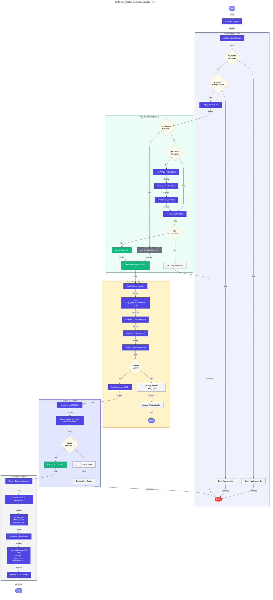

# 🔐 configure-federated-credential

> [!NOTE]
> **Target Audience**: DevOps Engineers, Security Engineers  
> **Reading Time**: ~12 minutes

<details>
<summary>📖 Navigation</summary>

| Previous | Index | Next |
|:---------|:-----:|-----:|
| [clean-secrets](clean-secrets.md) | [📚 Index](README.md) | [sql-managed-identity-config](sql-managed-identity-config.md) |

</details>

Configures federated identity credentials for GitHub Actions OIDC authentication.

## 📑 Table of Contents

- [📋 Overview](#-overview)
- [⚙️ Prerequisites](#️-prerequisites)
- [🎯 Parameters](#-parameters)
- [🌐 Environment Variables](#-environment-variables)
- [⚙️ Functionality](#️-functionality)
- [📖 Usage Examples](#-usage-examples)
- [💻 Platform Differences](#-platform-differences)
- [🚪 Exit Codes](#-exit-codes)
- [🔗 Related Hooks](#-related-hooks)

## 📋 Overview

This script adds or updates federated identity credentials in an Azure AD App Registration to enable GitHub Actions workflows to authenticate using OIDC (OpenID Connect).

### ❓ What is Federated Identity?

Federated identity credentials allow GitHub Actions workflows to authenticate to Azure without storing long-lived secrets. Instead, GitHub Actions obtains a short-lived OIDC token that Azure trusts based on the configured federation.

### 🔑 Key Operations

- Validates Azure CLI authentication
- Retrieves or looks up the App Registration
- Creates federated identity credential for the specified GitHub environment
- Configures the trust relationship with GitHub's OIDC provider

### 📅 When to Use

- Setting up CI/CD pipelines with GitHub Actions
- Configuring passwordless authentication for deployments
- Replacing service principal secrets with OIDC federation

## ⚙️ Prerequisites

### 🔧 Required Tools

| Tool | Minimum Version | Purpose |
|:-----|:---------------:|:--------|
| PowerShell Core | 7.0+ | Script execution (PowerShell version) |
| Bash | 4.0+ | Script execution (Bash version) |
| Azure CLI (az) | 2.40+ | Azure AD operations |
| jq | Latest | JSON parsing (Bash version only) |

### 🔐 Required Permissions

- **Azure CLI**: Must be authenticated (`az login`)
- **Azure AD**: Application Administrator or Owner of the App Registration
- **Microsoft Graph**: `Application.ReadWrite.All` permission

### ☁️ Required Azure AD Configuration

An App Registration must exist with:

- Service Principal created
- Appropriate Azure RBAC roles assigned for deployment

## 🎯 Parameters

### PowerShell Parameters

| Parameter | Type | Required | Default | Description |
|:----------|:----:|:--------:|:-------:|:------------|
| `-AppName` | String | No | None | Display name of the Azure AD App Registration |
| `-AppObjectId` | String | No | None | Object ID of the App Registration (alternative to AppName) |
| `-GitHubOrg` | String | No | `Evilazaro` | GitHub organization or username |
| `-GitHubRepo` | String | No | `Azure-LogicApps-Monitoring` | GitHub repository name |
| `-Environment` | String | No | `dev` | GitHub Environment name to configure |

### Bash Parameters

| Parameter | Type | Required | Default | Description |
|:----------|:----:|:--------:|:-------:|:------------|
| `--app-name` | String | No | None | Display name of the Azure AD App Registration |
| `--app-object-id` | String | No | None | Object ID of the App Registration |
| `--github-org` | String | No | `Evilazaro` | GitHub organization or username |
| `--github-repo` | String | No | `Azure-LogicApps-Monitoring` | GitHub repository name |
| `--environment` | String | No | `dev` | GitHub Environment name to configure |

## 🌐 Environment Variables

### Variables Read

This script does not require environment variables but can use them as fallbacks:

| Variable | Description |
|:---------|:------------|
| (None required) | |

### Variables Set

This script does not set any environment variables.

## ⚙️ Functionality

### 🔄 Execution Flow



### 📄 Federated Credential Structure

The script creates a federated identity credential with the following configuration:

```json
{
  "name": "github-{environment}",
  "issuer": "https://token.actions.githubusercontent.com",
  "subject": "repo:{org}/{repo}:environment:{environment}",
  "audiences": ["api://AzureADTokenExchange"],
  "description": "GitHub Actions OIDC for {environment} environment"
}
```

### 🎯 Subject Claim Patterns

GitHub OIDC tokens include different subject claims based on the trigger:

| Trigger | Subject Pattern |
|:--------|:----------------|
| Environment | `repo:{owner}/{repo}:environment:{environment}` |
| Branch | `repo:{owner}/{repo}:ref:refs/heads/{branch}` |
| Tag | `repo:{owner}/{repo}:ref:refs/tags/{tag}` |
| Pull Request | `repo:{owner}/{repo}:pull_request` |

This script configures the **environment** pattern.

## 📖 Usage Examples

### PowerShell

```powershell
# Configure using App Registration name
.\configure-federated-credential.ps1 -AppName 'my-app-registration'

# Configure using Object ID for specific environment
.\configure-federated-credential.ps1 -AppObjectId '00000000-0000-0000-0000-000000000000' -Environment 'prod'

# Configure for different GitHub repository
.\configure-federated-credential.ps1 -AppName 'my-app' -GitHubOrg 'my-org' -GitHubRepo 'my-repo' -Environment 'staging'

# Interactive mode (lists available apps)
.\configure-federated-credential.ps1
```

### Bash

```bash
# Configure using App Registration name
./configure-federated-credential.sh --app-name "my-app-registration"

# Configure using Object ID for specific environment
./configure-federated-credential.sh --app-object-id "00000000-0000-0000-0000-000000000000" --environment "prod"

# Configure for different GitHub repository
./configure-federated-credential.sh --app-name "my-app" --github-org "my-org" --github-repo "my-repo" --environment "staging"
```

### 📝 Sample Output

```
========================================
Federated Credential Configuration
========================================

Checking Azure CLI login status...
✓ Logged in as: user@example.com
✓ Subscription: My Azure Subscription (xxxxxxxx-xxxx-xxxx-xxxx-xxxxxxxxxxxx)

Looking up App Registration: my-app-registration
✓ Found App Registration:
    Display Name: my-app-registration
    App ID (Client ID): yyyyyyyy-yyyy-yyyy-yyyy-yyyyyyyyyyyy
    Object ID: zzzzzzzz-zzzz-zzzz-zzzz-zzzzzzzzzzzz

========================================
Configuring Federated Credential
========================================

GitHub Organization: Evilazaro
GitHub Repository: Azure-LogicApps-Monitoring
Environment: dev
Subject: repo:Evilazaro/Azure-LogicApps-Monitoring:environment:dev

✓ Federated credential 'github-dev' created successfully

========================================
Next Steps
========================================

Configure the following secrets in your GitHub repository:
  Settings > Secrets and variables > Actions

  AZURE_CLIENT_ID: yyyyyyyy-yyyy-yyyy-yyyy-yyyyyyyyyyyy
  AZURE_TENANT_ID: tttttttt-tttt-tttt-tttt-tttttttttttt
  AZURE_SUBSCRIPTION_ID: xxxxxxxx-xxxx-xxxx-xxxx-xxxxxxxxxxxx

Add this to your GitHub Actions workflow:

  - name: Azure Login
    uses: azure/login@v2
    with:
      client-id: ${{ secrets.AZURE_CLIENT_ID }}
      tenant-id: ${{ secrets.AZURE_TENANT_ID }}
      subscription-id: ${{ secrets.AZURE_SUBSCRIPTION_ID }}
```

## 💻 Platform Differences

| Aspect | PowerShell | Bash |
|:-------|:-----------|:-----|
| Azure CLI calls | `az ad app ...` | `az ad app ...` |
| JSON parsing | `ConvertFrom-Json` | `jq` |
| Interactive prompt | `Read-Host` | `read -p` |
| Dependency check | `Get-Command` | `command -v` |

## 🚪 Exit Codes

| Code | Meaning |
|:----:|:--------|
| `0` | Success - federated credential configured |
| `1` | Error - not logged in, app not found, or configuration failed |

## 🔗 Related Hooks

| Hook | Relationship |
|:-----|:-------------|
| [preprovision](preprovision.md) | May provision the App Registration that this script configures |
| [postprovision](postprovision.md) | Often run after provisioning to set up CI/CD |

## 🐙 GitHub Actions Workflow Example

After running this script, use the following in your GitHub Actions workflow:

```yaml
name: Deploy to Azure

on:
  push:
    branches: [main]

permissions:
  id-token: write  # Required for OIDC
  contents: read

jobs:
  deploy:
    runs-on: ubuntu-latest
    environment: dev  # Must match the configured environment
    
    steps:
      - uses: actions/checkout@v4
      
      - name: Azure Login
        uses: azure/login@v2
        with:
          client-id: ${{ secrets.AZURE_CLIENT_ID }}
          tenant-id: ${{ secrets.AZURE_TENANT_ID }}
          subscription-id: ${{ secrets.AZURE_SUBSCRIPTION_ID }}
      
      - name: Deploy
        run: azd deploy
```

## 🔧 Troubleshooting

### ⚠️ Common Issues

1. **"Not logged in to Azure CLI"**
   - Run `az login` before executing the script

2. **"App Registration not found"**
   - Verify the app name is spelled correctly
   - Ensure you have permissions to view the app registration

3. **"Failed to create federated credential"**
   - Verify you have Application Administrator or Owner role
   - Check if a credential with the same name already exists

4. **"AADSTS700024: Client assertion is not within its valid time range"**
   - Ensure system clock is synchronized
   - GitHub OIDC tokens are time-sensitive

### ✅ Verifying Configuration

```bash
# List federated credentials for an app
az ad app federated-credential list --id <app-object-id>

# Show specific credential
az ad app federated-credential show --id <app-object-id> --federated-credential-id <cred-id>
```

---

<div align="center">

**[← clean-secrets](clean-secrets.md)** · **[⬆️ Back to Top](#-configure-federated-credential)** · **[sql-managed-identity-config →](sql-managed-identity-config.md)**

</div>

**Version**: 1.0.0  
**Author**: Azure Developer CLI Hook  
**Last Modified**: January 2026
