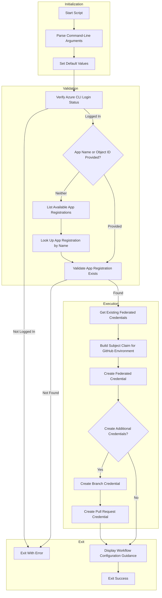

# Configure Federated Identity Credentials for GitHub Actions OIDC

## Overview

This script configures federated identity credentials in an Azure AD App Registration to enable GitHub Actions workflows to authenticate using OpenID Connect (OIDC) without storing secrets. This enables secure, passwordless authentication between GitHub Actions and Azure resources.

The script is implemented in **both PowerShell and Bash** to support cross-platform execution and can be run as an Azure Developer CLI (azd) hook or standalone utility.

## Table of Contents

- [Script Classification](#script-classification)
- [Supported Environments](#supported-environments)
- [Prerequisites](#prerequisites)
- [Files](#files)
- [High-Level Script Flow](#high-level-script-flow)
- [Usage](#usage)
- [Parameters](#parameters)
- [Examples](#examples)
- [Error Handling and Exit Codes](#error-handling--exit-codes)
- [Logging and Output](#logging--output)
- [Security Considerations](#security-considerations)
- [Troubleshooting](#troubleshooting)
- [Development Notes](#development-notes)
- [License and Ownership](#license--ownership)
- [Related Links](#related-links)

## Script Classification

| Attribute | Value |
|-----------|-------|
| **Category** | Azure Security & Identity Configuration |
| **Trigger Mechanism** | Manual execution or azd hook |
| **azd Hook** | Can be configured as post-provision hook |

## Supported Environments

### Shells

| Shell | Minimum Version |
|-------|-----------------|
| PowerShell | 7.0+ |
| Bash | 4.0+ |

### Operating Systems

| OS | Supported |
|----|-----------|
| Windows | ✓ |
| Linux | ✓ |
| macOS | ✓ |

## Prerequisites

> [!WARNING]
> You must have Application Administrator or Owner role on the target App Registration to create federated credentials.

| Prerequisite | Required | Description |
|--------------|----------|-------------|
| Azure CLI | Yes | Must be installed and authenticated (`az login`) |
| jq | Yes (Bash only) | JSON processor for parsing Azure CLI output |
| App Registration | Yes | Target Azure AD App Registration must exist |
| Permissions | Yes | Must have Application Administrator or Owner role on the App Registration |

## Files

| File | Description |
|------|-------------|
| `configure-federated-credential.ps1` | PowerShell implementation |
| `configure-federated-credential.sh` | Bash implementation |

## High-Level Script Flow



## Usage

> [!TIP]
> If you don't provide `AppName` or `AppObjectId`, the script will list available App Registrations for interactive selection.

### PowerShell

```powershell
# Configure using App Registration display name
./configure-federated-credential.ps1 -AppName 'my-app-registration'

# Configure using App Object ID with custom environment
./configure-federated-credential.ps1 -AppObjectId '00000000-0000-0000-0000-000000000000' -Environment 'prod'

# Configure with custom GitHub organization and repository
./configure-federated-credential.ps1 -AppName 'my-app' -GitHubOrg 'MyOrg' -GitHubRepo 'MyRepo' -Environment 'staging'

# Interactive mode (lists available App Registrations)
./configure-federated-credential.ps1
```

### Bash

```bash
# Configure using App Registration display name
./configure-federated-credential.sh --app-name "my-app-registration"

# Configure using App Object ID with custom environment
./configure-federated-credential.sh --app-object-id "00000000-0000-0000-0000-000000000000" --environment "prod"

# Configure with custom GitHub organization and repository
./configure-federated-credential.sh --app-name "my-app" --github-org "MyOrg" --github-repo "MyRepo"

# Display help
./configure-federated-credential.sh --help
```

## Parameters

| Logical Parameter | PowerShell Name | Bash Name | Required | Default | Description |
|-------------------|-----------------|-----------|----------|---------|-------------|
| App Name | `-AppName` | `--app-name` | No* | N/A | Display name of the Azure AD App Registration |
| App Object ID | `-AppObjectId` | `--app-object-id` | No* | N/A | Object ID of the Azure AD App Registration |
| GitHub Organization | `-GitHubOrg` | `--github-org` | No | `Evilazaro` | GitHub organization or username |
| GitHub Repository | `-GitHubRepo` | `--github-repo` | No | `Azure-LogicApps-Monitoring` | GitHub repository name |
| Environment | `-Environment` | `--environment` | No | `dev` | GitHub Environment name for OIDC |
| Help | N/A | `-h`, `--help` | No | N/A | Display help message |

*Either `AppName` or `AppObjectId` should be provided; if neither is provided, the script lists available App Registrations.

## Examples

### Configure for Development Environment

**PowerShell:**

```powershell
./configure-federated-credential.ps1 -AppName 'my-app-registration'
```

**Bash:**

```bash
./configure-federated-credential.sh --app-name "my-app-registration"
```

### Configure for Production Environment

**PowerShell:**

```powershell
./configure-federated-credential.ps1 -AppObjectId '00000000-0000-0000-0000-000000000000' -Environment 'prod'
```

**Bash:**

```bash
./configure-federated-credential.sh --app-object-id "00000000-0000-0000-0000-000000000000" --environment "prod"
```

### Configure for Custom Repository

**PowerShell:**

```powershell
./configure-federated-credential.ps1 -AppName 'my-app' -GitHubOrg 'MyOrg' -GitHubRepo 'MyRepo' -Environment 'staging'
```

**Bash:**

```bash
./configure-federated-credential.sh --app-name "my-app" --github-org "MyOrg" --github-repo "MyRepo" --environment "staging"
```

## Error Handling & Exit Codes

| Exit Code | Description |
|-----------|-------------|
| 0 | Federated credential configured successfully |
| 1 | Error (Azure CLI not logged in, App Registration not found, or operation failed) |

### Error Behavior

- Both implementations validate Azure CLI login status before proceeding
- App Registration lookup failures result in immediate exit with error message
- Federated credential creation failures are reported with detailed error information

## Logging & Output

| Output Type | Description |
|-------------|-------------|
| stdout | Status messages, App Registration details, configuration guidance |
| stderr | Error messages |
| Color-coded output | Visual distinction for success (green), warnings (yellow), errors (red), info (cyan) |

### Workflow Configuration Guidance

> [!NOTE]
> After running this script, update your GitHub Actions workflow with the following configuration.

Upon successful completion, the script displays guidance for configuring GitHub Actions workflows:

```yaml
permissions:
  id-token: write
  contents: read

- uses: azure/login@v2
  with:
    client-id: ${{ secrets.AZURE_CLIENT_ID }}
    tenant-id: ${{ secrets.AZURE_TENANT_ID }}
    subscription-id: ${{ secrets.AZURE_SUBSCRIPTION_ID }}
```

## Security Considerations

- Uses Azure CLI authentication (no additional credentials stored)
- Federated credentials enable passwordless authentication via OIDC
- Subject claims are scoped to specific GitHub environments, branches, or pull requests
- OIDC issuer: `https://token.actions.githubusercontent.com`
- Audience: `api://AzureADTokenExchange`

## Troubleshooting

| Issue | Resolution |
|-------|------------|
| `Not logged in to Azure CLI` | Run `az login` to authenticate |
| `App Registration not found` | Verify the App Registration name/ID and that you have access |
| `Failed to create federated credential` | Check permissions on the App Registration |
| `jq is required but not installed` (Bash) | Install jq: `brew install jq` (macOS), `apt-get install jq` (Ubuntu) |
| Credential already exists | The script will report existing credentials; delete and re-create if needed |

## Development Notes

- Both implementations use the Azure CLI `az ad app federated-credential` commands
- Temporary files are created for JSON parameters and cleaned up after use
- Subject claim format: `repo:{org}/{repo}:environment:{environment}`

## License & Ownership

| Attribute | Value |
|-----------|-------|
| Author | Azure Developer CLI Hook |
| Requires | Azure CLI, PowerShell 7.0+ / Bash 4.0+, jq (Bash) |
| Repository | [Azure-LogicApps-Monitoring](https://github.com/Evilazaro/Azure-LogicApps-Monitoring) |

## Related Links

- See [Azure AD Workload Identity Federation](https://docs.microsoft.com/azure/active-directory/develop/workload-identity-federation)
- See [GitHub Actions OIDC in Azure](https://docs.github.com/en/actions/deployment/security-hardening-your-deployments/configuring-openid-connect-in-azure)
