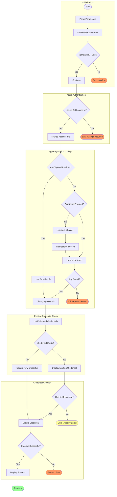

# configure-federated-credential

## Synopsis

Configures federated identity credentials for GitHub Actions OIDC authentication in an Azure AD App Registration, enabling passwordless authentication from GitHub Actions workflows.

## Description

This script adds or updates federated identity credentials in an Azure AD (Microsoft Entra ID) App Registration to enable GitHub Actions workflows to authenticate using OpenID Connect (OIDC). OIDC authentication eliminates the need to store long-lived secrets in GitHub, improving security posture significantly.

The script is designed to run as an Azure Developer CLI (azd) hook where environment variables are automatically loaded during the provisioning process. It can also be run manually to configure federated credentials for existing App Registrations.

When executed, the script validates Azure CLI authentication, looks up the App Registration by name or Object ID, checks for existing federated credentials to avoid duplicates, and creates a new federated credential configured for the specified GitHub repository and environment. The credential allows GitHub Actions running in that environment to obtain Azure AD tokens without storing client secrets.

## Workflow Diagram



## Prerequisites

| Category | Requirement | Version | Verification Command | Required |
|----------|-------------|---------|---------------------|----------|
| Runtime | PowerShell Core | >= 7.0 | `$PSVersionTable.PSVersion` | Yes |
| Runtime | Bash | >= 4.0 | `bash --version` | Yes |
| CLI Tool | Azure CLI | >= 2.50 | `az --version` | Yes |
| CLI Tool | jq (Bash only) | Latest | `jq --version` | Yes (Bash) |
| Permission | Application.ReadWrite.All | N/A | Microsoft Graph API | Yes |
| Permission | Directory.Read.All | N/A | Microsoft Graph API | Yes |

### Installation Commands

```bash
# Install jq (Bash dependency)
# macOS
brew install jq

# Ubuntu/Debian
sudo apt-get install jq

# RHEL/CentOS
sudo yum install jq
```

## Parameters/Arguments

### PowerShell Parameters

| Parameter | Type | Required | Default | Description |
|-----------|------|----------|---------|-------------|
| `-AppName` | `[string]` | No | N/A | Display name of the Azure AD App Registration |
| `-AppObjectId` | `[string]` | No | N/A | Object ID of the Azure AD App Registration |
| `-GitHubOrg` | `[string]` | No | `Evilazaro` | GitHub organization or username |
| `-GitHubRepo` | `[string]` | No | `Azure-LogicApps-Monitoring` | GitHub repository name |
| `-Environment` | `[string]` | No | `dev` | GitHub Environment name to configure |

### Bash Arguments

| Position/Flag | Type | Required | Default | Description |
|---------------|------|----------|---------|-------------|
| `--app-name` | string | No | N/A | Display name of the Azure AD App Registration |
| `--app-object-id` | string | No | N/A | Object ID of the Azure AD App Registration |
| `--github-org` | string | No | `Evilazaro` | GitHub organization or username |
| `--github-repo` | string | No | `Azure-LogicApps-Monitoring` | GitHub repository name |
| `--environment` | string | No | `dev` | GitHub Environment name to configure |

## Input/Output Specifications

### Inputs

**Environment Variables Read:**

- None required (can be passed as parameters)

**Required API Permissions:**

- Microsoft Graph: `Application.ReadWrite.All`
- Microsoft Graph: `Directory.Read.All`

### Outputs

**Exit Codes:**

| Exit Code | Meaning |
|-----------|---------|
| 0 | Success - Credential created or already exists |
| 1 | Error - Azure CLI not authenticated or permission denied |

**stdout Output:**

- Azure account information
- App Registration details
- Federated credential configuration
- Success/failure messages

**Azure Resources Modified:**

- Federated identity credential added to App Registration

## Usage Examples

### Basic Usage

```powershell
# PowerShell: Configure with App Registration name
.\configure-federated-credential.ps1 -AppName 'my-app-registration'
```

```bash
# Bash: Configure with App Registration name
./configure-federated-credential.sh --app-name "my-app-registration"
```

### Advanced Usage

```powershell
# PowerShell: Configure for production environment with specific repo
.\configure-federated-credential.ps1 -AppObjectId '00000000-0000-0000-0000-000000000000' -Environment 'prod'

# PowerShell: Configure for custom GitHub organization and repo
.\configure-federated-credential.ps1 -AppName 'my-app' -GitHubOrg 'MyOrg' -GitHubRepo 'MyRepo' -Environment 'staging'
```

```bash
# Bash: Configure for production environment
./configure-federated-credential.sh --app-object-id "00000000-0000-0000-0000-000000000000" --environment "prod"

# Bash: Configure for custom GitHub organization and repo
./configure-federated-credential.sh --app-name "my-app" --github-org "MyOrg" --github-repo "MyRepo" --environment "staging"
```

### CI/CD Pipeline Usage

```yaml
# Azure DevOps Pipeline - Setup federated credential
- task: AzureCLI@2
  displayName: 'Configure OIDC credential'
  inputs:
    azureSubscription: 'Azure-Connection'
    scriptType: 'pscore'
    scriptLocation: 'scriptPath'
    scriptPath: '$(System.DefaultWorkingDirectory)/hooks/configure-federated-credential.ps1'
    arguments: '-AppName "$(APP_REGISTRATION_NAME)" -Environment "$(ENVIRONMENT_NAME)"'

# GitHub Actions - Note: This would typically be run manually or as part of setup
- name: Configure federated credential
  shell: bash
  run: |
    az login --service-principal -u ${{ secrets.AZURE_CLIENT_ID }} -p ${{ secrets.AZURE_CLIENT_SECRET }} --tenant ${{ secrets.AZURE_TENANT_ID }}
    ./hooks/configure-federated-credential.sh --app-name "${{ vars.APP_NAME }}" --environment "prod"
```

## Error Handling and Exit Codes

| Exit Code | Meaning | Recovery Action |
|-----------|---------|-----------------|
| 0 | Success | N/A |
| 1 | Error | Check Azure CLI auth, verify permissions |

### Error Handling Approach

**PowerShell:**

- `Set-StrictMode -Version Latest` for strict mode
- `$ErrorActionPreference = 'Stop'` for fail-fast
- Try/Catch for Azure CLI command errors
- Graceful handling of existing credentials

**Bash:**

- `set -euo pipefail` for strict error handling
- JSON parsing with jq for reliable data extraction
- Temporary file cleanup on exit
- Clear error messages for common failures

## Security Considerations

### Credential Handling

- [x] No hardcoded secrets
- [x] OIDC eliminates need for long-lived secrets
- [x] Uses Azure CLI session for authentication
- [x] Federated credentials have limited scope

### Required Permissions

| Permission/Role | Scope | Justification |
|-----------------|-------|---------------|
| Application.ReadWrite.All | Microsoft Graph | Create federated credentials |
| Directory.Read.All | Microsoft Graph | List App Registrations |
| Application Administrator | Entra ID Role | Alternative to Graph permissions |

### Network Security

- **Endpoints accessed:** Microsoft Graph API (`graph.microsoft.com`)
- **TLS requirements:** TLS 1.2+
- **OIDC Issuer:** `https://token.actions.githubusercontent.com`
- **Audience:** `api://AzureADTokenExchange`

### Logging Security

- **Sensitive data masking:** Object IDs shown, no secrets logged
- **Audit trail:** Azure AD audit logs capture credential creation

## Known Limitations

- Only configures environment-scoped credentials (not branch or PR)
- Interactive prompt required if App name not provided
- Cannot update existing credentials (must delete and recreate)
- Requires Application Administrator or equivalent permissions
- GitHub Enterprise Server may require different OIDC issuer

## Related Scripts

| Script | Relationship | Description |
|--------|--------------|-------------|
| [preprovision.md](preprovision.md) | Related | May trigger this as part of setup |
| [postprovision.md](postprovision.md) | Related | May be called after provisioning |

## Changelog

| Version | Date | Changes |
|---------|------|---------|
| 1.0.0 | 2026-01-06 | Initial release |
