# configure-federated-credential

[Home](../../README.md) > [Docs](..) > [Hooks](README.md) > configure-federated-credential

> 🔑 Configures federated identity credentials for GitHub Actions OIDC authentication

---

## Table of Contents

- [Overview](#overview)
- [Compatibility](#compatibility)
- [Prerequisites](#prerequisites)
- [Parameters](#parameters)
- [Script Flow](#script-flow)
- [External Interactions](#external-interactions)
- [Functions](#functions)
- [Usage](#usage)
- [Environment Variables](#environment-variables)
- [Exit Codes](#exit-codes)
- [Error Handling](#error-handling)
- [Notes](#notes)
- [See Also](#see-also)

---

## Overview

This script adds or updates federated identity credentials in an Azure AD App Registration to enable GitHub Actions workflows to authenticate using OpenID Connect (OIDC) without storing secrets.

**Operations Performed:**

1. Verifies Azure CLI login status
2. Retrieves or looks up the target App Registration by name or Object ID
3. Lists existing federated credentials for the App Registration
4. Creates a new federated credential for the specified GitHub environment
5. Optionally creates additional credentials for the main branch and pull requests
6. Displays workflow configuration guidance

---

## Compatibility

| Platform    | Script                            | Status |
|:------------|:----------------------------------|:------:|
| Windows     | `configure-federated-credential.ps1` |   ✅   |
| Linux/macOS | `configure-federated-credential.sh`  |   ✅   |

---

## Prerequisites

| Requirement | Details | Installation Guide |
|:------------|:--------|:-------------------|
| **PowerShell** | 7.0 or higher | [Install PowerShell](https://docs.microsoft.com/powershell/scripting/install/installing-powershell) |
| **Bash** | 4.0 or higher | Pre-installed on Linux/macOS |
| **Azure CLI** | Latest version | [Install Azure CLI](https://docs.microsoft.com/cli/azure/install-azure-cli) |
| **jq** | JSON processor (Bash only) | [Install jq](https://stedolan.github.io/jq/download/) |

---

## Parameters

| Parameter | Type | Required | Default | Description |
|:----------|:----:|:--------:|:-------:|:------------|
| `-AppName` / `--app-name` | String | No | N/A | Display name of the Azure AD App Registration |
| `-AppObjectId` / `--app-object-id` | String | No | N/A | Object ID of the App Registration (takes precedence over AppName) |
| `-GitHubOrg` / `--github-org` | String | No | `Evilazaro` | GitHub organization or username |
| `-GitHubRepo` / `--github-repo` | String | No | `Azure-LogicApps-Monitoring` | GitHub repository name |
| `-Environment` / `--environment` | String | No | `dev` | GitHub Environment name for OIDC |
| `--help` / `-h` | Switch | No | N/A | Displays help message (Bash only) |

---

## Script Flow

### Execution Flow

```mermaid
%%{init: {'flowchart': {'nodeSpacing': 30, 'rankSpacing': 40, 'curve': 'basis'}}}%%
flowchart TD
    subgraph INIT["🔧 Initialization"]
        direction TB
        A([▶️ Start]):::startNode
        A --> B[🔧 Parse Arguments]:::config
        B --> C[📋 Display Banner]:::logging
    end

    subgraph VALIDATE["✅ Validation Phase"]
        direction TB
        D{🔍 jq Installed?}:::validation
        D -->|❌ No| E1[❗ jq Not Found]:::error
        D -->|✅ Yes| E{🔐 Azure Logged In?}:::auth
        E -->|❌ No| E2[❗ Not Authenticated]:::error
        E -->|✅ Yes| F[✅ Prerequisites Valid]:::logging
    end

    subgraph RESOLVE["🔍 App Resolution"]
        direction TB
        G{📋 AppObjectId Provided?}:::decision
        G -->|Yes| H[✅ Use Object ID]:::logging
        G -->|No| I{📋 AppName Provided?}:::decision
        I -->|No| J[📋 List App Registrations]:::data
        J --> K[📋 Prompt for Selection]:::logging
        I -->|Yes| L[🔍 Lookup by Name]:::external
        L --> M{🔍 App Found?}:::validation
        M -->|❌ No| E3[❗ App Not Found]:::error
        M -->|✅ Yes| N[📋 Display App Info]:::logging
    end

    subgraph EXECUTE["⚡ Execution Phase"]
        direction TB
        O[🔍 List Existing Credentials]:::data
        O --> P{📋 Credential Exists?}:::decision
        P -->|Yes| Q[📋 Display Existing]:::logging
        P -->|No| R[🔑 Create Credential]:::auth
        R --> S[🌐 az ad app federated-credential create]:::external
        S --> T{✅ Created Successfully?}:::validation
        T -->|❌ No| E4[❗ Creation Failed]:::error
        T -->|✅ Yes| U[✅ Display Success]:::logging
    end

    subgraph CLEANUP["🧹 Cleanup Phase"]
        direction TB
        V[📋 Display Workflow Config]:::logging
        V --> W[📋 Show GitHub Secrets]:::data
    end

    subgraph EXIT["🚪 Exit Handling"]
        direction TB
        X([❌ Exit 1]):::errorExit
        Y([✅ Exit 0]):::successExit
    end

    %% Cross-subgraph connections
    C --> D
    E1 --> X
    E2 --> X
    F --> G
    H --> O
    K --> L
    N --> O
    E3 --> X
    Q --> V
    U --> V
    E4 --> X
    W --> Y

    %% Subgraph styles
    style INIT fill:#e8eaf6,stroke:#303f9f,stroke-width:2px,color:#1a237e
    style VALIDATE fill:#fff8e1,stroke:#ffa000,stroke-width:2px,color:#ff6f00
    style RESOLVE fill:#e3f2fd,stroke:#1976d2,stroke-width:2px,color:#0d47a1
    style EXECUTE fill:#e0f2f1,stroke:#00796b,stroke-width:2px,color:#004d40
    style CLEANUP fill:#ede7f6,stroke:#512da8,stroke-width:2px,color:#311b92
    style EXIT fill:#eceff1,stroke:#455a64,stroke-width:2px,color:#263238

    %% Node class definitions
    classDef startNode fill:#b3e5fc,stroke:#0288d1,stroke-width:3px,color:#01579b
    classDef successExit fill:#c8e6c9,stroke:#388e3c,stroke-width:3px,color:#1b5e20
    classDef errorExit fill:#ffcdd2,stroke:#d32f2f,stroke-width:3px,color:#b71c1c
    classDef decision fill:#ffe0b2,stroke:#f57c00,stroke-width:2px,color:#e65100
    classDef validation fill:#fff9c4,stroke:#f9a825,stroke-width:2px,color:#f57f17
    classDef auth fill:#b2ebf2,stroke:#0097a7,stroke-width:2px,color:#006064
    classDef external fill:#bbdefb,stroke:#1976d2,stroke-width:2px,color:#0d47a1
    classDef error fill:#ffebee,stroke:#e53935,stroke-width:2px,color:#c62828
    classDef logging fill:#d7ccc8,stroke:#6d4c41,stroke-width:2px,color:#3e2723
    classDef config fill:#c5cae9,stroke:#3949ab,stroke-width:2px,color:#1a237e
    classDef data fill:#f0f4c3,stroke:#9e9d24,stroke-width:2px,color:#827717
```



### External Interactions

```mermaid
%%{init: {'sequence': {'mirrorActors': false, 'boxMargin': 10, 'boxTextMargin': 5}}}%%
sequenceDiagram
    box rgb(227, 242, 253) Local Environment
        participant Script as 🖥️ configure-federated-credential
    end
    
    box rgb(224, 247, 250) Microsoft Entra ID
        participant AzCLI as 🔐 Azure CLI
        participant EntraID as 🔑 Microsoft Entra ID
    end
    
    box rgb(255, 243, 224) GitHub
        participant GitHub as 🐙 GitHub Actions
    end

    Script->>AzCLI: 🔍 az account show
    AzCLI-->>Script: ✅ Account Info
    
    alt Lookup App by Name
        Script->>AzCLI: 🔍 az ad app list --display-name
        AzCLI->>EntraID: Query App Registrations
        EntraID-->>AzCLI: 📋 App Details
        AzCLI-->>Script: 📋 App Object ID
    end
    
    Script->>AzCLI: 🔍 az ad app federated-credential list
    AzCLI->>EntraID: List Federated Credentials
    EntraID-->>AzCLI: 📋 Existing Credentials
    AzCLI-->>Script: 📋 Credential List
    
    Script->>AzCLI: 🔑 az ad app federated-credential create
    AzCLI->>EntraID: Create Federated Credential
    Note over EntraID: Subject: repo:{org}/{repo}:environment:{env}
    EntraID-->>AzCLI: ✅ Credential Created
    AzCLI-->>Script: ✅ Success
    
    Note over Script,GitHub: GitHub Actions can now authenticate via OIDC
    GitHub->>EntraID: 🔑 Request Token (OIDC)
    EntraID-->>GitHub: 🔑 Access Token
```



---

## Functions

### PowerShell Functions

| Function | Purpose |
|:---------|:--------|
| `Write-InfoMessage` | Writes informational message with color |
| `Write-SectionHeader` | Writes formatted section header |
| `Test-AzureCliLogin` | Verifies Azure CLI login status |
| `Get-AppRegistration` | Retrieves App Registration by name or Object ID |
| `Get-FederatedCredentials` | Lists existing federated credentials |
| `New-FederatedCredential` | Creates a new federated credential |

### Bash Functions

| Function | Purpose |
|:---------|:--------|
| `write_info` | Writes colored output messages |
| `write_section_header` | Writes formatted section headers |
| `test_azure_cli_login` | Verifies Azure CLI authentication |
| `get_app_registration` | Retrieves App Registration details |
| `get_federated_credentials` | Lists existing credentials |
| `create_federated_credential` | Creates new federated credential |

---

## Usage

### PowerShell

```powershell
# Configure using App Registration display name
.\configure-federated-credential.ps1 -AppName 'my-app-registration'

# Configure using App Object ID with custom environment
.\configure-federated-credential.ps1 -AppObjectId '00000000-0000-0000-0000-000000000000' -Environment 'prod'

# Configure with custom GitHub organization and repository
.\configure-federated-credential.ps1 -AppName 'my-app' -GitHubOrg 'MyOrg' -GitHubRepo 'MyRepo' -Environment 'staging'

# Interactive mode (prompts for App Registration selection)
.\configure-federated-credential.ps1
```

### Bash

```bash
# Configure using App Registration display name
./configure-federated-credential.sh --app-name "my-app-registration"

# Configure using App Object ID with custom environment
./configure-federated-credential.sh --app-object-id "00000000-0000-0000-0000-000000000000" --environment "prod"

# Configure with custom GitHub organization and repository
./configure-federated-credential.sh --app-name "my-app" --github-org "MyOrg" --github-repo "MyRepo"

# Display help
./configure-federated-credential.sh --help
```

---

## Environment Variables

| Variable | Description | Required | Default |
|:---------|:------------|:--------:|:-------:|
| N/A | All configuration is passed via parameters | N/A | N/A |

---

## Exit Codes

| Code | Meaning |
|-----:|:--------|
| 0 | ✅ Success - Federated credential configured |
| 1 | ❌ Error - Missing dependency, authentication failure, or operation failed |

---

## Error Handling

The script implements comprehensive error handling:

- **Dependency Validation**: Checks for jq (Bash) and Azure CLI
- **Authentication Check**: Verifies Azure CLI login before proceeding
- **App Registration Validation**: Confirms App Registration exists
- **Duplicate Detection**: Checks for existing credentials before creating
- **Detailed Error Messages**: Provides actionable guidance on failures

---

## Notes

| Item | Details |
|:-----|:--------|
| **Version** | 1.0.0 |
| **Author** | Azure Developer CLI Hook |
| **OIDC Issuer** | `https://token.actions.githubusercontent.com` |
| **Audience** | `api://AzureADTokenExchange` |

**Federated Credential Subject Formats:**

| Scenario | Subject Claim Format |
|:---------|:---------------------|
| GitHub Environment | `repo:{org}/{repo}:environment:{environment}` |
| Branch | `repo:{org}/{repo}:ref:refs/heads/{branch}` |
| Pull Request | `repo:{org}/{repo}:pull_request` |

> ℹ️ **Note**: Federated credentials enable passwordless authentication from GitHub Actions to Azure. No secrets need to be stored in GitHub.

> 💡 **Tip**: After running this script, add the following secrets to your GitHub repository:
>
> - `AZURE_CLIENT_ID` - App Registration Application (client) ID
> - `AZURE_TENANT_ID` - Azure AD Tenant ID
> - `AZURE_SUBSCRIPTION_ID` - Target Azure Subscription ID

---

## See Also

- [Azure AD Workload Identity Federation](https://docs.microsoft.com/azure/active-directory/develop/workload-identity-federation)
- [GitHub Actions OIDC](https://docs.github.com/actions/deployment/security-hardening-your-deployments/configuring-openid-connect-in-azure)
- [README.md](README.md) — Hooks documentation overview

---

[← Back to Hooks Documentation](README.md)
