# 🔑 configure-federated-credential (.ps1 / .sh)

> [!NOTE]
> 🎯 **For DevOps Engineers**: Configure GitHub Actions OIDC federated credentials for passwordless Azure authentication.
> ⏱️ **Execution time:** ~20-40 seconds


<details>
<summary>📍 <strong>Quick Navigation</strong></summary>

| Previous | Index | Next |
|:---------|:------:|--------:|
| [← Post-Infra Delete](postinfradelete.md) | [📑 Index](README.md) | [Validation Workflow →](VALIDATION-WORKFLOW.md) |

</details>

---

## 📑 Table of Contents

- [📋 Overview](#-overview)
- [🎯 Purpose](#-purpose)
- [📋 Prerequisites](#-prerequisites)
  - [🔧 Required Tools](#-required-tools)
  - [☁️ Azure Requirements](#️-azure-requirements)
- [📁 Files](#-files)
- [⚙️ Parameters](#️-parameters)
  - [💻 PowerShell (`configure-federated-credential.ps1`)](#-powershell-configure-federated-credentialps1)
  - [🐚 Bash (`configure-federated-credential.sh`)](#-bash-configure-federated-credentialsh)
- [🚀 Usage Examples](#-usage-examples)
  - [💻 PowerShell Examples](#-powershell-examples)
  - [🐚 Bash Examples](#-bash-examples)
- [🔍 What the Script Does](#-what-the-script-does)
  - [🔄 Execution Flow](#-execution-flow)
  - [📊 Workflow Diagram](#-workflow-diagram)
- [🔑 Federated Credential Types](#-federated-credential-types)
- [⚙️ GitHub Actions Configuration](#️-github-actions-configuration)
  - [📜 Workflow Permissions](#-workflow-permissions)
  - [🔐 Azure Login Action](#-azure-login-action)
  - [🔒 Required GitHub Secrets](#-required-github-secrets)
- [🛠️ Script Behavior](#️-script-behavior)
  - [🖥️ Interactive Mode](#️-interactive-mode)
  - [🔄 Idempotent Operations](#-idempotent-operations)
- [⚠️ Error Handling](#️-error-handling)
- [🔢 Exit Codes](#-exit-codes)
- [🔐 Security Considerations](#-security-considerations)
- [📖 Related Documentation](#-related-documentation)
- [📜 Version History](#-version-history)

---

## 📋 Overview

The `configure-federated-credential` script configures federated identity credentials for GitHub Actions OIDC (OpenID Connect) authentication. This enables GitHub Actions workflows to authenticate to Azure without storing secrets, using Azure AD workload identity federation.

Available in both PowerShell (`.ps1`) and Bash (`.sh`) versions for cross-platform compatibility, this script is designed to be **idempotent** and can be safely re-run. It will skip existing credentials with the same subject claim without errors.

The script supports creating three types of federated credentials: environment-based (for GitHub environments), branch-based (for specific branches like `main`), and pull request-based (for PR workflows).

---

## 🎯 Purpose

This script performs the following operations:

| Operation                                 | Description                                               |
| ----------------------------------------- | --------------------------------------------------------- |
| ✅ **Validates Azure CLI authentication** | Ensures user is logged in to Azure CLI                    |
| ✅ **Retrieves App Registration**         | Looks up the App Registration by name or Object ID        |
| ✅ **Lists existing credentials**         | Shows any existing federated credentials on the app       |
| ✅ **Creates environment credential**     | Creates a federated credential for the GitHub environment |
| ✅ **Optional branch credential**         | Offers to create a credential for the `main` branch       |
| ✅ **Optional PR credential**             | Offers to create a credential for pull requests           |
| ✅ **Displays workflow guidance**         | Shows how to configure GitHub Actions workflows           |

---

## 📋 Prerequisites

### 🔧 Required Tools

| Tool           | Minimum Version | Purpose                              | Installation                          |
| -------------- | --------------- | ------------------------------------ | ------------------------------------- |
| **PowerShell** | 7.0+            | Script runtime (Windows/macOS/Linux) | `winget install Microsoft.PowerShell` |
| **Bash**       | 4.0+            | Script runtime (macOS/Linux)         | Pre-installed on most systems         |
| **Azure CLI**  | 2.50+           | Azure resource management            | `winget install Microsoft.AzureCLI`   |
| **jq**         | Any             | JSON parsing (Bash only)             | `apt install jq` / `brew install jq`  |

### ☁️ Azure Requirements

- Active Azure subscription
- Permission to manage App Registrations and federated credentials
- Existing Azure AD App Registration to configure
- Authenticated Azure CLI session (`az login`)

---

## 📁 Files

| File                                 | Platform            | Description                    |
| ------------------------------------ | ------------------- | ------------------------------ |
| `configure-federated-credential.ps1` | Windows/Linux/macOS | PowerShell Core implementation |
| `configure-federated-credential.sh`  | Linux/macOS         | Bash implementation            |

---

## ⚙️ Parameters

### 💻 PowerShell (`configure-federated-credential.ps1`)

| Parameter      | Type   | Required | Default                      | Description                                   |
| -------------- | ------ | -------- | ---------------------------- | --------------------------------------------- |
| `-AppName`     | String | No       | -                            | Display name of the Azure AD App Registration |
| `-AppObjectId` | String | No       | -                            | Object ID of the Azure AD App Registration    |
| `-GitHubOrg`   | String | No       | `Evilazaro`                  | GitHub organization or username               |
| `-GitHubRepo`  | String | No       | `Azure-LogicApps-Monitoring` | GitHub repository name                        |
| `-Environment` | String | No       | `dev`                        | GitHub Environment name to configure          |

### 🐚 Bash (`configure-federated-credential.sh`)

| Parameter         | Short | Required | Default                      | Description                                   |
| ----------------- | ----- | -------- | ---------------------------- | --------------------------------------------- |
| `--app-name`      | -     | No       | -                            | Display name of the Azure AD App Registration |
| `--app-object-id` | -     | No       | -                            | Object ID of the Azure AD App Registration    |
| `--github-org`    | -     | No       | `Evilazaro`                  | GitHub organization or username               |
| `--github-repo`   | -     | No       | `Azure-LogicApps-Monitoring` | GitHub repository name                        |
| `--environment`   | -     | No       | `dev`                        | GitHub Environment name to configure          |
| `--help`          | `-h`  | No       | -                            | Display help message                          |

---

## 🚀 Usage Examples

### 💻 PowerShell Examples

```powershell
# Using App Name
./configure-federated-credential.ps1 -AppName 'my-app-registration'

# Using App Object ID
./configure-federated-credential.ps1 -AppObjectId '00000000-0000-0000-0000-000000000000'

# With custom GitHub settings and environment
./configure-federated-credential.ps1 -AppName 'my-app' -GitHubOrg 'MyOrg' -GitHubRepo 'MyRepo' -Environment 'prod'

# Interactive mode (will list available apps)
./configure-federated-credential.ps1
```

### 🐚 Bash Examples

```bash
# Using App Name
./configure-federated-credential.sh --app-name "my-app-registration"

# Using App Object ID
./configure-federated-credential.sh --app-object-id "00000000-0000-0000-0000-000000000000"

# With custom GitHub settings and environment
./configure-federated-credential.sh --app-name "my-app" --github-org "MyOrg" --github-repo "MyRepo" --environment "prod"

# Show help
./configure-federated-credential.sh --help
```

---

## 🔍 What the Script Does

### 🔄 Execution Flow

1. **Verifies Azure CLI Authentication**: Checks if the user is logged in to Azure CLI
2. **Retrieves App Registration**: Looks up the App Registration by name or Object ID
3. **Lists Existing Credentials**: Shows any existing federated credentials configured on the app
4. **Creates Environment Credential**: Creates a federated credential for the specified GitHub environment
5. **Optional Branch Credential**: Offers to create a credential for the `main` branch
6. **Optional PR Credential**: Offers to create a credential for pull requests
7. **Displays Workflow Guidance**: Shows how to configure GitHub Actions workflows

### 📊 Workflow Diagram

```mermaid
---
title: Federated Credential Configuration Flow
---
flowchart TD
    %% ===== ENTRY POINT =====
    A(["🚀 Start Script"])

    %% ===== AUTHENTICATION CHECK =====
    subgraph AuthCheck["🔐 Authentication Check"]
        direction TB
        B{"Azure CLI<br/>Logged In?"}
        C(["❌ Exit: Run az login"])
    end

    %% ===== APP IDENTIFICATION =====
    subgraph AppIdentification["🎯 App Identification"]
        direction TB
        D{"AppObjectId<br/>Provided?"}
        E["Use Provided ID"]
        F{"AppName<br/>Provided?"}
        G["List Available Apps"]
        H["Prompt for App Name"]
        I["Look Up App by Name"]
        J{"App Found?"}
        K(["❌ Exit: App Not Found"])
    end

    %% ===== CREDENTIAL MANAGEMENT =====
    subgraph CredentialMgmt["⚙️ Credential Management"]
        direction TB
        L["Get Existing Credentials"]
        M{"Environment<br/>Credential Exists?"}
        N["✅ Skip: Already Exists"]
        O["Create Environment Credential"]
        P{"Create Branch<br/>Credential?"}
        Q["Create Branch Credential"]
        R{"Create PR<br/>Credential?"}
        S["Create PR Credential"]
    end

    %% ===== COMPLETION =====
    subgraph Completion["📋 Completion"]
        direction TB
        T["Show Workflow Guidance"]
        U(["✅ Complete"])
    end

    %% ===== FLOW CONNECTIONS =====
    A -->|"initiates"| B
    B -->|"No"| C
    B -->|"Yes"| D
    D -->|"Yes"| E
    D -->|"No"| F
    F -->|"No"| G
    G -->|"displays"| H
    F -->|"Yes"| I
    H -->|"proceeds to"| I
    I -->|"validates"| J
    J -->|"No"| K
    J -->|"Yes"| E
    E -->|"retrieves"| L
    L -->|"checks"| M
    M -->|"Yes"| N
    M -->|"No"| O
    O -->|"prompts"| P
    N -->|"continues"| P
    P -->|"Yes"| Q
    P -->|"No"| R
    Q -->|"prompts"| R
    R -->|"Yes"| S
    R -->|"No"| T
    S -->|"displays"| T
    T -->|"completes"| U

    %% ===== STYLING DEFINITIONS =====
    %% Primary components: Indigo - main processes/services
    classDef primary fill:#4F46E5,stroke:#3730A3,color:#FFFFFF
    %% Secondary components: Emerald - secondary elements
    classDef secondary fill:#10B981,stroke:#059669,color:#FFFFFF
    %% Decision points: Amber outline - conditional logic
    classDef decision fill:#FFFBEB,stroke:#F59E0B,color:#000000
    %% Triggers: Indigo light - entry points
    classDef trigger fill:#818CF8,stroke:#4F46E5,color:#FFFFFF
    %% Error/failure states: Red - error handling
    classDef failed fill:#F44336,stroke:#C62828,color:#FFFFFF
    %% External systems: Gray - reusable/external calls
    classDef external fill:#6B7280,stroke:#4B5563,color:#FFFFFF,stroke-dasharray: 5 5

    %% ===== SUBGRAPH STYLING =====
    style AuthCheck fill:#EEF2FF,stroke:#4F46E5,stroke-width:2px
    style AppIdentification fill:#FEF3C7,stroke:#F59E0B,stroke-width:2px
    style CredentialMgmt fill:#ECFDF5,stroke:#10B981,stroke-width:2px
    style Completion fill:#D1FAE5,stroke:#10B981,stroke-width:2px

    %% ===== APPLY STYLES TO NODES =====
    class A,U trigger
    class E,G,H,I,L,N,O,Q,S,T primary
    class B,D,F,J,M,P,R decision
    class C,K failed
```



---

## 🔑 Federated Credential Types

The script can create three types of federated credentials:

| Type             | Subject Format                              | Use Case                                           |
| ---------------- | ------------------------------------------- | -------------------------------------------------- |
| **Environment**  | `repo:{org}/{repo}:environment:{env}`       | Workflows running in a specific GitHub environment |
| **Branch**       | `repo:{org}/{repo}:ref:refs/heads/{branch}` | Workflows running on a specific branch             |
| **Pull Request** | `repo:{org}/{repo}:pull_request`            | Workflows running on pull requests                 |

---

## ⚙️ GitHub Actions Configuration

After running this script, configure your GitHub Actions workflow with the following settings:

### 📜 Workflow Permissions

```yaml
permissions:
  id-token: write
  contents: read
```

### 🔐 Azure Login Action

```yaml
- uses: azure/login@v2
  with:
    client-id: ${{ secrets.AZURE_CLIENT_ID }}
    tenant-id: ${{ secrets.AZURE_TENANT_ID }}
    subscription-id: ${{ secrets.AZURE_SUBSCRIPTION_ID }}
```

### 🔒 Required GitHub Secrets

| Secret                  | Description                                         |
| ----------------------- | --------------------------------------------------- |
| `AZURE_CLIENT_ID`       | The Application (client) ID of the App Registration |
| `AZURE_TENANT_ID`       | The Directory (tenant) ID                           |
| `AZURE_SUBSCRIPTION_ID` | The Azure subscription ID                           |

---

## 🛠️ Script Behavior

### 🖥️ Interactive Mode

If no `AppName` or `AppObjectId` is provided, the script:

1. Lists all available App Registrations in the tenant
2. Prompts the user to enter the display name of the desired app

**Example Output:**

```
Available App Registrations:
DisplayName              AppId                                  ObjectId
-----------              -----                                  --------
my-app-registration      12345678-1234-1234-1234-123456789012   abcdef00-...
another-app              87654321-4321-4321-4321-210987654321   fedcba00-...

Enter the App Registration display name: my-app-registration
```

### 🔄 Idempotent Operations

The script checks for existing credentials before creating new ones:

- ✅ If a credential with the same subject already exists, it reports this and skips creation
- ✅ This makes the script safe to run multiple times
- ✅ No duplicate credentials will be created

---

## ⚠️ Error Handling

| Error                                   | Cause                                          | Resolution                                        |
| --------------------------------------- | ---------------------------------------------- | ------------------------------------------------- |
| "'jq' is required but not installed"    | jq utility not found (Bash only)               | Install jq: `apt install jq` or `brew install jq` |
| "Not logged in to Azure CLI"            | Azure CLI session expired or not authenticated | Run `az login`                                    |
| "App Registration not found"            | Invalid app name or insufficient permissions   | Verify app name and permissions                   |
| "Failed to create federated credential" | Permission denied or invalid parameters        | Check Azure AD permissions                        |
| "Failed to list App Registrations"      | Insufficient permissions to list apps          | Request Application.Read.All                      |

---

## 🔢 Exit Codes

| Code | Description                                         |
| ---- | --------------------------------------------------- |
| 0    | Success                                             |
| 1    | Error (authentication, lookup, or creation failure) |

---

## 🔐 Security Considerations

| Consideration          | Description                                                                     |
| ---------------------- | ------------------------------------------------------------------------------- |
| **OIDC vs Secrets**    | Federated credentials eliminate the need to store long-lived secrets            |
| **Scope Limitation**   | Each credential is scoped to specific GitHub contexts (environment, branch, PR) |
| **Audit Trail**        | Azure AD logs all authentication attempts using federated credentials           |
| **Least Privilege**    | Configure App Registration with minimum required permissions                    |
| **Token Lifetime**     | OIDC tokens are short-lived (typically 1 hour)                                  |
| **No Secret Rotation** | Unlike client secrets, federated credentials don't need periodic rotation       |

---

## 📖 Related Documentation

- [Azure AD Workload Identity Federation](https://learn.microsoft.com/en-us/azure/active-directory/develop/workload-identity-federation)
- [GitHub Actions OIDC](https://docs.github.com/en/actions/deployment/security-hardening-your-deployments/about-security-hardening-with-openid-connect)
- [Azure Login Action](https://github.com/Azure/login)
- [Configuring OpenID Connect in Azure](https://docs.github.com/en/actions/deployment/security-hardening-your-deployments/configuring-openid-connect-in-azure)

---

## 📜 Version History

| Version | Date       | Description                                      |
| ------- | ---------- | ------------------------------------------------ |
| 1.0.0   | 2026-01-14 | Initial release with PowerShell and Bash support |

---

<div align="center">

**Made with ❤️ by Evilazaro | Principal Cloud Solution Architect | Microsoft**

[⬆ Back to Top](#-configure-federated-credential-ps1--sh) | [← Post-Infra Delete](postinfradelete.md) | [📑 Index](README.md) | [Validation Workflow →](VALIDATION-WORKFLOW.md)

</div>
