# configure-federated-credential

[Home](../../README.md) > [Docs](..) > [Hooks](README.md) > configure-federated-credential

> 🔐 **Summary**: Configures Azure AD federated credentials for secure GitHub Actions authentication using OIDC.

---

## Table of Contents

- [Overview](#overview)
- [Compatibility](#compatibility)
- [Prerequisites](#prerequisites)
- [Parameters](#parameters)
- [Script Flow](#script-flow)
- [Sequence Diagram](#sequence-diagram)
- [Functions](#functions)
- [Usage](#usage)
- [Environment Variables](#environment-variables)
- [Exit Codes](#exit-codes)
- [Error Handling](#error-handling)
- [Notes](#notes)
- [See Also](#see-also)

---

## Overview

This script configures Azure Active Directory (Azure AD) federated identity credentials to enable secure, passwordless authentication between GitHub Actions workflows and Azure resources using OpenID Connect (OIDC).

Federated credentials eliminate the need to store long-lived secrets in GitHub, instead allowing workflows to request short-lived tokens from Azure AD using the GitHub Actions OIDC provider.

**Operations Performed**:

1. Validates Azure CLI installation and authentication
2. Retrieves or creates Azure AD application registration
3. Configures federated identity credential for GitHub Actions OIDC
4. Sets up subject claims for environment-specific access control
5. Outputs configuration summary for GitHub Actions workflow setup

---

## Compatibility

| Platform    | Script                              | Status |
|:------------|:------------------------------------|:------:|
| Windows     | `configure-federated-credential.ps1`|   ✅   |
| Linux/macOS | `configure-federated-credential.sh` |   ✅   |

---

## Prerequisites

| Requirement | Details | Installation Guide |
|:------------|:--------|:-------------------|
| **PowerShell** | Version 7.0 or higher | [Install PowerShell](https://docs.microsoft.com/powershell/scripting/install/installing-powershell) |
| **Bash** | Version 4.0 or higher | Pre-installed on Linux/macOS |
| **Azure CLI** | Version 2.60.0 or higher | [Install Azure CLI](https://docs.microsoft.com/cli/azure/install-azure-cli) |
| **jq** | JSON processor (Bash only) | [Install jq](https://stedolan.github.io/jq/download/) |
| **Azure AD Permissions** | Application Administrator or Global Administrator role | Contact your Azure AD administrator |

---

## Parameters

### PowerShell

| Parameter | Type | Required | Default | Description |
|:----------|:----:|:--------:|:-------:|:------------|
| `-AppName` | String | **Yes** | N/A | Name of the Azure AD application to configure |
| `-AppObjectId` | String | No | N/A | Object ID of existing Azure AD application |
| `-GitHubOrg` | String | No | `Evilazaro` | GitHub organization name |
| `-GitHubRepo` | String | No | `Azure-LogicApps-Monitoring` | GitHub repository name |
| `-Environment` | String | No | `dev` | Target deployment environment |
| `-Verbose` | Switch | No | `$false` | Display detailed diagnostic information |

### Bash

| Parameter | Type | Required | Default | Description |
|:----------|:----:|:--------:|:-------:|:------------|
| `--app-name` | String | **Yes** | N/A | Name of the Azure AD application to configure |
| `--app-object-id` | String | No | N/A | Object ID of existing Azure AD application |
| `--github-org` | String | No | `Evilazaro` | GitHub organization name |
| `--github-repo` | String | No | `Azure-LogicApps-Monitoring` | GitHub repository name |
| `--environment` | String | No | `dev` | Target deployment environment |
| `-v, --verbose` | Flag | No | `false` | Display detailed diagnostic information |
| `-h, --help` | Flag | No | N/A | Display help message and exit |

---

## Script Flow

### Execution Flow

```mermaid
%%{init: {'flowchart': {'nodeSpacing': 30, 'rankSpacing': 40, 'curve': 'basis'}}}%%
flowchart TD
    subgraph INIT["🔧 Initialization"]
        direction TB
        A([▶️ Start]):::startNode
        A --> B[🔧 Set Strict Mode]:::config
        B --> C[📋 Parse Arguments]:::data
        C --> D[📋 Set Default Values]:::data
    end

    subgraph VALIDATE["✅ Validation Phase"]
        direction TB
        E{🔍 Azure CLI available?}:::validation
        E -->|❌ No| F[❗ Error: Azure CLI not found]:::error
        E -->|✅ Yes| G{🔍 User logged in?}:::validation
        G -->|❌ No| H[❗ Error: Not authenticated]:::error
        G -->|✅ Yes| I{🔍 AppName provided?}:::validation
        I -->|❌ No| J[❗ Error: AppName required]:::error
        I -->|✅ Yes| K[📋 Validate GitHub parameters]:::data
    end

    subgraph EXECUTE["⚡ Execution Phase"]
        direction TB
        L{🔍 AppObjectId provided?}:::validation
        L -->|❌ No| M[🔎 Query existing app by name]:::execution
        L -->|✅ Yes| N[📋 Use provided AppObjectId]:::data
        M --> O{🔍 App found?}:::validation
        O -->|❌ No| P[⚡ Create new app registration]:::execution
        O -->|✅ Yes| Q[📋 Use existing app]:::data
        P --> R[📋 Get new AppObjectId]:::data
        N --> S[⚡ Create federated credential]:::execution
        Q --> S
        R --> S
        S --> T{🔍 Credential created?}:::validation
        T -->|❌ No| U[❗ Error: Credential creation failed]:::error
        T -->|✅ Yes| V[✅ Output configuration summary]:::execution
    end

    subgraph CLEANUP["🧹 Cleanup Phase"]
        direction TB
        W[📋 Display GitHub Actions setup instructions]:::logging
        X[🧹 Restore preferences]:::cleanup
    end

    subgraph EXIT["🚪 Exit Handling"]
        direction TB
        Y([❌ Exit 1]):::errorExit
        Z([✅ Exit 0]):::successExit
    end

    %% Cross-subgraph connections
    D --> E
    F --> Y
    H --> Y
    J --> Y
    K --> L
    U --> Y
    V --> W
    W --> X
    X --> Z

    %% Subgraph styles
    style INIT fill:#e8eaf6,stroke:#303f9f,stroke-width:2px,color:#1a237e
    style VALIDATE fill:#fff8e1,stroke:#ffa000,stroke-width:2px,color:#ff6f00
    style EXECUTE fill:#e0f2f1,stroke:#00796b,stroke-width:2px,color:#004d40
    style CLEANUP fill:#ede7f6,stroke:#512da8,stroke-width:2px,color:#311b92
    style EXIT fill:#eceff1,stroke:#455a64,stroke-width:2px,color:#263238

    classDef startNode fill:#b3e5fc,stroke:#0288d1,stroke-width:3px,color:#01579b
    classDef successExit fill:#c8e6c9,stroke:#388e3c,stroke-width:3px,color:#1b5e20
    classDef errorExit fill:#ffcdd2,stroke:#d32f2f,stroke-width:3px,color:#b71c1c
    classDef config fill:#c5cae9,stroke:#3949ab,stroke-width:2px,color:#1a237e
    classDef data fill:#f0f4c3,stroke:#9e9d24,stroke-width:2px,color:#827717
    classDef validation fill:#fff9c4,stroke:#f9a825,stroke-width:2px,color:#f57f17
    classDef execution fill:#b2dfdb,stroke:#00796b,stroke-width:2px,color:#004d40
    classDef error fill:#ffebee,stroke:#e53935,stroke-width:2px,color:#c62828
    classDef cleanup fill:#e1bee7,stroke:#7b1fa2,stroke-width:2px,color:#4a148c
    classDef logging fill:#d7ccc8,stroke:#6d4c41,stroke-width:2px,color:#3e2723
```



---

## Sequence Diagram


---

## Functions

### PowerShell

| Function | Purpose |
|:---------|:--------|
| `Test-AzureCliInstalled` | Validates Azure CLI installation and version |
| `Test-AzureLoggedIn` | Validates current Azure authentication status |
| `Get-OrCreateApplication` | Retrieves existing or creates new Azure AD application |
| `New-FederatedCredential` | Creates federated identity credential for OIDC |
| `Write-ConfigurationSummary` | Outputs GitHub Actions configuration instructions |

### Bash

| Function | Purpose |
|:---------|:--------|
| `cleanup` | Performs cleanup operations on script exit |
| `handle_interrupt` | Handles SIGINT/SIGTERM signals gracefully |
| `log_verbose` | Outputs verbose messages when enabled |
| `log_error` | Outputs error messages to stderr |
| `log_info` | Outputs informational messages |
| `log_success` | Outputs success messages with formatting |
| `show_help` | Displays comprehensive help information |
| `check_azure_cli` | Validates Azure CLI installation |
| `check_azure_login` | Validates Azure authentication status |
| `get_or_create_app` | Retrieves or creates Azure AD application |
| `create_federated_credential` | Creates federated identity credential |
| `print_configuration` | Outputs GitHub Actions setup instructions |
| `main` | Main execution function orchestrating all operations |

---

## Usage

### PowerShell

```powershell
# Configure federated credential for new application
.\configure-federated-credential.ps1 -AppName "my-github-actions-app"

# Configure for existing application with specific GitHub details
.\configure-federated-credential.ps1 `
    -AppName "my-github-actions-app" `
    -GitHubOrg "MyOrganization" `
    -GitHubRepo "my-repository" `
    -Environment "production"

# Configure using existing application object ID
.\configure-federated-credential.ps1 `
    -AppName "my-github-actions-app" `
    -AppObjectId "12345678-1234-1234-1234-123456789012" `
    -Verbose
```

### Bash

```bash
# Configure federated credential for new application
./configure-federated-credential.sh --app-name "my-github-actions-app"

# Configure for existing application with specific GitHub details
./configure-federated-credential.sh \
    --app-name "my-github-actions-app" \
    --github-org "MyOrganization" \
    --github-repo "my-repository" \
    --environment "production"

# Configure using existing application object ID
./configure-federated-credential.sh \
    --app-name "my-github-actions-app" \
    --app-object-id "12345678-1234-1234-1234-123456789012" \
    --verbose

# Display help
./configure-federated-credential.sh --help
```

---

## Environment Variables

| Variable | Description | Required | Default |
|:---------|:------------|:--------:|:-------:|
| N/A | This script does not use environment variables | N/A | N/A |

> ℹ️ **Note**: Azure authentication is handled via Azure CLI's built-in credential management.

---

## Exit Codes

| Code | Meaning |
|-----:|:--------|
| 0 | ✅ Federated credential configured successfully |
| 1 | ❌ Azure CLI not found or not installed |
| 1 | ❌ User not authenticated to Azure |
| 1 | ❌ Required parameter missing (AppName) |
| 1 | ❌ Failed to create Azure AD application |
| 1 | ❌ Failed to create federated credential |
| 130 | ❌ Script interrupted by user (SIGINT) |

---

## Error Handling

The script implements comprehensive error handling:

- **Strict Mode**: PowerShell uses `Set-StrictMode -Version Latest`; Bash uses `set -euo pipefail`
- **Azure CLI Validation**: Checks for CLI presence and version before proceeding
- **Authentication Check**: Validates Azure login status before API operations
- **Idempotent Operations**: Can safely be re-run; handles existing credentials gracefully
- **Detailed Error Messages**: Provides actionable troubleshooting guidance
- **Signal Handling**: Bash version handles SIGINT and SIGTERM gracefully

---

## Notes

| Item | Details |
|:-----|:--------|
| **Script Version** | 1.0.0 |
| **Author** | Evilazaro \| Principal Cloud Solution Architect \| Microsoft |
| **GitHub OIDC Issuer** | `https://token.actions.githubusercontent.com` |
| **Azure AD Audience** | `api://AzureADTokenExchange` |

> ⚠️ **Important**: The user running this script must have Application Administrator or Global Administrator permissions in Azure AD to create/modify application registrations.

> 💡 **Tip**: After running this script, configure your GitHub Actions workflow to use `azure/login@v1` with the output Client ID, Tenant ID, and Subscription ID.

> 🔒 **Security**: Federated credentials are more secure than client secrets because they don't require storing long-lived credentials in GitHub.

---

## See Also

- [GitHub Actions OIDC Documentation](https://docs.github.com/en/actions/deployment/security-hardening-your-deployments/about-security-hardening-with-openid-connect)
- [Azure Workload Identity Federation](https://docs.microsoft.com/azure/active-directory/develop/workload-identity-federation)
- [README.md](README.md) — Hooks documentation overview

---

[← Back to Hooks Documentation](README.md) | [↑ Back to Top](#configure-federated-credential)
