# 🔐 configure-federated-credential

> Configures federated identity credentials for GitHub Actions OIDC authentication.

> [!NOTE]
> **Target Audience:** DevOps Engineers and Security Administrators  
> **Reading Time:** ~6 minutes

<details>
<summary>📍 Navigation</summary>

| Previous                                |          Index          |                                                            Next |
| :-------------------------------------- | :---------------------: | --------------------------------------------------------------: |
| [deploy-workflow](./deploy-workflow.md) | [🪝 Hooks](./README.md) | [sql-managed-identity-config](./sql-managed-identity-config.md) |

</details>

---

## 📋 Overview

This script adds or updates federated identity credentials in an Azure AD App Registration to enable GitHub Actions workflows to authenticate using OIDC (OpenID Connect).

This script is designed to be run as an Azure Developer CLI (azd) hook, where environment variables are automatically loaded during the provisioning process.

The script performs the following operations:

- Verifies Azure CLI login status
- Looks up App Registration by name or Object ID
- Lists existing federated credentials
- Creates or updates federated credentials for GitHub Actions
- Supports multiple GitHub environments (dev, staging, prod)

---

## 📑 Table of Contents

- [📌 Script Metadata](#-script-metadata)
- [🔧 Prerequisites](#-prerequisites)
- [📥 Parameters](#-parameters)
- [🔑 OIDC Configuration](#-oidc-configuration)
- [🔄 Execution Flow](#-execution-flow)
- [📝 Usage Examples](#-usage-examples)
- [⚠️ Exit Codes](#%EF%B8%8F-exit-codes)
- [🔒 Security Considerations](#-security-considerations)
- [📚 Related Documentation](#-related-documentation)

[⬅️ Back to Index](./README.md)

> [!IMPORTANT]
> Federated credentials enable passwordless authentication—no secrets need to be stored in GitHub.

---

## 📌 Script Metadata

| Property          | PowerShell                           | Bash                                |
| ----------------- | ------------------------------------ | ----------------------------------- |
| **File Name**     | `configure-federated-credential.ps1` | `configure-federated-credential.sh` |
| **Version**       | 1.0.0                                | 1.0.0                               |
| **Last Modified** | —                                    | —                                   |
| **Author**        | Azure Developer CLI Hook             | Azure Developer CLI Hook            |

---

## 🔧 Prerequisites

| Requirement     | Minimum Version | Notes                                   |
| --------------- | --------------- | --------------------------------------- |
| PowerShell Core | 7.0             | Required for `.ps1` script              |
| Bash            | 4.0             | Required for `.sh` script               |
| Azure CLI       | 2.50+           | For Azure AD operations                 |
| jq              | Any             | Required for Bash script (JSON parsing) |

---

## 📥 Parameters

### PowerShell (`configure-federated-credential.ps1`)

| Parameter      | Type   | Required | Default                      | Description                                   |
| -------------- | ------ | -------- | ---------------------------- | --------------------------------------------- |
| `-AppName`     | String | No\*     | N/A                          | Display name of the Azure AD App Registration |
| `-AppObjectId` | String | No\*     | N/A                          | Object ID of the Azure AD App Registration    |
| `-GitHubOrg`   | String | No       | `Evilazaro`                  | GitHub organization or username               |
| `-GitHubRepo`  | String | No       | `Azure-LogicApps-Monitoring` | GitHub repository name                        |
| `-Environment` | String | No       | `dev`                        | GitHub Environment name to configure          |

\*Either `-AppName` or `-AppObjectId` should be provided. If neither is specified, the script will list available App Registrations and prompt for selection.

### Bash (`configure-federated-credential.sh`)

| Parameter         | Type   | Required | Default                      | Description                                   |
| ----------------- | ------ | -------- | ---------------------------- | --------------------------------------------- |
| `--app-name`      | String | No\*     | N/A                          | Display name of the Azure AD App Registration |
| `--app-object-id` | String | No\*     | N/A                          | Object ID of the Azure AD App Registration    |
| `--github-org`    | String | No       | `Evilazaro`                  | GitHub organization or username               |
| `--github-repo`   | String | No       | `Azure-LogicApps-Monitoring` | GitHub repository name                        |
| `--environment`   | String | No       | `dev`                        | GitHub Environment name to configure          |

\*Either `--app-name` or `--app-object-id` should be provided. If neither is specified, the script will list available App Registrations and prompt for selection.

---

## 🔑 OIDC Configuration

### Constants

| Constant           | Value                                         | Description                     |
| ------------------ | --------------------------------------------- | ------------------------------- |
| GitHub OIDC Issuer | `https://token.actions.githubusercontent.com` | Token issuer for GitHub Actions |
| Azure AD Audience  | `api://AzureADTokenExchange`                  | Token audience for Azure AD     |

### Subject Format

The federated credential subject is formatted as:

```
repo:{org}/{repo}:environment:{environment}
```

Example: `repo:Evilazaro/Azure-LogicApps-Monitoring:environment:dev`

---

## 🔄 Execution Flow

```mermaid
---
title: configure-federated-credential Execution Flow
---
flowchart TD
    %% ===== STYLE DEFINITIONS =====
    classDef primary fill:#4F46E5,stroke:#3730A3,color:#FFFFFF
    classDef secondary fill:#10B981,stroke:#059669,color:#FFFFFF
    classDef datastore fill:#F59E0B,stroke:#D97706,color:#000000
    classDef trigger fill:#818CF8,stroke:#4F46E5,color:#FFFFFF
    classDef decision fill:#FFFBEB,stroke:#F59E0B,color:#000000
    classDef failed fill:#F44336,stroke:#C62828,color:#FFFFFF
    classDef external fill:#6B7280,stroke:#4B5563,color:#FFFFFF,stroke-dasharray:5 5
    classDef input fill:#F3F4F6,stroke:#6B7280,color:#000000

    %% ===== TRIGGER =====
    subgraph triggers["🚀 Entry Point"]
        direction TB
        A(["🚀 Start configure-federated-credential"])
    end

    %% ===== AUTHENTICATION =====
    subgraph auth["🔐 Authentication Check"]
        direction TB
        B{"Azure CLI Logged In?"}
    end

    %% ===== APP RESOLUTION =====
    subgraph appres["🔍 App Resolution"]
        direction TB
        C{"AppObjectId Provided?"}
        D["Use Provided Object ID"]
        E{"AppName Provided?"}
        F["Lookup App by Name"]
        G["List All App Registrations"]
        H["Prompt User for Selection"]
        I{"App Found?"}
    end

    %% ===== CREDENTIAL CONFIG =====
    subgraph credconfig["🔑 Credential Configuration"]
        direction TB
        J["Display App Details"]
        K["Get Existing Federated Credentials"]
        L["Generate Credential Name"]
        M{"Credential Exists?"}
        N["Update Existing Credential"]
        O["Create New Credential"]
    end

    %% ===== RESULTS =====
    subgraph results["📊 Results"]
        direction TB
        P["✅ Display Success"]
        Q["Display Next Steps"]
        R(["🏁 End"])
    end

    %% ===== FAILURE =====
    subgraph failure["❌ Error Handling"]
        direction TB
        Y["❌ Exit - App Not Found"]
        Z["❌ Exit - Login Required"]
    end

    %% ===== CONNECTIONS =====
    A -->|"checks"| B
    B -->|"No"| Z
    B -->|"Yes"| C

    C -->|"Yes"| D
    C -->|"No"| E

    E -->|"Yes"| F
    E -->|"No"| G

    G -->|"prompts"| H
    H -->|"selects"| F

    F -->|"checks"| I
    I -->|"No"| Y
    I -->|"Yes"| D

    D -->|"displays"| J
    J -->|"retrieves"| K

    K -->|"generates"| L
    L -->|"checks"| M

    M -->|"Yes"| N
    M -->|"No"| O

    N -->|"succeeds"| P
    O -->|"succeeds"| P

    P -->|"displays"| Q
    Q -->|"ends"| R

    %% ===== NODE STYLING =====
    class A trigger
    class B,C,E,I,M decision
    class D,F,J,K,L,N,O primary
    class G,H input
    class P,Q secondary
    class R secondary
    class Y,Z failed

    %% ===== SUBGRAPH STYLING =====
    style triggers fill:#EEF2FF,stroke:#4F46E5,stroke-width:2px
    style auth fill:#ECFDF5,stroke:#10B981,stroke-width:2px
    style appres fill:#E0E7FF,stroke:#4F46E5,stroke-width:2px
    style credconfig fill:#D1FAE5,stroke:#059669,stroke-width:2px
    style results fill:#FEF3C7,stroke:#F59E0B,stroke-width:2px
    style failure fill:#FEE2E2,stroke:#F44336,stroke-width:2px
```



---

## 📝 Usage Examples

### PowerShell

```powershell
# Configure using App Registration name (will be looked up)
./configure-federated-credential.ps1 -AppName 'my-app-registration'

# Configure using Object ID directly with production environment
./configure-federated-credential.ps1 -AppObjectId '00000000-0000-0000-0000-000000000000' -Environment 'prod'

# Configure for a different GitHub repository
./configure-federated-credential.ps1 -AppName 'my-app' -GitHubOrg 'MyOrg' -GitHubRepo 'MyRepo'
```

### Bash

```bash
# Configure using App Registration name (will be looked up)
./configure-federated-credential.sh --app-name "my-app-registration"

# Configure using Object ID directly with production environment
./configure-federated-credential.sh --app-object-id "00000000-0000-0000-0000-000000000000" --environment "prod"

# Configure for a different GitHub repository
./configure-federated-credential.sh --app-name "my-app" --github-org "MyOrg" --github-repo "MyRepo"
```

---

## ⚠️ Exit Codes

| Code | Meaning                                                       |
| ---- | ------------------------------------------------------------- |
| `0`  | Success - federated credential configured successfully        |
| `1`  | Error - not logged in, app not found, or configuration failed |

---

## 🔒 Security Considerations

- Federated credentials enable passwordless authentication from GitHub Actions
- Only workflows running in the specified GitHub repository and environment can authenticate
- No secrets need to be stored in GitHub Secrets
- Token exchange happens securely between GitHub and Azure AD

---

## 📚 Related Documentation

| Resource                                                                                                                                              | Description                        |
| ----------------------------------------------------------------------------------------------------------------------------------------------------- | ---------------------------------- |
| [GitHub Actions OIDC](https://docs.github.com/en/actions/deployment/security-hardening-your-deployments/about-security-hardening-with-openid-connect) | GitHub's OIDC documentation        |
| [Azure Workload Identity](https://learn.microsoft.com/azure/active-directory/workload-identities/workload-identity-federation)                        | Azure workload identity federation |

---

## 📜 Version History

| Version | Date | Changes                                                  |
| ------- | ---- | -------------------------------------------------------- |
| 1.0.0   | N/A  | Initial release - GitHub Actions OIDC federation support |

---

> [!WARNING]
> Ensure you have the necessary Azure AD permissions (Application.ReadWrite.All or owner role) before running this script.

## 🔗 Links

- [Repository](https://github.com/Evilazaro/Azure-LogicApps-Monitoring)
- [GitHub Actions OIDC Documentation](https://docs.github.com/en/actions/deployment/security-hardening-your-deployments/about-security-hardening-with-openid-connect)
- [Azure AD Workload Identity Federation](https://learn.microsoft.com/azure/active-directory/workload-identities/workload-identity-federation)

---

<div align="center">

**[⬆️ Back to Top](#-configure-federated-credential)** · **[← deploy-workflow](./deploy-workflow.md)** · **[sql-managed-identity-config →](./sql-managed-identity-config.md)**

</div>
