# 🚀 Workflow Deployment Script Documentation

> [!NOTE]
> 🎯 **For DevOps Engineers & Developers**: Deploy Logic Apps workflows to Azure with automated placeholder resolution.
> ⏱️ **Execution time:** ~30-90 seconds depending on workflow count

> **Version:** 2.0.1  
> **Last Updated:** 2026-01-07  
> **Scripts:** `deploy-workflow.ps1` (PowerShell) | `deploy-workflow.sh` (Bash)

<details>
<summary>📍 <strong>Quick Navigation</strong></summary>

| Previous                                |         Index         |                                      Next |
| :-------------------------------------- | :-------------------: | ----------------------------------------: |
| [← Generate Orders](Generate-Orders.md) | [📑 Index](README.md) | [Post-Infra Delete →](postinfradelete.md) |

</details>

---

## 📋 Table of Contents

- [📖 Overview](#-overview)
  - [✨ Key Features](#-key-features)
- [📋 Prerequisites](#-prerequisites)
  - [🔧 Required Tools](#-required-tools)
  - [☁️ Azure Requirements](#️-azure-requirements)
- [📁 Files](#-files)
- [⚙️ Parameters](#️-parameters)
  - [💻 PowerShell (`deploy-workflow.ps1`)](#-powershell-deploy-workflowps1)
  - [🐚 Bash (`deploy-workflow.sh`)](#-bash-deploy-workflowsh)
- [🚀 Usage Examples](#-usage-examples)
  - [🪝 As AZD Hook (Recommended)](#-as-azd-hook-recommended)
  - [💻 Manual Execution](#-manual-execution)
- [🌐 Environment Variables](#-environment-variables)
  - [📌 Required Variables](#-required-variables)
  - [📝 Optional Variables](#-optional-variables)
  - [🔗 Auto-Generated Aliases](#-auto-generated-aliases)
- [🔍 What the Script Does](#-what-the-script-does)
  - [🔄 Deployment Flow](#-deployment-flow)
  - [📊 Workflow Diagram](#-workflow-diagram)
- [🔎 Workflow Discovery](#-workflow-discovery)
  - [📂 Discovery Process](#-discovery-process)
  - [🚫 Exclusion Patterns](#-exclusion-patterns)
- [🔀 Placeholder Resolution](#-placeholder-resolution)
- [🔢 Exit Codes](#-exit-codes)
- [🔧 Troubleshooting](#-troubleshooting)
  - [❓ Common Issues](#-common-issues)
  - [📝 Verbose Mode](#-verbose-mode)
- [🔄 Version History](#-version-history)
- [📚 Related Documentation](#-related-documentation)

---

## 📖 Overview

The **deploy-workflow** hook deploys Logic Apps Standard workflow definitions from the OrdersManagement Logic App to Azure. This script runs as an `azd predeploy` hook, meaning all required environment variables are automatically loaded by Azure Developer CLI (azd) during the provisioning process.

The script handles the complete deployment lifecycle: discovering workflows, resolving environment variable placeholders in configuration files, fetching API connection runtime URLs, packaging artifacts, and deploying via Azure CLI. Available in both PowerShell and Bash variants, it provides cross-platform support for Windows, macOS, and Linux environments.

### ✨ Key Features

- 🔍 **Automatic Workflow Discovery**: Scans project directories for `workflow.json` files
- 🔀 **Placeholder Resolution**: Substitutes `${VARIABLE}` patterns with environment values
- 🔗 **Connection URL Fetching**: Retrieves API connection runtime URLs from Azure
- 📦 **ZIP Deployment**: Packages and deploys workflows using `az functionapp deployment`
- 🔄 **Environment Aliasing**: Maps `AZURE_*` variables to `WORKFLOWS_*` for compatibility
- 📊 **Detailed Logging**: Provides color-coded output for easy progress tracking

---

## 📋 Prerequisites

### 🔧 Required Tools

| Tool           | Minimum Version | Purpose                              | Installation                          |
| -------------- | --------------- | ------------------------------------ | ------------------------------------- |
| **PowerShell** | 7.0+            | Script runtime (Windows/macOS/Linux) | `winget install Microsoft.PowerShell` |
| **Bash**       | 4.0+            | Script runtime (macOS/Linux)         | Pre-installed on most systems         |
| **Azure CLI**  | 2.50+           | Azure resource management            | `winget install Microsoft.AzureCLI`   |
| **jq**         | Any             | JSON parsing (Bash only)             | `apt install jq` / `brew install jq`  |
| **zip**        | Any             | Archive creation (Bash only)         | Pre-installed on most systems         |

### ☁️ Azure Requirements

- Active Azure subscription with appropriate permissions
- Logic App Standard resource already provisioned
- API connections (Service Bus, Blob Storage) created in resource group
- Authenticated Azure CLI session

---

## 📁 Files

| File                  | Platform            | Description                    |
| --------------------- | ------------------- | ------------------------------ |
| `deploy-workflow.ps1` | Windows/Linux/macOS | PowerShell Core implementation |
| `deploy-workflow.sh`  | Linux/macOS         | Bash implementation            |

---

## ⚙️ Parameters

### 💻 PowerShell (`deploy-workflow.ps1`)

| Parameter       | Type   | Required | Default                                                  | Description                        |
| --------------- | ------ | -------- | -------------------------------------------------------- | ---------------------------------- |
| `-WorkflowPath` | String | No       | `../workflows/OrdersManagement/OrdersManagementLogicApp` | Path to workflow project directory |

### 🐚 Bash (`deploy-workflow.sh`)

| Argument | Type   | Required | Default                                                  | Description                        |
| -------- | ------ | -------- | -------------------------------------------------------- | ---------------------------------- |
| `$1`     | String | No       | `../workflows/OrdersManagement/OrdersManagementLogicApp` | Path to workflow project directory |

---

## 🚀 Usage Examples

### 🪝 As AZD Hook (Recommended)

The scripts are automatically executed by azd during deployment. No manual invocation required.

```yaml
# azure.yaml
hooks:
  predeploy:
    windows:
      shell: pwsh
      run: ./hooks/deploy-workflow.ps1
      continueOnError: false
      interactive: true
    posix:
      shell: sh
      run: ./hooks/deploy-workflow.sh
      continueOnError: false
      interactive: true
```

### 💻 Manual Execution

**PowerShell:**

```powershell
# Default workflow path
./hooks/deploy-workflow.ps1

# Custom workflow path
./hooks/deploy-workflow.ps1 -WorkflowPath "C:\MyWorkflows\LogicApp"

# With verbose output
./hooks/deploy-workflow.ps1 -Verbose
```

**Bash:**

```bash
# Default workflow path
./hooks/deploy-workflow.sh

# Custom workflow path
./hooks/deploy-workflow.sh "/path/to/workflows"
```

---

## 🌐 Environment Variables

### 📌 Required Variables

| Variable                | Description                             | Source  |
| ----------------------- | --------------------------------------- | ------- |
| `AZURE_SUBSCRIPTION_ID` | Azure subscription ID                   | azd env |
| `AZURE_RESOURCE_GROUP`  | Target resource group name              | azd env |
| `LOGIC_APP_NAME`        | Name of the Logic App Standard resource | azd env |

### 📝 Optional Variables

| Variable                             | Description                         | Default      |
| ------------------------------------ | ----------------------------------- | ------------ |
| `AZURE_LOCATION`                     | Azure region                        | `westus3`    |
| `SERVICE_BUS_CONNECTION_RUNTIME_URL` | Service Bus connection runtime URL  | Auto-fetched |
| `AZURE_BLOB_CONNECTION_RUNTIME_URL`  | Blob storage connection runtime URL | Auto-fetched |

### 🔗 Auto-Generated Aliases

The script automatically creates these aliases for `connections.json` compatibility:

| Alias Variable                  | Source Variable         |
| ------------------------------- | ----------------------- |
| `WORKFLOWS_SUBSCRIPTION_ID`     | `AZURE_SUBSCRIPTION_ID` |
| `WORKFLOWS_RESOURCE_GROUP_NAME` | `AZURE_RESOURCE_GROUP`  |
| `WORKFLOWS_LOCATION_NAME`       | `AZURE_LOCATION`        |

---

## 🔍 What the Script Does

### 🔄 Deployment Flow

1. **🔧 Environment Setup**: Maps `AZURE_*` variables to `WORKFLOWS_*` aliases
2. **✅ Validation**: Checks required environment variables
3. **🔎 Discovery**: Finds workflow project and discovers workflows
4. **🔗 Connection URLs**: Fetches runtime URLs for API connections (if not in environment)
5. **📁 Staging**: Creates temporary directory with resolved configuration files
6. **📦 Packaging**: Creates ZIP archive of deployment artifacts
7. **⚙️ Settings Update**: Updates Logic App application settings with connection URLs
8. **🚀 Deployment**: Deploys ZIP package using `az functionapp deployment source config-zip`
9. **🧹 Cleanup**: Removes temporary files

### 📊 Workflow Diagram

```mermaid
---
title: deploy-workflow Deployment Flow
---
flowchart LR
    %% ===== STYLE DEFINITIONS =====
    classDef primary fill:#4F46E5,stroke:#3730A3,color:#FFFFFF
    classDef secondary fill:#10B981,stroke:#059669,color:#FFFFFF
    classDef datastore fill:#F59E0B,stroke:#D97706,color:#000000
    classDef external fill:#6B7280,stroke:#4B5563,color:#FFFFFF,stroke-dasharray: 5 5
    classDef failed fill:#F44336,stroke:#C62828,color:#FFFFFF
    classDef trigger fill:#818CF8,stroke:#4F46E5,color:#FFFFFF
    classDef decision fill:#FFFBEB,stroke:#F59E0B,color:#000000
    classDef input fill:#F3F4F6,stroke:#6B7280,color:#000000

    %% ===== PHASE 1: INITIALIZATION =====
    subgraph phase1["🔧 Initialization"]
        direction LR
        A["🚀 Start"]:::trigger
        B["📋 Environment<br/>Setup"]:::primary
        C["✅ Validate<br/>Config"]:::secondary
        A -->|"begins"| B
        B -->|"validates"| C
    end

    %% ===== PHASE 2: DISCOVERY =====
    subgraph phase2["🔎 Discovery"]
        direction LR
        D["📂 Find Workflow<br/>Project"]:::primary
        E["🔍 Discover<br/>Workflows"]:::primary
        F["🔗 Fetch Connection<br/>URLs"]:::external
        D -->|"locates"| E
        E -->|"fetches"| F
    end

    %% ===== PHASE 3: PREPARATION =====
    subgraph phase3["📦 Preparation"]
        direction LR
        G["🔀 Resolve<br/>Placeholders"]:::primary
        H["📁 Stage<br/>Files"]:::datastore
        I["🗜️ Create ZIP<br/>Package"]:::primary
        G -->|"stages"| H
        H -->|"packages"| I
    end

    %% ===== PHASE 4: DEPLOYMENT =====
    subgraph phase4["🚀 Deployment"]
        direction LR
        J["⚙️ Update App<br/>Settings"]:::external
        K["☁️ Deploy ZIP<br/>to Azure"]:::external
        L["🧹 Cleanup<br/>Temp Files"]:::primary
        J -->|"deploys"| K
        K -->|"cleans up"| L
    end

    %% ===== PHASE 5: COMPLETION =====
    subgraph phase5["✨ Completion"]
        direction LR
        M["✅ Deployment<br/>Complete"]:::secondary
    end

    %% ===== INTER-PHASE CONNECTIONS =====
    phase1 -->|"proceeds to"| phase2
    phase2 -->|"proceeds to"| phase3
    phase3 -->|"proceeds to"| phase4
    phase4 -->|"completes"| phase5

    %% ===== SUBGRAPH STYLES =====
    style phase1 fill:#EEF2FF,stroke:#4F46E5,stroke-width:2px
    style phase2 fill:#D1FAE5,stroke:#10B981,stroke-width:2px
    style phase3 fill:#FEF3C7,stroke:#F59E0B,stroke-width:2px
    style phase4 fill:#EEF2FF,stroke:#4F46E5,stroke-width:2px
    style phase5 fill:#D1FAE5,stroke:#10B981,stroke-width:2px
```



#### 📋 Phase Descriptions

| Phase | Name              | Description                                                      |
| ----- | ----------------- | ---------------------------------------------------------------- |
| **1** | 🔧 Initialization | Set up environment aliases and validate required configuration   |
| **2** | 🔎 Discovery      | Locate workflow project and discover all deployable workflows    |
| **3** | 📦 Preparation    | Resolve placeholders, stage files, and create deployment package |
| **4** | 🚀 Deployment     | Update Azure settings and deploy the ZIP package                 |
| **5** | ✨ Completion     | Clean up temporary files and report success                      |

---

## 🔎 Workflow Discovery

### 📂 Discovery Process

The script automatically discovers workflows by:

1. Scanning subdirectories of the workflow project path
2. Looking for directories containing a `workflow.json` file
3. Filtering out excluded patterns

### 🚫 Exclusion Patterns

The following patterns are excluded from deployment (per `.funcignore`):

| Pattern               | Description                  |
| --------------------- | ---------------------------- |
| `.debug`              | Debug configuration files    |
| `.git*`               | Git repository files         |
| `.vscode`             | VS Code configuration        |
| `__azurite*`          | Azurite emulator files       |
| `__blobstorage__`     | Local blob storage emulator  |
| `__queuestorage__`    | Local queue storage emulator |
| `local.settings.json` | Local settings file          |
| `test`                | Test directories             |
| `workflow-designtime` | Design-time workflow files   |

---

## 🔀 Placeholder Resolution

The script resolves `${VARIABLE_NAME}` placeholders in the following files:

| File               | Description                         |
| ------------------ | ----------------------------------- |
| `connections.json` | API connection configurations       |
| `parameters.json`  | Workflow parameters                 |
| `workflow.json`    | Workflow definitions (per workflow) |

> ⚠️ **Note:** Unresolved placeholders generate warnings but don't fail the deployment.

---

## 🔢 Exit Codes

| Code | Description                                |
| ---- | ------------------------------------------ |
| `0`  | ✅ Deployment successful                   |
| `1`  | ❌ Missing required dependencies (jq, zip) |
| `1`  | ❌ Missing required environment variables  |
| `1`  | ❌ Workflow project not found              |
| `1`  | ❌ No workflows discovered                 |
| `1`  | ❌ Deployment command failed               |

---

## 🔧 Troubleshooting

### ❓ Common Issues

#### "'jq' or 'zip' is required but not installed" Error (Bash only)

Install the missing dependencies:

```bash
# macOS
brew install jq zip

# Ubuntu/Debian
sudo apt-get install jq zip

# RHEL/CentOS
sudo yum install jq zip
```

#### "Missing environment variables" Error

Ensure azd environment is properly initialized:

```bash
# List available environments
azd env list

# View current environment values
azd env get-values

# Set missing variable
azd env set VARIABLE_NAME "value"
```

#### "Workflow project not found" Error

Verify the workflow project exists at:

```
workflows/OrdersManagement/OrdersManagementLogicApp/
```

Or provide a custom path using the `WorkflowPath` parameter.

#### Unresolved Placeholders Warnings

Check that all required environment variables are set:

```bash
# Set environment variable
azd env set VARIABLE_NAME "value"

# Verify it's set
azd env get-values | grep VARIABLE_NAME
```

#### Connection Runtime URL Fetch Failed

Ensure:

1. ✅ API connections exist in the resource group
2. ✅ Azure CLI is authenticated with appropriate permissions
3. ✅ Subscription ID is correct

```bash
# Verify Azure CLI authentication
az account show

# List connections in resource group
az resource list --resource-group $AZURE_RESOURCE_GROUP --resource-type "Microsoft.Web/connections"
```

### 📝 Verbose Mode

For detailed logging during execution:

```powershell
# PowerShell with verbose output
./hooks/deploy-workflow.ps1 -Verbose
```

---

## 🔄 Version History

| Version | Date       | Changes                                            |
| ------- | ---------- | -------------------------------------------------- |
| 2.0.1   | 2026-01-07 | PSScriptAnalyzer compliance, added Bash equivalent |
| 2.0.0   | -          | Initial release with environment variable support  |

---

## 📚 Related Documentation

### 📜 Script Documentation

- [📄 preprovision.md](./preprovision.md) - Pre-deployment validation
- [📄 postprovision.md](./postprovision.md) - Post-deployment configuration
- [📄 check-dev-workstation.md](./check-dev-workstation.md) - Environment validation

### ☁️ Azure Documentation

- [Azure Logic Apps Standard](https://learn.microsoft.com/azure/logic-apps/single-tenant-overview-compare)
- [Azure Developer CLI](https://learn.microsoft.com/azure/developer/azure-developer-cli/)
- [Logic Apps Deployment](https://learn.microsoft.com/azure/logic-apps/deploy-single-tenant-logic-apps)

### 📂 Repository Documentation

- [Architecture Overview](../architecture/README.md)
- [Developer Workflow](./README.md)

---

<div align="center">

**Made with ❤️ by Evilazaro | Principal Cloud Solution Architect | Microsoft**

[⬆ Back to Top](#-workflow-deployment-script-documentation) | [← Generate Orders](Generate-Orders.md) | [📑 Index](README.md) | [Post-Infra Delete →](postinfradelete.md)

</div>
